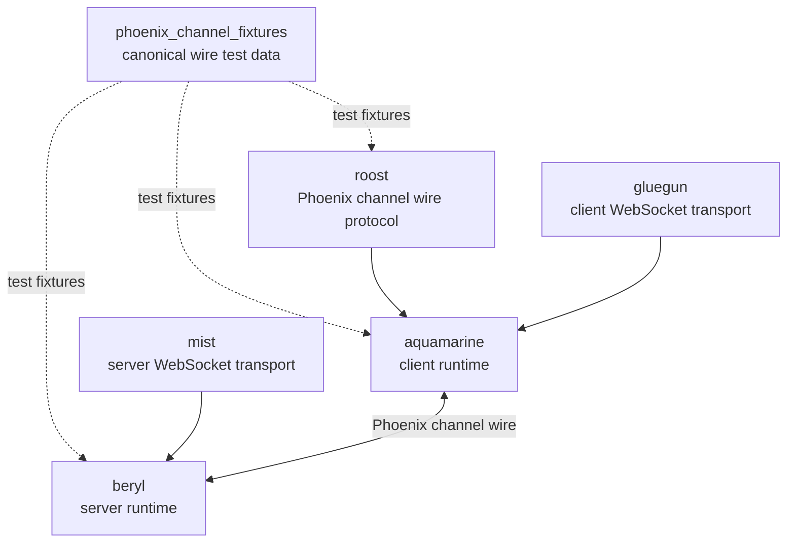

<table><tr>
<td></td>
<td><h1>beryl</h1>Type-safe real-time channels and presence for Gleam on the BEAM.</td>
</tr></table>

> [!IMPORTANT]
> beryl is not yet 1.0. The API is unstable, features may be removed in minor
> releases, and quality should not be considered production-ready. We welcome
> usage and feedback in the meantime!

## Install

```sh
gleam add beryl
```

beryl targets the **Erlang/BEAM** runtime only. It does not support the JavaScript target.

## Quick start

```gleam
import beryl
import beryl/channel.{type Channel, type HandleResult, type JoinResult}
import beryl/socket.{type Socket}
import beryl/transport/mist as mist_transport
import beryl/wire
import gleam/dynamic/decode
import gleam/erlang/process
import gleam/json
import gleam/option.{None}
import mist

pub type RoomAssigns { RoomAssigns(username: String) }

fn new_channel() -> Channel(RoomAssigns, info) {
  channel.new(fn(_topic, payload, socket) {
    let username_decoder = {
      use username <- decode.field("username", decode.string)
      decode.success(username)
    }
    let username = case channel.decode_payload(payload, username_decoder) {
      Ok(username) -> username
      Error(_) -> "anonymous"
    }
    channel.JoinOk(reply: None, socket: socket.set_assigns(socket, RoomAssigns(username:)))
  })
  |> channel.with_handle_in(fn(_event, _payload, socket) {
    channel.NoReply(socket)
  })
}

pub fn main() {
  let assert Ok(channels) = beryl.start(beryl.config(wire.phoenix_codec()))
  let assert Ok(_) = beryl.register(channels, "room:*", new_channel())

  let assert Ok(_) =
    mist_transport.handler(channels, mist_transport.default_config("/socket/websocket"), fn(_req) {
      // your regular HTTP handler here
      panic as "not implemented"
    })
    |> mist.new
    |> mist.port(8000)
    |> mist.start

  process.sleep_forever()
}
```

`mist_transport.handler` composes the WebSocket upgrade and your HTTP handler
into a single Mist request handler: WebSocket upgrades on the configured path go
to beryl, everything else falls through to the HTTP fallback. If you need to drive
the upgrade decision yourself, `mist_transport.upgrade` (and the
`mist_transport.is_websocket_request` guard) remain available.

For a complete end-to-end walkthrough including Phoenix JS client code, see the
**[Quick Start guide](https://beryl.tylerbutler.com/quick-start/)** on the docs website.

## Serializer negotiation (`vsn`)

Beryl negotiates a wire serializer per connection from the Phoenix `vsn` query
parameter, so it can act as a drop-in replacement for a Phoenix endpoint that
serves multiple client serializers at once.

- Connections without a `vsn`, or with `vsn=2.0.0`, use the codec passed to
  `beryl.config/1` (the JSON `wire.phoenix_codec()` by default). This behavior
  is unchanged from earlier releases.
- Register additional serializers per `vsn` with
  `mist_transport.with_serializer`. Each connection then decodes inbound frames
  and encodes its replies/pushes with the serializer it negotiated, so JSON and
  binary clients can share one server.

```gleam
import beryl/transport/mist as mist_transport

// Wire a MessagePack serializer to vsn=3.0.0. `my_msgpack_codec()` is any
// `beryl/wire/codec.Codec` whose `decode_binary` is `Some(..)` and whose
// encoders return `codec.BinaryFrame(..)` — e.g. backed by a MessagePack
// library such as `tylerbutler/msgpack_gleam`.
let config =
  mist_transport.default_config("/socket/websocket")
  |> mist_transport.with_serializer("3.0.0", my_msgpack_codec())
```

A client selects the serializer via the connection URL, e.g.
`wss://host/socket/websocket?vsn=3.0.0`.

Unsupported `vsn` values (anything other than `2.0.0`/absent without a
registered serializer) fall back to the configured codec by default. Call
`mist_transport.with_reject_unknown_vsn(config, True)` to instead reject such
upgrades with `400 Bad Request`.

MessagePack is intentionally **not** a runtime dependency of Beryl (keeping it
Hex-publishable); supply a MessagePack `Codec` from a downstream package and
register it as shown above. See `test/vsn_negotiation_test.gleam` for a working
binary serializer example.

## Documentation

- **Website & guides**: <https://beryl.tylerbutler.com>
- **Generated API docs**: <https://hexdocs.pm/beryl/>

## Ecosystem

Beryl is the server-side channel runtime. It owns socket registration, channel
handlers, broadcasts, presence, groups, pubsub, and transport integration.
Beryl has its own pluggable wire codec, and its Phoenix codec is kept compatible
with Roost and Aquamarine by shared conformance fixtures.



| Package | Responsibility |
|---------|----------------|
| `phoenix_channel_fixtures` | Shared test fixtures for Phoenix channel wire compatibility. |
| `roost` | Pure Phoenix channel frame constants, encode/decode helpers, and reply helpers. |
| `beryl` | Server-side runtime with its own pluggable codec; its Phoenix codec is fixture-tested. |
| `aquamarine` | Client-side channel runtime that uses Roost for Phoenix compatibility. |

## Features

- **Channels** — Topic-based pub/sub with typed callbacks and pattern matching (e.g. `room:*`, `document:*:*`)
- **Presence** — Distributed presence tracking using a CRDT (add-wins observed-remove set)
- **Groups** — Named channel groups for multi-topic broadcasting
- **PubSub** — pg-based distributed publish/subscribe
- **Actor bridge** — forward an external OTP actor's stream to a socket with `beryl/bridge`
- **WebSocket transport** — Mist integration with Phoenix-compatible wire protocol
- **Connect hook** — Socket-level `on_connect` authentication (Phoenix `UserSocket.connect/3` analogue): runs once per socket, can reject the whole connection before any join, and seeds initial assigns

## Examples

Three runnable demos are included in the `examples/` directory:

| Example | What it demonstrates |
|---------|----------------------|
| [`examples/cursors`](examples/cursors/) | Channels, topic wildcards, presence, `broadcast_from`, rate limiting |
| [`examples/chatrooms`](examples/chatrooms/) | Auth (`on_connect`), join rejection, `Reply`, `Push`, groups, validation, typing indicators |
| [`examples/collab_docs`](examples/collab_docs/) | Client-side CRDT document blocks, segment wildcards, conflict resolution |

See the [Examples page](https://beryl.tylerbutler.com/examples/) in the docs for a full comparison.

## Recipe: bridge an external actor to a socket

A long-lived domain actor (for example a per-document session) often emits
updates that need to be pushed to each joined socket. The `beryl/bridge` module
removes the per-socket forwarder boilerplate: start a bridge in `join`, subscribe
your actor to the bridge's `Subject`, and stop it in `terminate`. Each value the
actor emits is translated and delivered to the channel's `handle_info` callback
via `beryl.send_info`. The forwarder also monitors the channel process, so it is
cleaned up automatically if that process dies — no leaked processes.

```gleam
import beryl
import beryl/bridge.{type Bridge}
import beryl/channel.{type Channel}
import beryl/socket
import gleam/dynamic/decode
import gleam/json
import gleam/option.{None}

// Messages emitted by your domain actor.
pub type DocEvent {
  Updated(version: Int)
}

pub type Assigns {
  Assigns(bridge: Bridge(DocEvent))
}

fn new_channel(channels: beryl.Channels, doc_actor) -> Channel(Assigns) {
  channel.new(fn(topic, _payload, socket) {
    // Forward every DocEvent emitted by the actor to this socket/topic.
    let b =
      bridge.start(
        channels: channels,
        socket_id: socket.id(socket),
        topic: topic,
        with: fn(event) { event },
      )
    // Hand the bridge's subject to the domain actor as its subscriber.
    doc.subscribe(doc_actor, bridge.subject(b))
    channel.JoinOk(reply: None, socket: socket.set_assigns(socket, Assigns(b)))
  })
  |> channel.with_handle_info(fn(message, socket) {
    case decode.run(message, doc_event_decoder()) {
      Ok(Updated(version)) ->
        channel.Push(
          "doc_updated",
          json.object([#("version", json.int(version))]),
          socket,
        )
      _ -> channel.NoReply(socket)
    }
  })
  // Always stop the bridge on terminate for prompt, deterministic cleanup.
  |> channel.with_terminate(fn(_reason, socket) {
    bridge.stop(socket.get_assigns(socket).bridge)
  })
}
```

## Releases & changelog

See [CHANGELOG.md](CHANGELOG.md) for release notes. Releases follow
[Conventional Commits](https://www.conventionalcommits.org/) and are managed
with [changie](https://changie.dev/).

## Development

### Prerequisites

- [Erlang](https://www.erlang.org/) 27+
- [Gleam](https://gleam.run/) 1.3+
- [just](https://github.com/casey/just) (task runner)

Install tools via [mise](https://mise.jdx.dev/) or [asdf](https://asdf-vm.com/):

```sh
mise install
# or
asdf install
```

### Commands

```sh
just deps      # Download dependencies
just build     # Build the project
just test      # Run tests
just format    # Format code
just check     # Type check
just docs      # Build documentation
just ci        # Run all CI checks
```

### CI/CD

This project uses GitHub Actions for CI and automated releases:

- **CI**: Runs on every push/PR to main
- **PR Validation**: Checks PR title (commitlint) and changelog entries (changie)
- **Release**: Uses [changie](https://changie.dev/) for changelog-driven versioning
- **Publish**: Automatically publishes to [Hex.pm](https://hex.pm) on tag push

### GitHub Secrets Required

| Secret | Description |
|--------|-------------|
| `RELEASE_PAT` | GitHub PAT with `contents:write` and `pull-requests:write` permissions |
| `HEXPM_API_KEY` | API key from [hex.pm](https://hex.pm) for publishing |

### Commit Convention

This project uses [Conventional Commits](https://www.conventionalcommits.org/):

- `feat:` - New features (minor version bump)
- `fix:` - Bug fixes (patch version bump)
- `docs:` - Documentation changes
- `chore:` - Maintenance tasks
- `BREAKING CHANGE:` in commit body - Major version bump

## License

MIT — see [LICENSE](LICENSE) for details.
