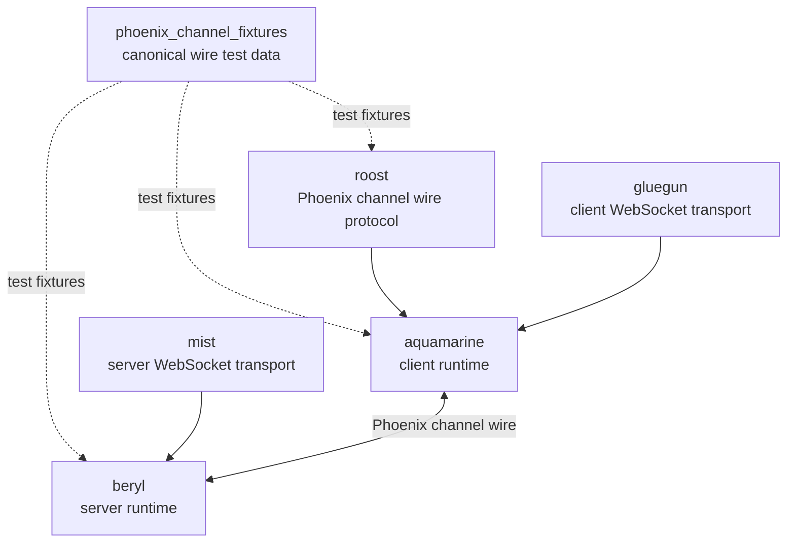

<table><tr>
<td></td>
<td><h1>beryl</h1>Type-safe app-side real-time sockets and presence for Gleam on the BEAM.</td>
</tr></table>

> [!IMPORTANT]
> beryl is not yet 1.0. The API is unstable, features may be removed in minor
> releases, and quality should not be considered production-ready. We welcome
> usage and feedback in the meantime!

## Install

```sh
gleam add beryl beryl_channels beryl_mist
```

`beryl` is the core real-time sockets library; `beryl_channels` is the channel
layer built on its public API; `beryl_mist` is the
[Mist](https://hex.pm/packages/mist) WebSocket transport. An
[Ewe](https://hex.pm/packages/ewe) transport is also available as `beryl_ewe`
(`gleam add beryl beryl_ewe`) and mirrors the `beryl_mist` API. All live in this
repository (a [trellis](https://trellis.tylerbutler.com)-managed workspace under
`packages/`).

`beryl_channels` is the recommended default for apps that serve several topic
namespaces on one socket, or that port a Phoenix Channels design. Apps with a
single topic family, or that want full control over routing, can use the core's
app-side dispatch API directly (`gleam add beryl beryl_mist`). See
[Choose an API](https://beryl.tylerbutler.com/choosing-an-api/).

beryl targets the **Erlang/BEAM** runtime only. It does not support the JavaScript target.

## Quick start

```gleam
import beryl
import beryl/transport/server
import beryl/wire
import beryl_channels
import beryl_channels/channel
import beryl_mist as mist_transport
import gleam/erlang/process
import gleam/json
import mist

type State {
  State(room: String)
}

/// This channel sends itself nothing, so its server-side message type is Nil.
type Note =
  Nil

fn room_channel() -> channel.Handler {
  channel.handler("room:*", fn(info: channel.JoinInfo(Note), topic, _payload) {
    channel.accept_with(
      channel.joined(State(room: topic), callbacks()),
      json.object([#("socket_id", json.string(info.socket_id))]),
    )
  })
}

fn callbacks() -> channel.Callbacks(State, Note) {
  channel.callbacks()
  |> channel.on_message(fn(state: State, message: channel.Message) {
    channel.continue_with(
      state,
      channel.actions()
        |> channel.broadcast(message.event, wire.dynamic_to_json(message.payload)),
    )
  })
}

pub fn main() {
  let assert Ok(sockets) =
    beryl_channels.start(
      beryl.config(wire.phoenix_codec()),
      handlers: [room_channel()],
    )

  let assert Ok(_) =
    mist_transport.handler(sockets, server.default_config("/socket/websocket"), fn(_req) {
      // your regular HTTP handler here
      panic as "not implemented"
    })
    |> mist.new
    |> mist.port(8000)
    |> mist.start

  process.sleep_forever()
}
```

Without the channel layer, the same server is one `init`/`update` pair passed to
`beryl.start` — see the
[Dispatch guide](https://beryl.tylerbutler.com/guides/dispatch/).

`mist_transport.handler` composes the WebSocket upgrade and your HTTP handler
into a single Mist request handler: WebSocket upgrades on the configured path go
to beryl, everything else falls through to the HTTP fallback. If you need to drive
the upgrade decision yourself, `mist_transport.upgrade` (and the
`mist_transport.is_websocket_request` guard) remain available.

For a complete end-to-end walkthrough including Phoenix JS client code, see the
**[Quick Start guide](https://beryl.tylerbutler.com/quick-start/)** on the docs website.

## Documentation

- **Website & guides**: <https://beryl.tylerbutler.com>
- **Generated API docs**: <https://hexdocs.pm/beryl/> and <https://hexdocs.pm/beryl_channels/>

## Ecosystem

Beryl is the server-side real-time runtime. It owns socket connections, wire
dispatch to your app's `update` function, broadcasts, presence, groups, pubsub,
and transport integration. Beryl has its own pluggable wire codec, and its
Phoenix codec is kept compatible with Roost and Aquamarine by shared
conformance fixtures.



| Package | Responsibility |
|---------|----------------|
| `phoenix_channel_fixtures` | Shared test fixtures for Phoenix channel wire compatibility. |
| `roost` | Pure Phoenix channel frame constants, encode/decode helpers, and reply helpers. |
| `beryl` | Server-side runtime with its own pluggable codec; its Phoenix codec is fixture-tested. |
| `beryl_channels` | Channel composition layer built strictly on beryl's public API. |
| `aquamarine` | Client-side channel runtime that uses Roost for Phoenix compatibility. |

## Features

- **Channels** — register one handler per topic pattern; each channel keeps
  private, typed state and its own server-side message type, and the layer
  routes every join, message, and close to the channel that owns the topic
- **App-side dispatch** — or one typed `init`/`update` pair per app; route topics
  yourself by pattern matching (e.g. `room:*`, `document:*:*`) — no assigns, no
  erasure, no registry either way
- **Presence** — Distributed presence tracking using a CRDT (add-wins observed-remove set)
- **Groups** — Named topic groups for multi-topic broadcasting
- **PubSub** — pg-based distributed publish/subscribe with a typed `Subscriber`
- **Actor bridge** — forward an external OTP actor's stream to a socket with `beryl/bridge`
- **WebSocket transport** — Mist integration with Phoenix-compatible wire protocol
- **Connect hook** — Socket-level `on_connect` authentication (Phoenix `UserSocket.connect/3` analogue): runs once per socket, can reject the whole connection before any join, and seeds ordered connect metadata delivered to the app's `init` via `ConnectInfo.seed`

## Examples

Four runnable demos are included in the `examples/` directory:

| Example | What it demonstrates |
|---------|----------------------|
| [`examples/cursors`](examples/cursors/) | App-side dispatch, topic wildcards, presence, `BroadcastFrom`, rate limiting |
| [`examples/chatrooms`](examples/chatrooms/) | Auth (`on_connect`), join rejection (`RejectJoin`), `ReplyOk`, `Push`, groups, validation, typing indicators |
| [`examples/collab_docs`](examples/collab_docs/) | Client-side CRDT document blocks, segment wildcards, conflict resolution |
| [`examples/showcase`](examples/showcase/) | End-to-end `beryl_channels` showcase across every subsystem — the three focused demos above stay on raw dispatch on purpose |

See the [Examples page](https://beryl.tylerbutler.com/examples/) in the docs for a full comparison.

## Recipe: bridge an external actor to a socket

A long-lived domain actor (for example a per-document session) often emits
updates that need to be pushed to each joined socket. The `beryl/bridge` module
removes the per-socket forwarder boilerplate: start a bridge in `init` (or when
a topic joins), subscribe your actor to the bridge's `Subject`, and stop it
when the socket or topic closes. Each value the actor emits is translated and
delivered to the app's `update` function as an `Info` event via
`socket.notify`. The forwarder also monitors the owning process, so it is
cleaned up automatically if that process dies — no leaked processes.

```gleam
import beryl/bridge.{type Bridge}
import beryl/socket.{type ConnectInfo}

// Messages emitted by your domain actor.
pub type DocEvent {
  Updated(version: Int)
}

// Your app's server-side message type, delivered to `update` as `Info`.
pub type Msg {
  DocUpdated(version: Int)
}

fn init(info: ConnectInfo(Msg)) {
  // Forward each DocEvent to this socket as an `Info(Msg)` event.
  let assert Ok(b) =
    bridge.start(to: info.self, with: fn(e: DocEvent) {
      let Updated(v) = e
      DocUpdated(v)
    })
  // Subscribe the domain actor to the bridge's subject.
  doc.subscribe(doc_actor, bridge.subject(b))
  #(Model(bridge: b), [])
}

// Stop the bridge when the socket closes (e.g. from a `Closed` event).
bridge.stop(model.bridge)
```

## Releases & changelog

See the [GitHub Releases](https://github.com/tylerbutler/beryl/releases) page for
release notes. Releases follow [Conventional Commits](https://www.conventionalcommits.org/)
and changelogs are managed with [trellis](https://trellis.tylerbutler.com) changelog fragments.

## Security

Beryl uses **Erlang distribution** for its distributed PubSub and presence
replication, which means **every node in your cluster is fully trusted**.
Application- and socket-level authorization protects you against untrusted
WebSocket clients; it does **not** protect you against a hostile Erlang
distribution peer, which can inject internal beryl traffic and presence state.

Before running beryl in production, read **[SECURITY.md](SECURITY.md)**, which
covers:

- The Erlang distribution **trust boundary** and what a compromised peer can do.
- Distribution hardening: a strong protected cookie, TLS distribution, EPMD/port
  firewalling, and keeping cluster membership closed.
- Why internal PubSub/presence messages are trusted while client WebSocket
  messages are validated and rate-limited.
- The `pubsub.config_with_scope` atom-table constraint (never pass it
  user-derived values).

For client-facing abuse controls (rate limits, connection caps, origin checks),
see the [Production Hardening guide](https://beryl.tylerbutler.com/guides/production-hardening/).

### Required: an edge proxy frame-size limit

Beryl's `with_max_inbound_frame_bytes` limit is enforced **post-assembly** —
the WebSocket transport (Mist/gramps) buffers and reassembles a complete frame
*before* Beryl measures it and rejects oversized frames. This bounds
per-message processing cost, but it does **not** bound transport memory.

A hostile client can therefore exhaust node memory with a single connection by
either:

- declaring a huge payload length in a frame header and streaming the body
  slowly, or
- sending a long run of fragmented continuation frames that the transport
  aggregates into one buffer.

In both cases the transport's receive buffer grows unbounded *before* Beryl's
frame-size check ever runs. **Beryl's per-IP connection limit
(`with_max_connections_per_ip`) and per-socket message-rate limit
(`with_message_rate`) do not mitigate this vector** — the buffer grows within a
single admitted connection and before any event reaches a socket's `update`
function.

To bound transport memory in production you **must** place an edge proxy or
load balancer (e.g. nginx, HAProxy, Envoy, or your cloud LB) in front of Beryl
and configure:

- a **maximum WebSocket frame/message size** at or below your chosen
  `with_max_inbound_frame_bytes` value, and
- a matching **request/body size limit** for the initial HTTP upgrade.

Set the proxy limit to reject oversized frames at the edge, before they are
buffered by the BEAM node. Beryl's in-process limit should be treated as
defense-in-depth for per-message cost, not as a memory bound.

## Releases & changelog

See the [GitHub Releases](https://github.com/tylerbutler/beryl/releases) page for
release notes. Releases follow [Conventional Commits](https://www.conventionalcommits.org/)
and the changelog is managed with [changie](https://changie.dev/).

## Development

### Prerequisites

- [Erlang](https://www.erlang.org/) 27+
- [Gleam](https://gleam.run/) 1.13+
- [just](https://github.com/casey/just) (task runner)

Install tools via [mise](https://mise.jdx.dev/) or [asdf](https://asdf-vm.com/):

```sh
mise install
# or
asdf install
```

### Commands

```sh
just deps      # Download dependencies
just build     # Build the project
just test      # Run tests
just format    # Format code
just check     # Type check
just docs      # Build documentation
just ci        # Run all CI checks
```

### CI/CD

This project uses GitHub Actions for CI and automated releases:

- **CI**: Runs on every push/PR to main
- **PR Validation**: Checks PR title (commitlint), workspace invariants (`trellis doctor`), and changelog fragments (`trellis changelog check`)
- **Release**: [trellis](https://trellis.tylerbutler.com) maintains a release PR from unreleased changelog fragments
- **Publish**: Merging the release PR creates per-package tags and GitHub releases (Hex.pm publishing is temporarily disabled)

### GitHub Secrets Required

| Secret | Description |
|--------|-------------|
| `RELEASE_PAT` | GitHub PAT with `contents:write` and `pull-requests:write` permissions |

### Commit Convention

This project uses [Conventional Commits](https://www.conventionalcommits.org/):

- `feat:` - New features (minor version bump)
- `fix:` - Bug fixes (patch version bump)
- `docs:` - Documentation changes
- `chore:` - Maintenance tasks
- `BREAKING CHANGE:` in commit body - Major version bump

## License

MIT — see [LICENSE](LICENSE) for details.
