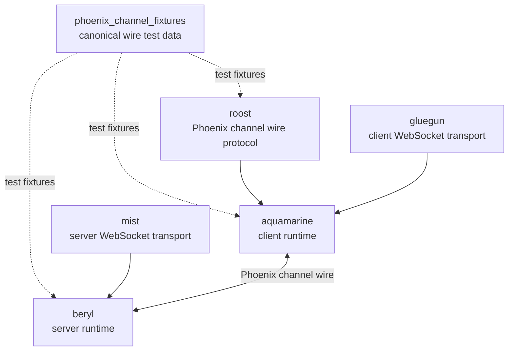

<table><tr>
<td></td>
<td><h1>beryl</h1>Type-safe real-time channels and presence for Gleam on the BEAM.</td>
</tr></table>

> [!IMPORTANT]
> beryl is not yet 1.0. The API is unstable, features may be removed in minor
> releases, and quality should not be considered production-ready. We welcome
> usage and feedback in the meantime!

## Install

```sh
gleam add beryl beryl_mist
```

`beryl` is the core channels library; `beryl_mist` is the [Mist](https://hex.pm/packages/mist)
WebSocket transport. An [Ewe](https://hex.pm/packages/ewe) transport is also
available as `beryl_ewe` (`gleam add beryl beryl_ewe`) and mirrors the
`beryl_mist` API. All live in this repository (a [trellis](https://trellis.tylerbutler.com)-managed
workspace under `packages/`).

beryl targets the **Erlang/BEAM** runtime only. It does not support the JavaScript target.

## Quick start

```gleam
import beryl
import beryl/event.{AcceptJoin, Broadcast, Join, Message, Next}
import beryl_mist as mist_transport
import beryl/wire
import gleam/dynamic/decode
import gleam/erlang/process
import gleam/json
import gleam/option.{None}
import gleam/otp/static_supervisor
import mist

pub type Model { Model(username: String) }

fn init(_info: event.ConnectInfo(Nil)) -> #(Model, List(event.Effect)) {
  #(Model(username: "anonymous"), [])
}

fn update(model: Model, ev: event.Event(Nil)) -> event.Next(Model, Nil) {
  case ev {
    Join("room:" <> _, payload, ref) -> {
      let username_decoder = {
        use username <- decode.field("username", decode.string)
        decode.success(username)
      }
      let username = case decode.run(payload, username_decoder) {
        Ok(username) -> username
        Error(_) -> "anonymous"
      }
      Next(Model(username:), [AcceptJoin(ref, None)])
    }
    Join(_, _, ref) ->
      Next(model, [
        event.RejectJoin(ref, json.object([#("reason", json.string("unknown_topic"))])),
      ])
    Message(topic, "new_msg", payload, _ref) ->
      Next(model, [Broadcast(topic, "new_msg", wire.dynamic_to_json(payload))])
    _ -> Next(model, [])
  }
}

pub fn main() {
  let assert Ok(#(channels, spec)) =
    beryl.child_spec(beryl.config(wire.phoenix_codec()), init: init, update: update)
  let assert Ok(_root) =
    static_supervisor.new(static_supervisor.OneForOne)
    |> static_supervisor.add(spec)
    |> static_supervisor.start()

  let assert Ok(_) =
    mist_transport.handler(channels, mist_transport.default_config("/socket/websocket"), fn(_req) {
      // your regular HTTP handler here
      panic as "not implemented"
    })
    |> mist.new
    |> mist.port(8000)
    |> mist.start

  process.sleep_forever()
}
```

`mist_transport.handler` composes the WebSocket upgrade and your HTTP handler
into a single Mist request handler: WebSocket upgrades on the configured path go
to beryl, everything else falls through to the HTTP fallback. If you need to drive
the upgrade decision yourself, `mist_transport.upgrade` (and the
`mist_transport.is_websocket_request` guard) remain available.

For a complete end-to-end walkthrough including Phoenix JS client code, see the
**[Quick Start guide](https://beryl.tylerbutler.com/quick-start/)** on the docs website.

## Documentation

- **Website & guides**: <https://beryl.tylerbutler.com>
- **Generated API docs**: <https://hexdocs.pm/beryl/>

## Ecosystem

Beryl is the server-side channel runtime. It owns socket registration, channel
handlers, broadcasts, presence, groups, pubsub, and transport integration.
Beryl has its own pluggable wire codec, and its Phoenix codec is kept compatible
with Roost and Aquamarine by shared conformance fixtures.



| Package | Responsibility |
|---------|----------------|
| `phoenix_channel_fixtures` | Shared test fixtures for Phoenix channel wire compatibility. |
| `roost` | Pure Phoenix channel frame constants, encode/decode helpers, and reply helpers. |
| `beryl` | Server-side runtime with its own pluggable codec; its Phoenix codec is fixture-tested. |
| `aquamarine` | Client-side channel runtime that uses Roost for Phoenix compatibility. |

## Features

- **App-side dispatch** — one typed `init`/`update` pair per socket handles every topic; effects express replies, pushes, broadcasts, presence, and kicks
- **Presence** — Distributed presence tracking using a CRDT (add-wins observed-remove set)
- **Groups** — Named channel groups for multi-topic broadcasting
- **PubSub** — pg-based distributed publish/subscribe
- **Typed server messages** — any process reaches a socket through a typed `Sender(msg)`; messages arrive in `update` as `Info(msg)` with no casts
- **WebSocket transport** — Mist integration with Phoenix-compatible wire protocol
- **Connect hook** — Socket-level `on_connect` authentication (Phoenix `UserSocket.connect/3` analogue): runs once per socket and can reject the whole connection before any join; request data reaches `init` via the `ConnectSeed`

## Examples

Three runnable demos are included in the `examples/` directory:

| Example | What it demonstrates |
|---------|----------------------|
| [`examples/cursors`](examples/cursors/) | Channels, topic wildcards, presence, `broadcast_from`, rate limiting |
| [`examples/chatrooms`](examples/chatrooms/) | Auth (`on_connect`), join rejection, replies, pushes, groups, validation, typing indicators |
| [`examples/collab_docs`](examples/collab_docs/) | Client-side CRDT document blocks, segment wildcards, conflict resolution |

See the [Examples page](https://beryl.tylerbutler.com/examples/) in the docs for a full comparison.

## Recipe: push server-side events to a socket

A long-lived domain actor (for example a per-document session) often emits
updates that need to be pushed to each joined socket. Every socket's `init`
receives a typed `Sender(msg)` (`ConnectInfo.self`); hand it to the domain
actor as a subscriber, and each emitted value arrives in `update` as a typed
`Info` event — no `Dynamic`, no forwarder boilerplate. If the socket has
disconnected, `event.notify` is a quiet no-op.

```gleam
import beryl/event.{Info, Join, Next, Push}
import gleam/json

// Messages emitted by your domain actor.
pub type DocEvent {
  Updated(version: Int)
}

fn init(info: event.ConnectInfo(DocEvent)) -> #(Model, List(event.Effect)) {
  // Hand the sender to the domain actor as this socket's subscriber.
  doc.subscribe(doc_actor, info.self)
  #(initial_model(), [])
}

fn update(model: Model, ev: event.Event(DocEvent)) -> event.Next(Model, DocEvent) {
  case ev {
    // `Info` receives the typed `DocEvent` directly — no decode step.
    Info(Updated(version)) ->
      Next(model, [
        Push("doc:1", "doc_updated", json.object([#("version", json.int(version))])),
      ])
    _ -> Next(model, [])
  }
}

// In the domain actor, emit with:
// event.notify(subscriber, Updated(version))
```

## Releases & changelog

See the [GitHub Releases](https://github.com/tylerbutler/beryl/releases) page for
release notes. Releases follow [Conventional Commits](https://www.conventionalcommits.org/)
and changelogs are managed with [trellis](https://trellis.tylerbutler.com) changelog fragments.

## Security

Beryl uses **Erlang distribution** for its distributed PubSub and presence
replication, which means **every node in your cluster is fully trusted**.
Application- and channel-level authorization protects you against untrusted
WebSocket clients; it does **not** protect you against a hostile Erlang
distribution peer, which can inject internal beryl traffic and presence state.

Before running beryl in production, read **[SECURITY.md](SECURITY.md)**, which
covers:

- The Erlang distribution **trust boundary** and what a compromised peer can do.
- Distribution hardening: a strong protected cookie, TLS distribution, EPMD/port
  firewalling, and keeping cluster membership closed.
- Why internal PubSub/presence messages are trusted while client WebSocket
  messages are validated and rate-limited.
- The `pubsub.config_with_scope` atom-table constraint (never pass it
  user-derived values).

For client-facing abuse controls (rate limits, connection caps, origin checks),
see the [Production Hardening guide](https://beryl.tylerbutler.com/guides/production-hardening/).

### Required: an edge proxy frame-size limit

Beryl's `with_max_inbound_frame_bytes` limit is enforced **post-assembly** —
the WebSocket transport (Mist/gramps) buffers and reassembles a complete frame
*before* Beryl measures it and rejects oversized frames. This bounds
per-message processing cost, but it does **not** bound transport memory.

A hostile client can therefore exhaust node memory with a single connection by
either:

- declaring a huge payload length in a frame header and streaming the body
  slowly, or
- sending a long run of fragmented continuation frames that the transport
  aggregates into one buffer.

In both cases the transport's receive buffer grows unbounded *before* Beryl's
frame-size check ever runs. **Beryl's per-IP connection limit
(`with_max_connections_per_ip`) and per-socket message-rate limit
(`with_message_rate`) do not mitigate this vector** — the buffer grows within a
single admitted connection and before any message is emitted to a channel.

To bound transport memory in production you **must** place an edge proxy or
load balancer (e.g. nginx, HAProxy, Envoy, or your cloud LB) in front of Beryl
and configure:

- a **maximum WebSocket frame/message size** at or below your chosen
  `with_max_inbound_frame_bytes` value, and
- a matching **request/body size limit** for the initial HTTP upgrade.

Set the proxy limit to reject oversized frames at the edge, before they are
buffered by the BEAM node. Beryl's in-process limit should be treated as
defense-in-depth for per-message cost, not as a memory bound.

## Development

### Prerequisites

- [Erlang](https://www.erlang.org/) 27+
- [Gleam](https://gleam.run/) 1.13+
- [just](https://github.com/casey/just) (task runner)

Install tools via [mise](https://mise.jdx.dev/) or [asdf](https://asdf-vm.com/):

```sh
mise install
# or
asdf install
```

### Commands

```sh
just deps      # Download dependencies
just build     # Build the project
just test      # Run tests
just format    # Format code
just check     # Type check
just docs      # Build documentation
just ci        # Run all CI checks
```

### CI/CD

This project uses GitHub Actions for CI and automated releases:

- **CI**: Runs on every push/PR to main
- **PR Validation**: Checks PR title (commitlint), workspace invariants (`trellis doctor`), and changelog fragments (`trellis changelog check`)
- **Release**: [trellis](https://trellis.tylerbutler.com) maintains a release PR from unreleased changelog fragments
- **Publish**: Merging the release PR creates per-package tags and GitHub releases (Hex.pm publishing is temporarily disabled)

### GitHub Secrets Required

| Secret | Description |
|--------|-------------|
| `RELEASE_PAT` | GitHub PAT with `contents:write` and `pull-requests:write` permissions |

### Commit Convention

This project uses [Conventional Commits](https://www.conventionalcommits.org/):

- `feat:` - New features (minor version bump)
- `fix:` - Bug fixes (patch version bump)
- `docs:` - Documentation changes
- `chore:` - Maintenance tasks
- `BREAKING CHANGE:` in commit body - Major version bump

## License

MIT — see [LICENSE](LICENSE) for details.
