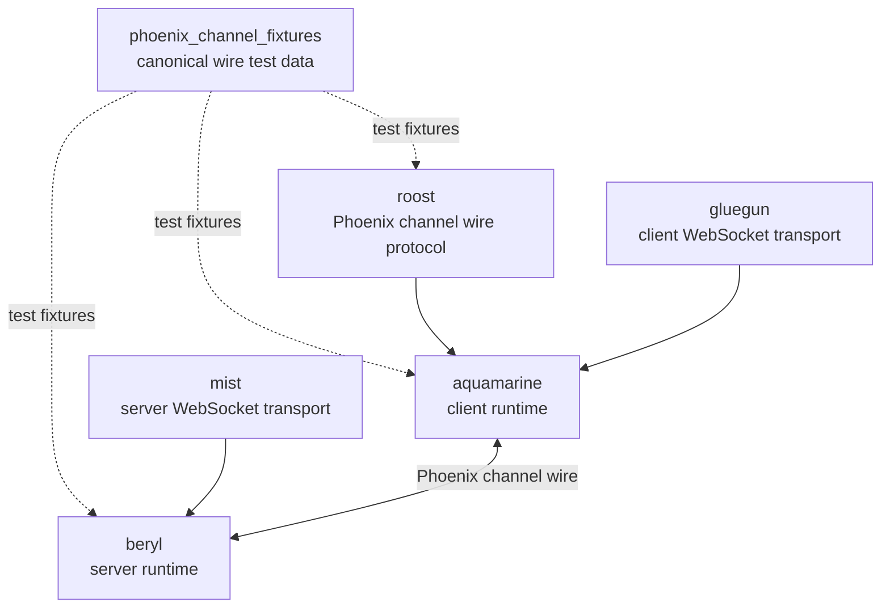

<table><tr>
<td></td>
<td><h1>beryl</h1>Type-safe real-time channels and presence for Gleam on the BEAM.</td>
</tr></table>

> [!IMPORTANT]
> Beryl is not yet 1.0. Minor releases can change the API or remove features.
> Treat Beryl as experimental. Try it and send feedback.

## Install

GitHub hosts the current Beryl packages. Hex does not. Add these dependencies
to `gleam.toml`:

```toml
[dependencies]
beryl = { git = "https://github.com/tylerbutler/beryl.git", ref = "main", path = "packages/beryl" }
beryl_mist = { git = "https://github.com/tylerbutler/beryl.git", ref = "main", path = "packages/beryl_mist" }
```

```sh
gleam deps download
```

`beryl` includes raw dispatch and the recommended `beryl/channel` composition
layer. `beryl_mist` provides the [Mist](https://hex.pm/packages/mist)
WebSocket transport. `beryl_ewe` provides an
[Ewe](https://hex.pm/packages/ewe) transport with the same API.

Beryl supports only the **Erlang/BEAM** runtime. It does not support
JavaScript.

## Quick start

```gleam
import beryl
import beryl/transport/server
import beryl/wire
import beryl/channel
import beryl_mist as mist_transport
import gleam/erlang/process
import gleam/otp/static_supervisor
import mist

type State {
  State(room: String)
}

fn room_channel() -> channel.Handler {
  channel.handler("room:*", fn(context) {
    channel.accept(State(room: context.topic), callbacks())
  })
}

fn callbacks() -> channel.Callbacks(State, Nil) {
  channel.callbacks()
  |> channel.on_message(fn(state, message) {
    channel.next(state, [
      channel.broadcast(
        message.event,
        wire.dynamic_to_json(message.payload),
      ),
    ])
  })
}

pub fn main() {
  let config =
    beryl.config(wire.phoenix_codec())
    |> beryl.with_frame_rate(per_second: 35, burst: 70)
    |> beryl.with_message_rate(per_second: 30, burst: 60)
  let assert Ok(#(channels, spec)) =
    channel.child_spec(config, handlers: [room_channel()])
  let assert Ok(_root) =
    static_supervisor.new(static_supervisor.OneForOne)
    |> static_supervisor.add(spec)
    |> static_supervisor.start()

  let assert Ok(_) =
    mist_transport.handler(channels, server.default_config("/socket/websocket"), fn(_req) {
      // your HTTP handler here
      panic as "not implemented"
    })
    |> mist.new
    |> mist.port(8000)
    |> mist.start

  process.sleep_forever()
}
```

`mist_transport.handler` combines the WebSocket upgrade and your HTTP handler
in one Mist request handler. It sends WebSocket upgrades on the configured
path to Beryl. It sends all other requests to the HTTP fallback. To control
the upgrade decision, use `mist_transport.upgrade` and
`beryl/transport/server.is_websocket_request`.

For a full example with Phoenix JS client code, see the
**[Quick Start guide](https://beryl.tylerbutler.com/quick-start/)**.

## Documentation

- **Website and guides**: <https://beryl.tylerbutler.com>
- **Generated API reference**: <https://beryl.tylerbutler.com/reference/api/>
- **Repository and git releases**: <https://github.com/tylerbutler/beryl>

## Ecosystem

Beryl is a server runtime for real-time applications. It manages socket
registration, broadcasts, presence, groups, PubSub, and transport integration.
Beryl has a pluggable wire codec. Shared conformance fixtures keep its Phoenix
codec compatible with Roost and Aquamarine.



| Package | Responsibility |
|---------|----------------|
| `phoenix_channel_fixtures` | Shared test fixtures for Phoenix channel wire compatibility. |
| `roost` | Phoenix channel frame constants, encode/decode helpers, and reply helpers. |
| `beryl` | Server-side runtime with its own pluggable codec; its Phoenix codec is fixture-tested. |
| `beryl/channel` | Typed channel composition module in the `beryl` package. |
| `aquamarine` | Client-side channel runtime that uses Roost for Phoenix compatibility. |

## Features

- **Channels:** Register typed handlers by topic pattern. Each joined topic has
  private state and a typed server-message API.
- **App dispatch:** Use the core `init` and `update` API when you need direct
  control of the router.
- **Presence:** Track distributed presence with an add-wins observed-remove set
  CRDT.
- **Groups:** Broadcast to named groups of channels.
- **PubSub:** Publish and subscribe across Erlang nodes with `pg`.
- **Typed server messages:** Send a message to a socket through
  `Sender(msg)`. `update` receives it as `Info(msg)` without a cast.
- **WebSocket transport:** Use Mist with the Phoenix wire protocol.
- **Connect hook:** Use socket-level `on_connect` authentication, similar to
  Phoenix `UserSocket.connect/3`. The hook runs once for each socket and can
  reject the connection before a join. `ConnectSeed` passes request data to
  `init`.

## Examples

The `examples/` directory contains four runnable demos:

| Example | What it demonstrates |
|---------|----------------------|
| [`examples/cursors`](examples/cursors/) | App-side dispatch, topic wildcards, session presence, `BroadcastFrom`, rate limiting |
| [`examples/chatrooms`](examples/chatrooms/) | Channel handlers, auth, join rejection, replies, pushes, groups, validation, typing indicators |
| [`examples/collab_docs`](examples/collab_docs/) | Channel handlers, client-side CRDT document blocks, segment wildcards, conflict resolution |
| [`examples/showcase`](examples/showcase/) | End-to-end `beryl/channel` composition across every subsystem |

See the [Examples page](https://beryl.tylerbutler.com/examples/) for a full
comparison.

## Recipe: bridge an external actor to a socket

A long-lived actor, such as a document session, can send updates to each joined
socket. `beryl/bridge` starts a small forwarding process. The process converts
the actor messages and sends typed `Info` events through the socket
`Sender`.

```gleam
import beryl/bridge.{type Bridge}
import beryl/socket.{Closed, Info, Next, Push}
import gleam/json

pub type DocEvent {
  Updated(version: Int)
}

pub type Msg {
  DocUpdated(version: Int)
}

pub type Model {
  Model(bridge: Bridge(DocEvent))
}

fn init(info: socket.ConnectInfo(Msg)) -> #(Model, List(socket.Effect)) {
  let assert Ok(forwarder) =
    bridge.start(to: info.self, with: fn(event: DocEvent) {
      let Updated(version) = event
      DocUpdated(version)
    })
  doc.subscribe(doc_actor, bridge.subject(forwarder))
  #(Model(bridge: forwarder), [])
}

fn update(model: Model, ev: socket.Input(Msg)) -> socket.Next(Model) {
  case ev {
    Info(DocUpdated(version)) ->
      Next(model, [
        Push("doc:1", "doc_updated", json.object([#("version", json.int(version))])),
      ])
    Closed(_, _) -> {
      bridge.stop(model.bridge)
      Next(model, [])
    }
    _ -> Next(model, [])
  }
}
```

Call `bridge.stop` when the owner socket or topic closes. The bridge monitors
its creator and stops if that process exits.

## Releases and changelog

See [GitHub Releases](https://github.com/tylerbutler/beryl/releases) for release
notes. Releases use
[Conventional Commits](https://www.conventionalcommits.org/). The project uses
[trellis](https://trellis.tylerbutler.com) changelog fragments.

## Security

Beryl uses **Erlang distribution** for PubSub and presence replication. You
must trust **every node in the cluster**. Application and channel authorization
protect against untrusted WebSocket clients. They do **not** protect against a
hostile Erlang distribution peer. Such a peer can inject internal Beryl
traffic and presence state.

Read **[SECURITY.md](SECURITY.md)** before you run Beryl in production. It
explains:

- The Erlang distribution **trust boundary** and the effect of a compromised
  peer.
- Distribution security: a strong protected cookie, TLS distribution,
  EPMD and port firewall rules, and closed cluster membership.
- Why Beryl trusts internal PubSub and presence messages but validates and
  rate-limits client WebSocket messages.
- The atom-table limit for `pubsub.config_with_scope`. Do not pass values from
  users to this function.

For controls against client abuse, such as rate limits, connection limits, and
origin checks, see the
[Production Hardening guide](https://beryl.tylerbutler.com/guides/production-hardening/).

### Required: an edge proxy frame-size limit

Beryl applies the `with_max_inbound_frame_bytes` limit **after frame
assembly**. The WebSocket transport (Mist/gramps) buffers and assembles a full
frame before Beryl measures it. Beryl then rejects an oversized frame. This
limit controls the processing cost of one message. It does **not** limit
transport memory.

A hostile client can exhaust node memory through one connection in two ways:

- It can declare a large payload length in a frame header and send the body
  at a low rate.
- It can send many fragmented continuation frames that the transport puts in
  one buffer.

In both cases, the transport receive buffer has no size limit before Beryl
checks the frame size. **Beryl's per-IP connection limit
(`with_max_connections_per_ip`), per-connection frame-rate limit
(`with_frame_rate`), and per-socket message-rate limit (`with_message_rate`)
do not prevent this attack**. These limits run after frame assembly. The
buffer can grow in one accepted connection before dispatch.

To limit transport memory in production, you **must** put an edge proxy or load
balancer in front of Beryl. You can use nginx, HAProxy, Envoy, or a cloud load
balancer. Configure:

- A **maximum WebSocket frame or message size** that is not greater than the
  `with_max_inbound_frame_bytes` value.
- A matching **request or body size limit** for the first HTTP upgrade request.

Set the proxy to reject oversized frames before the BEAM node buffers them.
Use Beryl's in-process limit as a second control for message processing cost.
Do not use it as a memory limit.

## Development

### Prerequisites

- [Erlang](https://www.erlang.org/) 27+
- [Gleam](https://gleam.run/) 1.13+
- [just](https://github.com/casey/just) (task runner)

Install tools via [mise](https://mise.jdx.dev/) or [asdf](https://asdf-vm.com/):

```sh
mise install
# or
asdf install
```

### Commands

```sh
just deps      # Download dependencies
just build     # Build the project
just test      # Run tests
just format    # Format code
just check     # Type check
just docs      # Build documentation
just ci        # Run all CI checks
```

### CI/CD

This project uses GitHub Actions for CI and releases:

- **CI:** Runs for each push and pull request to `main`.
- **PR validation:** Checks the PR title with commitlint, checks workspace
  rules with `trellis doctor`, and checks changelog fragments with
  `trellis changelog check`.
- **Release:** [trellis](https://trellis.tylerbutler.com) maintains a release
  PR from unreleased changelog fragments.
- **Publish:** Merging the release PR creates package tags and GitHub releases.
  Hex.pm publishing is disabled.

### GitHub Secrets Required

| Secret | Description |
|--------|-------------|
| `RELEASE_PAT` | GitHub PAT with `contents:write` and `pull-requests:write` permissions |

### Commit Convention

This project uses [Conventional Commits](https://www.conventionalcommits.org/):

- `feat:` - Adds a feature and causes a minor version increase.
- `fix:` - Fixes a defect and causes a patch version increase.
- `docs:` - Changes documentation.
- `chore:` - Performs maintenance.
- `BREAKING CHANGE:` in the commit body - Causes a major version increase.

## License

MIT. See [LICENSE](LICENSE).
