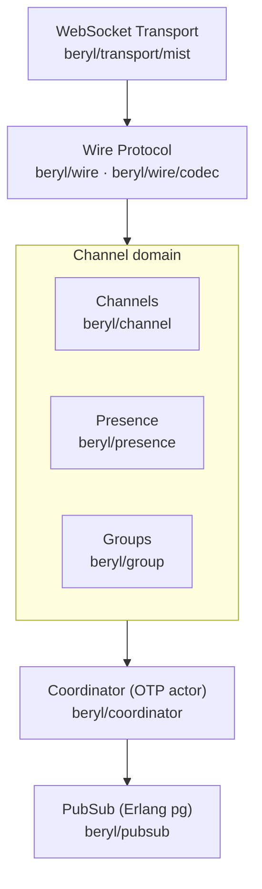
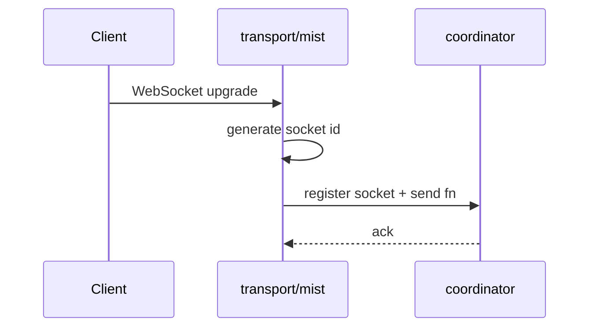
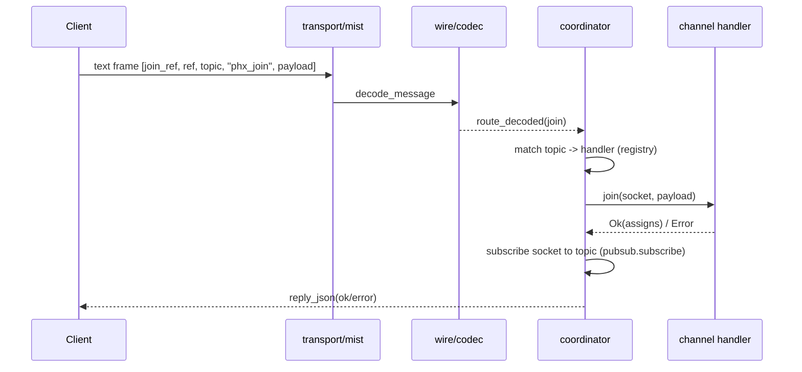
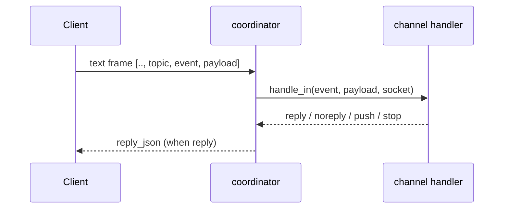
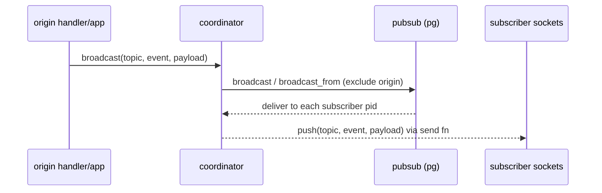
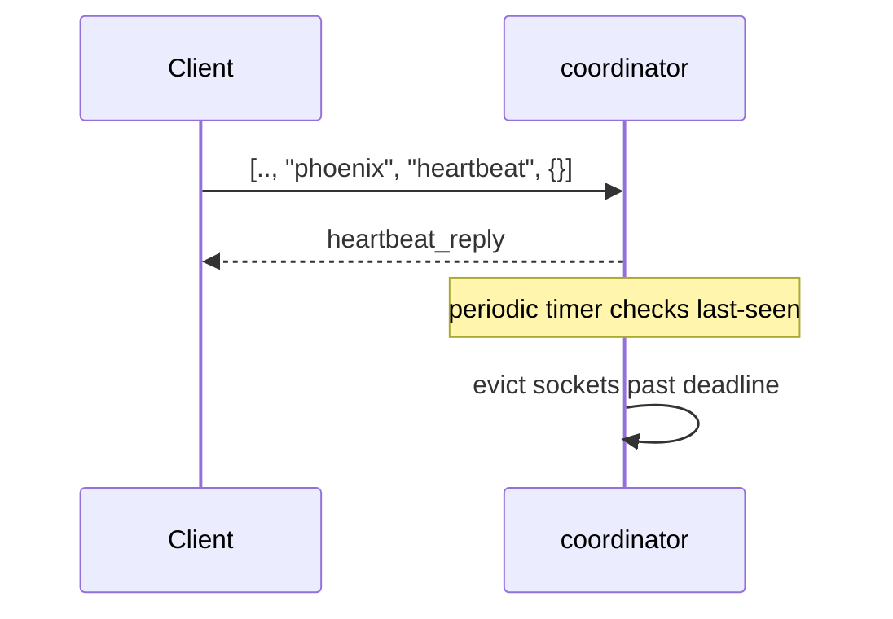
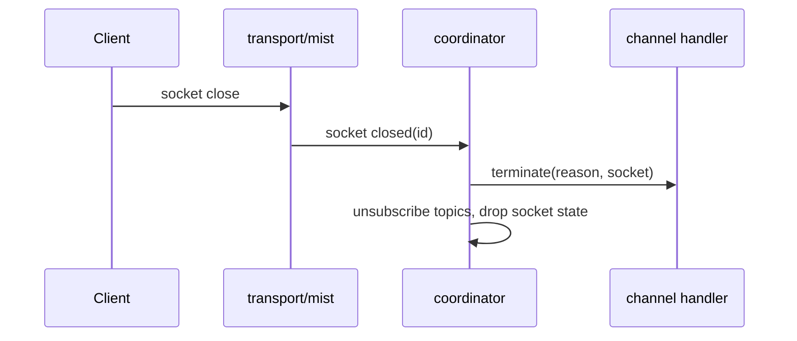
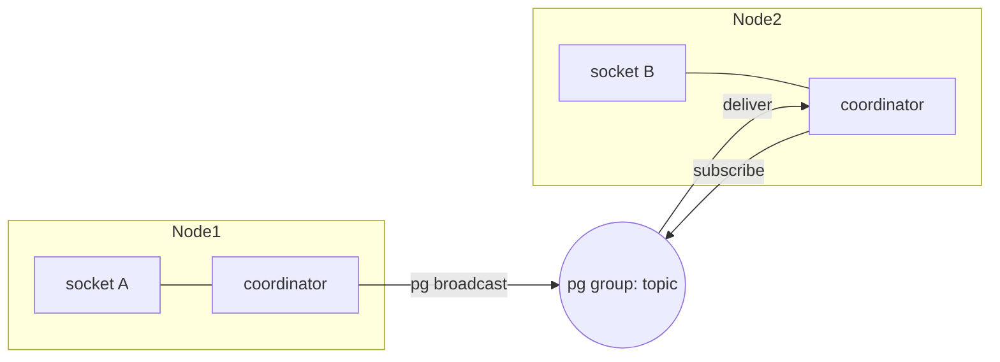
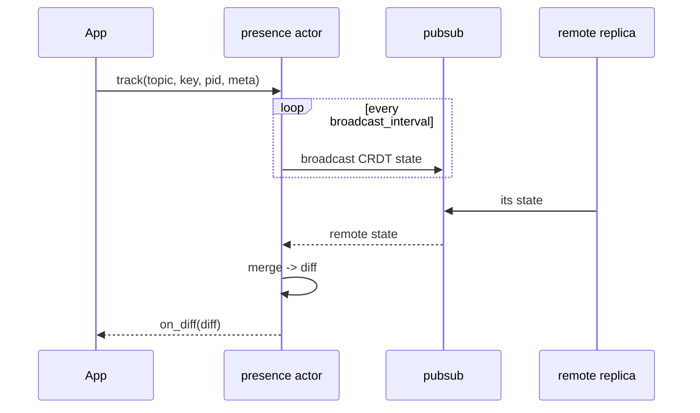
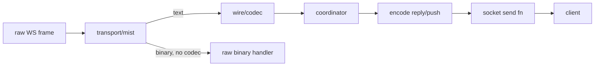

<script type="module">
  import mermaid from "https://cdn.jsdelivr.net/npm/mermaid@11/dist/mermaid.esm.min.mjs";
  mermaid.initialize({ startOnLoad: true });
</script>

# beryl architecture

Type-safe realtime channels & presence on the BEAM

<!--
Speaker notes:
Opening frame. In one sentence: beryl gives you Phoenix-style realtime channels
and presence, but as a Gleam library with full type safety, running natively on
the Erlang VM. Set expectations for the deck — we'll go top-down: what it is,
the module map, then the coordinator, and finally trace a message through its
full lifecycle (connect, join, event, broadcast, heartbeat, terminate) before
covering distribution, presence, and where to start contributing.
-->

---

## What beryl is

- Phoenix-style channel system on OTP actors and Erlang `pg`
- Pluggable wire codec + WebSocket transport
- Channels, presence, and groups as independent domain actors
- Coordinator wires them together and enforces heartbeats
- PubSub is the only cross-node primitive



<!--
Speaker notes:
This is the 10,000-foot view. Read the diagram top to bottom as the path a
message takes: a raw WebSocket frame enters at the transport, the wire codec
turns bytes into typed messages, the channel domain (channels, presence,
groups) holds the application-facing behavior, and the coordinator is the
single actor that ties it all together. PubSub sits at the bottom because it
is the *only* primitive that crosses node boundaries — everything above it is
local to one node. The key takeaway: each box is an independent layer you can
reason about (and test) on its own, and the coordinator is the seam where they
meet.
-->

---

## Module map

| Module | Responsibility |
|---|---|
| `beryl` | Public entry-point: `config/1`, `start/1`, `register/3`, `broadcast/4` |
| `beryl/coordinator` | Central OTP actor: registry, socket tracking, routing, heartbeat |
| `beryl/pubsub` | Distributed pub-sub via Erlang `pg` |
| `beryl/presence` | Add-wins OR-set CRDT; track/untrack, cross-node diff broadcast |
| `beryl/wire` | Pluggable codec; ships `phoenix_codec()` |
| `beryl/transport/mist` | Mist WebSocket adapter; assigns IDs, routes frames |
| `beryl/group` | Named topic collections; supports grouped broadcast |
| `beryl/topic` | Topic pattern matching: exact, `"ns:*"` prefix, and segment wildcards |

<!--
Speaker notes:
This table is the "where does X live" cheat sheet. Two rows do most of the
work: `beryl` is the public API a user calls, and `beryl/coordinator` is where
runtime state and routing actually live. Everything else is a focused
collaborator the coordinator delegates to — pubsub for fan-out, presence for
membership, wire for framing, transport for the socket. Point out that `beryl/topic`
is small but load-bearing: it decides which handler a topic string matches, so
the prefix and wildcard rules here drive the routing you'll see in later slides.
-->

---

## Coordinator: the central actor

The coordinator is a **single OTP actor** that is the heart of beryl. It tracks:

- **Socket registry** — `socket_id → {assigns, send_fn, topics, last_heartbeat}`
- **Handler registry** — `topic_pattern → channel_handler`
- **PubSub subscriptions** — one pg group per joined topic
- **Heartbeat timer** — evicts stale sockets on deadline

All inbound frames, PubSub deliveries, and info messages pass through its mailbox sequentially. Because it is a single actor, no locks are needed for socket or topic state.

<!--
Speaker notes:
This is the most important conceptual slide. The coordinator owns four pieces
of state, and the punchline is the last line: because one actor serializes
every message through a single mailbox, we get consistency for free — no
mutexes, no race conditions on the socket or topic tables. Call out each piece:
the socket registry is per-connection state, the handler registry maps topic
patterns to channel modules, the pg subscriptions are how we receive
broadcasts, and the heartbeat timer is how we reclaim dead sockets. If someone
asks "isn't a single actor a bottleneck?" — the actor only does cheap
bookkeeping and routing; the heavy lifting (codec, channel callbacks) is fast,
and you scale across nodes via pg, not by adding coordinator threads.
-->

---

## Supervision tree

```mermaid
flowchart TB
  S["supervisor (rest-for-one)"]
  S --> CO["coordinator"]
  S --> PR["presence (optional)"]
  S --> GR["groups (optional)"]
  CO -. "crash restarts downstream" .-> PR
  PR -. .-> GR
```

- `rest-for-one`: coordinator crash restarts presence and groups
- Embeddable via `beryl/supervisor.child_spec/1`
- Presence and groups are optional; omit from config if unused

<!--
Speaker notes:
The strategy here is `rest-for-one`, and the diagram's dashed arrows show why
it matters: children are started in order, and if an earlier child (the
coordinator) crashes, every child started *after* it is restarted too. That is
deliberate — presence and groups hold references and subscriptions that assume
a live coordinator, so restarting them together avoids stale state pointing at
a dead process. The reverse is not true: a presence crash does not take down
the coordinator. Mention that the whole tree is embeddable via
`child_spec/1`, so beryl drops into a user's existing supervision tree rather
than demanding to be the top of the application.
-->

---

## Message lifecycle — connect



The transport generates a 16-byte random ID (base16) and hands the socket and its send function to the coordinator for bookkeeping.

<!--
Speaker notes:
This is the simplest of the lifecycle slides, so use it to establish the
pattern the next slides reuse: a client action enters at the transport, the
transport does the minimum (here, mint a socket id), and then it registers
with the coordinator. The detail worth emphasizing is the *send function*:
the transport hands the coordinator a closure that knows how to push bytes
back to this specific client. That inversion is what lets the coordinator
later fan out a broadcast to many sockets without knowing anything about
WebSockets — it just calls each socket's send fn. No channel join has
happened yet; this slide is purely "a connection now exists and is tracked."
-->

---

## Message lifecycle — join



<!--
Speaker notes:
This slide has no prose on purpose — walk the sequence live. A join is the
first Phoenix-protocol message: the client sends a `phx_join` frame carrying a
`join_ref`, a `ref`, the target topic, and a payload. Trace each hop: the
transport decodes nothing itself, it delegates to the wire codec, which turns
the raw array into a typed decoded message. The coordinator then does the
authorization step that makes beryl type-safe — it matches the topic string
against the handler registry to find the channel module, and calls that
module's `join` callback. The callback returns `Ok(assigns)` to admit the
socket (and we subscribe it to the topic's pg group) or `Error` to reject it.
Either way the client gets a `phx_reply`. The relevance: this is where
application code first runs, and where subscription state is established —
everything in the next slides assumes a successful join happened here.
-->

---

## Message lifecycle — inbound event & broadcast





<!--
Speaker notes:
Two diagrams, two distinct flows — contrast them. The top one is the *inbound*
path: a client sends an event on an already-joined topic, the coordinator
invokes the channel's `handle_in`, and the callback's return value drives what
happens next. Name the four outcomes: `reply` (send a direct response to this
caller), `noreply` (handled, stay silent), `push` (send an unsolicited message
to this socket), and `stop` (leave the channel). The bottom diagram is the
*fan-out* path and is the heart of why beryl exists: a broadcast goes from the
origin into pubsub (pg), which delivers it to every subscriber pid across the
cluster, and each coordinator pushes it to its local sockets via their send fns.
The detail that earns a pause: `broadcast_from` excludes the originating socket
so a sender doesn't receive an echo of its own message — that exclusion is
load-bearing for correctness and easy to get wrong.
-->

---

## Heartbeat & terminate





<!--
Speaker notes:
Both diagrams are about *liveness and cleanup* — how sockets leave, gracefully
or not. The top flow is the heartbeat: Phoenix clients periodically send a
`heartbeat` on the special "phoenix" topic, the coordinator replies, and it
records a last-seen timestamp. A separate periodic timer sweeps the registry
and evicts any socket whose last-seen is past the deadline — this is how we
detect clients that vanished without a clean close (dropped network, killed
tab). The bottom flow is the graceful path: the transport observes the socket
closing and tells the coordinator, which calls each joined channel's
`terminate` callback (so application code can clean up) and then unsubscribes
the topics and drops the socket state. Relevance: both paths converge on the
same invariant — no dead socket is left subscribed to a pg group, so
broadcasts never try to push to a connection that's gone.
-->

---

## PubSub & distribution



- Built on Erlang `pg` — cluster-aware out of the box
- `broadcast_from` excludes the originating socket (load-bearing for correctness)
- Scoped by an Erlang atom; default scope is `beryl_pubsub`
- No extra message-bus infrastructure required

<!--
Speaker notes:
The diagram shows the payoff of building on Erlang `pg`: socket A on Node1 and
socket B on Node2 are joined to the same logical topic, which is just a pg
group spanning both nodes. When Node1 broadcasts, pg delivers to subscribers on
every node — Node2's coordinator receives it and pushes to socket B. The
relevance to emphasize: there is *no* external broker here. No Redis, no NATS,
no separate message bus to deploy and operate — pg ships with the BEAM and is
cluster-aware the moment your nodes are connected. Re-iterate the
`broadcast_from` exclusion from the previous slide (it's why the origin socket
doesn't echo), and mention the scope atom: groups are namespaced under an
Erlang atom, default `beryl_pubsub`, so multiple beryl instances can coexist.
-->

---

## Presence — CRDT replication



- Add-wins OR-set CRDT via `lattice_presence/presence_state`
- Each node holds its own replica; merges converge without coordination
- `on_diff` fires on every local change or remote merge with a non-empty diff

<!--
Speaker notes:
Presence answers "who is here right now" across the cluster, and the diagram
shows how it stays consistent without a coordinator or a database. Each node
runs a presence actor holding its own replica of an add-wins OR-set CRDT
(from `lattice_presence`). When the app calls `track`, the local replica
changes; on a timer the actor broadcasts its state over pubsub, and it merges
the states it receives from remote replicas. Stress the CRDT property: merges
are commutative and idempotent, so replicas *converge* regardless of message
order or duplication — no locking, no leader, no conflict resolution code. The
practical hook for users is `on_diff`: it fires with the set of joins/leaves
whenever the merged view actually changes, which is what you wire your UI to.
"Add-wins" means a concurrent track-and-untrack resolves in favor of present.
-->

---

## Wire & transport



- Phoenix wire format: `[join_ref, ref, topic, event, payload]`
- `Codec` is a data value — swap framing without touching coordinator or channel logic
- `phoenix_codec()` is the default; pass to `beryl.config/1`
- Binary frames bypass the codec when no `decode_binary` is configured

<!--
Speaker notes:
This slide is about the seam that keeps beryl protocol-agnostic. Follow the
diagram left to right: a raw frame hits the transport, which branches on frame
type — text frames go through the wire codec into typed messages, while binary
frames can take a raw-binary path when no binary decoder is configured. On the
way out, the coordinator's replies and pushes are encoded by the same codec and
handed to the socket's send fn. The big idea: the `Codec` is just a *data
value*, not hardwired logic — so you can swap the framing (today it's the
Phoenix `[join_ref, ref, topic, event, payload]` format) without touching the
coordinator or any channel code. `phoenix_codec()` is the default you pass to
`beryl.config/1`. This is what makes the system testable in layers and open to
alternative wire protocols down the road.
-->

---

## Concurrency note

The coordinator is a **single OTP mailbox** — sequential processing with no locks needed.

- Broadcasts arrive as Erlang messages; tests must **select the exact message shape**
- Stale queued messages can cause nondeterministic test failures
- Drain messages your tests create; don't use broad "any message" selectors near PubSub assertions
- This is BEAM-native: supervised actors, pattern matching, no shared mutable state

<!--
Speaker notes:
This slide is half architecture, half hard-won testing advice. The architectural
point restates the coordinator's superpower: one mailbox, sequential processing,
no locks. But the practical consequence bites in tests — broadcasts and pushes
arrive as ordinary Erlang messages in a process mailbox, so a test must select
the *exact* message shape it expects. If you use a broad "any message" selector
near a pubsub assertion, a stale message left over from an earlier action can be
consumed by the wrong receive and cause a flaky, nondeterministic failure. The
rule of thumb to repeat: drain the messages your test creates, and match
specifically. This is the most common source of test flakiness in the codebase,
so it's worth the slide.
-->

---

## Where to start contributing

| Start here | Module | Purpose |
|---|---|---|
| 💡 Heart of beryl | `src/beryl/coordinator.gleam` | Actor, registry, message routing |
| 📨 Message flow | `src/beryl/transport/mist.gleam` | Connect → decode → route |
| 🔌 Channel API | `src/beryl/channel.gleam` | `join`, `handle_in`, `terminate` callbacks |
| 📡 Fan-out | `src/beryl/pubsub.gleam` | pg-based broadcast |
| 👥 Presence | `src/beryl/presence.gleam` | CRDT actor, track/untrack, diffs |
| 🔤 Framing | `src/beryl/wire.gleam` | Phoenix codec, encode/decode |

Start with `coordinator.gleam` — it is the single process that ties everything together.
Architecture docs live at `/architecture/` in the website.

<!--
Speaker notes:
Closing slide — make it actionable. The table is ordered by where a newcomer
gets the most leverage. The single most important pointer is the first row:
read `coordinator.gleam` first, because it's the one process that touches every
other part, so understanding it gives you the map for everything else. From
there, follow your interest — transport for the connection lifecycle, channel
for the callback API you'll implement, pubsub for fan-out, presence for the
CRDT, wire for framing. End by pointing people at the longer-form architecture
docs on the website under `/architecture/`, which expand every topic in this
deck with prose. Invite questions.
-->

