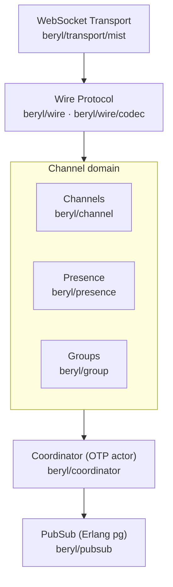
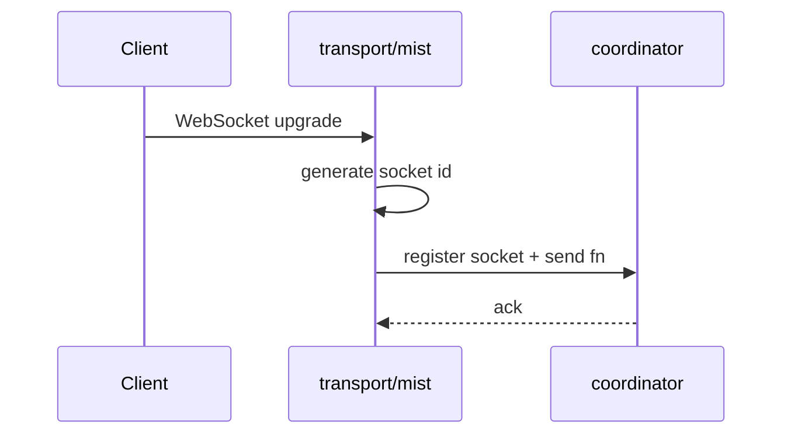
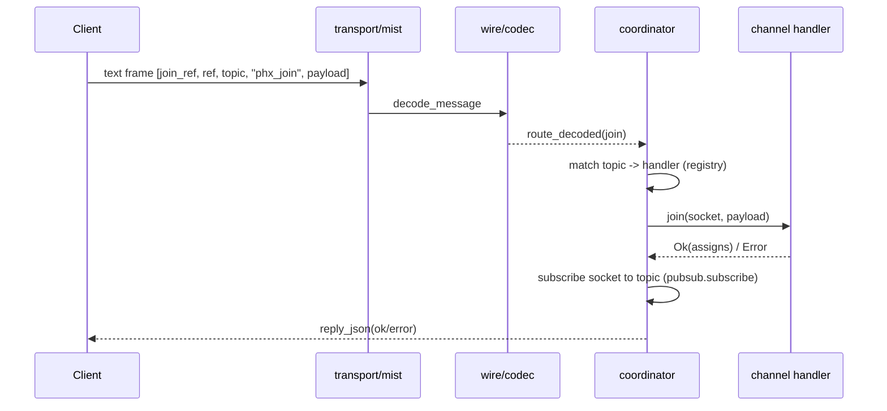
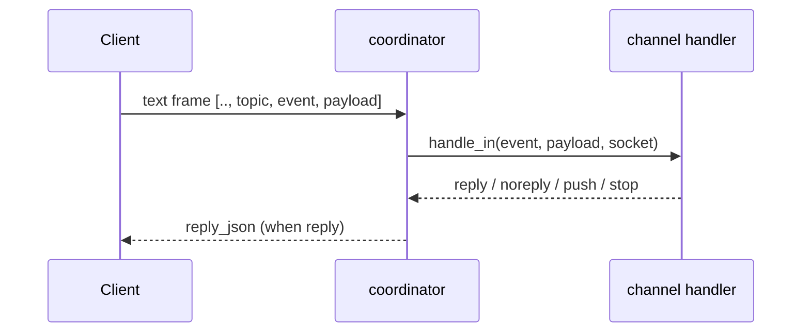
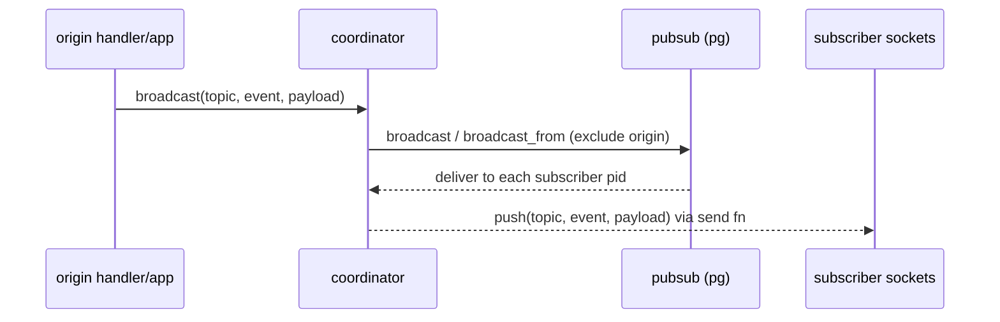
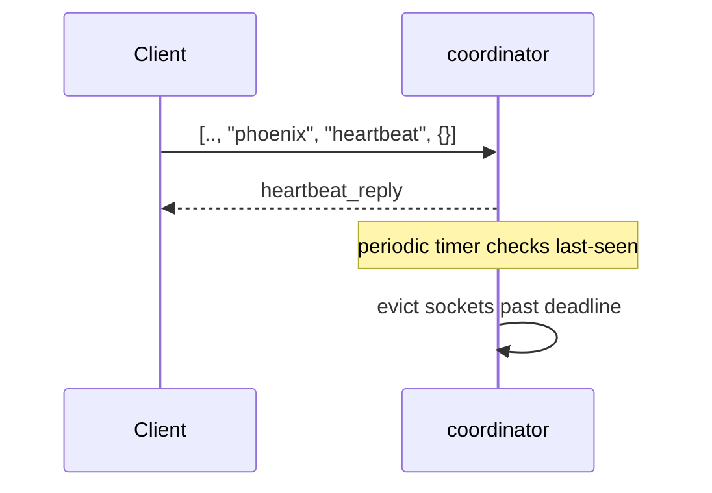
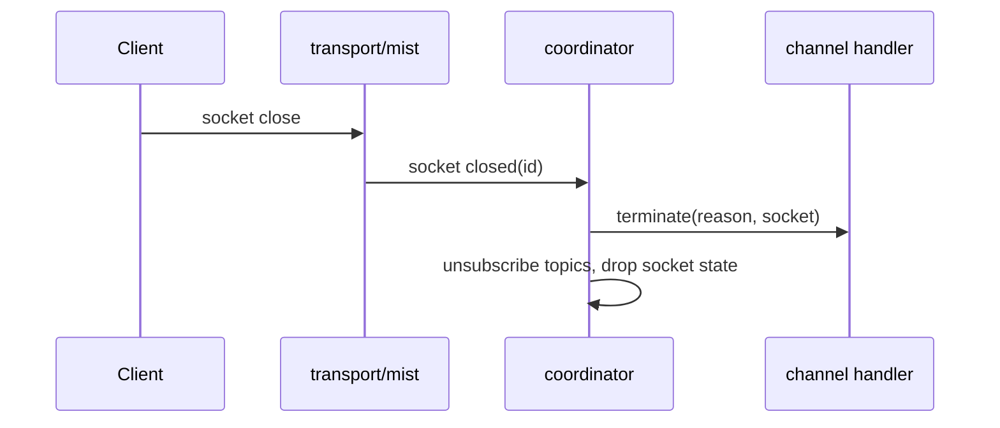
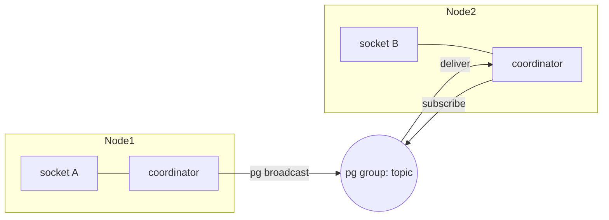
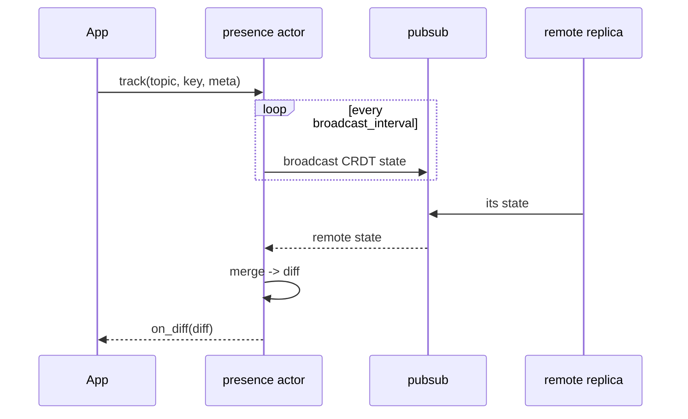
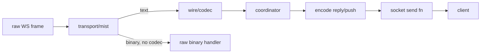

<script type="module">
  import mermaid from "https://cdn.jsdelivr.net/npm/mermaid@11/dist/mermaid.esm.min.mjs";
  mermaid.initialize({ startOnLoad: true });
</script>

# beryl architecture

Type-safe realtime channels & presence on the BEAM

---

## What beryl is

- Phoenix-style channel system on OTP actors and Erlang `pg`
- Pluggable wire codec + WebSocket transport
- Channels, presence, and groups as independent domain actors
- Coordinator wires them together and enforces heartbeats
- PubSub is the only cross-node primitive



---

## Module map

| Module | Responsibility |
|---|---|
| `beryl` | Public entry-point: `config/1`, `start/1`, `register/3`, `broadcast/4` |
| `beryl/coordinator` | Central OTP actor: registry, socket tracking, routing, heartbeat |
| `beryl/pubsub` | Distributed pub-sub via Erlang `pg` |
| `beryl/presence` | Add-wins OR-set CRDT; track/untrack, cross-node diff broadcast |
| `beryl/wire` | Pluggable codec; ships `phoenix_codec()` |
| `beryl/transport/mist` | Mist WebSocket adapter; assigns IDs, routes frames |
| `beryl/group` | Named topic collections; supports grouped broadcast |
| `beryl/topic` | Topic pattern matching: exact and `"ns:*"` wildcards |

---

## Coordinator: the central actor

The coordinator is a **single OTP actor** that is the heart of beryl. It tracks:

- **Socket registry** — `socket_id → {assigns, send_fn, topics, last_heartbeat}`
- **Handler registry** — `topic_pattern → channel_handler`
- **PubSub subscriptions** — one pg group per joined topic
- **Heartbeat timer** — evicts stale sockets on deadline

All inbound frames, PubSub deliveries, and info messages pass through its mailbox sequentially. Because it is a single actor, no locks are needed for socket or topic state.

---

## Supervision tree

```mermaid
flowchart TB
  S["supervisor (rest-for-one)"]
  S --> CO["coordinator"]
  S --> PR["presence (optional)"]
  S --> GR["groups (optional)"]
  CO -. "crash restarts downstream" .-> PR
  PR -. .-> GR
```

- `rest-for-one`: coordinator crash restarts presence and groups
- Embeddable via `beryl/supervisor.child_spec/1`
- Presence and groups are optional; omit from config if unused

---

## Message lifecycle — connect



The transport generates a 16-byte random ID (base16) and hands the socket and its send function to the coordinator for bookkeeping.

---

## Message lifecycle — join



---

## Message lifecycle — inbound event & broadcast





---

## Heartbeat & terminate





---

## PubSub & distribution



- Built on Erlang `pg` — cluster-aware out of the box
- `broadcast_from` excludes the originating socket (load-bearing for correctness)
- Scoped by an Erlang atom; default scope is `beryl_pubsub`
- No extra message-bus infrastructure required

---

## Presence — CRDT replication



- Add-wins OR-set CRDT via `lattice_presence/presence_state`
- Each node holds its own replica; merges converge without coordination
- `on_diff` fires on every local change or remote merge with a non-empty diff

---

## Wire & transport



- Phoenix wire format: `[join_ref, ref, topic, event, payload]`
- `Codec` is a data value — swap framing without touching coordinator or channel logic
- `phoenix_codec()` is the default; pass to `beryl.config/1`
- Binary frames bypass the codec when no `decode_binary` is configured

---

## Concurrency note

The coordinator is a **single OTP mailbox** — sequential processing with no locks needed.

- Broadcasts arrive as Erlang messages; tests must **select the exact message shape**
- Stale queued messages can cause nondeterministic test failures
- Drain messages your tests create; don't use broad "any message" selectors near PubSub assertions
- This is BEAM-native: supervised actors, pattern matching, no shared mutable state

---

## Where to start contributing

| Start here | Module | Purpose |
|---|---|---|
| 💡 Heart of beryl | `src/beryl/coordinator.gleam` | Actor, registry, message routing |
| 📨 Message flow | `src/beryl/transport/mist.gleam` | Connect → decode → route |
| 🔌 Channel API | `src/beryl/channel.gleam` | `join`, `handle_in`, `terminate` callbacks |
| 📡 Fan-out | `src/beryl/pubsub.gleam` | pg-based broadcast |
| 👥 Presence | `src/beryl/presence.gleam` | CRDT actor, track/untrack, diffs |
| 🔤 Framing | `src/beryl/wire.gleam` | Phoenix codec, encode/decode |

Start with `coordinator.gleam` — it is the single process that ties everything together.
Architecture docs live at `/architecture/` in the website.
