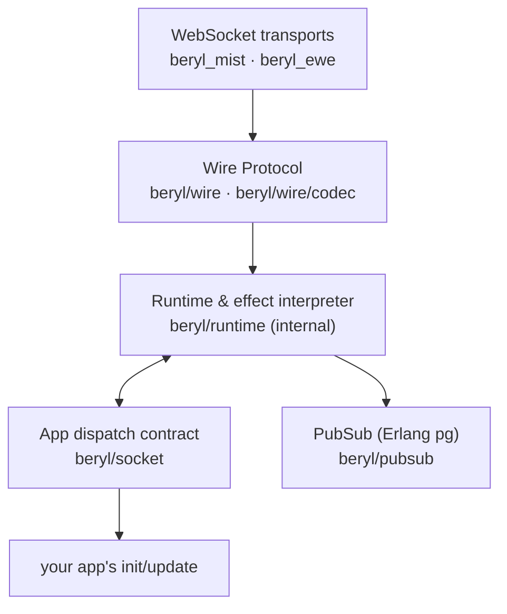
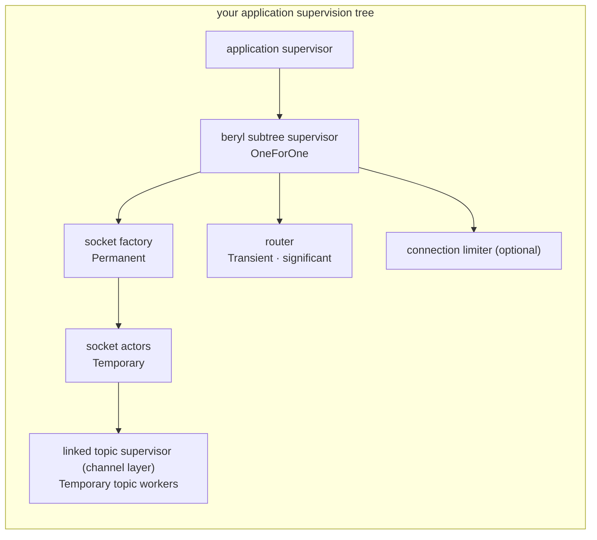
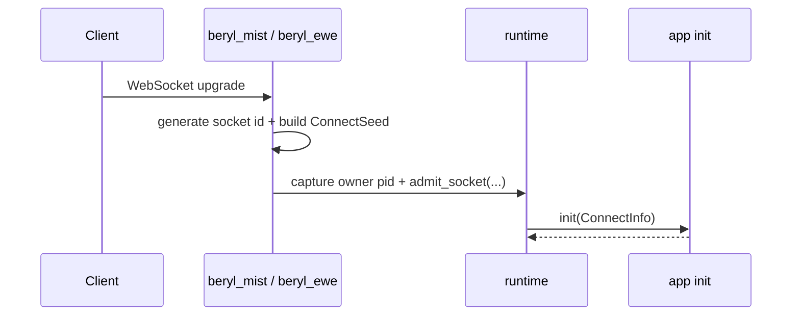
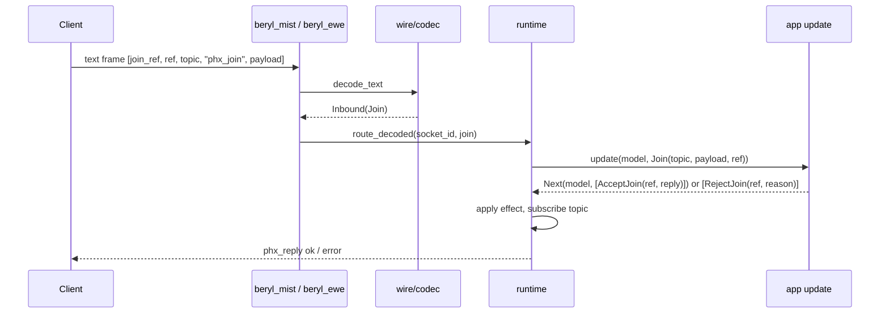
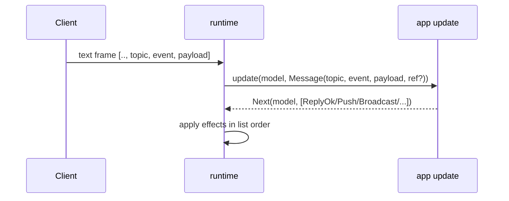
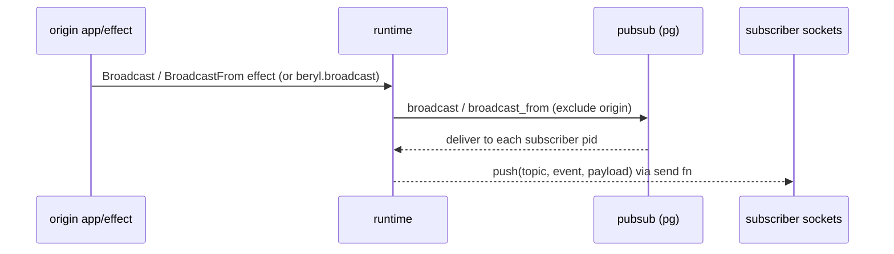
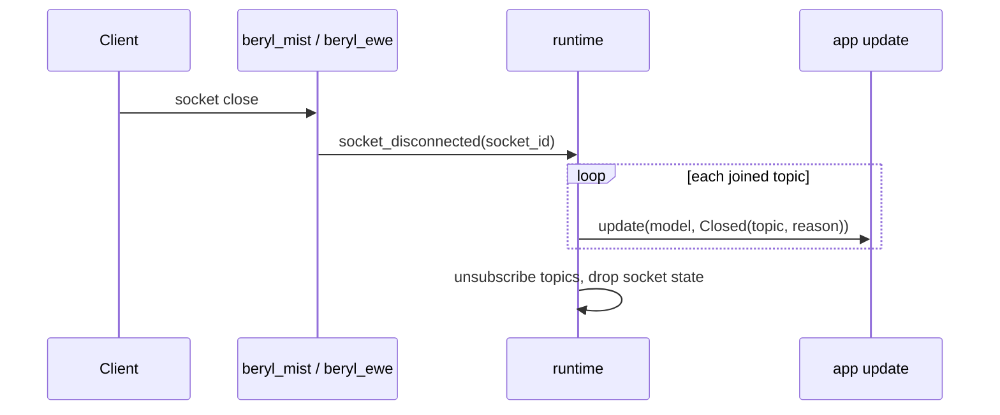
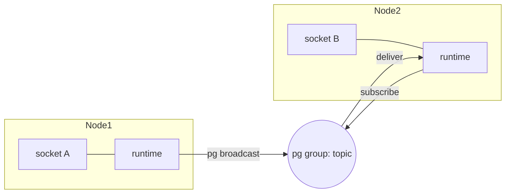
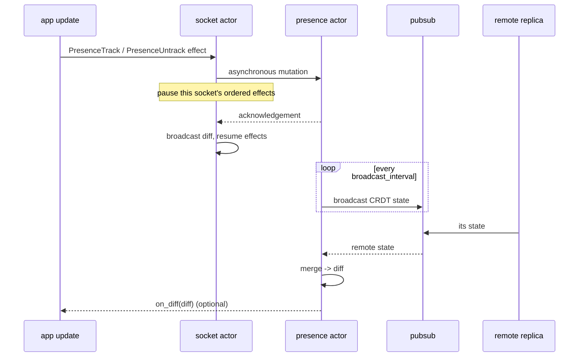
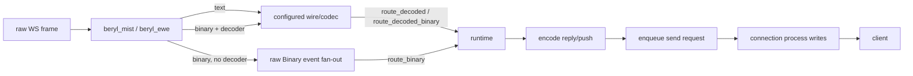

# beryl architecture

Type-safe realtime channels & presence on the BEAM

<!--
Speaker notes:
Opening frame. beryl provides Phoenix-compatible realtime messaging and
presence as a type-safe Gleam library on the Erlang VM. Explain the deck in
this order: the purpose, the module map, the runtime effect interpreter, and
the connection lifecycle. The lifecycle includes connect, join, event,
broadcast, heartbeat, and close. Then explain distribution, presence, and how
to start contributing.
-->

---

## What beryl is

- App-side dispatch on OTP actors and Erlang `pg`: one `init`/`update` pair per app
- Pluggable wire codec + WebSocket transport (Mist, Ewe)
- Presence and groups are independent, app-owned OTP actors
- One shared router, a temporary actor per socket, and optional per-topic workers
- PubSub is the only cross-node primitive

<!--
Speaker notes:
Read the diagram from top to bottom. A raw WebSocket frame enters the
transport. The wire codec converts bytes into typed messages. The shared
router forwards them to the socket actor. Raw dispatch runs `init` and
`update` there; the channel layer runs callbacks in a worker for each
socket/topic join. The socket actor applies effects in order and enqueues
outbound frames for the transport connection process to write. PubSub is the only
primitive that crosses node boundaries. All layers above PubSub are local to
one node. Each box is an independent layer that you can inspect and test. The
runtime connects these layers.
-->

---

## Module map

| Module | Responsibility |
|---|---|
| `beryl` | Public entry-point: `config`, `child_spec`, `stop`, `broadcast` |
| `beryl/socket` | App dispatch contract: `Input`, `Next`, `Effect`, `Sender`, `ConnectInfo` |
| `beryl/runtime` | Router, supervised socket actors, topic workers, effects, heartbeat |
| `beryl/channel` | Typed handlers and per-topic state, run in topic workers |
| `beryl/pubsub` | Distributed pub-sub via Erlang `pg`; typed `Subscriber(payload)` |
| `beryl/presence` | Add-wins OR-set CRDT; track/untrack, dirty full-state replication |
| `beryl/wire` | Pluggable codec; ships `phoenix_codec()` |
| `beryl_mist` / `beryl_ewe` | WebSocket adapters; assign socket ids, route frames |
| `beryl/group` | Named topic collections; supports grouped broadcast |
| `beryl/topic` | Topic pattern matching: exact, `"ns:*"` prefix, and segment wildcards |
| `beryl/bridge` | Forward an external actor's messages into one socket's `Info` events |

<!--
Speaker notes:
Use this table to find each responsibility. Two rows define most application
code. `beryl` is the public API. `beryl/socket` defines the application
contract: `Input` enters and `Effect` values leave. The internal
`beryl/runtime` module executes that contract. Applications do not import it,
but it is central to the architecture. The runtime uses PubSub for fan-out,
presence for membership, wire for framing, and the transport for the socket.
The application owns the presence actor, and the runtime borrows its handle.
`beryl/topic` is small but important. The app's `update` function uses it to
match a `Join` or `Message` topic against an application pattern.
-->

---

## The runtime: effect interpreter at the center

The runtime divides work between **a shared router and per-socket actors**:

- **Router**: admission, socket table, topic subscriber index, PubSub fan-out
- **Socket actor**: raw model, `init`/`update`, refs, effects, heartbeat timer
- **Topic worker**: channel state and callbacks for one socket/topic join
- **Transport connection process**: WebSocket state and frame writes

The socket actor orders effects and enqueues frames. The connection process
writes them. Topic workers can run concurrently; raw callbacks on one socket
remain sequential.

<!--
Speaker notes:
Runtime names the whole process arrangement, not one actor. The router does
not run application callbacks. Each socket actor owns its raw model and
protocol state. With channel.child_spec, each accepted socket/topic join
also has a worker that owns its private channel state.

The socket actor applies ordered effect lists, including worker reports.
Presence mutations can suspend a list. Send functions enqueue requests for
Mist or Ewe; they do not confirm a completed network write. Workers on
different topics can run concurrently, but their effects still pass through
the socket actor. Shared router work and connection writes remain possible
sources of delay.
-->

---

## Supervision: one supervised entry point

- `child_spec` returns a child specification for the runtime subtree and a stable handle
- Add the subtree to *your* application supervisor
- Temporary children do not restart sessions: clients reconnect and rejoin
- beryl **borrows** PubSub, presence, and groups. They are not children of this subtree.

<!--
Speaker notes:
`beryl.child_spec` provides one supervised entry point. It validates and builds the
OneForOne subtree (socket factory, significant transient router, and an
optional connection limiter), then hands back a
`ChildSpecification` that the caller passes to `static_supervisor.add`. The
application supervisor owns the lifecycle. Presence, PubSub, and groups are
not part of this tree. The application starts and owns them, and the runtime
borrows their handles. `beryl.stop` terminates only beryl's subtree. It does
not terminate the PubSub instance, presence actor, or group actors.

The transport requests a temporary socket child from the shared factory.
The router registers that child before init runs in the socket actor, so
slow init does not block the factory's start operation. Router and socket
actors retain mutual monitors. A socket fault closes one connection; a
topic-worker fault closes one topic. A router or factory fault closes all
connections in that runtime. A factory restart does not restart the router.
The factory starts before the router so graceful shutdown drains the router
and sockets before the factory terminates remaining children.
-->

---

## Message lifecycle: connect

The transport generates a 16-byte random id in base16 form. It gives the
socket, its send functions, and the connection metadata (`ConnectSeed`) to the
runtime. The runtime then calls the app's `init`.

<!--
Speaker notes:
Use this slide to define the pattern for the next lifecycle slides. A client
action enters through the transport. The transport creates a socket id and
builds `ConnectSeed` from the request path, query, headers, and any
`on_connect` metadata. It then registers the socket with the runtime.

The runtime calls the app's `init` with `ConnectInfo`. This value contains the
socket id, the seed, and a typed `Sender` for later server messages. `init`
returns the initial socket `model` and any immediate effects. A join has not
occurred. The runtime now tracks a connection and its model.
-->

---

## Message lifecycle: join

<!--
Speaker notes:
This slide has no visible prose. Explain the sequence during the talk. A join is the
first Phoenix-protocol message: the client sends a `phx_join` frame carrying
a `join_ref`, a `ref`, the target topic, and a payload. Trace each step. The
transport connection invokes the configured wire codec at the edge, which
converts the raw array into a typed decoded message. The transport then routes
that value to the runtime. The runtime delivers exactly one `Join` event to the app's
`update` function. It does not look up a registry because `update` handles
every topic itself, typically by pattern-matching the topic string. The
app answers with `AcceptJoin`, which subscribes the socket to the topic's pg
group and sends an ok reply. `RejectJoin` sends an error reply and does not
create a subscription. If the join finishes the turn
without an answer, the runtime rejects it. This fail-closed behavior is part
of the design. Application code first runs at this point, and the runtime
creates the subscription state here. The next slides assume that the join
succeeded.
-->

---

## Message lifecycle: inbound event and broadcast

<!--
Speaker notes:
Compare the two flows. The top diagram shows the inbound path. A client sends
an event on an already joined topic. The
runtime delivers a `Message` event to `update`, and the returned `Effect`
list controls the next operations. `ReplyOk` and `ReplyError` answer the
message ref. `Push` sends an unsolicited message to this socket.
`Broadcast` and `BroadcastFrom` send an event to a topic's subscribers.
`Stop` in `Next` closes the complete socket. The socket actor applies effects
and enqueues frames in list order. A presence mutation pauses the remaining
list until its acknowledgement or timeout. This rule matters when an
`AcceptJoin` precedes a `Push` in the same list.

The bottom diagram shows fan-out. A broadcast effect enters PubSub (`pg`),
which delivers it to each subscriber pid in the cluster. Each runtime then
pushes it to local sockets through their send functions. `BroadcastFrom`
excludes the originating socket. This rule prevents the sender from receiving
an echo of its own message and is necessary for correct behavior.
-->

---

## Heartbeat & close

<!--
Speaker notes:
Both diagrams show liveness and cleanup. In the top flow, Phoenix clients send
a periodic `heartbeat` on the special `"phoenix"` topic. The socket actor replies
and records the last-seen time. Each socket actor has its own timer and
removes its socket if it passes the deadline. This process detects clients
that lose their network connection or close without a clean disconnect.

The bottom flow covers clean closes, crashes, kicks, and timeouts. When a
socket connection ends, the runtime sends `Closed(topic, reason)` to `update`
for each joined topic. This event replaces the former `terminate` callback.
Application code can remove per-topic model state. The runtime then
unsubscribes and removes the socket. Both flows preserve one invariant: a dead
socket does not remain subscribed to a pg group. Broadcasts therefore do not
target closed connections.
-->

---

## PubSub & distribution

- Built on Erlang `pg` through a typed `Subscriber(payload)`; it works across the cluster
- `broadcast_from`/`BroadcastFrom` excludes the originating socket, which preserves correct behavior
- Scoped by an Erlang atom; default scope is `beryl_pubsub`
- No extra message-bus infrastructure required

<!--
Speaker notes:
Socket A on Node1 and socket B on Node2 join the same logical topic. A pg group
spans both nodes. When Node1 broadcasts, pg delivers the message to
subscribers on each node. Node2's runtime receives it and pushes it to socket
B.

This design does not require an external broker such as Redis or NATS. `pg`
ships with the BEAM and operates across connected nodes. Subscriptions use a
typed `Subscriber(payload)` handle with `pubsub.subscriber`, `join`, and
`leave`. The underlying pg operations remain the same.

Repeat the originating-socket exclusion rule from the previous slide. Also
explain the scope atom. Erlang atoms provide namespaces for groups, and the
default scope is `beryl_pubsub`. This permits multiple beryl instances to
coexist. Do not derive the scope from user input because the VM does not
garbage-collect atoms.
-->

---

## Presence: CRDT replication

- Add-wins OR-set CRDT via `lattice_presence/presence_state`
- App-owned actor: started and supervised separately
- Presence effects pause one socket; the presence actor remains shared

<!--
Speaker notes:
Presence reports who is connected across the cluster. It stays consistent
without a central coordinator or database. Each node runs a presence actor
that holds one replica of an add-wins OR-set CRDT from `lattice_presence`.
The application starts and supervises this actor outside beryl's subtree.

Public mutation calls are synchronous; do not call them from app callbacks.
Use presence effects or channel actions. The socket actor sends a mutation,
parks its ordered work, and resumes after acknowledgement or timeout.
Snapshot effects read the published ETS read model. On a
timer, the presence actor broadcasts its state through PubSub. It also merges
states from remote replicas. CRDT merges are commutative and idempotent.
Therefore, replicas converge when messages arrive in different orders or more
than once. The system does not need locks, a leader, or application conflict
resolution.

A slow presence callback can delay mutations from multiple sockets because
they share the presence actor. The per-socket deferred queues are not bounded
by the acknowledgement timeout.
-->

---

## Wire & transport

- Phoenix wire format: `[join_ref, ref, topic, event, payload]`
- `Codec` is a data value; change the framing without changing the runtime or your `update`
- `beryl.config(codec)` requires an explicit codec; `phoenix_codec()` is the built-in Phoenix option
- Transports monitor the runtime pid and close the connection if it goes down

<!--
Speaker notes:
Follow the diagram from left to right. A raw frame enters the Mist or Ewe
transport, which selects a path for the frame type. Text frames use the
codec's text decoder. Binary frames use its binary decoder when one exists and
retain binary telemetry classification through `route_decoded_binary`. A
codec without a binary decoder uses the raw `Binary` event path. For outbound
data, the same codec encodes runtime replies and pushes. The runtime then gives
them to the socket's send function. That function enqueues SendText or
SendBinary for the connection process. The connection process calls the
transport's frame-write function. Enqueue success is not delivery confirmation.

`Codec` is a data value, not fixed runtime logic. An application can change
framing without changing the runtime or application code. beryl has no
implicit wire default. Callers pass a codec to `beryl.config`. Use
`wire.phoenix_codec()` for Phoenix JSON and V2 binary compatibility.

Transports monitor the runtime pid through `transport.runtime_pid` and pass
that exact pid to `transport.admit_socket`. A restart, identity mismatch, or
failed registration closes the WebSocket. The transport does not attach the
socket to the replacement runtime.
-->

---

## Concurrency note

Each actor processes its own mailbox in sequence. There is **no shared
callback mailbox** for all sockets.

- Slow raw callbacks delay one socket; channel message/info callbacks run per topic
- Joins, ordered closes, and presence work can delay other work on the same socket
- Broadcasts arrive as Erlang messages; tests must **select the exact message shape**
- Stale queued messages can cause nondeterministic test failures
- Drain messages that your tests create. Do not use broad "any message"
  selectors near PubSub assertions.
- This is BEAM-native: supervised actors, pattern matching, no shared mutable state

<!--
Speaker notes:
This slide gives architecture information and test guidance. Per-socket
effect order is preserved through the connection writer. There is no total
callback order between sockets or between channel workers on different topics.
This isolates callback execution, not all resource use or latency: the router,
presence actor, socket effect interpreter, and transport queues can still
accumulate work.

Broadcasts and pushes arrive as ordinary Erlang messages in a process
mailbox. A test must select the exact expected message shape. A broad
"any message" selector can consume a stale message from an earlier action.
The test can then fail intermittently. Drain the messages that each test
creates, and match the expected message shape. Mailbox state is the most
common source of intermittent test failures in this codebase.
-->

---

## Queue limits and evidence

- Rate limits control admission, not end-to-end queued messages or bytes
- Worker input, reports, socket queues, router fan-out, and presence remain unbounded
- Outbound send queues have no configured slow-reader eviction policy
- [#397](https://github.com/tylerbutler/beryl/issues/397): runtime queue contracts; [#249](https://github.com/tylerbutler/beryl/issues/249): outbound backpressure
- [#371](https://github.com/tylerbutler/beryl/pull/371) is protocol smoke, not comparative performance evidence
- ADR 0005 compares startup at 2,000 connections/s; [#400](https://github.com/tylerbutler/beryl/issues/400) tracks broader baselines

<!--
Speaker notes:
Do not infer bounded memory or healthy-client latency from process isolation.
The runtime guide lists current controls, defaults, and overflow behavior:
https://beryl.tylerbutler.com/architecture/runtime/#queue-limits-and-overload
Generic PubSub and external consumer mailboxes have no global beryl budget.
Queue units, reservation release paths, overload ordering, and occupancy/age
telemetry are pending contracts in #397, not shipped guarantees.

ADR 0005 used Mist, Erlang 27.2.1, 12 schedulers, and three runs per design at
a requested 2,000 starts/s. It compares direct and factory startup at that
rate; it does not establish a general throughput, memory, or recovery bound.
#400 covers slow readers, hot workers, slow presence, combined router
pressure, and crash/reconnect workloads.
-->

---

## Where to start contributing

| Start here | Module | Purpose |
|---|---|---|
| 💡 Public surface | `src/beryl.gleam` | `config`, `child_spec`, `stop`, broadcast helpers |
| 🔌 Dispatch contract | `src/beryl/socket.gleam` | `Input`, `Next`, `Effect`, `Sender`, `ConnectInfo` |
| ⚙️ Heart of beryl | `src/beryl/runtime.gleam` | Router, socket actors, workers, effects, heartbeat (internal) |
| 📨 Message flow | `packages/beryl_mist/src/beryl_mist.gleam` | Connect → decode → route |
| 📡 Fan-out | `src/beryl/pubsub.gleam` | pg-based broadcast, typed `Subscriber` |
| 👥 Presence | `src/beryl/presence.gleam` | CRDT actor, track/untrack, diffs |
| 🔤 Framing | `src/beryl/wire.gleam` | Phoenix codec, encode/decode |

Start with `beryl.gleam` and `beryl/socket.gleam` for the public contract.
Then read `runtime.gleam`. It implements the router, socket actors, and topic workers.
The website contains architecture documents under `/architecture/`.

<!--
Speaker notes:
Use the closing slide to give specific next steps. The table starts with the
files that give a new contributor the most context. `beryl.gleam` contains
the public entry points. `socket.gleam` contains the contract that `update`
implements. Together, they define the public dispatch API.

Then read `runtime.gleam`. It connects all other parts, although applications
do not import it. Next, select a subject: transport for the connection
lifecycle, PubSub for fan-out, presence for the CRDT, or wire for framing.
The website has more architecture documents under `/architecture/`, including
`/architecture/runtime`. End the talk and invite questions.
-->
