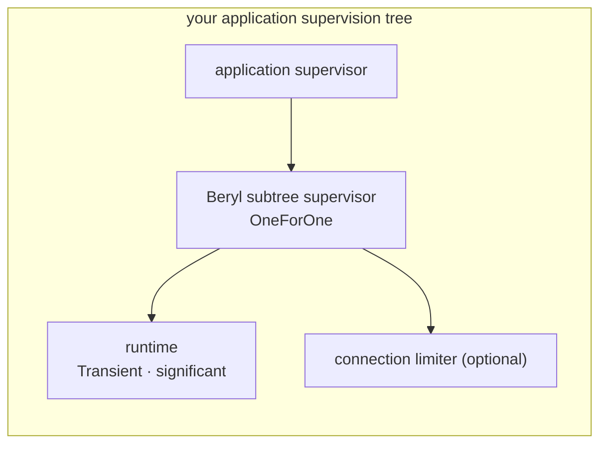
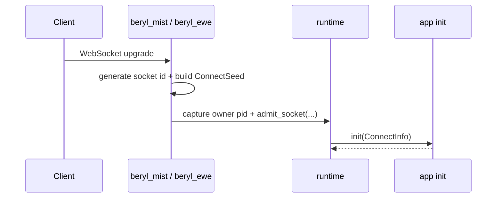
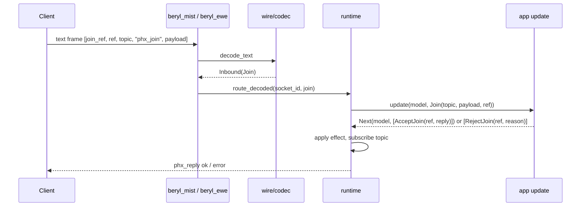
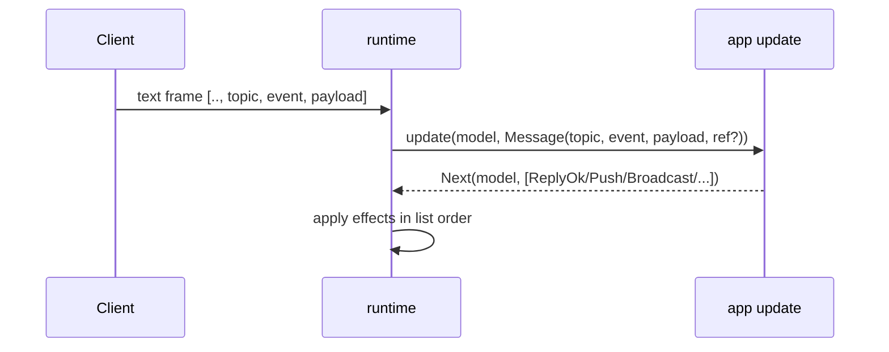
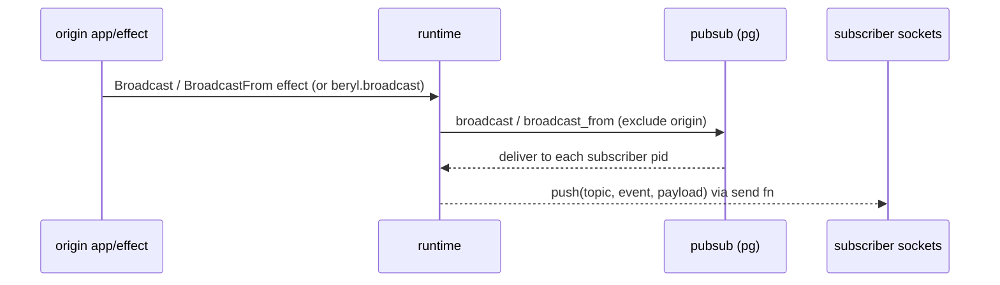
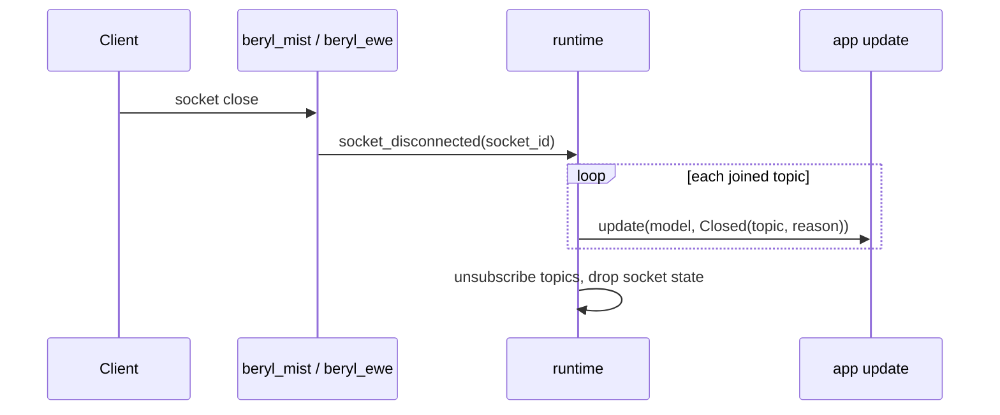
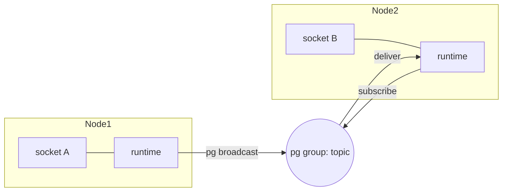
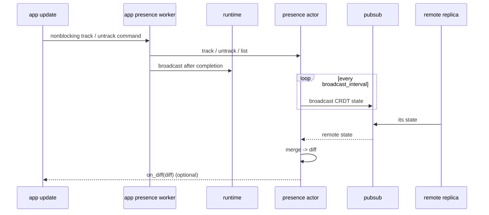
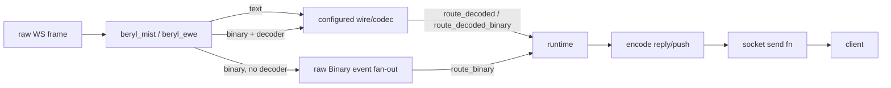

# beryl architecture

Type-safe realtime channels & presence on the BEAM

<!--
Speaker notes:
Opening frame. In one sentence: beryl gives you Phoenix-compatible realtime
messaging and presence, but as a Gleam library with full type safety, running
natively on the Erlang VM. Set expectations for the deck — we'll go top-down:
what it is, the module map, then the runtime (the effect interpreter at the
center of everything), and finally trace a connection through its full
lifecycle (connect, join, event, broadcast, heartbeat, close) before covering
distribution, presence, and where to start contributing.
-->

---

## What beryl is

- App-side dispatch on OTP actors and Erlang `pg`: one `init`/`update` pair per app
- Pluggable wire codec + WebSocket transport (Mist, Ewe)
- Presence and groups are independent, app-owned OTP actors
- One runtime actor per app dispatches events and applies effects
- PubSub is the only cross-node primitive

<!--
Speaker notes:
This is the 10,000-foot view. Read the diagram top to bottom as the path a
message takes: a raw WebSocket frame enters at the transport, the wire codec
turns bytes into typed messages, and the runtime — one OTP actor per app —
delivers those as typed `Input` values to the app's `update` function, then
applies whatever `Effect` list `update` returns. There is no channel registry
and no per-channel callback modules: one `update` function handles every
topic your app cares about, and it routes by pattern-matching the topic
string itself. PubSub sits at the bottom because it is the *only* primitive
that crosses node boundaries — everything above it is local to one node. The
key takeaway: each box is an independent layer you can reason about (and
test) on its own, and the runtime is the seam where they meet.
-->

---

## Module map

| Module | Responsibility |
|---|---|
| `beryl` | Public entry-point: `config`, `child_spec`, `stop`, `broadcast` |
| `beryl/event` | App dispatch contract: `Input`, `Next`, `Effect`, `Sender`, `ConnectInfo` |
| `beryl/runtime` | Internal OTP actor: socket tracking, dispatch, effect interpretation, heartbeat |
| `beryl/pubsub` | Distributed pub-sub via Erlang `pg`; typed `Subscriber(payload)` |
| `beryl/presence` | Add-wins OR-set CRDT; track/untrack, dirty full-state replication |
| `beryl/wire` | Pluggable codec; ships `phoenix_codec()` |
| `beryl_mist` / `beryl_ewe` | WebSocket adapters; assign socket ids, route frames |
| `beryl/group` | Named topic collections; supports grouped broadcast |
| `beryl/topic` | Topic pattern matching: exact, `"ns:*"` prefix, and segment wildcards |
| `beryl/bridge` | Forward an external actor's messages into one socket's `Info` events |

<!--
Speaker notes:
This table is the "where does X live" cheat sheet. Two rows do most of the
work: `beryl` is the public API a user calls, and `beryl/event` is the
contract that shapes every app built on beryl — `Input` in, `Effect`s out.
`beryl/runtime` is where that contract is actually executed; it's internal,
not a module apps import directly, but it's the single most important piece
to understand architecturally. Everything else is a focused collaborator the
runtime delegates to — pubsub for fan-out, presence for membership (an
app-owned actor the runtime just borrows a handle to), wire for framing,
transport for the socket. Point out that `beryl/topic` is small but
load-bearing: it's what your own `update` function uses to decide which
topic prefix a `Join`/`Message` event belongs to.
-->

---

## The runtime: effect interpreter at the center

The runtime is a **single OTP actor** — one per `Sockets` handle. It tracks:

- **Socket state** — `socket_id → {model, send_fn, joined topics, last_heartbeat}`
- **App contract** — calls `init`/`update` and applies the returned `Effect`s
- **PubSub subscriptions** — one pg group per joined topic
- **Heartbeat timer** — evicts stale sockets on deadline

All inbound frames, PubSub deliveries, and `Info` messages pass through its mailbox sequentially, and effects apply in strict list order within one turn.

<!--
Speaker notes:
This is the most important conceptual slide, and it replaces what used to be
a "coordinator + channel registry" story with something simpler: there is no
registry, because there's no per-topic handler to look up — one `update`
function handles every event for every socket on this runtime. The runtime
owns four pieces of state, and the punchline is the last line: because one
actor serializes every message through a single mailbox, we get consistency
for free — no mutexes, no race conditions on socket or topic state, and
effect order equals wire order. Call out each piece: socket state now holds
the app's own `model` (not a beryl-defined "assigns" record), the app
contract is `init`/`update` plus the `Effect` list `update` returns, the pg
subscriptions are how broadcasts arrive, and the heartbeat timer reclaims
dead sockets. If someone asks "isn't a single actor a bottleneck?" — the
actor only does cheap bookkeeping, dispatch, and effect application; you
scale across nodes via pg, not by adding runtime threads.
-->

---

## Supervision: one supervised entry point

- `child_spec` returns a child spec for the runtime subtree and a stable handle
- Add the subtree to *your* application supervisor
- PubSub, presence, and groups are **borrowed** — never children of this subtree

<!--
Speaker notes:
One supervised entry point. `beryl.child_spec` validates and builds the
OneForOne subtree (runtime as the significant, transient child, plus an
optional connection limiter sibling), then hands back a
`ChildSpecification` for the caller to `static_supervisor.add` themselves —
the application supervisor owns its lifecycle. Presence, PubSub, and groups are NOT
part of this tree anymore. They're started and owned by the application, and
the runtime just borrows a handle. `beryl.stop` only tears down Beryl's own
subtree — never your PubSub instance, presence actor, or group actors.
-->

---

## Message lifecycle — connect

The transport generates a 16-byte random id (base16) and hands the socket, its send functions, and connect metadata (`ConnectSeed`) to the runtime, which calls the app's `init`.

<!--
Speaker notes:
This is the simplest of the lifecycle slides, so use it to establish the
pattern the next slides reuse: a client action enters at the transport, the
transport does the minimum (mint a socket id, assemble `ConnectSeed` from the
request — path, query, headers, and any `on_connect` metadata), and then it
registers with the runtime. The runtime calls the app's `init` with a
`ConnectInfo` bundling the socket id, that seed, and a typed `Sender` for
later server-initiated messages — and `init` returns the socket's starting
`model` plus any effects to apply immediately. No join has happened yet;
this slide is purely "a connection now exists, is tracked, and has a model."
-->

---

## Message lifecycle — join

<!--
Speaker notes:
This slide has no prose on purpose — walk the sequence live. A join is the
first Phoenix-protocol message: the client sends a `phx_join` frame carrying
a `join_ref`, a `ref`, the target topic, and a payload. Trace each hop: the
transport connection invokes the configured wire codec at the edge, which
turns the raw array into a typed decoded message; the transport then routes
that value to the runtime. The runtime delivers exactly one `Join` event to the app's
`update` function — there's no registry lookup, because `update` handles
every topic itself, typically by pattern-matching the topic string. The
app answers with `AcceptJoin` (subscribing the socket to the topic's pg
group and sending an ok reply) or `RejectJoin` (sending an error reply, no
subscription). One rule worth emphasizing: if the join finishes the turn
unanswered, the runtime rejects it automatically — fail closed by design.
The relevance: this is where application code first runs, and where
subscription state is established — everything in the next slides assumes
a successful join happened here.
-->

---

## Message lifecycle — inbound event & broadcast

<!--
Speaker notes:
Two diagrams, two distinct flows — contrast them. The top one is the
*inbound* path: a client sends an event on an already-joined topic, the
runtime delivers a `Message` event to `update`, and the returned `Effect`
list drives what happens next. Name a few outcomes: `ReplyOk`/`ReplyError`
(answer this specific message's ref), `Push` (send an unsolicited message to
this socket), `Broadcast`/`BroadcastFrom` (fan out to a topic's
subscribers), and `Stop` from `Next` (leave the socket entirely). Effects
apply strictly in list order within one actor turn — list order is wire
order, which matters when an `AcceptJoin` is followed by a `Push` in the
same list. The bottom diagram is the *fan-out* path and is the heart of why
beryl exists: a broadcast effect goes into pubsub (pg), which delivers it to
every subscriber pid across the cluster, and each runtime pushes it to its
local sockets via their send fns. The detail that earns a pause:
`BroadcastFrom` excludes the originating socket so a sender doesn't receive
an echo of its own message — that exclusion is load-bearing for correctness
and easy to get wrong.
-->

---

## Heartbeat & close

<!--
Speaker notes:
Both diagrams are about *liveness and cleanup* — how sockets leave,
gracefully or not. The top flow is the heartbeat: Phoenix clients
periodically send a `heartbeat` on the special "phoenix" topic, the runtime
replies, and it records a last-seen timestamp. A separate periodic timer
sweeps tracked sockets and evicts any whose last-seen is past the
deadline — this is how we detect clients that vanished without a clean
close (dropped network, killed tab). The bottom flow is the graceful (and
crash/kick/timeout) path: whenever a socket's connection ends for any
reason, the runtime delivers a `Closed(topic, reason)` event to `update`
for *every* joined topic — this single event replaces what used to be a
`terminate` callback — so application code can clean up per-topic model
state, and then the runtime unsubscribes and drops the socket. Relevance:
both paths converge on the same invariant — no dead socket is left
subscribed to a pg group, so broadcasts never try to push to a connection
that's gone.
-->

---

## PubSub & distribution

- Built on Erlang `pg` via a typed `Subscriber(payload)` — cluster-aware out of the box
- `broadcast_from`/`BroadcastFrom` excludes the originating socket (load-bearing for correctness)
- Scoped by an Erlang atom; default scope is `beryl_pubsub`
- No extra message-bus infrastructure required

<!--
Speaker notes:
The diagram shows the payoff of building on Erlang `pg`: socket A on Node1
and socket B on Node2 are joined to the same logical topic, which is just a
pg group spanning both nodes. When Node1 broadcasts, pg delivers to
subscribers on every node — Node2's runtime receives it and pushes to
socket B. The relevance to emphasize: there is *no* external broker here. No
Redis, no NATS, no separate message bus to deploy and operate — pg ships
with the BEAM and is cluster-aware the moment your nodes are connected.
Mention that subscribing now goes through a typed `Subscriber(payload)`
handle (`pubsub.subscriber` → `join`/`leave`), not a bare `subscribe`
function — same pg mechanics, better typing. Re-iterate the exclusion
semantics from the previous slide, and mention the scope atom: groups are
namespaced under an Erlang atom, default `beryl_pubsub`, so multiple beryl
instances can coexist. Never derive that scope from user input — atoms are
never garbage collected.
-->

---

## Presence — CRDT replication

- Add-wins OR-set CRDT via `lattice_presence/presence_state`
- App-owned actor: started and supervised separately
- Synchronous presence calls stay outside the shared runtime

<!--
Speaker notes:
Presence answers "who is here right now" across the cluster, and the
diagram shows how it stays consistent without a central coordinator or a
database. Each node runs a presence actor holding its own replica of an
add-wins OR-set CRDT (from `lattice_presence`) — and that actor is started
and supervised by the *application*, not by Beryl's own subtree. Public
presence calls are synchronous, so an application-owned worker performs
them outside the shared socket runtime and broadcasts the result afterward.
On a timer
the actor broadcasts its state over pubsub and merges states it receives
from remote replicas. Stress the CRDT property: merges are commutative and
idempotent, so replicas *converge* regardless of message order or
duplication — no locking, no leader, no conflict resolution code.
The async presence read-model/effect work is deferred as one bundle rather
than exposing a partial blocking runtime feature.
-->

---

## Wire & transport

- Phoenix wire format: `[join_ref, ref, topic, event, payload]`
- `Codec` is a data value — swap framing without touching the runtime or your `update`
- `beryl.config(codec)` requires an explicit codec; `phoenix_codec()` is the built-in Phoenix option
- Transports monitor the runtime pid and close the connection if it goes down

<!--
Speaker notes:
This slide is about the seam that keeps beryl protocol-agnostic. Follow the
diagram left to right: a raw frame hits the transport (Mist or Ewe), which
branches on frame type. Text frames use the codec's text decoder. Binary
frames use its binary decoder when present and retain binary telemetry
classification through `route_decoded_binary`; only codecs without a binary
decoder use the raw `Binary` event path. On the way out, the runtime's replies
and pushes are encoded by the same codec and handed to the socket's send fn. The big idea:
the `Codec` is just a *data value*, not hardwired logic — so you can swap
the framing without touching the runtime or any app code. There is no implicit
wire default: callers pass a codec to `beryl.config`; choose
`wire.phoenix_codec()` for Phoenix JSON and V2 binary compatibility. One new detail
worth a beat: transports monitor the runtime's pid via
`transport.connection_owner`, then pass that exact identity to
`transport.admit_socket`. A restart, identity mismatch, or failed
registration closes the WebSocket instead of attaching it to the successor
runtime.
-->

---

## Concurrency note

The runtime is a **single OTP mailbox** — sequential processing with no locks needed.

- Broadcasts arrive as Erlang messages; tests must **select the exact message shape**
- Stale queued messages can cause nondeterministic test failures
- Drain messages your tests create; don't use broad "any message" selectors near PubSub assertions
- This is BEAM-native: supervised actors, pattern matching, no shared mutable state

<!--
Speaker notes:
This slide is half architecture, half hard-won testing advice. The
architectural point restates the runtime's superpower: one mailbox,
sequential processing, no locks, and effect order equals wire order. But
the practical consequence bites in tests — broadcasts and pushes arrive as
ordinary Erlang messages in a process mailbox, so a test must select the
*exact* message shape it expects. If you use a broad "any message" selector
near a pubsub assertion, a stale message left over from an earlier action
can be consumed by the wrong receive and cause a flaky, nondeterministic
failure. The rule of thumb to repeat: drain the messages your test creates,
and match specifically. This is the most common source of test flakiness in
the codebase, so it's worth the slide.
-->

---

## Where to start contributing

| Start here | Module | Purpose |
|---|---|---|
| 💡 Public surface | `src/beryl.gleam` | `config`, `child_spec`, `stop`, broadcast helpers |
| 🔌 Dispatch contract | `src/beryl/event.gleam` | `Input`, `Next`, `Effect`, `Sender`, `ConnectInfo` |
| ⚙️ Heart of beryl | `src/beryl/runtime.gleam` | Actor, dispatch, effect interpreter, heartbeat (internal) |
| 📨 Message flow | `packages/beryl_mist/src/beryl_mist.gleam` | Connect → decode → route |
| 📡 Fan-out | `src/beryl/pubsub.gleam` | pg-based broadcast, typed `Subscriber` |
| 👥 Presence | `src/beryl/presence.gleam` | CRDT actor, track/untrack, diffs |
| 🔤 Framing | `src/beryl/wire.gleam` | Phoenix codec, encode/decode |

Start with `beryl.gleam` and `beryl/event.gleam` for the public contract, then read `runtime.gleam` — it is the single process that ties everything together.
Architecture docs live at `/architecture/` in the website.

<!--
Speaker notes:
Closing slide — make it actionable. The table is ordered by where a
newcomer gets the most leverage. Start with the two public-facing files:
`beryl.gleam` (the entry points you call) and `event.gleam` (the contract
your `update` function implements) — together they're the whole public
API surface for dispatch. Then read `runtime.gleam`, because it's the one
process that touches every other part, so understanding it gives you the
map for everything else, even though you never import it directly. From
there, follow your interest — transport for the connection lifecycle,
pubsub for fan-out, presence for the CRDT, wire for framing. End by
pointing people at the longer-form architecture docs on the website under
`/architecture/`, which expand every topic in this deck with prose,
including the new `/architecture/runtime` page. Invite questions.
-->
