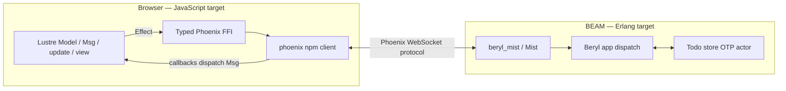

# Lustre Realtime Todo Example Plan

## Status

Draft (2026-08-15)

## Summary

Add a small collaborative Todo example that combines a Lustre 5.7 browser
client with a Beryl server. The example will demonstrate server-authoritative
CRUD state, join snapshots, mutation acknowledgements, and realtime updates
across browser tabs.

The implementation will be written from scratch. Public Lustre Todo examples
are useful architectural references, but the most compact candidates do not
declare licenses and must not be copied.

## Goals

- Demonstrate a Lustre application consuming Beryl realtime channels.
- Keep the client in Gleam except for a thin Phoenix JavaScript FFI.
- Make the BEAM server authoritative for Todo state.
- Synchronize add, toggle, and delete operations across clients.
- Give late joiners the complete current list.
- Provide focused unit and multi-browser integration coverage.
- Keep the example runnable without authentication or a database.

## Non-Goals

- Inline editing.
- All/active/completed filters.
- Toggle-all and clear-completed bulk actions.
- Optimistic updates and rollback.
- Authentication, presence, or per-user lists.
- CRDT conflict resolution.
- Persistent database storage.
- Multiple Todo lists or wildcard topic routing.
- Initial integration into `examples/showcase`.

## Key Decisions

### Build a clean-room Lustre client

Use the MIT-licensed
[TodoMVC specification](https://github.com/tastejs/todomvc/blob/ff43b02e59dfa604386bb382034b2cd07c2bcd8a/app-spec.md)
as a behavioral reference. Do not copy source from
[`ryanmiville/lustre-todomvc`](https://github.com/ryanmiville/lustre-todomvc)
or
[`lustre-labs/benchmark`](https://github.com/lustre-labs/benchmark);
neither repository declares a license at the revisions researched.

### Use server-authoritative state

The server owns the canonical Todo list. Clients send mutation requests and
apply only acknowledged or broadcast canonical values. This keeps the example
focused on Beryl rather than optimistic client reconciliation.

### Use the official Phoenix JavaScript client

Beryl speaks the Phoenix Channels protocol through
`packages/beryl/src/beryl/wire.gleam`. No suitable typed Gleam Phoenix browser
client is currently available, so the Lustre client will call the official
`phoenix` npm package through a small typed FFI module.

### Use one fixed topic

The initial example uses the `"todos"` topic. Existing examples already teach
wildcard namespaces; a fixed topic exposes the smallest Beryl app-dispatch
surface.

### Store state in an OTP actor

Use an in-memory actor modeled on
`examples/collab_docs/src/collab_docs/doc_store.gleam`. State may be lost when
the example server restarts. Database persistence can be added in a separate
example or guide.

## Architecture



## Proposed File Layout

```text
examples/todo/
├── gleam.toml
├── package.json
├── playwright.config.js
├── scripts/
│   └── bundle-client.mjs
├── src/
│   ├── todo.gleam
│   └── todo/
│       ├── app.gleam
│       ├── router.gleam
│       └── store.gleam
├── test/
│   ├── todo_app_test.gleam
│   └── todo_test.gleam
├── client/
│   ├── gleam.toml
│   ├── src/
│   │   ├── todo_client.gleam
│   │   ├── todo_channel.gleam
│   │   └── todo_channel_ffi.mjs
│   └── test/
│       └── todo_client_test.gleam
├── priv/static/
│   └── style.css
└── e2e/
    └── todo.spec.js
```

The server package targets Erlang. The nested client package targets
JavaScript and follows the build layout established by
`examples/collab_docs/client` and
`examples/collab_docs/scripts/bundle-client.mjs`.

## Domain Model

```gleam
pub type Todo {
  Todo(id: String, text: String, completed: Bool)
}
```

The server store exposes:

```gleam
pub fn all(store: Store) -> List(Todo)
pub fn add(store: Store, text: String) -> Todo
pub fn toggle(store: Store, id: String) -> Result(Todo, Nil)
pub fn delete(store: Store, id: String) -> Result(String, Nil)
```

A monotonic server counter is sufficient for stable IDs in this single-node
example.

## Channel Protocol

| Direction | Event | Payload | Result |
|---|---|---|---|
| Client to server | `phx_join` | `{}` | Reply `{todos: [...]}` |
| Client to server | `add_todo` | `{text}` | Reply with canonical Todo |
| Client to server | `toggle_todo` | `{id}` | Reply with canonical Todo |
| Client to server | `delete_todo` | `{id}` | Reply `{id}` |
| Server to clients | `todo_added` | Canonical Todo | Insert keyed row |
| Server to clients | `todo_updated` | Canonical Todo | Replace keyed row |
| Server to clients | `todo_deleted` | `{id}` | Remove keyed row |

For every mutation, the server will:

1. Decode and validate the payload.
2. Update the store.
3. return `ReplyOk` or `ReplyError`.
4. Broadcast the canonical change.

The join handler returns the full current list through `AcceptJoin`. Phoenix
automatically rejoins after transient disconnects, so the next join reply also
resynchronizes the client.

## Lustre Client

The client uses `lustre.application(init:, update:, view:)` because channel
operations are effects.

```gleam
type Model {
  Model(
    status: Status,
    channel: Option(channel.Channel),
    todos: List(Todo),
    input: String,
    error: Option(String),
  )
}

type Msg {
  UserChangedInput(String)
  UserSubmittedTodo
  UserToggledTodo(String)
  UserDeletedTodo(String)
  ChannelConnected(channel.Channel, List(Todo))
  ChannelAddedTodo(Todo)
  ChannelUpdatedTodo(Todo)
  ChannelDeletedTodo(String)
  ChannelFailed(String)
  ChannelClosed
}
```

Implementation rules:

- Connect once from `init` using `lustre/effect.from`.
- Store the opaque Phoenix channel handle in the model.
- Decode every JavaScript `Dynamic` value with `gleam/dynamic/decode`.
- Render rows with `lustre/element/keyed` and stable Todo IDs.
- Use a controlled add field with `attribute.value` and `event.on_input`.
- Disable mutation controls until the channel joins.
- Show `Connecting`, `Connected`, `Disconnected`, and error states.
- Clear the input only after the add operation is acknowledged.

## Phoenix FFI

Keep the FFI limited to connection lifecycle and channel pushes:

```gleam
pub type Channel

@external(javascript, "./todo_channel_ffi.mjs", "connect")
fn connect(
  url: String,
  topic: String,
  on_join: fn(Channel, Dynamic) -> Nil,
  on_event: fn(String, Dynamic) -> Nil,
  on_close: fn() -> Nil,
  on_error: fn(String) -> Nil,
) -> Nil

@external(javascript, "./todo_channel_ffi.mjs", "push")
fn push(
  channel: Channel,
  event: String,
  payload_json: String,
  on_ok: fn(Dynamic) -> Nil,
  on_error: fn(Dynamic) -> Nil,
) -> Nil

@external(javascript, "./todo_channel_ffi.mjs", "close")
fn close(channel: Channel) -> Nil
```

The JavaScript implementation imports `Socket` from `phoenix`, registers each
domain event once, and forwards callbacks to Lustre's dispatch function.

## Dependencies

Use package tooling to resolve and update manifests and lockfiles.

Client:

- `lustre = ">= 5.7.0 and < 6.0.0"`
- `gleam_stdlib = ">= 1.0.0 and < 2.0.0"`
- `gleam_json = ">= 3.1.0 and < 4.0.0"`
- `gleam_javascript = ">= 1.0.0 and < 2.0.0"` if required by the FFI wrapper

JavaScript:

- `phoenix = "^1.8.11"`
- Repository-compatible `esbuild`
- Repository-compatible `@playwright/test`

Server dependencies should follow `examples/chatrooms/gleam.toml`, using the
current path dependencies for `beryl`, `beryl_mist`, and `example_helpers`.

Do not add `lustre_websocket`; it is a raw WebSocket abstraction and does not
provide Phoenix Channels behavior.

## Implementation Tasks

### Phase 1: Client domain and UI

- [ ] Create `examples/todo/client` as a JavaScript-target Gleam package.
- [ ] Define the Todo, connection status, model, and message types.
- [ ] Implement controlled add input, keyed list, toggle, delete, and counter.
- [ ] Add pure update tests for snapshot, add, toggle, delete, and errors.

### Phase 2: Server and store

- [ ] Create `examples/todo` as an Erlang-target package.
- [ ] Implement the in-memory Todo store actor.
- [ ] Configure Beryl with `wire.phoenix_codec()`.
- [ ] Implement the `"todos"` join snapshot.
- [ ] Implement validated add, toggle, and delete handlers.
- [ ] Return canonical mutation replies and broadcasts.
- [ ] Add server tests for payload validation and store transitions.

### Phase 3: Browser channel integration

- [ ] Add the `phoenix` npm dependency.
- [ ] Implement the typed Gleam channel module.
- [ ] Implement the JavaScript FFI.
- [ ] Decode join and event payloads without casts.
- [ ] Handle join failure, disconnect, and automatic rejoin state.
- [ ] Bundle the client with esbuild into `priv/static`.

### Phase 4: HTTP and end-to-end behavior

- [ ] Serve the HTML shell and static assets with Mist.
- [ ] Expose the Beryl WebSocket endpoint.
- [ ] Add Playwright configuration on the next available example port.
- [ ] Test two-browser add, toggle, and delete synchronization.
- [ ] Test a late joiner's full snapshot.
- [ ] Test empty-text rejection.
- [ ] Add at least one Phoenix frame-level assertion.
- [ ] Test disabled controls before join and connection status changes.

### Phase 5: Workspace integration and documentation

- [ ] Add `todo` to `examples/pnpm-workspace.yaml`.
- [ ] Add the client build to `examples-client-build` in `justfile`.
- [ ] Add both packages to `examples-build`.
- [ ] Add the Playwright suite to `examples-test`.
- [ ] Keep both packages in normal Gleam tests by providing test directories.
- [ ] Add the example to `website/src/content/docs/examples.mdx`.
- [ ] Add a README with run instructions and the server-authoritative model.
- [ ] Add a trellis changelog fragment if the example is user-visible in the
      release workflow.

## Acceptance Criteria

- [ ] Adding a Todo in browser A makes it appear in browser B.
- [ ] Toggling a Todo in A updates its state in B.
- [ ] Deleting a Todo in A removes it from B.
- [ ] A browser opened after mutations receives the complete current list.
- [ ] Empty or whitespace-only text is rejected and never broadcast.
- [ ] Mutation controls remain disabled until the channel joins.
- [ ] The items-left counter stays correct through all operations.
- [ ] Malformed channel payloads produce an explicit client error.
- [ ] The join reply contains a structured `todos` array.
- [ ] Targeted Gleam tests and the Todo Playwright suite pass.
- [ ] Repository formatting, checking, and example build recipes pass.

## Risks and Mitigations

### Duplicate channel listeners

Create the connection effect only from `init`. Do not reconnect from `view` or
unrelated update branches. Let Phoenix handle transient reconnects and retain
only one channel handle in the model.

### Inconsistent sender updates

Use canonical server replies and broadcasts. Do not mix optimistic local
changes with server state in the first version.

### Invalid JavaScript payloads

Decode all join, reply, and event values in Gleam. Surface decoding failures as
client errors rather than silently ignoring them.

### Example scope growth

Keep deferred TodoMVC features out of the initial change unless they
demonstrate an additional Beryl capability.

### Source licensing

Write all application code from scratch. If canonical TodoMVC CSS is used,
source it from the MIT-licensed TodoMVC project and retain the required
attribution.

## References

- [Lustre 5.7 source and examples](https://github.com/lustre-labs/lustre/tree/dde3533819e563d5538e38cc2c796cbab0cc5e92)
- [TodoMVC specification](https://github.com/tastejs/todomvc/blob/ff43b02e59dfa604386bb382034b2cd07c2bcd8a/app-spec.md)
- `packages/beryl/src/beryl/wire.gleam`
- `packages/beryl/src/beryl/socket.gleam`
- `examples/chatrooms/src/chatrooms/app.gleam`
- `examples/collab_docs/src/collab_docs/app.gleam`
- `examples/collab_docs/src/collab_docs/doc_store.gleam`
- `examples/collab_docs/scripts/bundle-client.mjs`
- `examples/chatrooms/e2e/chatrooms.spec.js`
- `examples/cursors/e2e/cursors.spec.js`
