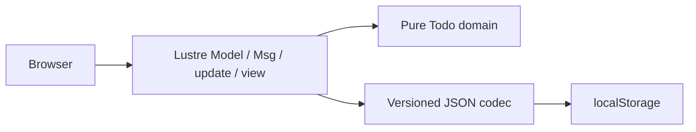
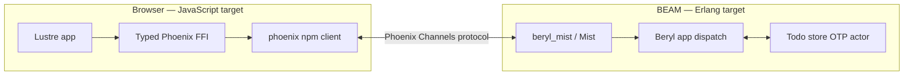

# Lustre Realtime Todo Example Plan

## Status

Approved — implement as two independently reviewable commits.

## Summary

Build the Todo example in two layers:

1. **Standalone browser baseline:** a complete Lustre 5.7 application using
   `localStorage`. It is independently runnable and contains no Beryl, Phoenix,
   Mist, or Erlang server code.
2. **Beryl realtime layer:** add an Erlang server package and replace browser
   persistence as the source of truth with a server-authoritative Beryl channel.

The first commit must remain useful on its own. The second commit should make the
realtime changes easy to understand by showing exactly what Beryl adds to an
otherwise complete Lustre application.

## Shared Goals

- Use a small, reusable Todo domain model.
- Support add, toggle, delete, and an items-left count.
- Reject empty and whitespace-only titles.
- Render stable keyed rows.
- Use controlled input, native controls, visible status/error states, and
  accessible labels and focus treatment.
- Keep the example runnable without authentication or a database.
- Write all application code from scratch.

## Non-Goals

- Inline editing.
- All/active/completed filters.
- Toggle-all or clear-completed actions.
- Authentication, presence, or per-user lists.
- CRDT conflict resolution.
- A persistent server database.
- Multiple Todo lists or wildcard topic routing.
- Initial integration into `examples/showcase`.

## Commit 1: Standalone Lustre + localStorage

### Boundary

Commit 1 is browser-only. It must not contain:

- a parent Gleam/Erlang package in `examples/todo`;
- Beryl or transport dependencies;
- Phoenix protocol code or the `phoenix` npm package;
- Mist routes, WebSockets, actors, or other server code.

### Architecture



Read and decode storage before `lustre.start`. A missing key produces an empty
list. Malformed or inaccessible storage produces an empty list plus a visible,
recoverable error.

Every successful mutation writes the full versioned state:

```json
{
  "version": 1,
  "next_id": 3,
  "todos": [
    { "id": 0, "text": "Write the guide", "completed": true }
  ]
}
```

Browser-local IDs use a persisted monotonic integer counter. Deleting a Todo
does not reuse its ID.

### File Layout

```text
examples/todo/
├── .gitignore
├── README.md
├── package.json
├── playwright.config.js
├── e2e/
│   └── todo.spec.js
└── client/
    ├── .gitignore
    ├── gleam.toml
    ├── manifest.toml
    ├── assets/
    │   └── style.css
    ├── src/
    │   ├── todo_client.gleam
    │   └── todo_app/
    │       ├── domain.gleam
    │       ├── local_storage.gleam
    │       ├── local_storage_ffi.mjs
    │       └── storage.gleam
    └── test/
        └── todo_client_test.gleam
```

Use Lustre's native tooling:

```sh
gleam run -m lustre/dev start
gleam run -m lustre/dev build
```

The production build goes to `client/priv/static/` and remains ignored. Do not
add a custom esbuild script.

### Workspace Integration

- Register `todo` in `examples/pnpm-workspace.yaml`.
- Add `pnpm -C examples/todo build` to `examples-client-build`.
- Add `pnpm -C examples/todo test` to `examples-test`.
- Do **not** add `todo` to the Erlang package list in `examples-build`.
- Update `examples/pnpm-lock.yaml` with pnpm.
- Generate `client/manifest.toml` with Gleam package tooling.

### Commit 1 Tests

Pure Gleam tests cover:

- trimming valid input and rejecting whitespace;
- monotonic add behavior;
- toggle and items-left behavior;
- delete behavior;
- storage JSON round trips;
- malformed, unsupported, or inconsistent persisted data.

Playwright covers:

- whitespace rejection;
- add, toggle, and delete behavior;
- items-left updates;
- reload persistence;
- clearing browser storage before each test.

### Commit 1 Acceptance

- The app runs with only the Lustre development server.
- The production build succeeds with Lustre's build command.
- Todos survive a page reload.
- Missing storage starts empty without an error.
- Malformed storage starts empty with a visible recovery message.
- Generated build output and Playwright artifacts remain untracked.
- Client Gleam tests and the Todo Playwright suite pass.

## Commit 2: Beryl Realtime Layer

### Boundary

Commit 2 adds the server and realtime behavior. It should preserve the visual
interface and pure Todo operations from commit 1 while making the server
authoritative.

After the channel joins:

- the join reply replaces the client's current snapshot;
- clients send add, toggle, and delete requests;
- clients apply canonical replies or broadcasts;
- reconnecting clients resynchronize from the next join snapshot;
- `localStorage` is no longer the canonical state.

### Architecture



### Server State and Protocol

Use one fixed `"todos"` topic and an in-memory OTP actor. The server owns the
canonical monotonic ID counter and Todo list.

| Direction | Event | Payload | Result |
|---|---|---|---|
| Client to server | `phx_join` | `{}` | Reply `{todos: [...]}` |
| Client to server | `add_todo` | `{text}` | Canonical Todo |
| Client to server | `toggle_todo` | `{id}` | Canonical Todo |
| Client to server | `delete_todo` | `{id}` | `{id}` |
| Server to clients | `todo_added` | Canonical Todo | Insert keyed row |
| Server to clients | `todo_updated` | Canonical Todo | Replace keyed row |
| Server to clients | `todo_deleted` | `{id}` | Remove keyed row |

For each mutation, the server validates input, updates the actor, replies with
the canonical result, and broadcasts the canonical change.

### Commit 2 Additions

```text
examples/todo/
├── gleam.toml
├── manifest.toml
├── src/
│   ├── todo.gleam
│   └── todo/
│       ├── app.gleam
│       ├── router.gleam
│       └── store.gleam
├── test/
│   ├── todo_app_test.gleam
│   └── todo_test.gleam
└── client/src/
    ├── todo_channel.gleam
    └── todo_channel_ffi.mjs
```

The typed JavaScript FFI is limited to Phoenix connection lifecycle and channel
pushes. Decode every JavaScript value in Gleam; do not cast channel payloads.

### Commit 2 Workspace Changes

- Add the new Erlang package to `examples-build`.
- Add the `phoenix` npm dependency.
- Keep the existing client build and Playwright recipe entries.
- Expand Playwright coverage to multiple browser contexts and late joins.
- Add the example to the website only after the complete realtime layer works.

### Commit 2 Acceptance

- Browser A additions appear in browser B.
- Toggles and deletes synchronize across browsers.
- A late joiner receives the complete current snapshot.
- Rejoining replaces stale client state.
- Invalid payloads produce explicit errors and never mutate server state.
- Controls expose connecting, connected, and disconnected states.
- Targeted client, server, and multi-browser tests pass.

## Risks and Mitigations

### Commit boundaries blur

Keep commit 1 entirely browser-local. Do not pre-scaffold the Erlang package,
Phoenix bridge, or server-facing model fields.

### Malformed persisted data

Version and validate the complete stored object. On failure, show a recovery
message and start empty rather than partially accepting state.

### Duplicate channel listeners

In commit 2, create the connection effect only from initialization and let the
Phoenix client manage reconnects.

### Sender divergence

In commit 2, use canonical server replies and broadcasts. Do not mix optimistic
local mutations with server-authoritative state.

### Source licensing

Use the MIT-licensed TodoMVC specification only as a behavioral reference. Do
not copy unlicensed Lustre Todo source.

## References

- [Lustre 5.7](https://hex.pm/packages/lustre/5.7.1)
- [Lustre dev tools](https://hex.pm/packages/lustre_dev_tools)
- [TodoMVC specification](https://github.com/tastejs/todomvc/blob/ff43b02e59dfa604386bb382034b2cd07c2bcd8a/app-spec.md)
- `packages/beryl/src/beryl/wire.gleam`
- `examples/collab_docs/src/collab_docs/doc_store.gleam`
- `examples/chatrooms/e2e/chatrooms.spec.js`
