# Architecture Documentation & MARP Deck Implementation Plan

> **For agentic workers:** REQUIRED SUB-SKILL: Use superpowers:subagent-driven-development (recommended) or superpowers:executing-plans to implement this plan task-by-task. Steps use checkbox (`- [ ]`) syntax for tracking.

**Goal:** Ship an onboarding-focused, multi-page Architecture section on the docs website plus a self-contained MARP deck (HTML), both using Mermaid diagrams, so a new contributor understands beryl's layers, modules, message flows, and where to change things.

**Architecture:** Add client-side Mermaid rendering to the Starlight site via `astro-mermaid`. Revise the existing `architecture/overview.md` into a contributor map and add five flow/subsystem pages, each ending with a "where this lives in `src/`" pointer. Add a `docs/architecture-deck.md` MARP deck rendered to HTML by `just deck` through a small custom marp engine that turns ` ```mermaid ` fences into client-rendered diagrams.

**Tech Stack:** Astro 6 + Starlight 0.39, `astro-mermaid` (+ `mermaid` peer), `@marp-team/marp-cli` via `npx`, Gleam (source being documented), changie, just, pnpm 10 / Node 22+.

## Global Constraints

- Docs only. Do NOT modify any `src/**` Gleam/Erlang code.
- Website package manager is pnpm 10 on Node 22+. Use `mise exec node@24 -- npx pnpm@10 …` (global `pnpm` 7 downgrades the lockfile — never use it).
- `mermaid()` MUST be registered BEFORE `starlight()` in `website/astro.config.mjs` integrations, or diagrams render as raw code.
- Every architecture page is a Starlight content file with frontmatter `title:` and lives under `website/src/content/docs/architecture/`. Add each new page to the Architecture sidebar group in `website/astro.config.mjs`.
- Every architecture page ends with a `## Where this lives` section pointing at exact `src/beryl/*` files.
- All diagrams use Mermaid fenced code blocks (` ```mermaid `).
- Deck renders to HTML only (no PDF).
- Conventional Commits for all commits; type/scope lowercase (e.g. `docs(architecture): …`).
- A changie fragment is required (user-visible docs + new tooling). Use `just change`, not a hand-named file.
- Branch for this work: `docs/architecture-docs-and-deck` (already created).

### Verified source facts (use these; do not invent signatures)

Public API anchors confirmed from source:

- `beryl` (`src/beryl.gleam`): `config(codec)`, `start(config) -> Result(Channels, StartError)`, `register(channels, topic, channel)`, `broadcast`, `broadcast_from`, `broadcast_presence_diff`, `send_info`, `with_pubsub`, `with_logging`, `with_message_rate`, `with_join_rate`, `coordinator_subject`, `configured_codec`.
- `beryl/coordinator` (`src/beryl/coordinator.gleam`, ~1936 lines): OTP actor. Types `ChannelHandler`, `SocketContext`, `JoinResultErased`, `HandleResultErased`, `Message`. Entry points `start`, `start_with_config`, `start_with_config_and_pubsub`, `start_named*`. Routing: `route_message`, `route_decoded`, `route_binary`. Holds handler registry (type-erased), socket tracking, topic→subscriber map, heartbeat timer.
- `beryl/pubsub` (`src/beryl/pubsub.gleam`): `pg`-backed. `start`, `subscribe`, `unsubscribe`, `broadcast`, `broadcast_from`, `broadcast_from_socket`, `local_broadcast`, `subscribers`, `subscriber_count`. FFI in `src/beryl_pubsub_ffi.erl`. `PubSubFrom` carries exclusion identity.
- `beryl/presence` (`src/beryl/presence.gleam`): OTP actor over `lattice_presence` (add-wins observed-remove CRDT). `start`, `start_named`, `track`, `untrack`, `untrack_all`, `list`, `get_by_key`, `diff*`, config `default_config(replica)`, `with_pubsub`, `with_broadcast_interval`, `with_on_diff`. Wire helpers in `src/beryl/presence/wire.gleam`.
- `beryl/wire` (`src/beryl/wire.gleam`) + `beryl/wire/codec` (`src/beryl/wire/codec.gleam`): `phoenix_codec()`, `decode_message`, `encode`, `reply_json`, `push`, `heartbeat_reply`. Phoenix frame shape `[join_ref, ref, topic, event, payload]`.
- `beryl/transport/mist` (`src/beryl/transport/mist.gleam`): `default_config(path)`, `with_on_connect`, `upgrade`, `is_websocket_request`, `handler`, `upgrade_connection`. Generates socket id, registers send fn with coordinator, routes text/binary frames, notifies coordinator on close.
- `beryl/supervisor` (`src/beryl/supervisor.gleam`): `SupervisedConfig`, `start`, `stop`, `child_spec`. rest-for-one order coordinator → presence → groups.
- `beryl/group` (`src/beryl/group.gleam`): named topic collections; `start`, `create`, `add`, `broadcast`.

---

### Task 1: Add Mermaid rendering to the website

**Files:**
- Modify: `website/package.json` (dependencies)
- Modify: `website/astro.config.mjs:1-16` (import + integrations order)
- Create (temporary smoke test, deleted in this task): `website/src/content/docs/architecture/_mermaid-smoke.md`

**Interfaces:**
- Produces: working ` ```mermaid ` fence rendering on all docs pages (consumed by Tasks 2–7).

- [ ] **Step 1: Install `astro-mermaid` and its `mermaid` peer**

Run from repo root:
```bash
cd website && mise exec node@24 -- npx pnpm@10 add astro-mermaid mermaid
```
Expected: `website/package.json` gains `astro-mermaid` and `mermaid`; `website/pnpm-lock.yaml` stays at lockfileVersion `'9.0'`.

- [ ] **Step 2: Register the integration before Starlight**

Edit `website/astro.config.mjs`. Add the import after line 1:
```js
import starlight from "@astrojs/starlight";
import mermaid from "astro-mermaid";
```
Then add `mermaid()` as the first entry of `integrations` (before `starlight({`):
```js
	integrations: [
		mermaid({ theme: "default" }),
		starlight({
```

- [ ] **Step 3: Add a smoke-test page**

Create `website/src/content/docs/architecture/_mermaid-smoke.md`:
````markdown
---
title: Mermaid Smoke Test
---

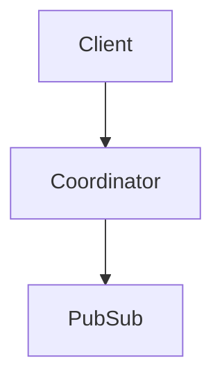
````

- [ ] **Step 4: Build the site and confirm it compiles**

Run:
```bash
cd website && mise exec node@24 -- npx pnpm@10 build
```
Expected: build succeeds with no errors; output mentions the architecture pages.

- [ ] **Step 5: Confirm the diagram renders (visual check)**

Run:
```bash
cd website && mise exec node@24 -- npx pnpm@10 preview &
```
Open `/architecture/_mermaid-smoke` in a browser. Expected: a rendered flowchart (boxes + arrows), NOT raw ```mermaid text. If raw text shows, confirm `mermaid()` precedes `starlight()` in the config. Stop the preview server when done.

- [ ] **Step 6: Remove the smoke-test page**

```bash
rm website/src/content/docs/architecture/_mermaid-smoke.md
```

- [ ] **Step 7: Commit**

```bash
git add website/package.json website/pnpm-lock.yaml website/astro.config.mjs
git commit -m "docs(website): add astro-mermaid for diagram rendering"
```

---

### Task 2: Revise `architecture/overview.md` into the contributor map

**Files:**
- Modify: `website/src/content/docs/architecture/overview.md` (full rewrite)

**Interfaces:**
- Consumes: Mermaid rendering from Task 1.
- Produces: the top-level architecture page that links to the five subsystem pages (Tasks 3–7).

- [ ] **Step 1: Rewrite the page**

Replace the whole file with content matching this structure (write the prose; the diagram and section list below are mandatory and must appear):

Frontmatter:
```markdown
---
title: Architecture Overview
description: How beryl is organized, the major modules, and where to make changes.
---
```

Required sections, in order:
1. **Intro** (2–3 sentences): beryl layers a Phoenix-style channel system on top of OTP actors and Erlang `pg`, with a pluggable wire codec and WebSocket transport.
2. **How to read these docs** — bullet list linking to the five pages: Message Lifecycle, Coordinator & Supervision, PubSub & Distribution, Presence, Wire & Transport. State that each page ends with a "Where this lives" pointer.
3. **The layer stack** — replace the old ASCII box with this Mermaid diagram:
````markdown
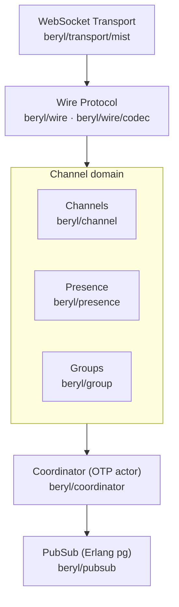
````
4. **Module map** — a table with columns *Module* / *Responsibility* / *Page*. One row per file: `beryl`, `beryl/coordinator`, `beryl/pubsub`, `beryl/presence`, `beryl/presence/wire`, `beryl/wire`, `beryl/wire/codec`, `beryl/transport/mist`, `beryl/supervisor`, `beryl/group`, `beryl/topic`, `beryl/socket`, `beryl/channel`, `beryl/error`, `beryl/rate_limit`, `beryl/bridge`, `beryl/log`, `beryl/internal`. Use the verified facts in Global Constraints for responsibilities. Link the rows covered by a dedicated page.
5. **Process & supervision at a glance** — this Mermaid diagram:
````markdown
```mermaid
flowchart TB
  S["supervisor (rest-for-one)"]
  S --> CO["coordinator"]
  S --> PR["presence (optional)"]
  S --> GR["groups (optional)"]
  CO -. "crash restarts downstream" .-> PR
  PR -. .-> GR
```
````
6. **Where things live** — short "src/beryl/* file map" recap pointing readers to the subsystem pages.

- [ ] **Step 2: Build and validate links**

```bash
cd website && mise exec node@24 -- npx pnpm@10 build
```
Expected: build succeeds; `starlight-links-validator` reports no broken links. Links to pages created in Tasks 3–7 will fail here — that is expected until those pages exist. Run the authoritative link validation at the end of Task 7. Do not block this task's commit on those forward links.

- [ ] **Step 3: Commit**

```bash
git add website/src/content/docs/architecture/overview.md
git commit -m "docs(architecture): rewrite overview as contributor map"
```

---

### Task 3: Add `architecture/message-lifecycle.md`

**Files:**
- Create: `website/src/content/docs/architecture/message-lifecycle.md`
- Modify: `website/astro.config.mjs` (Architecture sidebar group, after the Overview entry)

**Interfaces:**
- Consumes: Mermaid rendering (Task 1); overview links (Task 2).

- [ ] **Step 1: Write the page**

Create the file with frontmatter `title: Message Lifecycle` and these required sections, each introduced by 1–3 sentences of prose and the corresponding Mermaid sequence diagram.

Connect + register:
````markdown
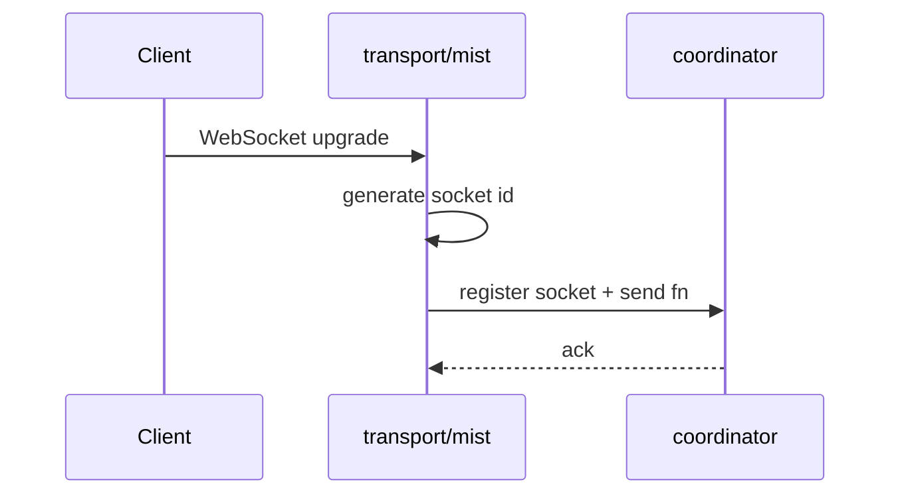
````

Join a topic:
````markdown
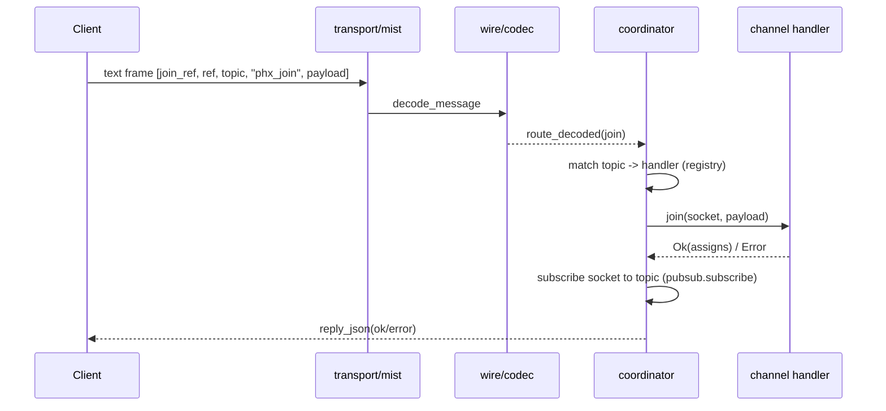
````

Handle an inbound event (`handle_in`):
````markdown
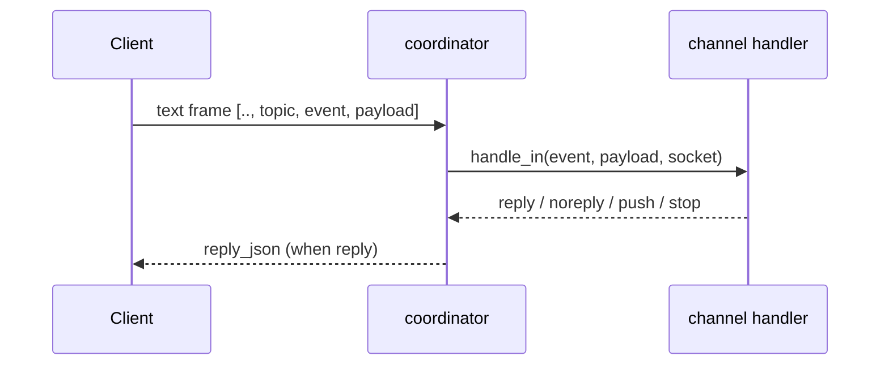
````

Broadcast fan-out:
````markdown
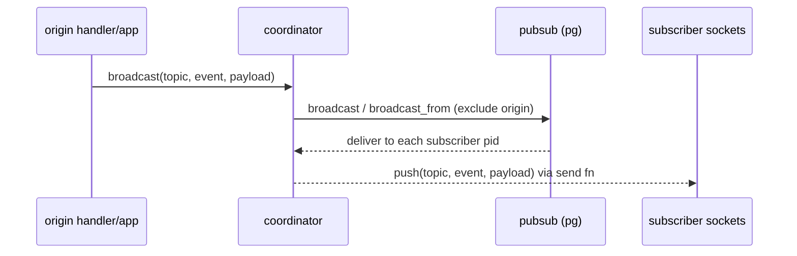
````

Heartbeat + eviction:
````markdown
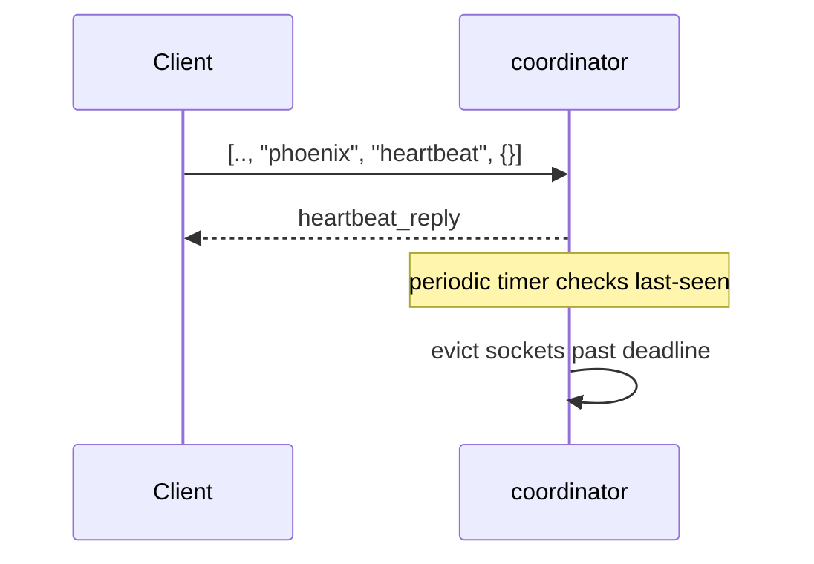
````

Disconnect + terminate:
````markdown
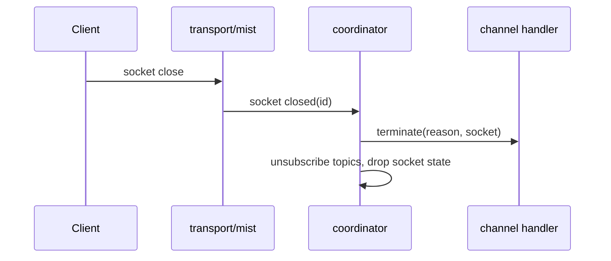
````

Add a short **Concurrency note**: the coordinator is a single OTP actor processing its mailbox sequentially; broadcasts arrive as messages, so tests must select the exact message shape and drain queued messages (BEAM mailbox gotcha).

End with:
```markdown
## Where this lives

- `src/beryl/transport/mist.gleam` — connect/close, frame routing
- `src/beryl/coordinator.gleam` — `route_message`, `route_decoded`, `route_binary`, heartbeat timer
- `src/beryl/wire.gleam`, `src/beryl/wire/codec.gleam` — decode/encode frames
- `src/beryl/pubsub.gleam` — fan-out
```

- [ ] **Step 2: Add to the sidebar**

In `website/astro.config.mjs`, inside the Architecture `items` array (after the Overview entry, around line 134), add:
```js
						{
							label: "Message Lifecycle",
							slug: "architecture/message-lifecycle",
						},
```

- [ ] **Step 3: Build and validate**

```bash
cd website && mise exec node@24 -- npx pnpm@10 build
```
Expected: build succeeds; page reachable at `/architecture/message-lifecycle`.

- [ ] **Step 4: Commit**

```bash
git add website/src/content/docs/architecture/message-lifecycle.md website/astro.config.mjs
git commit -m "docs(architecture): add message lifecycle page"
```

---

### Task 4: Add `architecture/coordinator.md`

**Files:**
- Create: `website/src/content/docs/architecture/coordinator.md`
- Modify: `website/astro.config.mjs` (Architecture sidebar group)

- [ ] **Step 1: Write the page**

Frontmatter `title: Coordinator & Supervision`. Required sections:
1. **Role** — the single central OTP actor owning all channel state; everything else talks to it via its `Subject(coordinator.Message)`.
2. **What it tracks** — bullet list: handler registry (topic pattern → handler), socket tracking (id, send fn, subscribed topics), topic → subscriber-id sets, heartbeat last-seen.
3. **Type erasure** — explain `JoinResultErased` / `HandleResultErased` / `SocketContext`: handlers have different `assigns` types but are stored in one registry by erasing the type, restored on dispatch. Keep it conceptual.
4. **Message routing** — `route_message` → decode → `route_decoded` (text) / `route_binary` (binary); dispatch to the matched handler's `join` / `handle_in` / `handle_binary` / `terminate`.
5. **Heartbeat enforcement** — periodic timer evicts sockets that miss heartbeats.
6. **Supervision tree** — this Mermaid diagram plus prose on rest-for-one semantics (a coordinator crash restarts presence and groups to keep state consistent) and `child_spec` for embedding:
````markdown
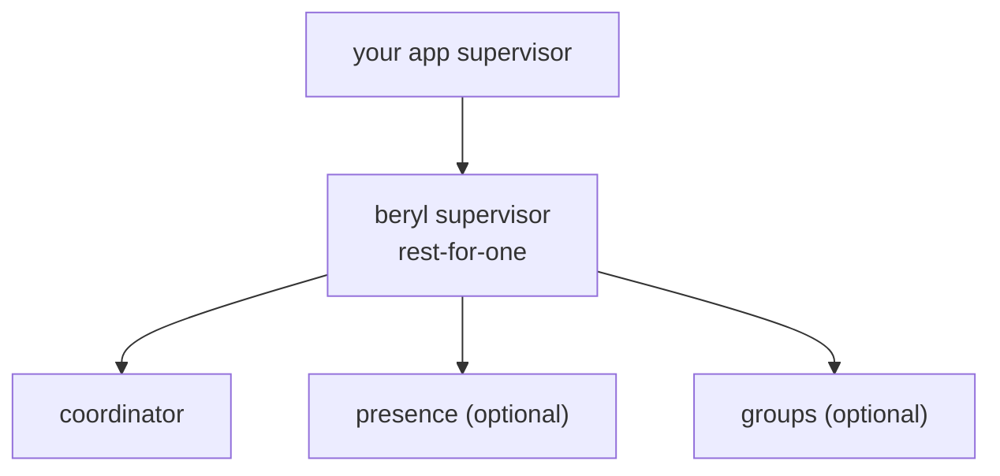
````
7. **Where this lives** — `src/beryl/coordinator.gleam`, `src/beryl/supervisor.gleam`.

- [ ] **Step 2: Add sidebar entry**
```js
						{
							label: "Coordinator & Supervision",
							slug: "architecture/coordinator",
						},
```

- [ ] **Step 3: Build**
```bash
cd website && mise exec node@24 -- npx pnpm@10 build
```
Expected: success; `/architecture/coordinator` reachable.

- [ ] **Step 4: Commit**
```bash
git add website/src/content/docs/architecture/coordinator.md website/astro.config.mjs
git commit -m "docs(architecture): add coordinator and supervision page"
```

---

### Task 5: Add `architecture/pubsub-and-distribution.md`

**Files:**
- Create: `website/src/content/docs/architecture/pubsub-and-distribution.md`
- Modify: `website/astro.config.mjs` (Architecture sidebar group)

- [ ] **Step 1: Write the page**

Frontmatter `title: PubSub & Distribution`. Required sections:
1. **Foundation** — wraps Erlang's `pg` module; processes join topic groups and receive broadcasts; works across cluster nodes automatically.
2. **The FFI boundary** — Gleam `beryl/pubsub` calls into `src/beryl_pubsub_ffi.erl`. List the public surface: `start`, `subscribe`, `unsubscribe`, `broadcast`, `broadcast_from`, `broadcast_from_socket`, `local_broadcast`, `subscribers`, `subscriber_count`.
3. **Exclusion semantics** — `broadcast_from` / `broadcast_from_socket` use `PubSubFrom` to exclude the originating subscriber so a sender doesn't echo its own message. Note this contract must be preserved (regression-prone).
4. **Distribution diagram**:
````markdown
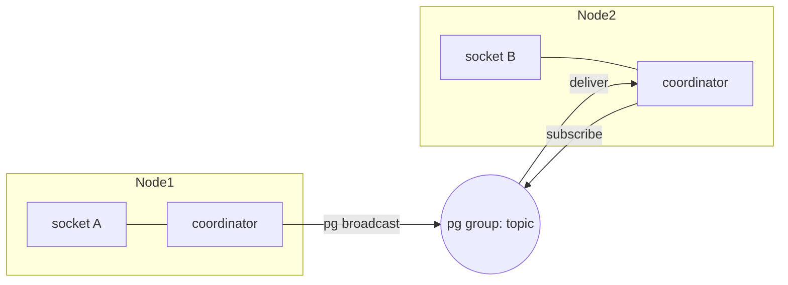
````
5. **Where this lives** — `src/beryl/pubsub.gleam`, `src/beryl_pubsub_ffi.erl`.

- [ ] **Step 2: Add sidebar entry**
```js
						{
							label: "PubSub & Distribution",
							slug: "architecture/pubsub-and-distribution",
						},
```

- [ ] **Step 3: Build**
```bash
cd website && mise exec node@24 -- npx pnpm@10 build
```
Expected: success; page reachable.

- [ ] **Step 4: Commit**
```bash
git add website/src/content/docs/architecture/pubsub-and-distribution.md website/astro.config.mjs
git commit -m "docs(architecture): add pubsub and distribution page"
```

---

### Task 6: Add `architecture/presence.md`

**Files:**
- Create: `website/src/content/docs/architecture/presence.md`
- Modify: `website/astro.config.mjs` (Architecture sidebar group)

- [ ] **Step 1: Write the page**

Frontmatter `title: Presence`. Required sections:
1. **Model** — an OTP actor wrapping `lattice_presence` (an add-wins, observed-remove CRDT). Per-replica state merges conflict-free across nodes.
2. **API surface** — `start` / `start_named`, `track`, `untrack`, `untrack_all`, `list`, `get_by_key`, `diff` / `diff_topics` / `diff_joins` / `diff_leaves`. Config: `default_config(replica)`, `with_pubsub`, `with_broadcast_interval`, `with_on_diff`.
3. **Replication** — the actor periodically broadcasts its state via PubSub (`with_broadcast_interval`); remote state merges into the local CRDT; `on_diff` fires when a merge changes membership.
4. **Diagram**:
````markdown
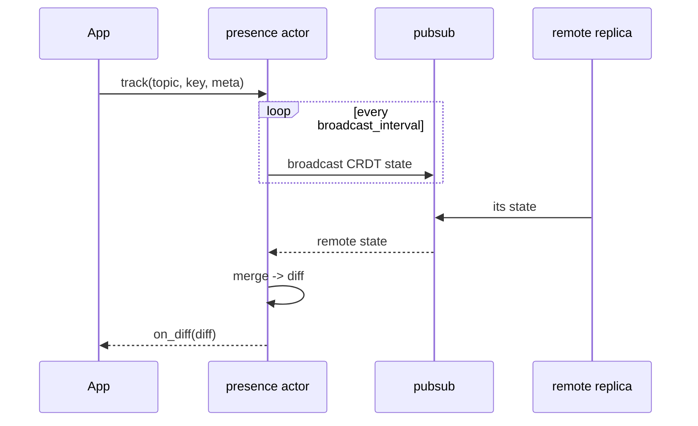
````
5. **Where this lives** — `src/beryl/presence.gleam`, `src/beryl/presence/wire.gleam`.

- [ ] **Step 2: Add sidebar entry**
```js
						{
							label: "Presence",
							slug: "architecture/presence",
						},
```

- [ ] **Step 3: Build**
```bash
cd website && mise exec node@24 -- npx pnpm@10 build
```
Expected: success; page reachable.

- [ ] **Step 4: Commit**
```bash
git add website/src/content/docs/architecture/presence.md website/astro.config.mjs
git commit -m "docs(architecture): add presence page"
```

---

### Task 7: Add `architecture/wire-and-transport.md`

**Files:**
- Create: `website/src/content/docs/architecture/wire-and-transport.md`
- Modify: `website/astro.config.mjs` (Architecture sidebar group)

- [ ] **Step 1: Write the page**

Frontmatter `title: Wire & Transport`. Required sections:
1. **Codec abstraction** — frames are encoded/decoded by a pluggable `Codec`; the built-in `wire.phoenix_codec()` speaks the Phoenix protocol.
2. **Frame shapes** — Phoenix array `[join_ref, ref, topic, event, payload]`; replies carry status `ok`/`error` + response; server pushes have no ref; heartbeats use topic `phoenix` / event `heartbeat`. Functions: `decode_message`, `encode`, `reply_json`, `push`, `heartbeat_reply`.
3. **Mist transport** — responsibilities: generate a unique socket id, register the send fn with the coordinator, route incoming text frames through the codec, route binary frames through the codec when configured else to raw binary handlers, notify the coordinator on close. Functions: `upgrade`, `is_websocket_request`, `handler`, `with_on_connect`.
4. **Diagram**:
````markdown
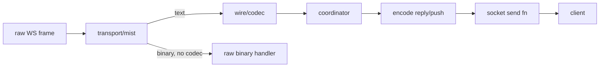
````
5. **Where this lives** — `src/beryl/wire.gleam`, `src/beryl/wire/codec.gleam`, `src/beryl/transport/mist.gleam`.

- [ ] **Step 2: Add sidebar entry**
```js
						{
							label: "Wire & Transport",
							slug: "architecture/wire-and-transport",
						},
```

- [ ] **Step 3: Build the full site and validate ALL links**

```bash
cd website && mise exec node@24 -- npx pnpm@10 build
```
Expected: build succeeds and `starlight-links-validator` passes with no broken links (all overview links from Task 2 now resolve).

- [ ] **Step 4: Commit**

```bash
git add website/src/content/docs/architecture/wire-and-transport.md website/astro.config.mjs
git commit -m "docs(architecture): add wire and transport page"
```

---

### Task 8: Build the MARP deck (HTML) with Mermaid + `just deck`

**Files:**
- Create: `docs/architecture-deck.md`
- Create: `docs/marp.engine.mjs`
- Modify: `justfile` (add `deck` recipe near the `docs` recipe, ~line 63)
- Modify: `.gitignore` (ignore generated `docs/architecture-deck.html`)

**Interfaces:**
- Produces: `docs/architecture-deck.html` via `just deck`.

- [ ] **Step 1: Write the custom marp engine**

Create `docs/marp.engine.mjs` (turns ` ```mermaid ` fences into client-rendered divs):
```js
import { Marp } from "@marp-team/marp-core";

export default ({ marp } = {}) => {
  const engine = marp ?? new Marp({ html: true });
  const fence = engine.markdown.renderer.rules.fence;
  engine.markdown.renderer.rules.fence = (tokens, idx, options, env, self) => {
    const token = tokens[idx];
    if ((token.info || "").trim() === "mermaid") {
      return `<pre class="mermaid">${token.content}</pre>`;
    }
    return fence(tokens, idx, options, env, self);
  };
  return engine;
};
```

- [ ] **Step 2: Write the deck**

Create `docs/architecture-deck.md`. Start with the MARP front-matter and a trailing Mermaid loader script (HTML output renders diagrams client-side):
```markdown
---
marp: true
title: beryl architecture
theme: default
paginate: true
html: true
---

<script type="module">
  import mermaid from "https://cdn.jsdelivr.net/npm/mermaid@11/dist/mermaid.esm.min.mjs";
  mermaid.initialize({ startOnLoad: true });
</script>

# beryl architecture

Type-safe realtime channels & presence on the BEAM
```
Then ~15–20 slides (separate with `---`). Required slides, condensed from the website pages (reuse the same Mermaid diagrams):
1. Title (above)
2. What beryl is + the layer-stack Mermaid diagram (from `overview.md`)
3. Module map (short bullet version)
4. Coordinator: the central actor (what it tracks)
5. Supervision tree diagram (from `coordinator.md`)
6–8. Message lifecycle build-up: connect → join → broadcast (reuse the three sequence diagrams from `message-lifecycle.md`)
9. Heartbeat + terminate (one slide)
10. PubSub & distribution diagram (from `pubsub-and-distribution.md`)
11. Presence CRDT diagram (from `presence.md`)
12. Wire & transport diagram (from `wire-and-transport.md`)
13. Concurrency note (single OTP mailbox; tests drain messages)
14. Where to start contributing — map module → page, point at `src/beryl/coordinator.gleam` as the heart.

- [ ] **Step 3: Add the `just deck` recipe**

In `justfile`, after the `docs:` recipe (line ~63), add:
```just
# Render the architecture deck to HTML
deck:
    npx -y -p @marp-team/marp-core -p @marp-team/marp-cli marp docs/architecture-deck.md --engine docs/marp.engine.mjs --html -o docs/architecture-deck.html
```

- [ ] **Step 4: Render the deck**

```bash
just deck
```
Expected: `docs/architecture-deck.html` is created with no errors.

- [ ] **Step 5: Verify diagrams render (visual check + fallback)**

Open `docs/architecture-deck.html` in a browser. Expected: slides display with rendered Mermaid diagrams.
If diagrams show as raw text because marp stripped the `<script>`, apply the fallback: inject the loader through the engine by wrapping `engine.render` so it appends the loader to the rendered HTML. Replace `return engine;` with:
```js
  const baseRender = engine.render.bind(engine);
  engine.render = (md, opts) => {
    const out = baseRender(md, opts);
    const loader = '<script type="module">import mermaid from "https://cdn.jsdelivr.net/npm/mermaid@11/dist/mermaid.esm.min.mjs";mermaid.initialize({startOnLoad:true});</script>';
    return { ...out, html: out.html + loader };
  };
  return engine;
```
Re-run `just deck` and re-check. Keep whichever variant renders diagrams.

- [ ] **Step 6: Ignore the generated HTML**

Append to `.gitignore`:
```
docs/architecture-deck.html
```

- [ ] **Step 7: Commit (source only, not the generated HTML)**

```bash
git add docs/architecture-deck.md docs/marp.engine.mjs justfile .gitignore
git commit -m "docs(architecture): add MARP architecture deck and just deck recipe"
```

---

### Task 9: Changelog fragment + final validation

**Files:**
- Create: `.changes/unreleased/<generated>.md` (via changie)

- [ ] **Step 1: Add a changie fragment**

Run:
```bash
just change
```
Choose kind **Added**. Body: `Architecture documentation section (multi-page) and a MARP architecture deck (just deck).`
Expected: a new file appears under `.changes/unreleased/`.

- [ ] **Step 2: Final website validation**

```bash
cd website && mise exec node@24 -- npx pnpm@10 build
```
Expected: build + links validator pass.

- [ ] **Step 3: Render the deck once more**

```bash
just deck && test -f docs/architecture-deck.html && echo OK
```
Expected: `OK`.

- [ ] **Step 4: Commit**

```bash
git add .changes/unreleased
git commit -m "docs: add changelog entry for architecture docs and deck"
```

- [ ] **Step 5: Push and open PR**

```bash
git fetch origin main
git push -u origin docs/architecture-docs-and-deck
gh pr create --title "docs(architecture): add architecture docs and MARP deck" --body "Adds a multi-page Architecture section (overview + message lifecycle, coordinator/supervision, pubsub, presence, wire/transport) with Mermaid diagrams, plus a MARP deck rendered to HTML via \`just deck\`. Onboarding-focused; each page ends with a 'where this lives' pointer."
```
Expected: PR created; CI runs against the merge result.

---

## Self-Review

**Spec coverage:** overview revision (Task 2), 5 subsystem pages (Tasks 3–7), Mermaid on website (Task 1), MARP HTML deck + engine + `just deck` (Task 8), sidebar wiring (in each page task), changie + verification (Task 9). All spec deliverables map to tasks.

**Placeholder scan:** diagrams are concrete Mermaid; commands are exact; the only intentional judgement is prose authoring, which is the deliverable and is constrained by required-section lists and verified API facts. No TBD/TODO.

**Type consistency:** module/function names match the verified source facts block (`route_decoded`/`route_binary`, `broadcast_from`, `phoenix_codec`, `with_broadcast_interval`, etc.), used consistently across pages and deck.
