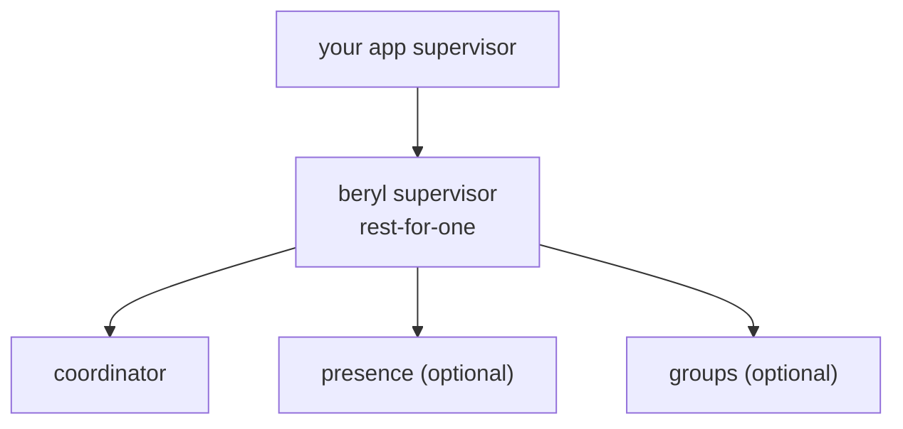

The coordinator is the central OTP actor that owns all channel runtime state. Every other part of the system — the transport layer, user-defined channel handlers, presence, and groups — communicates with it by sending messages to its `Subject(coordinator.Message)`.

## Role

The coordinator is the single source of truth for connected sockets, handler registrations, topic subscriptions, and heartbeat timestamps. It processes its mailbox sequentially, which gives it a consistent view of all concurrent activity without locks. No channel state lives outside the coordinator; handler callbacks run inside it during message dispatch.

## What it tracks

The coordinator maintains four categories of state:

- **Handler registry** — maps each registered topic pattern to a `ChannelHandler`. Patterns are matched in registration order when a socket joins a topic.
- **Socket tracking** — records each connected socket's ID, its wire-send function (text and binary), and the set of topics it has subscribed to.
- **Topic → subscriber sets** — maps each active topic string to the set of socket IDs currently joined on it, used for broadcast fan-out.
- **Heartbeat last-seen** — stores a monotonic timestamp for each socket, updated on every received heartbeat frame; used by the periodic eviction check.

## Type erasure

Channel handlers are parameterized by an `assigns` type that differs between channels — one channel may use a `UserSocket` record, another a plain `Nil`. To store all handlers in a single registry `Dict`, the coordinator erases these types at the boundary.

`JoinResultErased` and `HandleResultErased` are the type-erased variants of the typed `JoinResult` and `HandleResult` your callbacks return. `SocketContext` is the erased counterpart to the typed `Socket(assigns)` — it carries the current assigns as `Dynamic`. On dispatch the coordinator reconstructs the typed socket by coercing the `Dynamic` back to the handler's expected type, calls the callback, then stores the updated assigns (erased again) for the next message.

This pattern lets the registry hold `ChannelHandler` values with heterogeneous assigns types without requiring a common type parameter on the registry itself.

## Message routing

Inbound WebSocket frames follow a two-step path:

1. `route_message` — called by the transport with a raw text or binary frame. For text frames, it hands the bytes to the codec's `decode_text` and then calls `route_decoded`; for binary frames it calls `route_binary` directly.
2. `route_decoded` — receives the decoded `Message` and dispatches by event type:
   - `phx_join` → looks up the matching `ChannelHandler` in the registry, calls its `join` callback, subscribes the socket to the topic on success, sends a join reply.
   - Any other event → looks up the handler for the socket's existing subscription, calls `handle_in`.
   - `heartbeat` → updates the socket's last-seen timestamp and sends a reply.
   - `phx_leave` → calls `terminate`, unsubscribes the socket.
3. `route_binary` — matches the socket's existing topic subscription and calls `handle_binary`.

The registry lookup for topic matching uses `topic.matches`, which supports exact strings, `"namespace:*"` prefix wildcards, and segment wildcards such as `"document:*:ops"`.

## Heartbeat enforcement

When `heartbeat_check_interval_ms` is greater than zero in `CoordinatorConfig`, the coordinator schedules a recurring self-message (`CheckHeartbeats`) at that interval. On each check it iterates all tracked sockets, compares the current monotonic time to `last_heartbeat`, and evicts any socket whose elapsed time exceeds `heartbeat_timeout_ms`. Eviction calls each joined topic's `terminate` callback, sends a disconnect notification over the socket's send function, then removes the socket from all state. By default `beryl.start` sets the check interval to half the timeout.

## Supervision tree

beryl ships a dedicated supervisor in `beryl/supervisor` that starts all subsystems under a **rest-for-one** strategy. This means that if the coordinator crashes, presence and groups are also restarted — a fresh coordinator has empty state, so any presence or group data tracking now-absent subscriptions would be inconsistent.



Start order is coordinator → presence (optional) → groups (optional). Presence and groups are only started when configured via `SupervisedConfig`.

`supervisor.child_spec/1` returns an OTP `ChildSpecification(SupervisedChannels)` — a spec for the beryl supervisor process — so you can embed the entire beryl subtree inside your application's top-level supervisor:

```gleam
import beryl/supervisor
import gleam/otp/static_supervisor

static_supervisor.new(static_supervisor.OneForOne)
|> static_supervisor.add(supervisor.child_spec(beryl_config))
|> static_supervisor.start()
```

PubSub is **not** part of this tree; it is backed by Erlang's `pg` module, which manages its own lifecycle independently of beryl's supervisor.

## Where this lives

- `src/beryl/coordinator.gleam` — `ChannelHandler`, `SocketContext`, `JoinResultErased`, `HandleResultErased`, `route_message`, `route_decoded`, `route_binary`, heartbeat timer.
- `src/beryl/supervisor.gleam` — `SupervisedConfig`, `SupervisedChannels`, `start`, `stop`, `child_spec`; rest-for-one child ordering.
