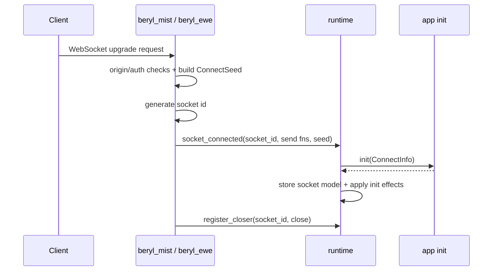
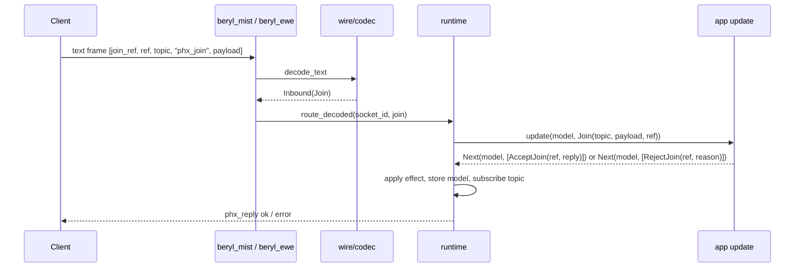
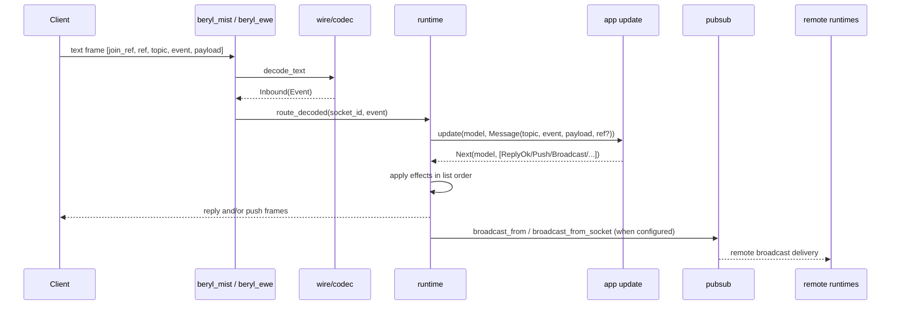
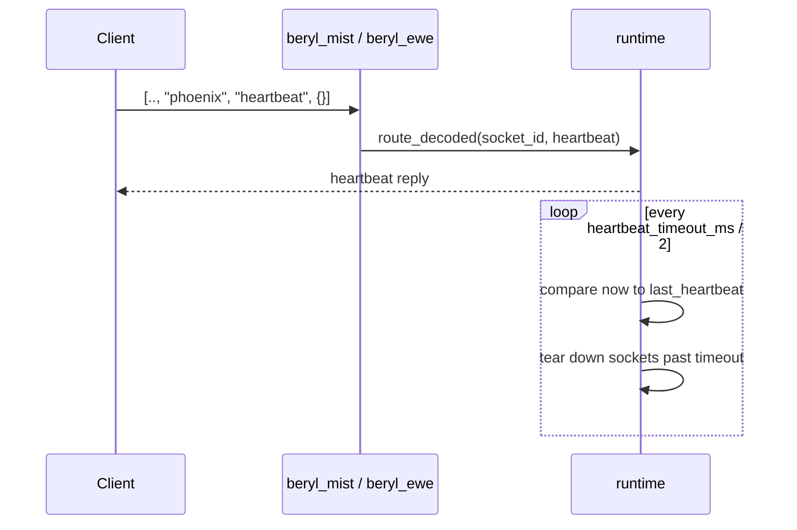
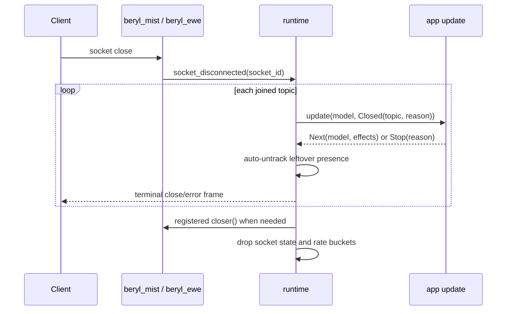

This page traces how a WebSocket connection moves through Beryl's app-side dispatch runtime. The transport owns the HTTP/WebSocket edge, the runtime owns per-socket state, and the app's `update` decides what effects to apply.

The diagrams show "app init"/"app update" because that is the runtime's contract. With the [channel layer](/guides/channels/) those boxes are `beryl_channels`'s router, which adds one hop and no new machinery — see [Where the channel layer fits](#where-the-channel-layer-fits) at the end.

## Connect and register

After a successful upgrade, the transport generates a socket id, builds `ConnectSeed` from the request, announces the socket to the runtime, and registers a closer callback the runtime can use later for heartbeat eviction or server-initiated disconnects.

## Join a topic

A client joins by sending a `phx_join` frame. The transport decodes the frame through the active codec and routes the decoded join into the runtime. The runtime delivers one `Join` event to `update`, and your app answers it with `AcceptJoin` or `RejectJoin`.

If the join finishes the turn unanswered, the runtime rejects it automatically.

## Handle an inbound event and broadcast

Once a topic is joined, text events become `Message` values and binary frames become `Binary` values. Your app returns a new model plus effects such as `ReplyOk`, `Push`, `Broadcast`, or `BroadcastFrom`; the runtime applies them strictly in list order.

Local fan-out happens inside the runtime before any PubSub forwarding. When PubSub is configured, remote runtimes receive the same broadcast and fan it out to their own local subscribers.

## Heartbeat and eviction

Clients still send heartbeat frames on the reserved `"phoenix"` topic. The runtime updates the socket's last-seen timestamp, replies immediately, and periodically evicts sockets that have gone stale.

## Disconnect and close topics

When a socket closes, the transport tells the runtime. The runtime then tears the socket down topic by topic, delivering `Closed(topic, reason)` to your app for each joined topic, cleaning up presence, sending terminal frames, and finally closing the transport connection if it is still open.

The same `Closed` path is used for client leaves, heartbeat timeouts, `KickTopic`, and graceful `beryl.stop` shutdown.

## Where the channel layer fits

`beryl_channels` supplies the `init`/`update` pair in every diagram above. `init` builds one router per socket — the handler table, an empty live-instance dictionary, and a join generation counter — and returns no effects. `update` then maps each input onto one channel:

| Runtime input | Router behavior |
|---|---|
| `Join(topic, payload, ref)` | First matching pattern wins; allocate a generation, run that handler's `join`, and emit `AcceptJoin(ref, reply)` followed by the join's own actions, or `RejectJoin(ref, reason)`. No match at all is refused with `{"reason": "unmatched topic"}` |
| `Message(topic, ..)` / `Binary(topic, ..)` | Delivered to the live instance for that topic, if any; inputs for a topic with no instance are ignored |
| `Info(envelope)` | The envelope's topic and generation are checked against the live instance first; a stale envelope is dropped still sealed, so nothing typed reaches the wrong join |
| `Closed(topic, reason)` | The instance is removed, then its `on_terminate` actions are lowered in the same turn |

Every channel action lowers one-to-one onto the `Effect` values in the diagrams above, scoped to the channel's own topic, so the frames on the wire are indistinguishable from the hand-written equivalent.

## Concurrency note

The runtime is one OTP actor processing its mailbox sequentially. Broadcasts arrive as actor messages too, so effect order and test mailbox hygiene still matter.

## Where this lives

- `packages/beryl/src/beryl/socket.gleam` — `ConnectInfo`, `Input`, `Next`, `Effect`
- `packages/beryl/src/beryl/runtime.gleam` — socket connect/disconnect, inbound dispatch, topic teardown, heartbeat timer, effect application
- `packages/beryl/src/beryl/wire.gleam`, `packages/beryl/src/beryl/wire/codec.gleam` — frame decoding and encoding
- `packages/beryl/src/beryl/pubsub.gleam` — local and distributed broadcast delivery
- `packages/beryl_mist/src/beryl_mist.gleam`, `packages/beryl_ewe/src/beryl_ewe.gleam` — WebSocket edge adapters
- `packages/beryl_channels/src/beryl_channels/internal/router.gleam` — the channel layer's per-socket router (package-internal)
