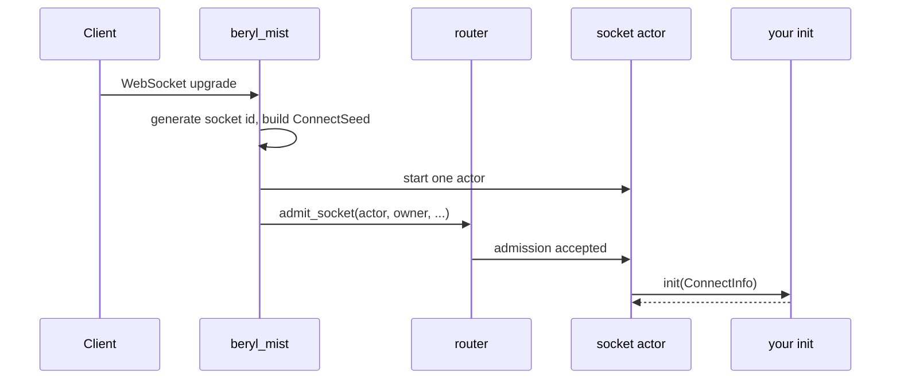
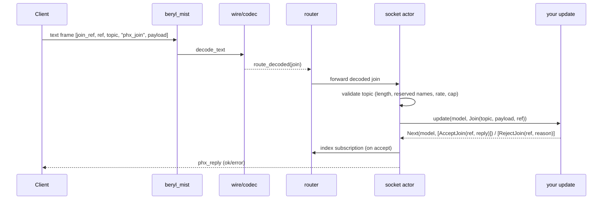
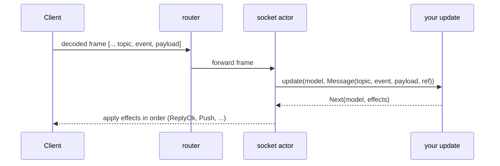
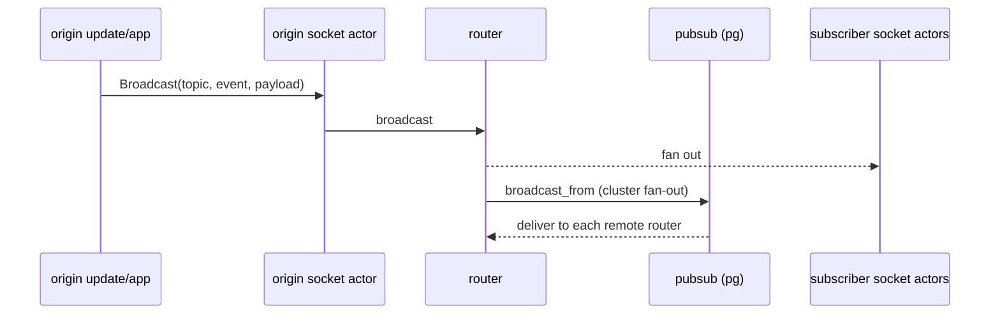
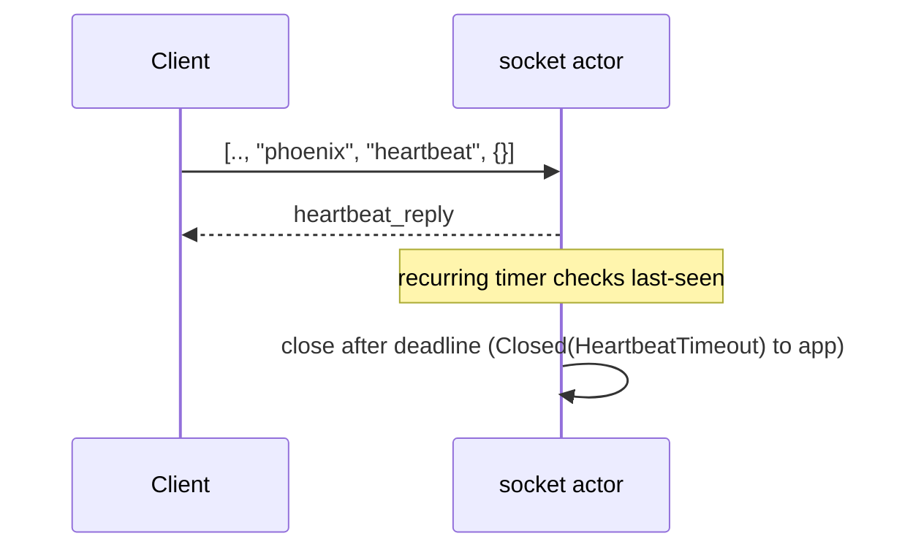
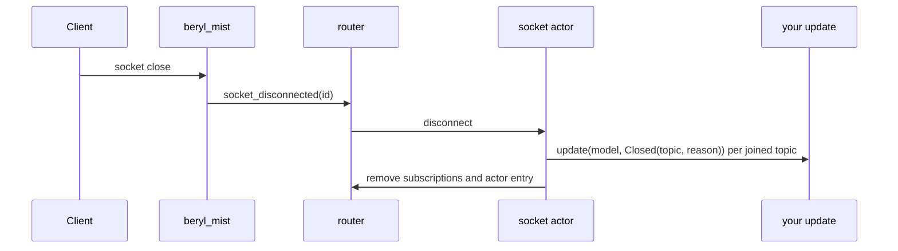

This page follows a message from the WebSocket connection to the client. Each
diagram shows one phase of beryl's message processing.

## Connect and init

When a client requests a WebSocket upgrade, Mist creates a unique socket ID. It
builds a `ConnectSeed` from the path, query, and headers. Mist then sends the
socket and its send functions through the router to a new socket actor. The
socket actor calls your app's `init` with `ConnectInfo`. This value contains
the socket ID, seed, and typed `Sender`. The actor stores the model that `init`
returns.

## Join a topic

A client sends a `phx_join` frame to join a topic. The connection process
decodes the frame. The router forwards it to the socket actor, which sends a
`Join` event to your `update` function. The function returns an `AcceptJoin` or
`RejectJoin` effect.

The runtime rejects a `Join` that has no answer. Thus, beryl fails closed.

## Handle an inbound event

After a successful join, `update` receives each later topic frame as a
`Message` event. The effects list can send a reply, push, broadcast, or presence
write. An empty list sends nothing.

## Broadcast fan-out

A broadcast sends a message to each socket on a topic. `Broadcast` and
`beryl.broadcast` include the source socket. `BroadcastFrom` and
`beryl.broadcast_from` exclude it. When you configure PubSub, Erlang `pg` sends
the broadcast to other runtime nodes. Each runtime then sends it to local
subscribers.

## Heartbeat and eviction

Clients send a `heartbeat` frame on the `"phoenix"` topic at set intervals. The
socket actor replies and records the time. Each socket actor has a timer that
checks its own deadline. The app does not receive heartbeat frames.

## Disconnect and close

When a client closes the WebSocket, Mist notifies the router. The router
forwards the close to the socket actor. The actor sends `Closed(topic, reason)`
to `update` for each joined topic, then removes its socket state and asks the
router to remove its subscriptions.

The same `Closed` path is used for client leaves, heartbeat timeouts,
`KickTopic`, and graceful `beryl.stop` shutdown.

## Where the channel layer fits

`beryl/channel` supplies the `init` and `update` pair in these diagrams. Its
`init` builds one channel model for each socket. Its `update` maps each input
to the live channel instance for that topic.

| Runtime input | Channel model behavior |
|---|---|
| `Join(topic, payload, ref)` | First matching handler wins; its join result emits `AcceptJoin` followed by ordered join actions, or `RejectJoin`. No match is refused with `{"reason": "unmatched topic"}` |
| `Message(topic, ..)` / `Binary(topic, ..)` | Delivered to the live instance for that topic |
| `Info(envelope)` | Topic and join generation are checked before the sealed typed value is opened; stale mail is dropped |
| `Closed(topic, reason)` | Calls `on_terminate` and lowers its actions after the topic is already unsubscribed |

Termination has one edge case. The router removes the instance in the model
returned by the `Closed` turn. If `on_terminate` panics, the core discards that
model and keeps the old model. The retained instance can receive its own
generation-scoped `channel.notify` mail. Client messages cannot reach the
closed topic. A rejoin replaces the instance, and socket shutdown removes it.
See
[Crash behavior](/guides/channels/#crash-behavior).

Each channel action maps to one core effect. The runtime preserves their order.
An asynchronous presence effect can pause one socket while other sockets
continue.

## Concurrency note

Each socket actor processes its mailbox in sequence. The router processes
index updates and broadcasts in its own mailbox. Tests must select the exact
message shape and drain queued messages.

## Where this lives

- `packages/beryl_mist/src/beryl_mist.gleam`: connect/close, edge decoding, frame routing
- `src/beryl/runtime.gleam`: event dispatch, effect application, heartbeat timer
- `src/beryl/wire.gleam`, `src/beryl/wire/codec.gleam`: decode/encode frames
- `src/beryl/pubsub.gleam`: fan-out
