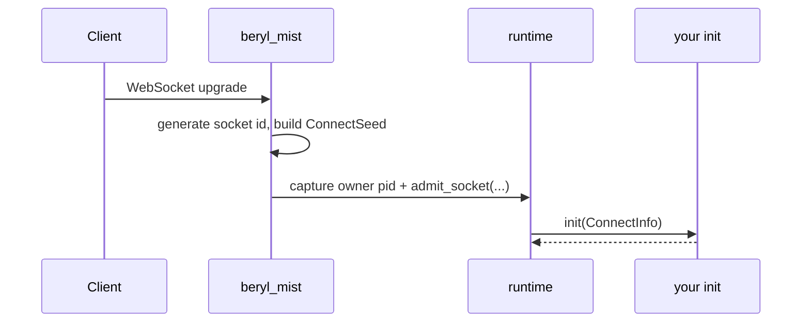
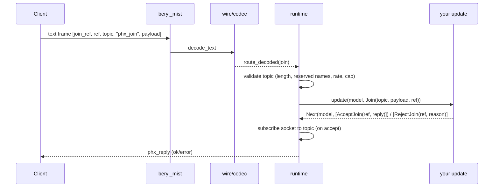
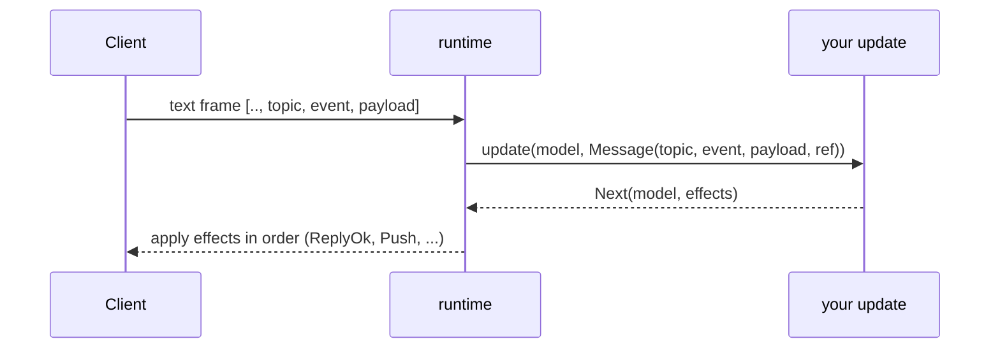
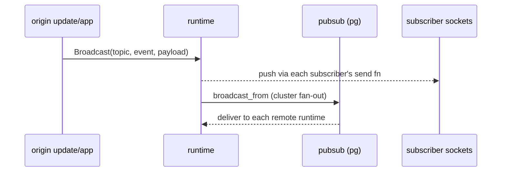
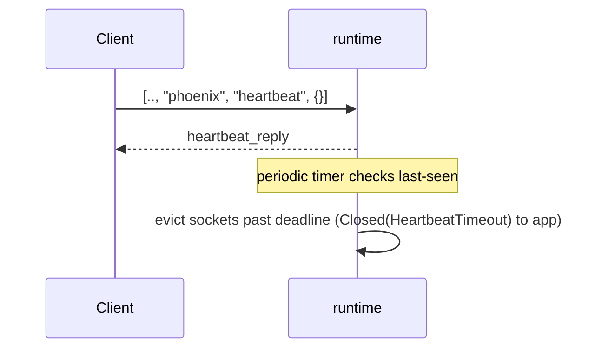
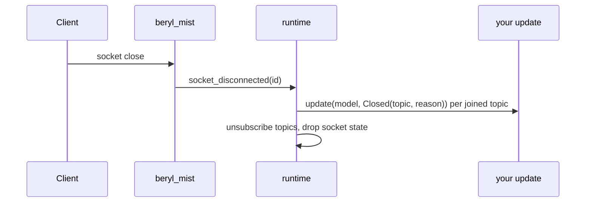

This page traces every significant step a message takes from the moment a WebSocket connection opens until it is pushed back to one or more clients. Each diagram corresponds to a distinct phase; together they give you a complete mental model of how beryl processes real-time traffic.

## Connect and init

When a client initiates a WebSocket upgrade, the Mist transport layer generates a unique socket id, assembles a `ConnectSeed` from the upgrade request (path, query, headers), and hands the socket, along with its send functions, to the runtime. The runtime calls your app's `init` with a `ConnectInfo` carrying the socket id, the seed, and a typed `Sender` for server-side messages, and stores the returned model.

## Join a topic

A client joins a topic by sending a `phx_join` frame. The transport decodes the raw frame in the connection process, and the runtime delivers a `Join` event to your `update` function, which answers with an `AcceptJoin` or `RejectJoin` effect.

A `Join` left unanswered by the update's effects is rejected automatically; beryl fails closed.

## Handle an inbound event

After a successful join, every subsequent inbound frame for that topic arrives at `update` as a `Message` event. The effects list decides what goes back on the wire: a reply correlated to the client's ref, pushes, broadcasts, presence writes, or nothing at all.

## Broadcast fan-out

Broadcasting delivers a message to every socket subscribed to a topic. The `Broadcast` effect (or `beryl.broadcast` from outside `update`) reaches all subscribers; `BroadcastFrom` / `beryl.broadcast_from` excludes the originating socket. When PubSub is configured, the pg-based layer forwards the broadcast to every other node's runtime, which fans out to its local subscribers.

## Heartbeat and eviction

Clients periodically send a `heartbeat` frame on the `"phoenix"` topic to signal liveness. The runtime replies immediately and tracks the last-seen timestamp; a periodic timer evicts sockets that have not sent a heartbeat within the configured deadline. The app never sees heartbeat frames.

## Disconnect and close

When a client closes the WebSocket connection, Mist notifies the runtime, which delivers a `Closed(topic, reason)` event to `update` for every joined topic and then cleans up all subscriptions and socket state.

The same `Closed` path is used for client leaves, heartbeat timeouts,
`KickTopic`, and graceful `beryl.stop` shutdown.

## Where the channel layer fits

`beryl/channel` supplies the `init`/`update` pair in every diagram above.
Its `init` builds one router per socket; its `update` maps each input to the
live channel instance for that topic.

| Runtime input | Router behavior |
|---|---|
| `Join(topic, payload, ref)` | First matching handler wins; its join result emits `AcceptJoin` followed by ordered join actions, or `RejectJoin`. No match is refused with `{"reason": "unmatched topic"}` |
| `Message(topic, ..)` / `Binary(topic, ..)` | Delivered to the live instance for that topic |
| `Info(envelope)` | Topic and join generation are checked before the sealed typed value is opened; stale mail is dropped |
| `Closed(topic, reason)` | Calls `on_terminate` and lowers its actions after the topic is already unsubscribed |

Termination has one deliberate edge case. The router removes the instance in
the model returned by the `Closed` turn. If `on_terminate` panics, core
discards that returned model and keeps the pre-`Closed` one, so the retained
instance can still receive its own generation-scoped `channel.notify` mail.
Client messages cannot reach it because the topic is closed; a rejoin replaces
it, and ending the socket removes it. See
[Crash behavior](/guides/channels/#crash-behavior).

Channel actions lower one-to-one onto core effects. Their order is preserved,
but asynchronous presence effects may park only that socket while other
sockets continue.

## Concurrency note

The runtime is a single OTP actor processing its mailbox sequentially; broadcasts arrive as messages, so tests must select the exact message shape and drain queued messages (BEAM mailbox gotcha).

## Where this lives

- `packages/beryl_mist/src/beryl_mist.gleam`: connect/close, edge decoding, frame routing
- `src/beryl/runtime.gleam`: event dispatch, effect application, heartbeat timer
- `src/beryl/wire.gleam`, `src/beryl/wire/codec.gleam`: decode/encode frames
- `src/beryl/pubsub.gleam`: fan-out
