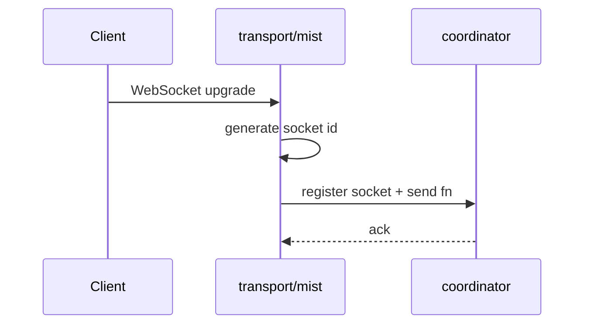
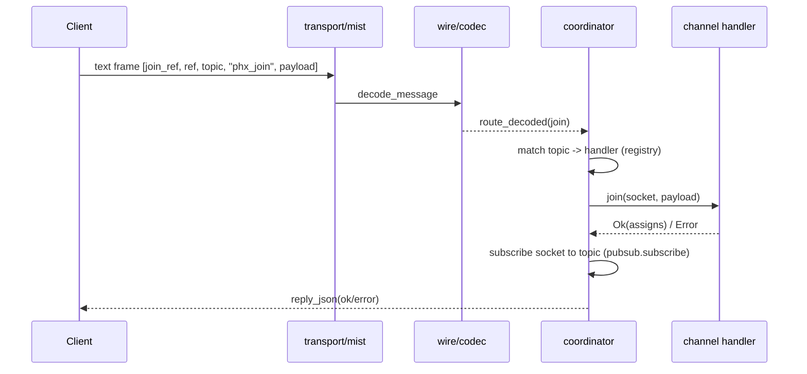
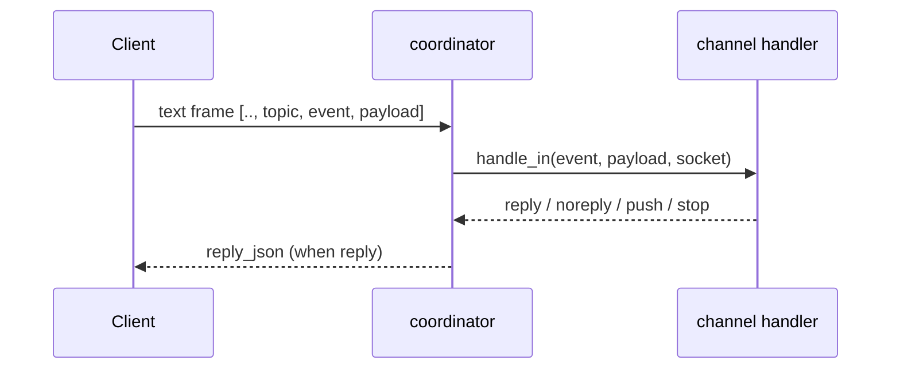
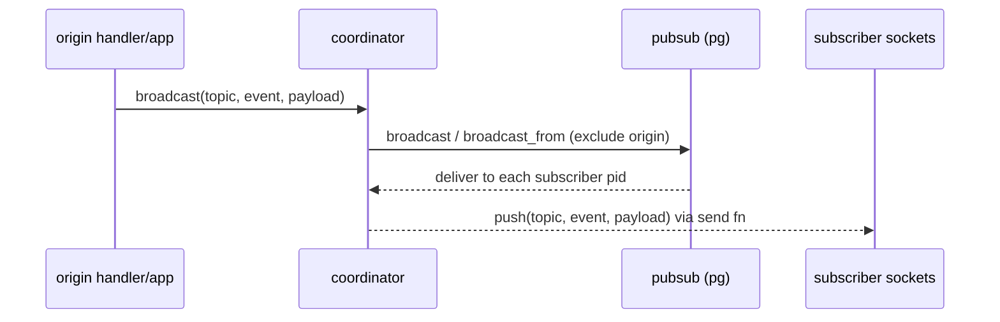
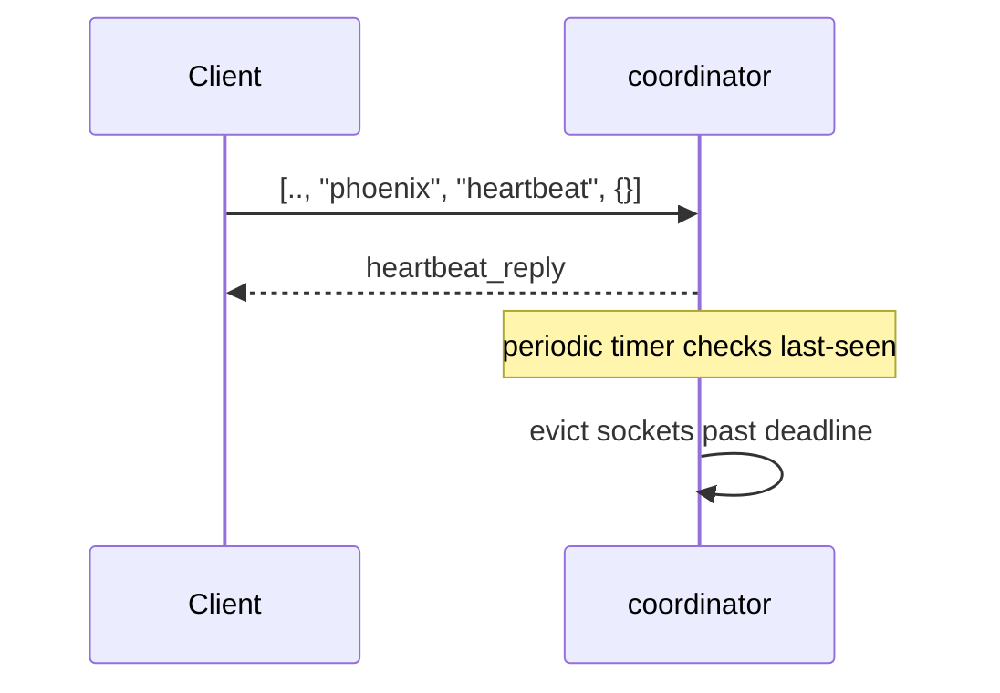
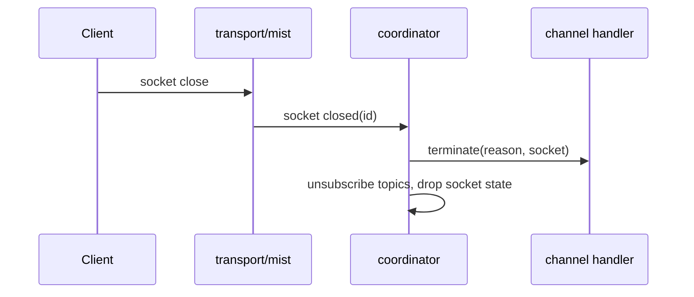

This page traces every significant step a message takes from the moment a WebSocket connection opens until it is pushed back to one or more clients. Each diagram corresponds to a distinct phase; together they give you a complete mental model of how beryl processes real-time traffic.

## Connect and register

When a client initiates a WebSocket upgrade, the Mist transport layer generates a unique socket id and hands the socket—along with its send function—to the coordinator for bookkeeping.

## Join a topic

A client joins a topic by sending a `phx_join` frame. The wire codec decodes the raw text frame, the coordinator looks up the matching channel handler in its registry, and the handler's `join/2` callback decides whether to accept or reject the connection.

## Handle an inbound event

After a successful join, every subsequent inbound frame for that topic is routed to the channel handler's `handle_in/3` callback. The handler returns one of `reply`, `noreply`, `push`, or `stop`, and the coordinator acts accordingly.

## Broadcast fan-out

Broadcasting delivers a message to every socket subscribed to a topic. `broadcast/3` reaches all subscribers; `broadcast_from/3` excludes the originating socket. The pg-based PubSub layer delivers the message as an Erlang message to each subscriber's coordinator process, which then pushes it over the wire.

## Heartbeat and eviction

Clients periodically send a `heartbeat` frame on the `"phoenix"` topic to signal liveness. The coordinator replies immediately and tracks the last-seen timestamp; a periodic timer evicts sockets that have not sent a heartbeat within the configured deadline.

## Disconnect and terminate

When a client closes the WebSocket connection, Mist notifies the coordinator, which calls each joined channel handler's `terminate/2` callback and then cleans up all topic subscriptions and socket state.

## Concurrency note

The coordinator is a single OTP actor processing its mailbox sequentially; broadcasts arrive as messages, so tests must select the exact message shape and drain queued messages (BEAM mailbox gotcha).

## Where this lives

- `src/beryl/transport/mist.gleam` — connect/close, frame routing
- `src/beryl/coordinator.gleam` — `route_message`, `route_decoded`, `route_binary`, heartbeat timer
- `src/beryl/wire.gleam`, `src/beryl/wire/codec.gleam` — decode/encode frames
- `src/beryl/pubsub.gleam` — fan-out
