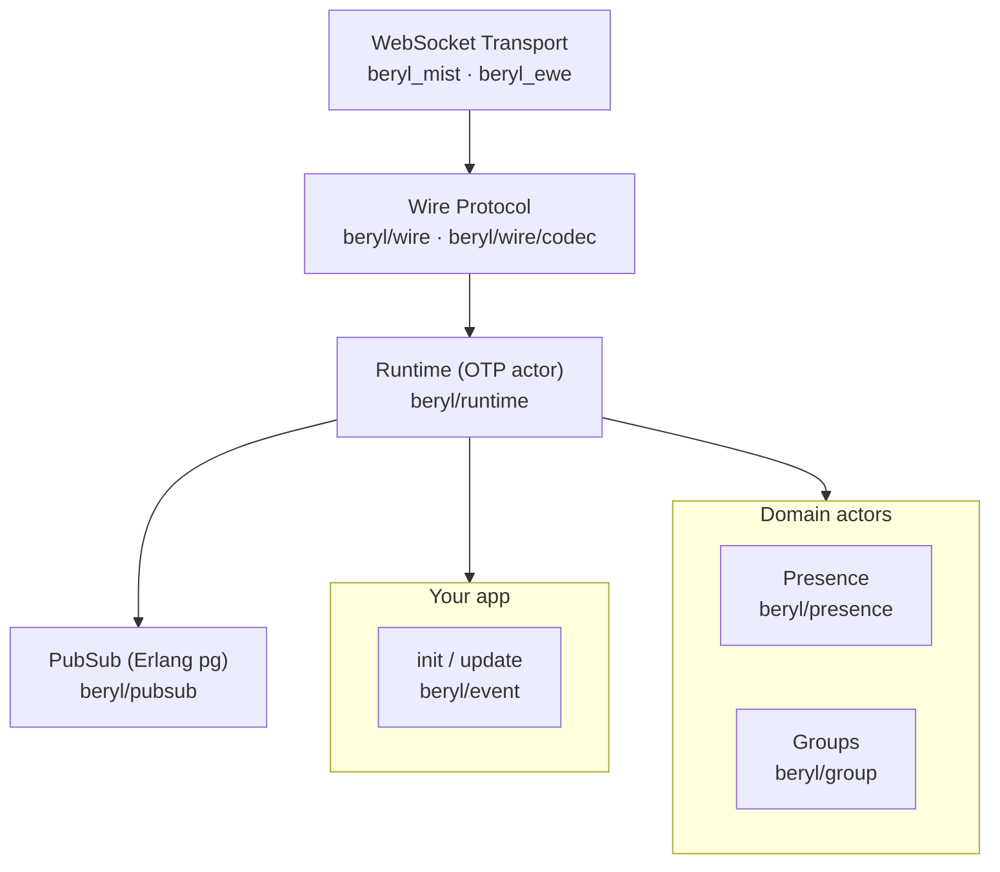
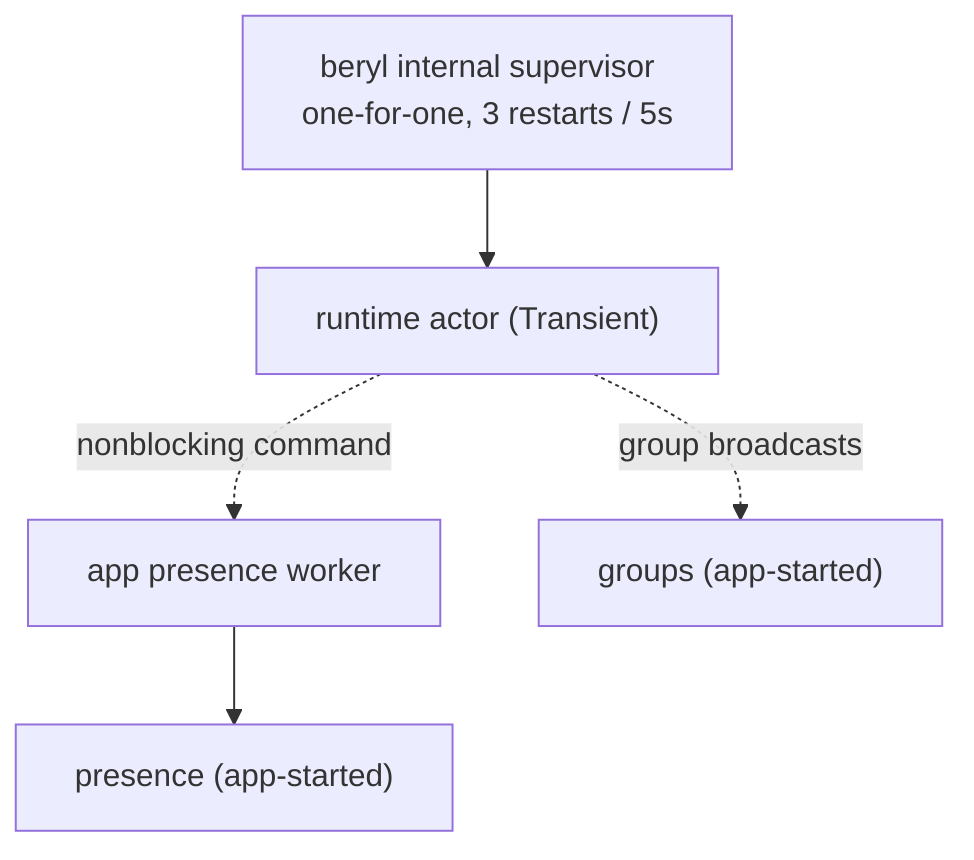

beryl layers a Phoenix-compatible channel system on top of OTP actors and Erlang `pg`, with a pluggable wire codec and WebSocket transport.
The app supplies an `init`/`update` pair to `beryl.child_spec`; the runtime actor dispatches decoded wire messages to it as typed events and applies the effects it returns.
Presence and groups are independent domain actors; PubSub is the only cross-node primitive; everything else is local to a node.

## How to read these docs

Each subsystem page covers one slice of the stack end-to-end and ends with a **"Where this lives"** pointer back to the relevant source files.

- [Message Lifecycle](/architecture/message-lifecycle): how a frame travels from WebSocket to your `update` function and back
- [Runtime & Supervision](/architecture/runtime): the runtime actor, typed dispatch, and the built-in supervision
- [PubSub & Distribution](/architecture/pubsub-and-distribution): Erlang `pg` groups, broadcast semantics, and cross-node delivery
- [Presence](/architecture/presence): CRDT-backed presence tracking, diffs, and replication
- [Wire & Transport](/architecture/wire-and-transport): codec contract, Phoenix framing, and the Mist WebSocket adapter

## The layer stack

## Module map

| Module | Responsibility | Page |
|---|---|---|
| `beryl` | Public entry-point: `config/1`, `child_spec/3`, `broadcast/4`, `broadcast_from/5`, `stop/1` | (none) |
| `beryl/event` | The app-facing dispatch types: `Event`, `Next`, `Effect`, `Ref`, `ConnectInfo`/`ConnectSeed`, typed `Sender`/`notify` | [Runtime](/architecture/runtime) |
| `beryl/runtime` | Central OTP actor: per-socket models, event dispatch, effect interpreter, heartbeat enforcement | [Runtime](/architecture/runtime) |
| `beryl/pubsub` | Distributed pub-sub via Erlang `pg`; subscribe, broadcast, and broadcast_from | [PubSub & Distribution](/architecture/pubsub-and-distribution) |
| `beryl/presence` | OTP actor wrapping an add-wins OR-set CRDT; track/untrack, cross-node diff broadcast, `on_diff` callbacks | [Presence](/architecture/presence) |
| `beryl/presence/wire` | Phoenix-compatible JSON encoding for presence diffs (`joins`/`leaves` maps) | [Presence](/architecture/presence) |
| `beryl/wire` | Pluggable codec surface; ships `phoenix_codec()` for `[join_ref, ref, topic, event, payload]` framing | [Wire & Transport](/architecture/wire-and-transport) |
| `beryl/wire/codec` | `Codec` type contract: `decode_text`, `decode_binary`, `encode_*`; lets you swap framing | [Wire & Transport](/architecture/wire-and-transport) |
| `beryl/transport` | Frame-level transport SPI consumed by transport packages | [Wire & Transport](/architecture/wire-and-transport) |
| `beryl_mist` / `beryl_ewe` | WebSocket adapters: assign socket IDs, register send functions, decode frames at the edge, route to the runtime | [Wire & Transport](/architecture/wire-and-transport) |
| `beryl/group` | Named topic collections managed by an OTP actor; supports grouped broadcast | (none) |
| `beryl/topic` | Topic pattern matching: exact strings, `"ns:*"` prefix wildcards, and segment wildcards (`"document:*:ops"`) | (none) |
| `beryl/error` | Opaque `StartFailure` type that hides OTP's `actor.StartError` from public APIs | (none) |
| `beryl/rate_limit` | Token-bucket rate limiter; keyed per socket, per socket+topic, or per topic pattern | (none) |
| `beryl/log` | Internal logging shim over `palabres`; thin named-logger surface, not public API | (none) |
| `beryl/internal` | Shared internal utilities (logging config, crash rescue); not public API | (none) |

## Process & supervision at a glance

The runtime supervises itself inside `child_spec`; presence and groups are plain actors the application starts and owns. See the [Supervision guide](/guides/supervision/).

## Where things live

Core source files live under `packages/beryl/src/beryl/`; transports under `packages/beryl_mist/` and `packages/beryl_ewe/`.
The runtime is the entry point for understanding behaviour. Start with [Runtime & Supervision](/architecture/runtime).
For how a message actually moves through the system, see [Message Lifecycle](/architecture/message-lifecycle).
For cross-node concerns, see [PubSub & Distribution](/architecture/pubsub-and-distribution).
