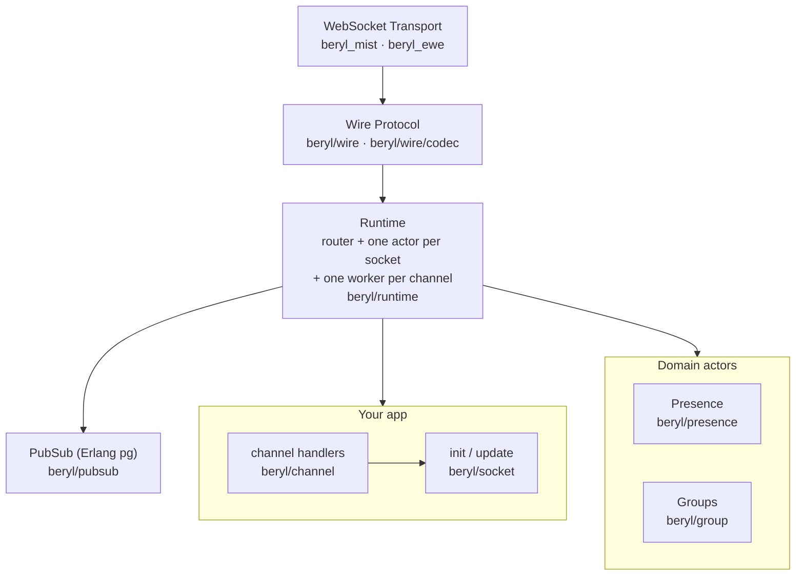
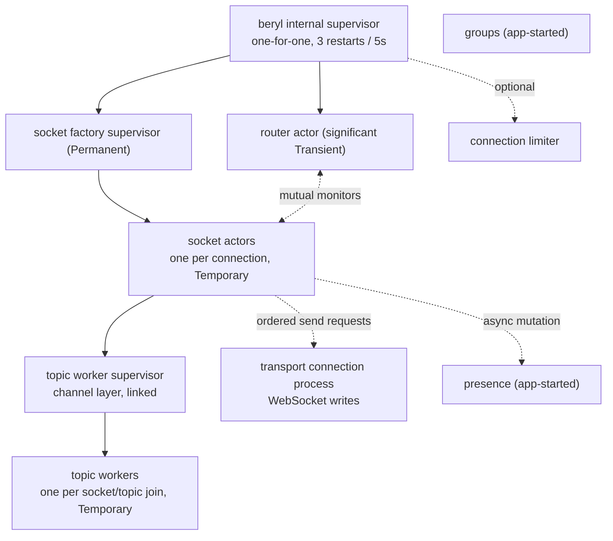

beryl provides a socket runtime on OTP actors and Erlang `pg`, with a built-in
Phoenix-compatible codec. It supports pluggable wire codecs and WebSocket
transports. An app can pass an `init` and `update` pair to `beryl.child_spec`.
It can also pass a typed handler table to `channel.child_spec`. The runtime
dispatches decoded messages and applies the returned effects. Separate actors
manage presence and groups. Only PubSub sends data across nodes.

Here, **runtime** means the router, socket actors, and optional channel workers
together, not one process. A **topic worker** belongs to one socket/topic join,
not to every subscriber of a topic name.

## Choose a page

Each page describes one subsystem and lists its source files.

- [How beryl handles a message](/architecture/message-lifecycle): how a frame travels from WebSocket to your `update` function and back
- [Socket processes & restarts](/architecture/runtime): the router, one process per socket, one worker per joined topic, typed messages, and restart behavior
- [Broadcasts Across Nodes](/architecture/pubsub-and-distribution): Erlang `pg` groups, sender exclusion, and delivery between nodes
- [Presence](/architecture/presence): CRDT-backed presence tracking, diffs, and replication
- [WebSocket Frames & Transports](/architecture/wire-and-transport): message encoding, Phoenix frames, and the Mist WebSocket adapter

## How data moves through beryl

## Module map

| Module | Responsibility | Page |
|---|---|---|
| `beryl` | Public entry-point: `config/1`, `child_spec/3`, `broadcast/4`, `broadcast_from/5`, `stop/1` | — |
| `beryl/channel` | Recommended channel layer: supervised startup, handler validation, typed per-topic state, join and close callbacks, senders, and ordered actions | [Channels](/guides/channels/) |
| `beryl/socket` | The app-facing dispatch types: `Input`, `Next`, `Effect`, `JoinRef`/`ReplyRef`, `ConnectInfo`/`ConnectSeed`, typed `Sender`/`notify` | [Runtime](/architecture/runtime) |
| `beryl/runtime` | Router, socket actors, and topic workers: subscriber index, per-socket models, per-topic channel processes, event delivery, returned effects, and heartbeat enforcement | [Runtime](/architecture/runtime) |
| `beryl/pubsub` | Distributed publish and subscribe through Erlang `pg` | [Broadcasts Across Nodes](/architecture/pubsub-and-distribution) |
| `beryl/presence` | OTP actor wrapping an add-wins OR-set CRDT; track/untrack, cross-node diff broadcast, `on_diff` callbacks | [Presence](/architecture/presence) |
| `beryl/presence/wire` | Phoenix-compatible JSON encoding for presence diffs (`joins`/`leaves` maps) | [Presence](/architecture/presence) |
| `beryl/wire` | Message encoding; includes `phoenix_codec()` for `[join_ref, ref, topic, event, payload]` frames | [WebSocket Frames & Transports](/architecture/wire-and-transport) |
| `beryl/wire/codec` | `Codec` functions such as `decode_text`, `decode_binary`, and `encode_*` | [WebSocket Frames & Transports](/architecture/wire-and-transport) |
| `beryl/transport` | Public interface used by WebSocket transport packages | [WebSocket Frames & Transports](/architecture/wire-and-transport) |
| `beryl_mist` / `beryl_ewe` | WebSocket adapters that assign socket IDs, register send functions, decode frames, and route messages | [WebSocket Frames & Transports](/architecture/wire-and-transport) |
| `beryl/group` | Named topic collections managed by an OTP actor; supports grouped broadcast | (none) |
| `beryl/topic` | Topic pattern matching: exact strings, `"ns:*"` prefix wildcards, and segment wildcards (`"document:*:ops"`) | (none) |
| `beryl/error` | Opaque `StartFailure` type that hides OTP's `actor.StartError` from public APIs | (none) |
| `beryl/rate_limit` | Token-bucket rate limiter; keyed per socket, per socket+topic, or per topic pattern | (none) |
| `beryl/log` | Internal named loggers built on `palabres`; not public API | (none) |
| `beryl/internal` | Shared internal utilities (logging config, crash rescue); not public API | (none) |

## Process ownership and restart behavior

`child_spec` supervises the router and socket factory. Transport connections
request temporary socket children from the factory. Socket actors preserve
protocol/effect order; transport connection processes perform network writes.
Channel workers own per-topic state and callbacks.

A socket actor fault closes that socket. A worker fault closes its topic.
A router or factory fault closes the affected runtime's connections.
Temporary children are not restarted: clients reconnect and rejoin rather
than recover an old session. The application starts and owns the presence and
group actors. See the
[Supervision guide](/guides/supervision/).

Slow channel callbacks do not block sibling workers, but joins, ordered
closes, and presence work can delay the socket's effect processing. The router
and presence actor remain shared resources, and transport queues can grow
behind slow readers. See [Queue limits and overload](/architecture/runtime/#queue-limits-and-overload)
and [Performance evidence](/architecture/runtime/#performance-evidence) for
the current limits and the work tracked in
[#397](https://github.com/tylerbutler/beryl/issues/397) and
[#400](https://github.com/tylerbutler/beryl/issues/400).

## Source files

Core source files are under `packages/beryl/src/beryl/`. Transport source files
are under `packages/beryl_mist/` and `packages/beryl_ewe/`. Start with
[Socket Processes & Restarts](/architecture/runtime) to learn how beryl runs sockets. See
[How beryl handles a message](/architecture/message-lifecycle) for the message path. See
[Broadcasts Across Nodes](/architecture/pubsub-and-distribution) for cross-node
behavior.
