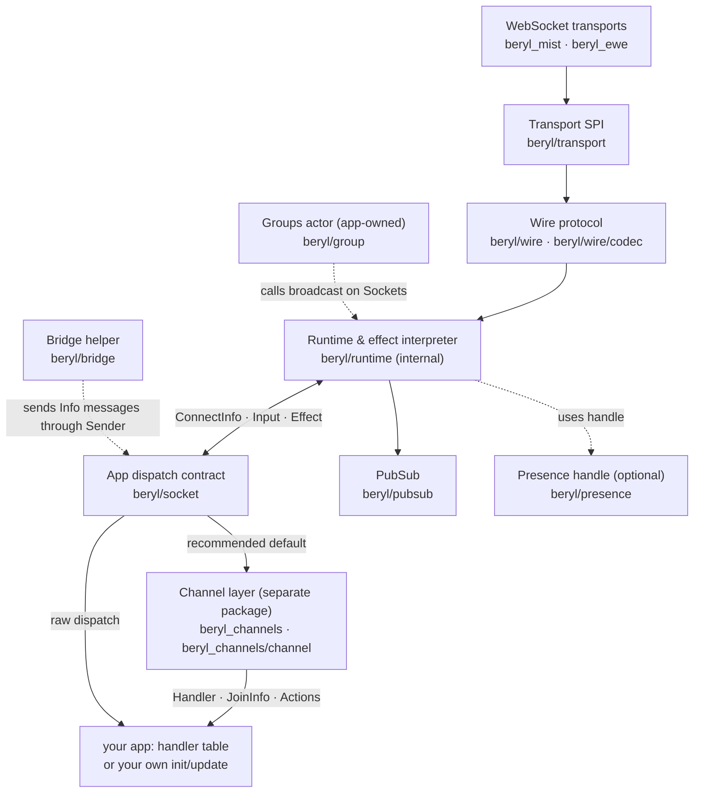
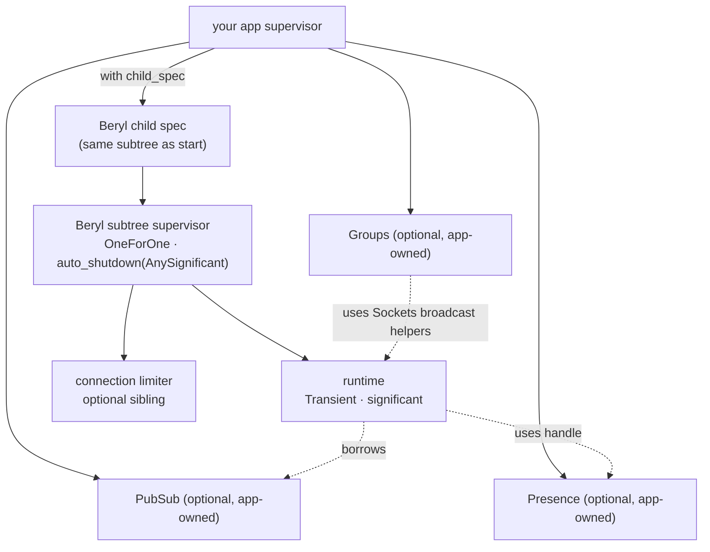

Beryl is an app-side dispatch runtime for WebSocket topics on the BEAM. Transports turn frames into `beryl/socket` values, one runtime actor per `Sockets` handle delivers those events to an `update` function, and the same runtime applies the returned `Effect`s in order.

That `update` is either yours or the channel layer's. `beryl_channels` is a separate package built strictly on the public `beryl` API: it compiles a handler table into exactly the `init`/`update` pair `beryl.start` expects, routes each input to the channel that owns its topic, and lowers each channel's `Actions` onto the same `Effect` values. Nothing below the dispatch contract knows which one is in use — see the [Channels guide](/guides/channels/) and [Choose an API](/choosing-an-api/).

PubSub is still the cluster-wide fan-out primitive. Presence and groups remain separate OTP actors that your app starts and supervises; the runtime borrows their handles when configured, but they are not children of the Beryl subtree.

## How to read these docs

Each subsystem page covers one slice of the stack end-to-end and ends with a **"Where this lives"** pointer back to the relevant source files.

- [Message Lifecycle](/architecture/message-lifecycle) — how a connection moves from transport registration to `Join`/`Message`/`Closed` events and back to frames
- [Runtime & Effect Interpreter](/architecture/runtime) — runtime ownership, effect ordering, supervision, crash behavior, and shutdown
- [PubSub & Distribution](/architecture/pubsub-and-distribution) — Erlang `pg` groups, broadcast semantics, and cross-node delivery
- [Presence](/architecture/presence) — CRDT-backed presence tracking, diffs, and replication
- [Wire & Transport](/architecture/wire-and-transport) — codec contract, Phoenix framing, and the Mist/Ewe WebSocket adapters

## The layer stack

The channel layer sits *on* the dispatch contract, not beside it: it is an ordinary consumer of `beryl.start`/`beryl.child_spec` with no access to internal modules.

## Module map

| Module | Responsibility | Page |
|---|---|---|
| `beryl` | Public entry-point: config builders, `start`, `child_spec`, `stop`, stable `Sockets` handle, broadcast helpers | [Runtime & Effect Interpreter](/architecture/runtime) |
| `beryl/socket` | App-side dispatch contract: `ConnectInfo`, `Input`, `Next`, `Effect`, `Sender` | [Message Lifecycle](/architecture/message-lifecycle) |
| `beryl/runtime` | Internal OTP actor: per-socket models, topic membership, heartbeats, inbound dispatch, effect interpretation | [Runtime & Effect Interpreter](/architecture/runtime) |
| `beryl/transport` | SPI used by transports to announce sockets, route decoded frames, and watch runtime ownership | [Wire & Transport](/architecture/wire-and-transport) |
| `beryl/pubsub` | Distributed pub-sub via Erlang `pg`; typed `Subscriber(payload)` API and sender exclusion | [PubSub & Distribution](/architecture/pubsub-and-distribution) |
| `beryl/presence` | OTP actor wrapping an add-wins OR-set CRDT; track/untrack/list plus replication hooks | [Presence](/architecture/presence) |
| `beryl/presence/wire` | Phoenix-compatible JSON encoding for `presence_diff` payloads | [Presence](/architecture/presence) |
| `beryl/wire` | Phoenix framing helpers and `phoenix_codec()` | [Wire & Transport](/architecture/wire-and-transport) |
| `beryl/wire/codec` | `Codec`, `Inbound`, and `Frame` contracts for pluggable framing | [Wire & Transport](/architecture/wire-and-transport) |
| `beryl/bridge` | Forward an external actor's message stream into one socket's `Info` events | — |
| `beryl/group` | App-owned named topic collections that broadcast through a `Sockets` handle | — |
| `beryl/topic` | Topic and event-name validation plus wildcard pattern matching | — |
| `beryl_mist` | Mist WebSocket adapter built on `beryl/transport` | [Wire & Transport](/architecture/wire-and-transport) |
| `beryl_ewe` | Ewe WebSocket adapter built on `beryl/transport` | [Wire & Transport](/architecture/wire-and-transport) |
| `beryl_channels` | Channel-system entry points (`start`, `child_spec`, `validate_handlers`) built on the public `beryl` API | [Channels](/guides/channels) |
| `beryl_channels/channel` | The composition surface: `Handler`, `JoinInfo`, `Sender`, `Callbacks`, `Actions`, join and lifecycle results | [Channels](/guides/channels) |

`beryl_channels`'s own router lives in `beryl_channels/internal/router`, which Gleam hides from other packages and from the generated docs. It holds one per-socket model — the handler table, the live instance per joined topic, and a monotonically increasing join generation — and is reachable only through the two entry points above.

## Process & supervision at a glance

`beryl.start` builds the same subtree, starts it immediately, and unlinks the caller from the subtree supervisor after startup.

## Where things live

Core library code lives under `packages/beryl/src/`. The WebSocket transports live in `packages/beryl_mist/src/` and `packages/beryl_ewe/src/`, and the channel layer in `packages/beryl_channels/src/`.

Start with `packages/beryl/src/beryl.gleam` and `packages/beryl/src/beryl/socket.gleam` for the public surface, then read [Runtime & Effect Interpreter](/architecture/runtime) for the runtime tree and lifecycle.

For how a message actually moves through the system, see [Message Lifecycle](/architecture/message-lifecycle). For cross-node concerns, see [PubSub & Distribution](/architecture/pubsub-and-distribution).
