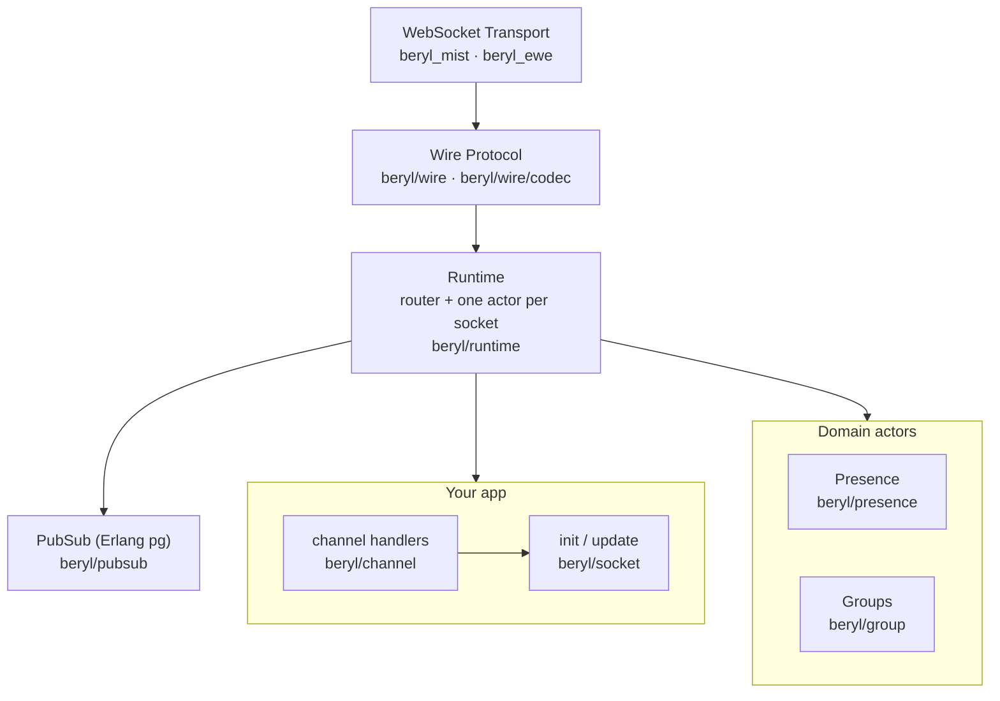
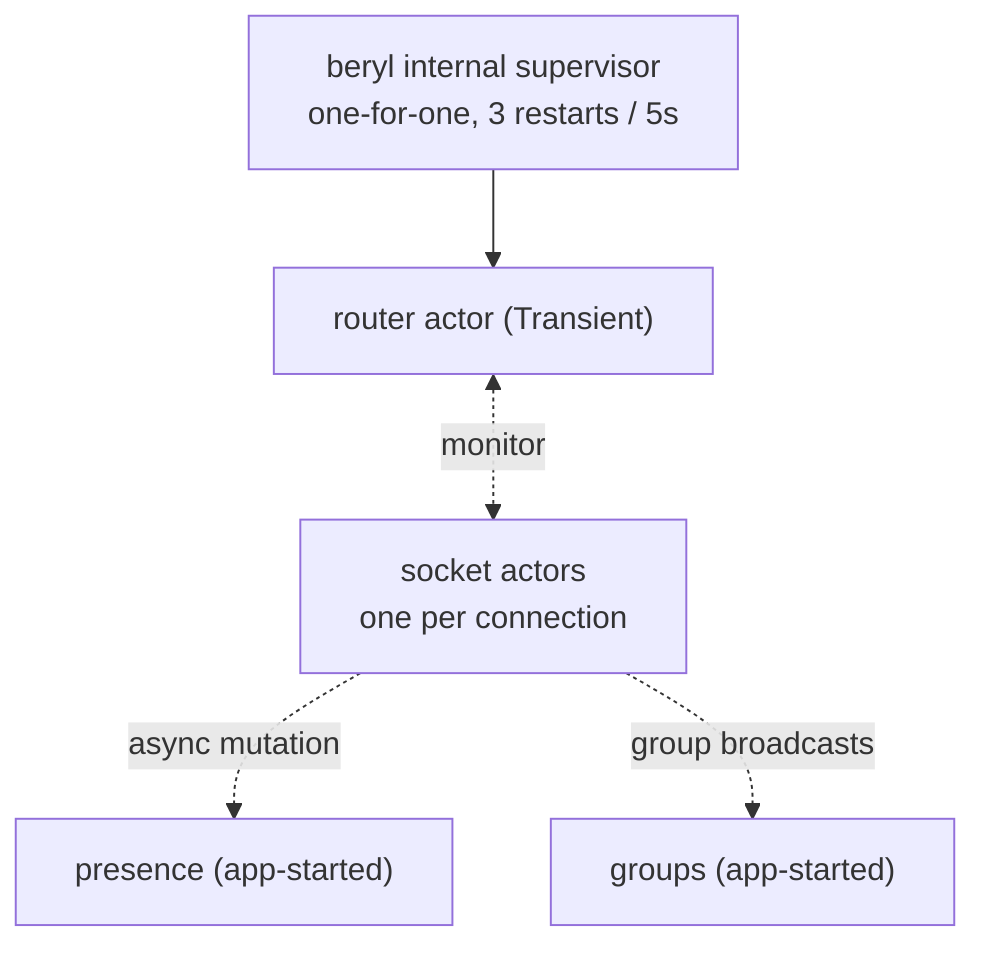

beryl provides a Phoenix-compatible socket runtime on OTP actors and Erlang
`pg`. It supports pluggable wire codecs and WebSocket transports. An app can
pass an `init` and `update` pair to `beryl.child_spec`. It can also pass a typed
handler table to `channel.child_spec`. The runtime dispatches decoded messages
and applies the returned effects. Separate actors manage presence and groups.
Only PubSub sends data across nodes.

## How to read these docs

Each page describes one subsystem and lists its source files.

- [Message Lifecycle](/architecture/message-lifecycle): how a frame travels from WebSocket to your `update` function and back
- [Runtime & Supervision](/architecture/runtime): the router, per-socket actors, typed dispatch, and built-in supervision
- [PubSub & Distribution](/architecture/pubsub-and-distribution): Erlang `pg` groups, broadcast semantics, and cross-node delivery
- [Presence](/architecture/presence): CRDT-backed presence tracking, diffs, and replication
- [Wire & Transport](/architecture/wire-and-transport): codec contract, Phoenix framing, and the Mist WebSocket adapter

## The layer stack

## Module map

| Module | Responsibility | Page |
|---|---|---|
| `beryl` | Public entry-point: `config/1`, `child_spec/3`, `broadcast/4`, `broadcast_from/5`, `stop/1` | — |
| `beryl/channel` | Recommended channel layer: supervised startup, handler validation, typed per-topic state, lifecycle callbacks, senders, and ordered actions | [Channels](/guides/channels/) |
| `beryl/socket` | The app-facing dispatch types: `Input`, `Next`, `Effect`, `JoinRef`/`ReplyRef`, `ConnectInfo`/`ConnectSeed`, typed `Sender`/`notify` | [Runtime](/architecture/runtime) |
| `beryl/runtime` | Router and socket actors: subscriber index, per-socket models, event dispatch, effect interpreter, heartbeat enforcement | [Runtime](/architecture/runtime) |
| `beryl/pubsub` | Distributed pub-sub via Erlang `pg`; subscribe, broadcast, and broadcast_from | [PubSub & Distribution](/architecture/pubsub-and-distribution) |
| `beryl/presence` | OTP actor wrapping an add-wins OR-set CRDT; track/untrack, cross-node diff broadcast, `on_diff` callbacks | [Presence](/architecture/presence) |
| `beryl/presence/wire` | Phoenix-compatible JSON encoding for presence diffs (`joins`/`leaves` maps) | [Presence](/architecture/presence) |
| `beryl/wire` | Pluggable codec surface; ships `phoenix_codec()` for `[join_ref, ref, topic, event, payload]` framing | [Wire & Transport](/architecture/wire-and-transport) |
| `beryl/wire/codec` | `Codec` type contract: `decode_text`, `decode_binary`, `encode_*`; lets you swap framing | [Wire & Transport](/architecture/wire-and-transport) |
| `beryl/transport` | Frame-level transport SPI consumed by transport packages | [Wire & Transport](/architecture/wire-and-transport) |
| `beryl_mist` / `beryl_ewe` | WebSocket adapters: assign socket IDs, register send functions, decode frames at the edge, route to the runtime | [Wire & Transport](/architecture/wire-and-transport) |
| `beryl/group` | Named topic collections managed by an OTP actor; supports grouped broadcast | (none) |
| `beryl/topic` | Topic pattern matching: exact strings, `"ns:*"` prefix wildcards, and segment wildcards (`"document:*:ops"`) | (none) |
| `beryl/error` | Opaque `StartFailure` type that hides OTP's `actor.StartError` from public APIs | (none) |
| `beryl/rate_limit` | Token-bucket rate limiter; keyed per socket, per socket+topic, or per topic pattern | (none) |
| `beryl/log` | Internal logging shim over `palabres`; thin named-logger surface, not public API | (none) |
| `beryl/internal` | Shared internal utilities (logging config, crash rescue); not public API | (none) |

## Process & supervision at a glance

`child_spec` supervises the router. Transport connections start the socket
actors, which monitor the router and are monitored by it. The application
starts and owns the presence and group actors. See the
[Supervision guide](/guides/supervision/).

## Where things live

Core source files are under `packages/beryl/src/beryl/`. Transport source files
are under `packages/beryl_mist/` and `packages/beryl_ewe/`. Start with
[Runtime & Supervision](/architecture/runtime) to learn the runtime. See
[Message Lifecycle](/architecture/message-lifecycle) for the message path. See
[PubSub & Distribution](/architecture/pubsub-and-distribution) for cross-node
behavior.
