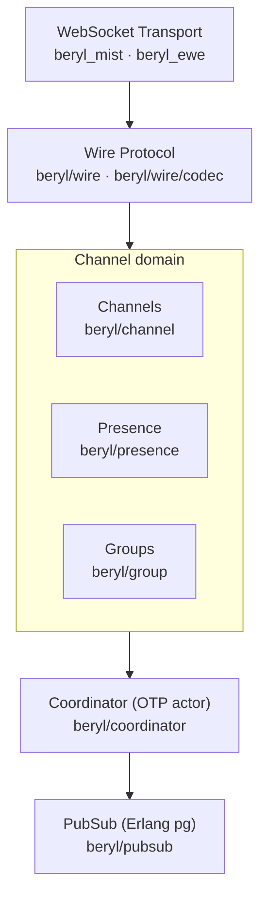

beryl layers a Phoenix-style channel system on top of OTP actors and Erlang `pg`, with a pluggable wire codec and WebSocket transport.
Channels, presence, and groups are independent domain actors wired together by the coordinator, which dispatches decoded wire messages and enforces heartbeats.
PubSub is the only cross-node primitive; everything else is local to a node.

## How to read these docs

Each subsystem page covers one slice of the stack end-to-end and ends with a **"Where this lives"** pointer back to the relevant source files.

- [Message Lifecycle](/architecture/message-lifecycle/) — how a frame travels from WebSocket to channel handler and back
- [Coordinator & Supervision](/architecture/coordinator/) — OTP actor lifecycle, handler registry, and the supervision tree
- [PubSub & Distribution](/architecture/pubsub-and-distribution/) — Erlang `pg` groups, broadcast semantics, and cross-node delivery
- [Presence](/architecture/presence/) — CRDT-backed presence tracking, diffs, and replication
- [Wire & Transport](/architecture/wire-and-transport/) — codec contract, Phoenix framing, and the WebSocket transport adapters

## The layer stack



## Module map

| Module | Responsibility | Page |
|---|---|---|
| `beryl` | Public entry-point: `config/1`, `register/3`, `broadcast/4`, `send_info/4`. Starting is `beryl/supervisor`'s job — `beryl` has no `start` | — |
| `beryl/coordinator` | Central OTP actor: handler registry, socket tracking, message routing, heartbeat enforcement | [Coordinator](/architecture/coordinator/) |
| `beryl/pubsub` | Distributed pub-sub via Erlang `pg`; subscribe, broadcast, and broadcast_from | [PubSub & Distribution](/architecture/pubsub-and-distribution/) |
| `beryl/presence` | OTP actor wrapping an add-wins OR-set CRDT; track/untrack, cross-node diff broadcast, `on_diff` callbacks | [Presence](/architecture/presence/) |
| `beryl/presence/wire` | Phoenix-compatible JSON encoding for presence diffs (`joins`/`leaves` maps) | [Presence](/architecture/presence/) |
| `beryl/wire` | Pluggable codec surface; ships `phoenix_codec()` for `[join_ref, ref, topic, event, payload]` framing | [Wire & Transport](/architecture/wire-and-transport/) |
| `beryl/wire/codec` | `Codec` type contract: `decode_text`, `decode_binary`, `encode_*` — lets you swap framing | [Wire & Transport](/architecture/wire-and-transport/) |
| `beryl_mist` | Mist WebSocket adapter: assigns socket IDs, registers send functions, routes frames to coordinator | [Wire & Transport](/architecture/wire-and-transport/) |
| `beryl_ewe` | Ewe WebSocket adapter; mirrors the `beryl_mist` API against the same `beryl/transport` SPI | [Wire & Transport](/architecture/wire-and-transport/) |
| `beryl/supervisor` | one-for-one supervision tree isolating an optional connection limiter from a nested rest-for-one channel subtree (registry → coordinator → presence → groups); returns a child specification via `start/1` | [Coordinator](/architecture/coordinator/) |
| `beryl/group` | Named topic collections managed by an OTP actor; supports grouped broadcast | — |
| `beryl/topic` | Topic pattern matching: exact strings, `"ns:*"` prefix wildcards, and segment wildcards (`"document:*:ops"`) | — |
| `beryl/socket` | Opaque connected-client type with typed assigns; `id`, `get_assigns`, `set_assigns`, `map_assigns` | — |
| `beryl/channel` | Builder API for user-defined message callbacks parameterized by an `assigns` type | [Message Lifecycle](/architecture/message-lifecycle/) |
| `beryl/error` | Opaque `StartFailure` type that hides OTP's `actor.StartError` from public APIs | — |
| `beryl/rate_limit` | Token-bucket rate limiter backed by an OTP registry actor; keyed by socket ID or topic | — |
| `beryl/bridge` | Forwards an external OTP actor's message stream into a socket channel; avoids per-socket forwarder boilerplate | — |
| `beryl/log` | Internal logging shim over `palabres`; thin named-logger surface, not public API | — |
| `beryl/internal` | Shared internal utilities (logging config, configure helper); not public API | — |

## Process & supervision at a glance

```mermaid
flowchart TB
  S["beryl supervisor (one-for-one)"]
  S --> LI["connection limiter (optional)"]
  S --> CH["channel supervisor (rest-for-one)"]
  CH --> RE["registry"]
  CH --> CO["coordinator"]
  CH --> PR["presence (optional)"]
  CH --> GR["groups (optional)"]
  CO -. "crash restarts downstream" .-> PR
  PR -. .-> GR
```

## Where things live

beryl is a monorepo. Core library sources live under `packages/beryl/src/`, and each transport is its own package (`packages/beryl_mist/src/`, `packages/beryl_ewe/src/`).
The coordinator and supervisor are the entry points for understanding runtime behaviour — start with [Coordinator & Supervision](/architecture/coordinator/).
For how a message actually moves through the system, see [Message Lifecycle](/architecture/message-lifecycle/).
For cross-node concerns, see [PubSub & Distribution](/architecture/pubsub-and-distribution/).
