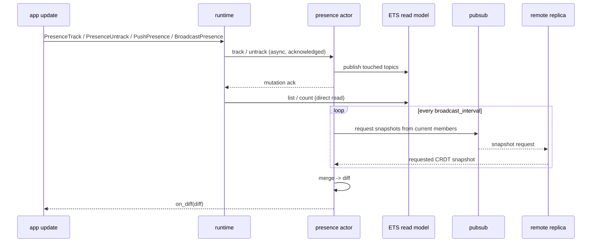

## How presence stores changes

beryl presence uses an OTP actor and an **add-wins, observed-remove
conflict-free replicated data type (CRDT)** from
[`lattice_presence/presence_state`](https://hex.pm/packages/lattice_presence).
Each cluster node keeps one copy. Nodes can merge their copies in any order.
Joins and leaves that happen at the same time produce the same final result.

Each tracked entry has a **replica name**, set by the `replica` argument to
`default_config/1`. Use a unique name for each cluster node. The CRDT uses this
name to identify remote state.

## Add presence to an app

The application builds the presence actor with `presence.child_spec`. Add the
child to the supervision tree. Then pass its handle to `beryl.Config` with
`with_presence_handle`.

Raw dispatch uses `PresenceTrack`, `PresenceUntrack`, `PushPresence`, and
`BroadcastPresence` effects. The runtime sends mutations to the presence actor. The actor acknowledges a
mutation after it updates the CRDT and ETS read model. Until then, the runtime
pauses later effects and inputs for that socket. Other sockets, broadcasts,
heartbeats, and shutdown work continue.

Snapshot effects read the actor-owned ETS model directly, so they do not wait
on the actor mailbox. Re-tracking a runtime-owned key is one atomic
leave-plus-join transition, and topic close cleans up that socket's remaining
runtime refs in one batch. Tracking refs resolve to exact local CRDT tags, so a
late runtime acknowledgement cannot remove an independently owned public
`presence.track` entry with the same session, topic, and key.

The public `track`, `untrack`, and `untrack_all` APIs remain synchronous for
application actors and other out-of-band workflows. Public `list`,
`get_by_key`, and `count` calls read ETS directly and retain immediate
read-after-write behavior.

Local mutations share a finite item/byte budget. Each runtime-owned session
also retains a cleanup reservation until it ends. Pending call timeouts
cancel work; running calls can still complete. Generic PubSub sync has no
pre-receipt admission bound. See [overload handling](/guides/overload/).

## Presence functions

### Starting presence

| Function | Description |
|---|---|
| `child_spec(config)` | Return a stable presence handle and its supervised child specification |

The handle keeps working after an actor restart on the same node. The process
and ETS read model use stable names. The replacement actor starts with empty
in-memory CRDT state and tracking refs. The handle works only on its node.
PubSub copies presence state between nodes.

### Configuration builders

| Function | Description |
|---|---|
| `default_config(replica)` | Create a config with no PubSub and a 1500 ms interval that remains unused until PubSub is attached |
| `with_pubsub(config, ps)` | Attach a PubSub instance for cross-node state replication |
| `with_broadcast_interval(config, ms)` | Set the snapshot repair cadence in ms; `0` disables periodic requests |
| `with_on_diff(config, callback)` | Register a callback invoked whenever a local change or merge produces a non-empty diff |
| `with_queue_limits(config, limits)` | Set positive local mutation and cleanup budgets |
| `with_telemetry(config)` | Enable queue occupancy events |

### Tracking

| Function | Description |
|---|---|
| `track(presence, topic, key, session_id, meta)` | Add a presence entry; returns a server-generated tracking ref for later `untrack` |
| `untrack(presence, ref)` | Remove one tracked entry by the ref returned from `track` |
| `untrack_all(presence, session_id)` | Remove all entries for a session id |

### Querying

| Function | Description |
|---|---|
| `list(presence, topic)` | Return all `PresenceEntry` values for a topic |
| `get_by_key(presence, topic, key)` | Return `{session_id, meta}` pairs for a specific key within a topic |

### Diff helpers

`on_diff` callbacks receive an opaque `Diff`. Use these accessors:

| Function | Description |
|---|---|
| `diff(joins, leaves)` | Construct a diff from topic-grouped join and leave lists |
| `diff_topics(diff)` | List every topic touched by this diff |
| `diff_joins(diff, topic)` | Get joined entries for a topic |
| `diff_leaves(diff, topic)` | Get departed entries for a topic |

## Sync between nodes

When you configure `with_pubsub`, the presence actor requests snapshots once
at startup and then at the configured interval, which defaults to 1500 ms:

1. Each tick reads the current `pg` membership of `"beryl:presence:sync"`.
   The actor sends each other member a request with a unique ref and a reply
   subject. It keeps one outstanding ref per member and retries unanswered
   requests, so a slow reply can span multiple ticks.
2. Each member replies directly with its full CRDT state, even when it has no
   new mutations. The requester accepts only a reply to that member's current
   request, merges it with `state.merge_with_diff`, and updates its read model.
   A request permits one reciprocal request, so a replica with its periodic
   timer disabled can still receive updates. Reciprocal requests do not repeat.
3. If the merge changes membership, the actor calls `on_diff` with the
   resulting `Diff`. It calls the function for each merge, so rapid merges do
   not lose diffs.

This repairs late joins, missed delivery, and restored `pg` membership without
an unrelated application mutation. The interval is a retry cadence, not a
convergence deadline: membership propagation, network delivery, and actor work
can take longer. Repair requires continued successful exchanges.

Use `with_broadcast_interval(0)` to disable periodic requests. The initial
request and replies to peers still run, but quiet recovery is not guaranteed.
Without PubSub, the configured interval is unused.

Presence uses version 2 of its internal sync envelope. Version 1 unsolicited
snapshots and version 2 requests do not interoperate; upgrade the replicas in
a presence scope together. The frozen five-element PubSub tuple is unchanged.

Automated tests cover quiet bootstrap, partition repair, empty restart, and
`pg` recovery across separate BEAM nodes, as well as same-node replication.
[Issue #365](https://github.com/tylerbutler/beryl/issues/365) tracks the broader
distributed PubSub and presence matrix.

## Replica availability

After a successful snapshot exchange, beryl associates the replica identity
with the source actor's PID and monitors that process. A process exit or an
Erlang distribution disconnection hides that replica's entries and emits
matching leave diffs. Each repair tick also checks `pg` membership, so scope
recovery or membership loss can hide an actor that still runs.

beryl uses the CRDT's `replica_down` for these local visibility changes.
It retains the entries and causal context. Peer snapshots cannot make an
unavailable or unconfirmed replica visible. Diffs compare the visible state
before and after the complete transition, so removing a hidden entry does
not emit a second leave.

A temporary partition can make a remote session appear offline while its
source node still lists it. Local tracking and local reads remain available.
On reconnect, membership alone does not restore visibility: a fresh snapshot
from the same actor first incorporates changes made during the partition,
then restores its current entries with join diffs. This favors local
availability over a single cluster-wide online/offline decision.

Actor restart creates a new incarnation with empty local state and new
tracking refs. Clients must re-track their local presence. Failure detection
depends on Erlang process/distribution signals and actor progress; the repair
interval does not bound node-failure detection time.

## Request and sync flow

## Source files

| File | Role |
|---|---|
| `packages/beryl/src/beryl/presence.gleam` | OTP actor, public API, CRDT wiring, PubSub subscription and broadcast |
| `packages/beryl/src/beryl/presence/wire.gleam` | Wire helpers for encoding and decoding presence diffs over the channel protocol |
