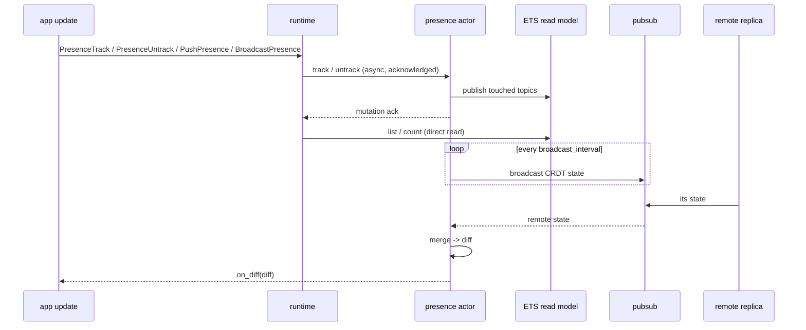

## Model

Beryl presence is an OTP actor that wraps [`lattice_presence/presence_state`](https://hex.pm/packages/lattice_presence) — an **add-wins, observed-remove CRDT**. Each node in a cluster holds its own replica of the CRDT state. Because the data structure is conflict-free, replicas merge in any order without coordination: concurrent joins and leaves from different nodes always converge to the same result.

Every tracked entry is stamped with a **replica name** (the `replica` argument to `default_config/1`). The replica name must be unique across the cluster; it is used as the CRDT replica identifier when merging remote state.

## How Beryl apps use it

The presence actor is a standalone supervised child that the application
builds with `presence.child_spec`, adds to its supervision tree, and supplies
to `beryl.Config` with `with_presence_handle`.

App-side dispatch uses `PresenceTrack`, `PresenceUntrack`, `PushPresence`, and
`BroadcastPresence` effects. Mutations are sent asynchronously to the presence
actor and acknowledged only after both the CRDT and its ETS read model are
updated. The runtime suspends the issuing socket's remaining effects and later
inputs until that acknowledgement arrives; other sockets, broadcasts,
heartbeats, and shutdown handling continue normally.

Snapshot effects read the actor-owned ETS model directly, so they do not wait
on the actor mailbox. Re-tracking a runtime-owned key is one atomic
leave-plus-join transition, and topic close cleans up that socket's remaining
runtime refs in one batch. Tracking refs resolve to exact local CRDT tags, so a
late runtime acknowledgement cannot remove an independently owned public
`presence.track` entry with the same session, topic, and key.

The public `track`, `untrack`, and `untrack_all` APIs remain synchronous for
application actors and other out-of-band workflows. Public `list`,
`get_by_key`, and `count` calls read ETS directly and retain immediate
read-after-write behavior.

## API surface

### Starting presence

| Function | Description |
|---|---|
| `child_spec(config)` | Return a stable presence handle and its supervised child specification |

The handle keeps working across actor restarts because both the process and
its ETS read model use the same stable name. The replacement actor starts with
fresh in-memory CRDT state and tracking refs.

### Configuration builders

| Function | Description |
|---|---|
| `default_config(replica)` | Create a minimal config with no PubSub and no periodic broadcast |
| `with_pubsub(config, ps)` | Attach a PubSub instance for cross-node state replication |
| `with_broadcast_interval(config, ms)` | Set how often (in ms) the actor broadcasts its CRDT state; `0` disables |
| `with_on_diff(config, callback)` | Register a callback invoked whenever a local change or merge produces a non-empty diff |

### Tracking

| Function | Description |
|---|---|
| `track(presence, topic, key, session_id, meta)` | Add a presence entry; returns a server-generated tracking ref for later `untrack` |
| `untrack(presence, ref)` | Remove one tracked entry by the ref returned from `track` |
| `untrack_all(presence, session_id)` | Remove all entries for a session id |

### Querying

| Function | Description |
|---|---|
| `list(presence, topic)` | Return all `PresenceEntry` values for a topic |
| `get_by_key(presence, topic, key)` | Return `{session_id, meta}` pairs for a specific key within a topic |

### Diff helpers

`on_diff` callbacks receive an opaque `Diff`. Use these accessors:

| Function | Description |
|---|---|
| `diff(joins, leaves)` | Construct a diff from topic-grouped join and leave lists |
| `diff_topics(diff)` | List every topic touched by this diff |
| `diff_joins(diff, topic)` | Get joined entries for a topic |
| `diff_leaves(diff, topic)` | Get departed entries for a topic |

## Replication

When `with_pubsub` and `with_broadcast_interval` are both configured, the presence actor runs a periodic broadcast loop:

1. On each tick, if the local CRDT has changed since the last broadcast (`dirty = true`), the actor publishes a typed `SyncPayload(v, sender, state)` term to the well-known topic `"beryl:presence:sync"` using `broadcast_from` — which excludes self-delivery at the PubSub layer.
2. Remote replicas on other nodes receive that typed payload through PubSub, merge the incoming state with `state.merge_with_diff`, and update their CRDT replica.
3. If the merge changes membership (new joins or leaves relative to local state), `on_diff` fires immediately with the resulting `Diff`. This ensures no diff is silently dropped when multiple merges arrive in rapid succession.

Setting `broadcast_interval_ms` to `0` (the default in `default_config`) disables periodic broadcasts entirely, which is appropriate for single-node deployments.

## Diagram

## Where this lives

| File | Role |
|---|---|
| `packages/beryl/src/beryl/presence.gleam` | OTP actor, public API, CRDT wiring, PubSub subscription and broadcast |
| `packages/beryl/src/beryl/presence/wire.gleam` | Wire helpers for encoding and decoding presence diffs over the channel protocol |
