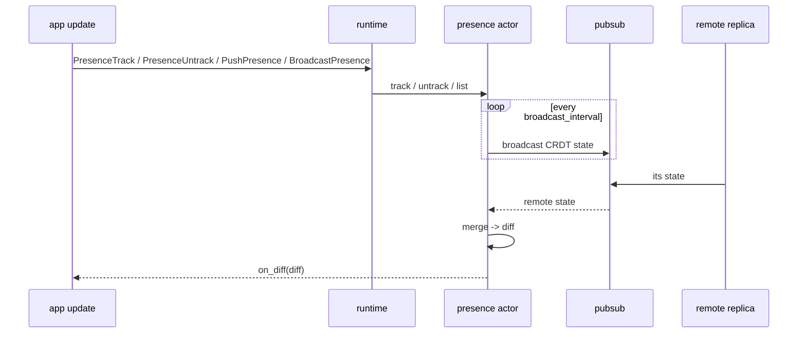

## Model

Beryl presence is an OTP actor that wraps [`lattice_presence/presence_state`](https://hex.pm/packages/lattice_presence) — an **add-wins, observed-remove CRDT**. Each node in a cluster holds its own replica of the CRDT state. Because the data structure is conflict-free, replicas merge in any order without coordination: concurrent joins and leaves from different nodes always converge to the same result.

Every tracked entry is stamped with a **replica name** (the `replica` argument to `default_config/1`). The replica name must be unique across the cluster; it is used as the CRDT replica identifier when merging remote state.

## How Beryl apps use it

The presence actor is still a standalone process that your app starts and supervises itself. To let the runtime drive presence, attach that handle to `beryl.Config` with `beryl.with_presence_handle`.

From there, presence changes are driven by effects returned from your app's `update`:

- `PresenceTrack(topic, key, meta)`
- `PresenceUntrack(topic, key)`
- `PushPresence(topic, event, encode)`
- `BroadcastPresence(topic, event, encode)`

The runtime applies those effects after `update` returns. `PushPresence` and `BroadcastPresence` read presence at apply time, so earlier track/untrack effects in the same list are already reflected in the snapshot they encode.

## API surface

### Starting presence

| Function | Description |
|---|---|
| `start(config)` | Start an anonymous presence actor |
| `start_named(config, name)` | Start a named presence actor |

### Configuration builders

| Function | Description |
|---|---|
| `default_config(replica)` | Create a minimal config with no PubSub and no periodic broadcast |
| `with_pubsub(config, ps)` | Attach a PubSub instance for cross-node state replication |
| `with_broadcast_interval(config, ms)` | Set how often (in ms) the actor broadcasts its CRDT state; `0` disables |
| `with_on_diff(config, callback)` | Register a callback invoked whenever a local change or merge produces a non-empty diff |

### Tracking

| Function | Description |
|---|---|
| `track(presence, topic, key, session_id, meta)` | Add a presence entry; returns a server-generated tracking ref for later `untrack` |
| `untrack(presence, ref)` | Remove one tracked entry by the ref returned from `track` |
| `untrack_all(presence, session_id)` | Remove all entries for a session id |

### Querying

| Function | Description |
|---|---|
| `list(presence, topic)` | Return all `PresenceEntry` values for a topic |
| `get_by_key(presence, topic, key)` | Return `{session_id, meta}` pairs for a specific key within a topic |

### Diff helpers

`on_diff` callbacks receive an opaque `Diff`. Use these accessors:

| Function | Description |
|---|---|
| `diff(joins, leaves)` | Construct a diff from topic-grouped join and leave lists |
| `diff_topics(diff)` | List every topic touched by this diff |
| `diff_joins(diff, topic)` | Get joined entries for a topic |
| `diff_leaves(diff, topic)` | Get departed entries for a topic |

## Replication

When `with_pubsub` and `with_broadcast_interval` are both configured, the presence actor runs a periodic broadcast loop:

1. On each tick, if the local CRDT has changed since the last broadcast (`dirty = true`), the actor publishes a typed `SyncPayload(v, sender, state)` term to the well-known topic `"beryl:presence:sync"` using `broadcast_from` — which excludes self-delivery at the PubSub layer.
2. Remote replicas on other nodes receive that typed payload through PubSub, merge the incoming state with `state.merge_with_diff`, and update their CRDT replica.
3. If the merge changes membership (new joins or leaves relative to local state), `on_diff` fires immediately with the resulting `Diff`. This ensures no diff is silently dropped when multiple merges arrive in rapid succession.

Setting `broadcast_interval_ms` to `0` (the default in `default_config`) disables periodic broadcasts entirely, which is appropriate for single-node deployments.

## Diagram

## Where this lives

| File | Role |
|---|---|
| `packages/beryl/src/beryl.gleam` | `with_presence_handle` attaches a borrowed presence actor to the runtime config |
| `packages/beryl/src/beryl/socket.gleam` | Presence-related effects: `PresenceTrack`, `PresenceUntrack`, `PushPresence`, `BroadcastPresence` |
| `packages/beryl/src/beryl/presence.gleam` | OTP actor, public API, CRDT wiring, PubSub subscription and broadcast |
| `packages/beryl/src/beryl/presence/wire.gleam` | Wire helpers for encoding and decoding presence diffs over the channel protocol |
