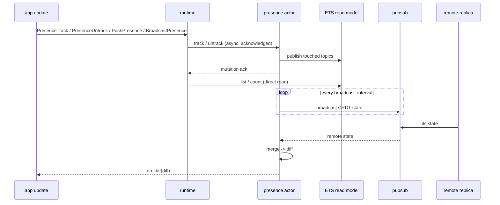

## Model

Beryl presence is an OTP actor that wraps
[`lattice_presence/presence_state`](https://hex.pm/packages/lattice_presence).
It uses an **add-wins, observed-remove CRDT**. Each cluster node keeps one CRDT
replica. Replicas can merge in any order without coordination. Concurrent joins
and leaves converge to the same result.

Each tracked entry has a **replica name**, set by the `replica` argument to
`default_config/1`. Use a unique name for each cluster node. The CRDT uses this
name to identify remote state.

## How Beryl apps use it

The application builds the presence actor with `presence.child_spec`. Add the
child to the supervision tree. Then pass its handle to `beryl.Config` with
`with_presence_handle`.

App-side dispatch uses `PresenceTrack`, `PresenceUntrack`, `PushPresence`, and
`BroadcastPresence` effects. The runtime sends mutations to the presence actor. The actor acknowledges a
mutation after it updates the CRDT and ETS read model. Until then, the runtime
pauses later effects and inputs for that socket. Other sockets, broadcasts,
heartbeats, and shutdown work continue.

Snapshot effects read the actor-owned ETS model directly, so they do not wait
on the actor mailbox. Re-tracking a runtime-owned key is one atomic
leave-plus-join transition, and topic close cleans up that socket's remaining
runtime refs in one batch. Tracking refs resolve to exact local CRDT tags, so a
late runtime acknowledgement cannot remove an independently owned public
`presence.track` entry with the same session, topic, and key.

The public `track`, `untrack`, and `untrack_all` APIs remain synchronous for
application actors and other out-of-band workflows. Public `list`,
`get_by_key`, and `count` calls read ETS directly and retain immediate
read-after-write behavior.

## API surface

### Starting presence

| Function | Description |
|---|---|
| `child_spec(config)` | Return a stable presence handle and its supervised child specification |

The handle keeps working after an actor restart on the same node. The process
and ETS read model use stable names. The replacement actor starts with empty
in-memory CRDT state and tracking refs. The handle works only on its node.
PubSub copies presence state between nodes.

### Configuration builders

| Function | Description |
|---|---|
| `default_config(replica)` | Create a minimal config with no PubSub and no periodic broadcast |
| `with_pubsub(config, ps)` | Attach a PubSub instance for cross-node state replication |
| `with_broadcast_interval(config, ms)` | Set how often (in ms) the actor broadcasts its CRDT state; `0` disables |
| `with_on_diff(config, callback)` | Register a callback invoked whenever a local change or merge produces a non-empty diff |

### Tracking

| Function | Description |
|---|---|
| `track(presence, topic, key, session_id, meta)` | Add a presence entry; returns a server-generated tracking ref for later `untrack` |
| `untrack(presence, ref)` | Remove one tracked entry by the ref returned from `track` |
| `untrack_all(presence, session_id)` | Remove all entries for a session id |

### Querying

| Function | Description |
|---|---|
| `list(presence, topic)` | Return all `PresenceEntry` values for a topic |
| `get_by_key(presence, topic, key)` | Return `{session_id, meta}` pairs for a specific key within a topic |

### Diff helpers

`on_diff` callbacks receive an opaque `Diff`. Use these accessors:

| Function | Description |
|---|---|
| `diff(joins, leaves)` | Construct a diff from topic-grouped join and leave lists |
| `diff_topics(diff)` | List every topic touched by this diff |
| `diff_joins(diff, topic)` | Get joined entries for a topic |
| `diff_leaves(diff, topic)` | Get departed entries for a topic |

## Replication

When you configure `with_pubsub` and `with_broadcast_interval`, the presence
actor runs a broadcast loop:

1. On each tick, the actor checks the `dirty` value. If local state changed,
   it sends `SyncPayload(v, sender, state)` to `"beryl:presence:sync"`.
   `broadcast_from` prevents self-delivery.
2. Remote replicas receive the typed payload through PubSub. They merge it with
   `state.merge_with_diff` and update their CRDT state.
3. If the merge changes membership, the actor calls `on_diff` with the
   resulting `Diff`. It calls the function for each merge, so rapid merges do
   not lose diffs.

Set `broadcast_interval_ms` to `0` to disable periodic broadcasts. This is the
default and is suitable for one-node deployments.

## Diagram

## Where this lives

| File | Role |
|---|---|
| `packages/beryl/src/beryl/presence.gleam` | OTP actor, public API, CRDT wiring, PubSub subscription and broadcast |
| `packages/beryl/src/beryl/presence/wire.gleam` | Wire helpers for encoding and decoding presence diffs over the channel protocol |
