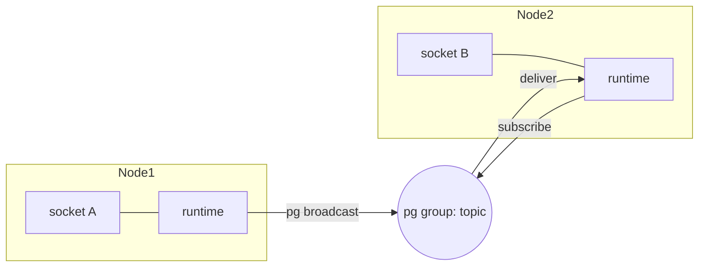

## Foundation

Beryl's PubSub layer is built on Erlang's built-in [`pg`](https://www.erlang.org/doc/man/pg.html) module (process groups). When a process subscribes to a topic, it joins a named `pg` group scoped to the PubSub instance. When a broadcast is sent, beryl looks up all members of that group and delivers the message to each one.

Because `pg` is cluster-aware, this works transparently across nodes in an Erlang cluster: a process on Node A subscribing to `"room:lobby"` will receive broadcasts from Node B without any additional configuration.

Each PubSub instance is identified and isolated by a **scope** (an Erlang
atom). The default scope is `beryl_pubsub`; use `config_with_scope/1` to create
isolated namespaces. Different scopes can safely carry different payload types
into one process mailbox; all handles for one scope must use the same payload
type.

## The FFI Boundary

The Gleam module `beryl/pubsub` delegates all low-level pg operations to `src/beryl_pubsub_ffi.erl` via `@external` declarations. The FFI file is intentionally minimal: a thin wrapper that maps Gleam calls directly to `pg` BIFs.

**Public surface of `beryl/pubsub`:**

| Function | Description |
|---|---|
| `start(config)` | Start a pg scope (idempotent, safe to call multiple times) |
| `subscriber(ps)` | Create a typed subscriber owned by the calling process |
| `join(subscriber, topic)` | Join the subscriber to a topic |
| `leave(subscriber, topic)` | Leave a previously joined topic |
| `selecting(selector, subscriber, transform)` | Match scope-tagged four-field messages and fold them into an actor selector |
| `broadcast(ps, topic, event, payload)` | Deliver to all subscribers on all nodes |
| `broadcast_from(ps, from, topic, event, payload)` | Deliver to all subscribers **except** `from` pid |
| `broadcast_from_socket(ps, from, except_socket_id, topic, event, payload)` | Deliver to all subscribers except `from`, carrying a socket exclusion hint |
| `local_broadcast(ps, topic, event, payload)` | Deliver to local-node subscribers only |
| `subscribers(ps, topic)` | Return all subscriber pids (all nodes) |
| `subscriber_count(ps, topic)` | Return subscriber count (all nodes) |

Broadcasts are sent raw through `pg` as the scope atom followed by the four
`Message(payload)` fields (`topic`, `event`, `payload`, `from`). This
five-element tuple is a frozen wire contract. The scoped and previously
unscoped shapes do not interoperate during a rolling upgrade; applications
must also version payload-shape changes that cross nodes.

The `PubSubFrom` type tags each message with its origin so downstream receivers can inspect whether a message came from the system, a specific process, or a process with an associated socket:

```gleam
pub type PubSubFrom {
  System
  FromPid(Pid)
  FromSocket(Pid, String)
}
```

## Exclusion Semantics

`broadcast_from` and `broadcast_from_socket` implement **sender exclusion**: the originating process does not receive its own broadcast. This prevents a runtime from echoing a message back to the socket that sent it.

- `broadcast_from(ps, from, ...)` skips delivery to the process whose `Pid` matches `from`.
- `broadcast_from_socket(ps, from, except_socket_id, ...)` also skips delivery to `from`, and carries `FromSocket(from, except_socket_id)` in the message so that any remote runtime receiving it can optionally suppress re-delivery to a matching socket ID on their node.

:::caution[Regression-prone contract]
The exclusion behaviour is load-bearing for channel correctness. If the comparison `pid == from` is ever changed or skipped, senders will receive their own messages. Tests that cover `broadcast_from` exclusion must be preserved when refactoring the PubSub layer.
:::

## Distribution Diagram



When socket A sends a message on Node 1, its runtime calls `broadcast_from`, which iterates the `pg` group members. Members on Node 2 receive the message via Erlang distribution; no extra message-bus infrastructure is required.

## Trust Model

All traffic arriving over Erlang distribution is treated as **fully trusted
cluster input**. A peer can execute arbitrary code on connected nodes; the
beryl-specific capabilities below are only a subset of that access. Network
isolation and mutually verified TLS distribution enforce the security
boundary. Erlang cookies prevent accidental cross-cluster connections but are
not cryptographically secure peer authentication.

A process on any peer node can:

- Subscribe to any `pg` group (PubSub topic) and receive all broadcasts.
- Inject messages that downstream runtimes will process as legitimate
  internal traffic.
- Inject reserved presence sync traffic, delivering false presence state to
  subscribers on all nodes. Ordinary WebSocket clients cannot reach these
  reserved internal topics; this vector is exclusive to trusted cluster peers.

**App-level authorization** (the `Join` and `Message` arms of `update`)
applies only to inbound WebSocket frames. It does not screen messages that
arrive via distribution.

Refer to the [Production Hardening guide](/guides/production-hardening/#erlang-cluster-security-boundary)
for the full cluster security requirements (network isolation, mutually
verified TLS distribution, EPMD port restrictions, and cookie handling).

## Where this lives

| File | Role |
|---|---|
| `src/beryl/pubsub.gleam` | Public Gleam API: types, config, and all broadcast functions |
| `src/beryl_pubsub_ffi.erl` | Erlang FFI: thin `pg` wrappers called via `@external` |
