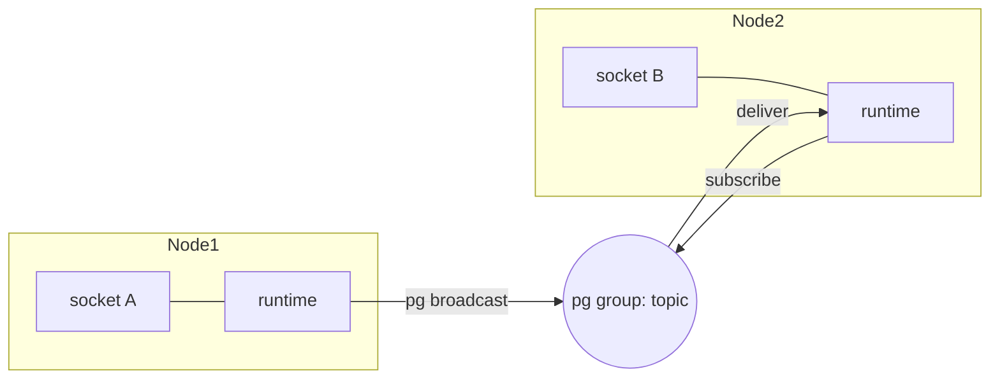

## How distribution works

beryl's PubSub layer uses Erlang's
[`pg`](https://www.erlang.org/doc/man/pg.html) process groups. A subscriber
joins a named `pg` group in the PubSub scope. For each broadcast, beryl finds
the group members and sends the message to them.

Erlang `pg` works across connected cluster nodes. A process on Node A can
subscribe to `"room:lobby"` and receive broadcasts from Node B.

Each PubSub instance is identified and isolated by a **scope** (an Erlang
atom). The default scope is `beryl_pubsub`; use `config_with_scope/1` to create
isolated namespaces. Different scopes can safely carry different payload types
into one process mailbox; all handles for one scope must use the same payload
type.

Generic PubSub sends bypass local admission before receipt. They can grow a
subscriber mailbox, including a beryl runtime or presence mailbox. Runtime
fan-out from those messages still reserves each destination socket's capacity.
See [overload boundaries](/guides/overload/#memory-boundaries).

## How beryl manages Erlang `pg`

The Gleam module `beryl/pubsub` uses a typed membership actor in
`beryl/pubsub_memberships`. The actor owns local membership intent and restores
live memberships after the scoped `pg` process restarts.

`beryl/pubsub_native` contains typed wrappers for member queries and raw sends.
A small Erlang boundary starts the node-owned supervision tree, adapts actor
startup to OTP child specifications, and converts failing `pg` mutations into
typed errors.

| Function | Description |
|---|---|
| `start(config)` | Start a pg scope (idempotent, safe to call multiple times) |
| `subscriber(ps)` | Create a typed subscriber owned by the calling process |
| `join(subscriber, topic)` | Join the subscriber to a topic |
| `leave(subscriber, topic)` | Leave a previously joined topic |
| `selecting(selector, subscriber, transform)` | Match scope-tagged four-field messages and fold them into an actor selector |
| `broadcast(ps, topic, event, payload)` | Deliver to all subscribers on all nodes |
| `broadcast_from(ps, from, topic, event, payload)` | Deliver to all subscribers **except** `from` pid |
| `broadcast_from_socket(ps, from, except_socket_id, topic, event, payload)` | Deliver to all subscribers except `from`, carrying a socket exclusion hint |
| `local_broadcast(ps, topic, event, payload)` | Deliver to local-node subscribers only |
| `subscribers(ps, topic)` | Return all subscriber pids (all nodes) |
| `subscriber_count(ps, topic)` | Return subscriber count (all nodes) |

`pg` sends each broadcast as the scope atom followed by the four
`Message(payload)` fields (`topic`, `event`, `payload`, `from`). This
five-element tuple is a fixed message format between nodes. Nodes that use the
old four-element format cannot communicate with nodes that use the current
format during an upgrade. Applications must also version payload changes that
cross nodes.

The `PubSubFrom` type tags each message with its origin so downstream receivers can inspect whether a message came from the system, a specific process, or a process with an associated socket:

```gleam
pub type PubSubFrom {
  System
  FromPid(Pid)
  FromSocket(Pid, String)
}
```

## Exclude the sender

`broadcast_from` and `broadcast_from_socket` exclude the sender. The source
process does not receive its broadcast. This prevents an echo to the source
socket.

- `broadcast_from(ps, from, ...)` skips delivery to the process whose `Pid` matches `from`.
- `broadcast_from_socket(ps, from, except_socket_id, ...)` also skips delivery to `from`, and includes `FromSocket(from, except_socket_id)` in the message so that any remote runtime receiving it can optionally suppress re-delivery to a matching socket ID on their node.

:::caution[Keep sender-exclusion tests]
Channel behavior depends on sender exclusion. If code changes or skips the
`pid == from` comparison, senders receive their own messages. Keep the
`broadcast_from` exclusion tests when you change PubSub code.
:::

## Cross-node example



When socket A sends a message on Node 1, its runtime calls `broadcast_from`.
The function iterates through the `pg` group members. Erlang distribution sends
the message to members on Node 2. You do not need another message bus.

## Secure cluster connections

Configure network isolation and mutually verified TLS before enabling Erlang
distribution, even on a single node or in development. These requirements
apply whether or not the node runs beryl.

Treat all Erlang distribution traffic as **trusted cluster input**. A peer can
run arbitrary code on connected nodes. The beryl capabilities below are only
part of that access. Use network isolation and mutual TLS verification for the
security boundary. Erlang cookies prevent accidental cluster connections, but
they do not provide secure peer authentication.

A process on any peer node can:

- Subscribe to any `pg` group (PubSub topic) and receive all broadcasts.
- Inject messages that downstream runtimes will process as legitimate
  internal traffic.
- Inject reserved presence sync traffic, delivering false presence state to
  subscribers on all nodes. Ordinary WebSocket clients cannot reach these
  reserved internal topics; this vector is exclusive to trusted cluster peers.

**App-level authorization** (the `Join` and `Message` arms of `update`)
applies only to inbound WebSocket frames. It does not screen messages that
arrive via distribution.

Refer to the [deployment hardening guide](/guides/production-hardening/#erlang-cluster-security-boundary)
for the full cluster security requirements (network isolation, mutually
verified TLS distribution, EPMD port restrictions, and cookie handling).

## Source files

| File | Role |
|---|---|
| `src/beryl/pubsub.gleam` | Public Gleam API: types, config, and all broadcast functions |
| `src/beryl/pubsub_memberships.gleam` | Typed actor: local membership intent, owner monitors, and `pg` recovery |
| `src/beryl/pubsub_native.gleam` | Internal typed member-query and raw-send wrappers |
| `src/beryl_pubsub_supervisor.erl` | Node-owned root and per-scope OTP supervision |
| `src/beryl_pubsub_ffi.erl` | Small startup, subject, and failure-conversion adapters |
