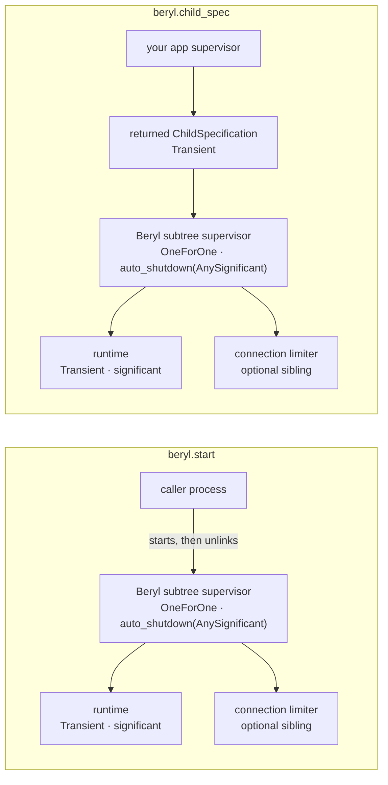

The runtime is the single OTP actor behind a Beryl app-side dispatch system. One runtime tracks every connected socket for a `Sockets` handle, delivers `Join`/`Message`/`Binary`/`Closed`/`Info` events to your app's `update`, and applies the returned `Effect` list itself.

## Role

A runtime owns the node-local state for one Beryl app instance:

- connected sockets and their send/close functions
- each socket's current app `model`
- joined topics, join refs, and pending reply refs
- heartbeat timestamps and rate-limit buckets
- PubSub topic membership for local subscribers
- presence refs created by `PresenceTrack`

When a transport announces a new socket, the runtime calls your `init` once with `ConnectInfo`. After that, every decoded inbound frame becomes an `Input` delivered to `update`.

## Dispatch contract

`Join` events are fail-closed: your `update` must answer them with `AcceptJoin(ref, ...)` or `RejectJoin(ref, ...)` in the returned effects list. If a join finishes the turn unanswered, the runtime rejects it automatically.

`Closed(topic, reason)` is the runtime's topic teardown signal. It is delivered on client leave, socket disconnect, heartbeat eviction, `KickTopic`, and graceful shutdown, so apps can clean up topic-scoped model state in one place.

## Effect ordering

Effects are applied strictly in list order inside one actor turn. Because the same actor both interprets the list and writes frames for that socket, list order is wire order.

That guarantee is load-bearing. For example, `AcceptJoin(ref, ...)` followed by `Push(topic, event, payload)` sends the join reply first and the push second.

## Supervision shapes

`beryl.start` and `beryl.child_spec` build the same nested Beryl subtree. The only difference is who owns that subtree.

In standalone mode, `start` explicitly unlinks the caller from the subtree supervisor after startup so the subtree's normal auto-shutdown does not propagate back into the caller process. In embedded mode, `child_spec` returns the subtree as an OTP child spec for your own supervisor to own.

## Owned vs borrowed processes

| Beryl owns and stops | Your app owns and stops |
|---|---|
| runtime | `PubSub` started separately and attached with `beryl.with_pubsub` |
| optional connection limiter | presence actor started separately and attached with `beryl.with_presence_handle` |
| — | `beryl/group` actors started separately with `group.start` / `group.start_named` |

The subtree supervisor exists only to supervise the runtime and optional limiter. PubSub, presence, and groups are borrowed application resources, not children of the Beryl subtree.

## Crash and restart behavior

There is no unsupervised runtime. Both entry points run the runtime as the subtree's `Transient` significant child under restart tolerance `3` in `5` seconds.

On a runtime crash, the supervisor restarts a fresh runtime under the same registered name. The stable `Sockets` handle still points at that name, so new connections and future broadcasts work again after the restart window.

What is lost on crash:

- every joined socket's current `model`
- topic membership and join refs
- pending reply refs
- heartbeat timestamps and rate-limit buckets
- registered per-socket closer callbacks

Existing WebSocket connections are not preserved across that restart. The transport connection process monitors the runtime pid via `beryl/transport.runtime_pid` and closes the socket when the owning runtime goes down, rather than leaving a zombie connection attached to an empty replacement runtime.

Before startup, during a restart window, or after shutdown, the name-backed `Sockets` handle degrades safely: fire-and-forget operations are quiet no-ops and connection admission is refused cleanly instead of crashing.

## Stopping

`beryl.stop(sockets)` drains the Beryl subtree only.

- It delivers `Closed(..., Shutdown)` to every joined topic.
- It cleans up tracked presence for closing topics and sockets.
- It sends terminal frames and closes transport connections.
- It waits for the runtime and optional limiter processes to go `Down` before returning.

It does **not** stop your app's root supervisor, sibling children, PubSub instance, presence actor, or group actors. Calling `stop` again returns `Error(NotRunning)`. If the drain does not acknowledge within 5000 ms, it returns `Error(StopTimeout)`.

## Where this lives

- `packages/beryl/src/beryl.gleam` — public lifecycle and handle surface: `start`, `child_spec`, `stop`, `build_app_subtree`, `start_app_supervisor`, `app_handle`
- `packages/beryl/src/beryl/runtime.gleam` — internal runtime actor: socket connect/disconnect, inbound dispatch, heartbeat checks, topic teardown, effect interpretation
