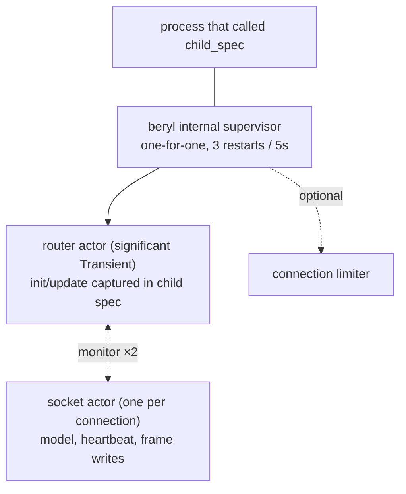

The runtime is a pair of roles built from one OTP actor implementation: a **router** in front of **one actor per connected socket**. Transports send admitted, decoded frames to the router, which forwards each one to the owning socket's actor; your application's `init`/`update` functions run inside that socket's own actor. Presence and groups are independent application-owned supervised children; PubSub is an Erlang `pg` wrapper rather than a child of the runtime.

## Role

Each socket actor is the single source of truth for its socket: the app model, the wire-send functions, its joined topics, and its heartbeat timestamp. It processes its mailbox sequentially, which serializes that socket's `update` calls and frame writes without locks — and because each socket has its own actor, one socket's slow callback never stalls another's. The router owns what is genuinely global: admission, the topic → subscriber index used for broadcast fan-out, the PubSub subscription, and stats. Its turn is a match-and-forward, never an app callback. Transport connection processes still own edge concerns such as WebSocket state, frame limits, decoding, and the local message-rate bucket; the model returned by `update` is the app state the next event sees.

## What it tracks

A socket actor maintains, for its one socket:

- **The app model** — the app-defined `model` value produced by `init` and threaded through every `update` call.
- **Socket tracking** — the socket's wire-send functions (text and binary), its closer, and the set of topics it has joined (including joins awaiting an `AcceptJoin`/`RejectJoin` answer).
- **Heartbeat last-seen** — a monotonic timestamp, updated on every received heartbeat frame; checked by the actor's own recurring timer.

The router maintains:

- **Topic → subscriber sets** — maps each active topic string to the set of socket IDs currently joined on it, used for broadcast fan-out. Updated by cast from the socket actors as they join and leave.
- **The actor table** — socket ID → socket actor, with a monitor per actor so a crashed actor's entries are swept rather than leaked.

## Typed dispatch without erasure

The runtime actor is generic over the app's `model` and `msg` types. `beryl.child_spec` captures those types in a record of monomorphic closures at construction time, so the public `Sockets` handle — and the frame-level transport SPI behind it — stays unparameterized while the runtime holds fully typed state. This is plain closure capture by a generic function: there are no unchecked casts, `Dynamic` round-trips, or identity FFI in the socket-dispatch path. PubSub separately validates the frozen raw mailbox record before its package-internal payload coercion.

Server-side messages work the same way: `init` receives a typed `Sender(msg)` whose closure captures the message type, and `socket.notify` delivers messages that arrive in `update` as `Info(msg)` — an ordinary typed send.

`channel.child_spec` uses this same mechanism. Its generic router
captures each handler's private state and server-message type in closures,
while the socket-level message is a sealed, generation-stamped envelope.
The envelope's topic and generation are checked before the typed value is
opened, so stale mail cannot reach a later join.

## Input dispatch

Inbound WebSocket frames follow a two-step path:

1. **Decode at the edge** — the transport decodes raw frames in the connection process using the configured codec (see [Wire & Transport](/architecture/wire-and-transport)), so parse cost and malformed input never reach the runtime.
2. **Route to update** — the decoded message is sent to the router, which forwards it to the socket's actor; the actor turns it into an `Input` for the socket's `update` function:
   - `phx_join` → validates the topic (length, control characters, reserved `beryl:` prefix, join rate, topic cap), then delivers `Join(topic, payload, ref)`. The join is held pending until the update's effects answer it; an unanswered join is rejected (fail closed).
   - Any other event on a joined topic → `Message(topic, event, payload, ref)`.
   - `heartbeat` → answered directly by the socket actor; the app never sees it.
   - `phx_leave` → acks the leave, then delivers `Closed(topic, Normal)`.
   - Binary frames → decoded through the codec's binary decoder when present and routed with binary message classification; otherwise delivered raw as `Binary(topic, data)` to each joined topic.

## Effect ordering

Effects are applied strictly in list order. Because the socket's own actor interprets the list and writes that socket's frames, list order is wire order; an `AcceptJoin` is guaranteed to reach the wire before a `Push` later in the same list. A `Broadcast` effect routes through the router (which resolves the subscriber set and hands each recipient's actor its own copy to encode), but the originating socket delivers its own copy inline first, so the broadcast still lands in effect-list order on its own wire.

Most lists are applied in a single actor turn. `PresenceTrack` and `PresenceUntrack` are applied by the presence actor instead, so the socket actor holds the rest of that socket's list — and queues that socket's later inbound messages — until the mutation is acknowledged, then resumes exactly where it left off. Ordering for the socket is unchanged; what changes is that only that socket waits. Every other socket, broadcast, heartbeat check, and shutdown keeps being processed, which also means an unrelated broadcast can land between two of the waiting socket's effects.

## Crash containment

Crashes in app callbacks are rescued rather than allowed to take down the socket's actor. The blast radius is scoped to what crashed: a crashing `Join` is rejected; a crashing topic-scoped `Message` or `Binary` closes only that topic; a crashing `Info` tears down the whole socket because it has no topic to attribute; a crashing `Closed` is logged while teardown continues; and a crashing `init` leaves the socket unregistered. Crash descriptions are depth-limited and truncated before logging. Other sockets remain isolated.

This is a deliberate trade-off with OTP's usual "let it crash" model. Even
with per-socket actors, letting an app callback crash reach the actor would
widen the blast radius from the crashed scope (one topic, one join) to the
whole socket — every joined topic torn down and the connection closed for a
fault one topic's handler caused. Beryl uses a crash boundary only where it
can discard the callback result and reject or tear down the narrowest
affected scope; it never continues with a partial result. Faults outside
those explicit boundaries still crash the socket's actor — which the router's
monitor sweeps, closing only that socket — and faults in the router itself
invoke supervision.

For the channel layer, those scopes map to `join`, `on_message` /
`on_binary`, `on_info`, and `on_terminate`. A terminate panic discards that
router update, so its actions are lost and the old instance remains reachable
only through its own typed sender until rejoin or socket teardown. Core still
finishes closing the topic and continues closing sibling channels.

## Heartbeat enforcement

Each socket actor schedules its own recurring self-check at `heartbeat_timeout_ms / 2` — there is no global sweep. On each check it compares the current monotonic time to its socket's `last_heartbeat` and evicts the socket if it is past the timeout. Eviction delivers `Closed(topic, HeartbeatTimeout)` for each joined topic, invokes the transport's registered closer so the underlying connection is actually shut, and removes the socket from all state. `child_spec` rejects timeouts below 2 loudly, because integer division would otherwise round the check interval to zero and silently disable eviction.

## Supervision

`child_spec` has no unsupervised mode. The router always starts under an internal one-for-one supervisor with a **3 restarts / 5 seconds** tolerance. Socket actors are not supervisor children: each is started by the transport's connection process at admission, monitored by the router (a crashed actor's entries are swept, closing only that socket), and monitors the router in return, stopping on its `Down`:

- The `init`/`update` closures live in the child specification, so a restart resumes dispatch immediately — there is no registration step to replay.
- The router is registered under a stable name; the `Sockets` handle keeps working across restarts, and sends during a restart window degrade to quiet no-ops.
- Router death takes the socket population with it: every socket actor stops on the router's `Down`, and the transports — which monitor the same pid — close the connections. A restart therefore starts with no sockets; clients rejoin exactly as they would after any server restart.
- The child is `Transient`, so a graceful `beryl.stop` is final. A stop drains socket actors in two phases (settle in-flight presence work while every watcher is still alive, then tear down), and kills any straggler stuck in an app callback rather than abandoning it.

PubSub is **not** part of this tree; it is backed by Erlang's `pg` module, which manages its own lifecycle. Presence and groups expose their own child specifications for the application's supervision tree (see the [Supervision guide](/guides/supervision/)).

## Where this lives

- `src/beryl/runtime.gleam` — the router and socket-actor roles of one actor implementation: socket/model tracking, event dispatch, the effect interpreter, per-socket heartbeat timers, crash rescue, admission, and the drain.
- `src/beryl.gleam` — `child_spec`, the supervised child specification, and the monomorphic closure record over the generic runtime (including the transport-side socket-actor start).
