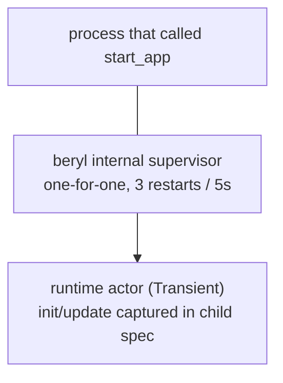

The runtime is the central OTP actor that owns all per-socket state. Every other part of the system — the transport layer, presence, groups, and PubSub — communicates with it by sending messages, while your application's `init`/`update` functions run inside it during event dispatch.

## Role

The runtime is the single source of truth for connected sockets, per-socket models, topic subscriptions, and heartbeat timestamps. It processes its mailbox sequentially, which gives it a consistent view of all concurrent activity without locks. No socket state lives outside the runtime; your `update` function runs inside it, and the model it returns is the state the next event sees.

## What it tracks

The runtime maintains four categories of state:

- **Per-socket models** — the app-defined `model` value produced by `init` and threaded through every `update` call for that socket.
- **Socket tracking** — each connected socket's ID, its wire-send functions (text and binary), its closer, and the set of topics it has joined (including joins awaiting an `AcceptJoin`/`RejectJoin` answer).
- **Topic → subscriber sets** — maps each active topic string to the set of socket IDs currently joined on it, used for broadcast fan-out.
- **Heartbeat last-seen** — a monotonic timestamp per socket, updated on every received heartbeat frame; used by the periodic eviction check.

## Typed dispatch without erasure

The runtime actor is generic over the app's `model` and `msg` types. `beryl.start_app` captures those types in a record of monomorphic closures at start time, so the public `Channels` handle — and the frame-level transport SPI behind it — stays unparameterized while the runtime holds fully typed state. This is plain closure capture by a generic function: there are no unchecked casts, no `Dynamic` round-trips, and no identity FFI anywhere in the dispatch path.

Server-side messages work the same way: `init` receives a typed `Sender(msg)` whose closure captures the message type, and `event.notify` delivers messages that arrive in `update` as `Info(msg)` — an ordinary typed send.

## Event dispatch

Inbound WebSocket frames follow a two-step path:

1. **Decode at the edge** — the transport decodes raw frames in the connection process using the configured codec (see [Wire & Transport](/architecture/wire-and-transport)), so parse cost and malformed input never reach the shared runtime actor.
2. **Route to update** — the decoded message is sent to the runtime, which turns it into an `Event` for the socket's `update` function:
   - `phx_join` → validates the topic (length, control characters, reserved `beryl:` prefix, join rate, topic cap), then delivers `Join(topic, payload, ref)`. The join is held pending until the update's effects answer it; an unanswered join is rejected (fail closed).
   - Any other event on a joined topic → `Message(topic, event, payload, ref)`.
   - `heartbeat` → answered directly by the runtime; the app never sees it.
   - `phx_leave` → acks the leave, then delivers `Closed(topic, Normal)`.
   - Binary frames → decoded through the codec's binary decoder when present; otherwise delivered raw as `Binary(topic, data)` to each joined topic.

Effects returned by `update` are applied in list order; an `AcceptJoin` is guaranteed to reach the wire before a `Push` later in the same list.

## Crash containment

Crashes in app callbacks are rescued rather than allowed to take down the shared runtime. The blast radius is scoped to what crashed: a crashing `Join` update rejects the join, a crashing `Message` update closes only that topic, and a crashing `init` leaves the socket unregistered. Crash descriptions are depth-limited and truncated before logging.

## Heartbeat enforcement

The runtime schedules a recurring self-check at `heartbeat_timeout_ms / 2`. On each check it compares the current monotonic time to each socket's `last_heartbeat` and evicts any socket past the timeout. Eviction delivers `Closed(topic, HeartbeatTimeout)` for each joined topic, invokes the transport's registered closer so the underlying connection is actually shut, and removes the socket from all state. `start_app` rejects timeouts below 2 loudly, because integer division would otherwise round the check interval to zero and silently disable eviction.

## Supervision

`start_app` has no unsupervised mode. The runtime always starts under an internal one-for-one supervisor with a **3 restarts / 5 seconds** tolerance:

- The `init`/`update` closures live in the child specification, so a restart resumes dispatch immediately — there is no registration step to replay.
- The runtime is registered under a stable name; the `Channels` handle keeps working across restarts, and sends during a restart window degrade to quiet no-ops.
- A restart drops per-socket state (models, joined topics); clients rejoin exactly as they would after any server restart.
- The child is `Transient`, so a graceful `beryl.stop` is final.

PubSub is **not** part of this tree; it is backed by Erlang's `pg` module, which manages its own lifecycle. Presence and groups are independent actors started by the application (see the [Supervision guide](/guides/supervision/)).

## Where this lives

- `src/beryl/runtime.gleam` — the runtime actor: socket/model tracking, event dispatch, the effect interpreter, heartbeat timer, crash rescue.
- `src/beryl.gleam` — `start_app`, the supervised child specification, and the monomorphic closure record over the generic runtime.
