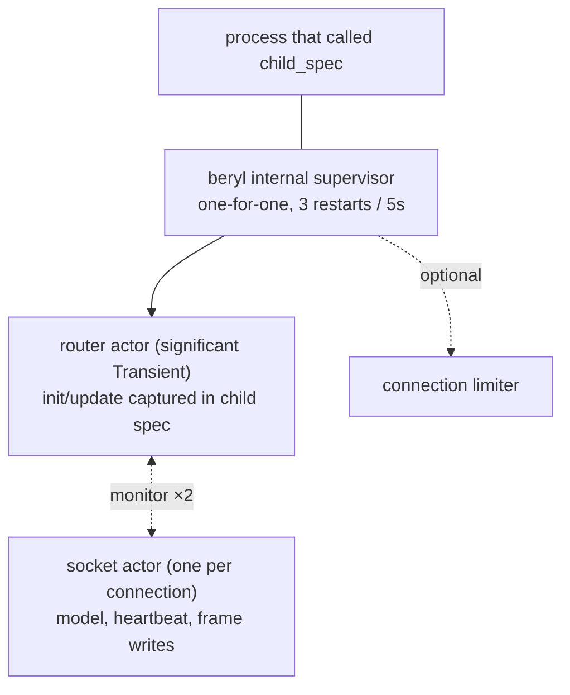

The runtime uses one router actor and one actor for each connected socket.
Transports send admitted, decoded frames to the router. The router sends each
frame to the actor that owns the socket. Your application's `init` and `update`
functions run in that socket actor. The application owns separate supervised
children for presence and groups. PubSub wraps Erlang `pg` and is not a runtime
child.

## Role

Each socket actor stores the app model, wire-send functions, joined topics, and
heartbeat time for one socket. It processes mailbox messages in sequence. This
serializes that socket's `update` calls and frame writes without locks. A slow
callback for one socket does not stop other sockets.

The router manages admission, the topic subscriber index, the PubSub
subscription, and stats. It only matches and forwards messages. It does not run
app callbacks. Transport connection processes manage WebSocket state, frame
limits, decoding, and the local message-rate bucket. The next event uses the
model returned by `update`.

## What it tracks

A socket actor maintains, for its one socket:

- **The app model** — the app-defined `model` value produced by `init` and threaded through every `update` call.
- **Socket tracking** — the socket's wire-send functions (text and binary), its closer, and the set of topics it has joined (including joins awaiting an `AcceptJoin`/`RejectJoin` answer).
- **Heartbeat last-seen** — a monotonic timestamp, updated on every received heartbeat frame; checked by the actor's own recurring timer.

The router maintains:

- **Topic → subscriber sets** — maps each active topic string to the set of socket IDs currently joined on it, used for broadcast fan-out. Updated by cast from the socket actors as they join and leave.
- **The actor table** — socket ID → socket actor, with a monitor per actor so a crashed actor's entries are swept rather than leaked.

## Typed dispatch without erasure

The runtime actor is generic over the app's `model` and `msg` types.
`beryl.child_spec` captures those types in monomorphic closures. The public
`Sockets` handle and transport SPI do not need type parameters. The runtime
still keeps typed state. This path uses no unchecked casts, `Dynamic`
round-trips, or identity FFI. PubSub validates its raw mailbox record before
its internal payload coercion.

Server-side messages work the same way: `init` receives a typed `Sender(msg)` whose closure captures the message type, and `socket.notify` delivers messages that arrive in `update` as `Info(msg)` — an ordinary typed send.

`channel.child_spec` uses this same mechanism. Its generic router
captures each handler's private state and server-message type in closures,
while the socket-level message is a sealed, generation-stamped envelope.
The envelope's topic and generation are checked before the typed value is
opened, so stale mail cannot reach a later join.

## Input dispatch

Inbound WebSocket frames follow a two-step path:

1. **Decode at the edge** — the transport decodes raw frames in the connection process using the configured codec (see [Wire & Transport](/architecture/wire-and-transport)), so parse cost and malformed input never reach the runtime.
2. **Route to update** — the decoded message is sent to the router, which forwards it to the socket's actor; the actor turns it into an `Input` for the socket's `update` function:
   - `phx_join` → validates the topic (length, control characters, reserved `beryl:` prefix, join rate, topic cap), then delivers `Join(topic, payload, ref)`. The join is held pending until the update's effects answer it; an unanswered join is rejected (fail closed).
   - Any other event on a joined topic → `Message(topic, event, payload, ref)`.
   - `heartbeat` → answered directly by the socket actor; the app never sees it.
   - `phx_leave` → acks the leave, then delivers `Closed(topic, Normal)`.
   - Binary frames → decoded through the codec's binary decoder when present and routed with binary message classification; otherwise delivered raw as `Binary(topic, data)` to each joined topic.

## Effect ordering

The runtime applies effects in list order. The same actor interprets the list
and writes the frames. Thus, list order is wire order. An `AcceptJoin` reaches
the wire before a later `Push`. A `Broadcast` goes through the router, which
sends a copy to each recipient actor. The source socket writes its own copy
first, so the broadcast keeps its effect-list position on that socket's wire.

The socket actor applies most lists in one turn. The presence actor applies
`PresenceTrack` and `PresenceUntrack`. The runtime pauses the rest of that
socket's list until the presence actor responds. It also queues later input for
that socket. Then it resumes at the next effect. The socket keeps its effect
order. Other sockets, broadcasts, heartbeat checks, and shutdown work continue.
An unrelated broadcast can occur between two effects from the paused socket.

## Crash containment

The runtime catches crashes in app callbacks. A `Join` crash rejects that join.
A topic `Message` or `Binary` crash closes only that topic. An `Info` crash
closes the socket because the message has no topic. A `Closed` crash is logged,
and teardown continues. An `init` crash prevents socket registration. The
runtime limits and truncates crash descriptions before logging. Other sockets
continue.

This is a deliberate trade-off with OTP's usual "let it crash" model. Even
with per-socket actors, letting an app callback crash reach the actor would
widen the blast radius from the crashed scope (one topic, one join) to the
whole socket — every joined topic torn down and the connection closed for a
fault one topic's handler caused. Beryl uses a crash boundary only where it
can discard the callback result and reject or tear down the narrowest
affected scope; it never continues with a partial result. Faults outside
those explicit boundaries still crash the socket's actor — which the router's
monitor sweeps, closing only that socket — and faults in the router itself
invoke supervision.

For the channel layer, those scopes map to `join`, `on_message` /
`on_binary`, `on_info`, and `on_terminate`. A terminate panic discards that
router update, so its actions are lost and the old instance remains reachable
only through its own typed sender until rejoin or socket teardown. Core still
finishes closing the topic and continues closing sibling channels.

## Heartbeat enforcement

Each socket actor checks its heartbeat every `heartbeat_timeout_ms / 2`. There
is no global sweep. The actor compares the current monotonic time with its
socket's `last_heartbeat`. It removes the socket when it exceeds the timeout.
Removal sends
`Closed(topic, HeartbeatTimeout)` for each joined topic. It also calls the
transport closer and removes all socket state. `child_spec` rejects timeouts
below 2 because integer division would set the check interval to zero.

## Supervision

`child_spec` has no unsupervised mode. The router always starts under an internal one-for-one supervisor with a **3 restarts / 5 seconds** tolerance. Socket actors are not supervisor children: each is started by the transport's connection process at admission, monitored by the router (a crashed actor's entries are swept, closing only that socket), and monitors the router in return, stopping on its `Down`:

- The child specification contains the `init` and `update` closures. A restart
  resumes dispatch without a registration step.
- The router uses a stable registered name. The `Sockets` handle works after a
  restart. Sends during the restart window do nothing.
- Router death stops all socket actors. The transports also monitor the router
  and close their connections. A restart starts with no sockets, so clients
  must rejoin.
- The child is `Transient`, so a graceful `beryl.stop` is final. A stop first
  completes in-flight presence work, then stops the socket actors. It kills an
  actor that remains blocked in an app callback.

PubSub is **not** part of this tree. Erlang `pg` manages its lifecycle.
Presence and groups provide child specifications for the application
supervision tree. See the [Supervision guide](/guides/supervision/).

## Where this lives

- `src/beryl/runtime.gleam` — the router and socket-actor roles of one actor implementation: socket/model tracking, event dispatch, the effect interpreter, per-socket heartbeat timers, crash rescue, admission, and the drain.
- `src/beryl.gleam` — `child_spec`, the supervised child specification, and the monomorphic closure record over the generic runtime (including the transport-side socket-actor start).
