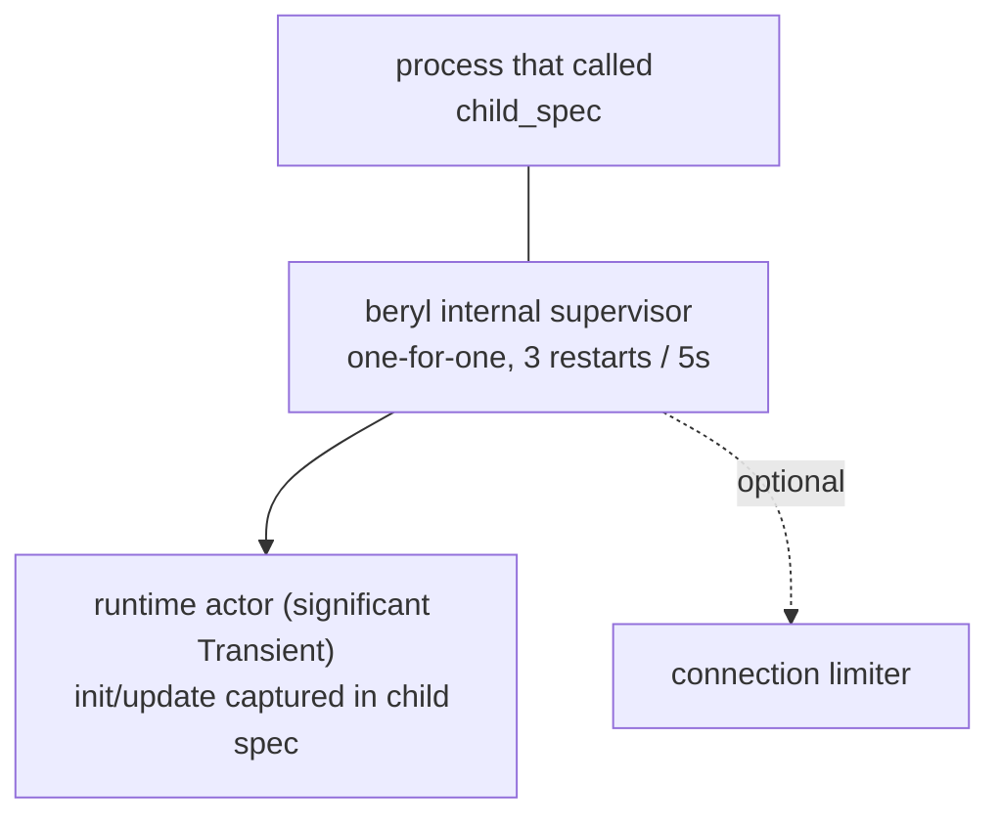

The runtime is the main OTP actor for socket dispatch. Transports send admitted
and decoded frames to it. The runtime calls your application's `init` and
`update` functions for each event. The application owns separate supervised
children for presence and groups. PubSub wraps Erlang `pg` and is not a runtime
child.

## Role

The runtime stores connected socket IDs, app models, topic subscriptions, and
heartbeat times. It processes mailbox messages in sequence. This gives it a
consistent view without locks. Transport connection processes manage WebSocket
state, frame limits, decoding, and the local message-rate bucket. The next event
uses the model returned by `update`.

## What it tracks

The runtime maintains four categories of state:

- **Per-socket models** — the app-defined `model` value produced by `init` and threaded through every `update` call for that socket.
- **Socket tracking** — each connected socket's ID, its wire-send functions (text and binary), its closer, and the set of topics it has joined (including joins awaiting an `AcceptJoin`/`RejectJoin` answer).
- **Topic → subscriber sets** — maps each active topic string to the set of socket IDs currently joined on it, used for broadcast fan-out.
- **Heartbeat last-seen** — a monotonic timestamp per socket, updated on every received heartbeat frame; used by the periodic eviction check.

## Typed dispatch without erasure

The runtime actor is generic over the app's `model` and `msg` types.
`beryl.child_spec` captures those types in monomorphic closures. The public
`Sockets` handle and transport SPI do not need type parameters. The runtime
still keeps typed state. This path uses no unchecked casts, `Dynamic`
round-trips, or identity FFI. PubSub validates its raw mailbox record before
its internal payload coercion.

Server-side messages work the same way: `init` receives a typed `Sender(msg)` whose closure captures the message type, and `socket.notify` delivers messages that arrive in `update` as `Info(msg)` — an ordinary typed send.

`channel.child_spec` uses this same mechanism. Its generic router
captures each handler's private state and server-message type in closures,
while the socket-level message is a sealed, generation-stamped envelope.
The envelope's topic and generation are checked before the typed value is
opened, so stale mail cannot reach a later join.

## Input dispatch

Inbound WebSocket frames follow a two-step path:

1. **Decode at the edge** — the transport decodes raw frames in the connection process using the configured codec (see [Wire & Transport](/architecture/wire-and-transport)), so parse cost and malformed input never reach the shared runtime actor.
2. **Route to update** — the decoded message is sent to the runtime, which turns it into an `Input` for the socket's `update` function:
   - `phx_join` → validates the topic (length, control characters, reserved `beryl:` prefix, join rate, topic cap), then delivers `Join(topic, payload, ref)`. The join is held pending until the update's effects answer it; an unanswered join is rejected (fail closed).
   - Any other event on a joined topic → `Message(topic, event, payload, ref)`.
   - `heartbeat` → answered directly by the runtime; the app never sees it.
   - `phx_leave` → acks the leave, then delivers `Closed(topic, Normal)`.
   - Binary frames → decoded through the codec's binary decoder when present and routed with binary message classification; otherwise delivered raw as `Binary(topic, data)` to each joined topic.

## Effect ordering

The runtime applies effects in list order. The same actor interprets the list
and writes the frames. Thus, list order is wire order. An `AcceptJoin` reaches
the wire before a later `Push`.

The runtime applies most lists in one actor turn. The presence actor applies
`PresenceTrack` and `PresenceUntrack`. The runtime pauses the rest of that
socket's list until the presence actor responds. It also queues later input for
that socket. Then it resumes at the next effect. The socket keeps its effect
order. Other sockets, broadcasts, heartbeat checks, and shutdown work continue.
An unrelated broadcast can occur between two effects from the paused socket.

## Crash containment

The runtime catches crashes in app callbacks. A `Join` crash rejects that join.
A topic `Message` or `Binary` crash closes only that topic. An `Info` crash
closes the socket because the message has no topic. A `Closed` crash is logged,
and teardown continues. An `init` crash prevents socket registration. The
runtime limits and truncates crash descriptions before logging. Other sockets
continue.

This is a deliberate trade-off with OTP's usual "let it crash" model. Every
socket's model lives in the same runtime actor, so allowing one app callback
crash to reach supervision would restart that actor, discard every socket's
state, and close every connection on the handle. Beryl uses a crash boundary
only where it can discard the callback result and reject or tear down the
narrowest affected scope; it never continues with a partial result. Faults
outside those explicit boundaries still crash the runtime and invoke
supervision.

For the channel layer, those scopes map to `join`, `on_message` /
`on_binary`, `on_info`, and `on_terminate`. A terminate panic discards that
router update, so its actions are lost and the old instance remains reachable
only through its own typed sender until rejoin or socket teardown. Core still
finishes closing the topic and continues closing sibling channels.

## Heartbeat enforcement

The runtime checks heartbeats every `heartbeat_timeout_ms / 2`. It compares the
current monotonic time with each socket's `last_heartbeat`. It removes each
socket that exceeds the timeout. Removal sends
`Closed(topic, HeartbeatTimeout)` for each joined topic. It also calls the
transport closer and removes all socket state. `child_spec` rejects timeouts
below 2 because integer division would set the check interval to zero.

## Supervision

`child_spec` has no unsupervised mode. The runtime always starts under an internal one-for-one supervisor with a **3 restarts / 5 seconds** tolerance:

- The child specification contains the `init` and `update` closures. A restart
  resumes dispatch without a registration step.
- The runtime uses a stable registered name. The `Sockets` handle works after a
  restart. Sends during the restart window do nothing.
- A restart drops per-socket state (models, joined topics); clients rejoin exactly as they would after any server restart.
- The child is `Transient`, so a graceful `beryl.stop` is final.

PubSub is **not** part of this tree. Erlang `pg` manages its lifecycle.
Presence and groups provide child specifications for the application
supervision tree. See the [Supervision guide](/guides/supervision/).

## Where this lives

- `src/beryl/runtime.gleam` — the runtime actor: socket/model tracking, event dispatch, the effect interpreter, heartbeat timer, crash rescue.
- `src/beryl.gleam` — `child_spec`, the supervised child specification, and the monomorphic closure record over the generic runtime.
