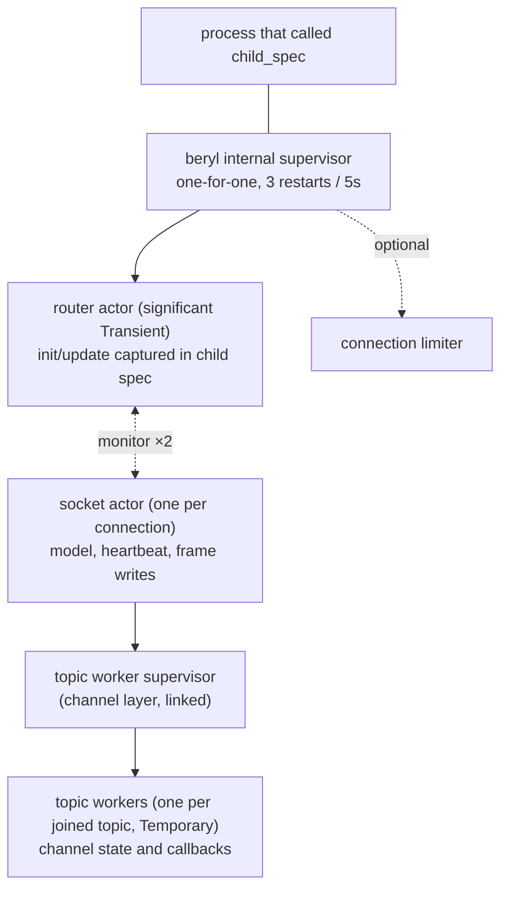

The runtime uses one router actor and one actor for each connected socket.
Transports send admitted, decoded frames to the router. The router sends each
frame to the actor that owns the socket. Your application's `init` and `update`
functions run in that socket actor. With the channel layer, the socket actor
also starts one worker process for each accepted topic, and the channel's
callbacks run there. The application owns separate supervised children for
presence and groups. PubSub wraps Erlang `pg` and is not a runtime child.

## How the processes divide the work

Each socket actor stores the app model, wire-send functions, joined topics, and
heartbeat time for one socket. It processes mailbox messages in sequence. This
serializes that socket's `update` calls and frame writes without locks. A slow
callback for one socket does not stop other sockets.

With the channel layer, each joined topic has a worker under a supervisor
that the socket actor starts and links. `join` runs while the worker starts,
and the socket actor waits for it. `on_message` and `on_info` run in the
worker, which reports lowered effects back to the socket actor. The socket
actor applies them in arrival order and writes every frame, so one topic's
effects keep their order, and different topics on one socket interleave.
A close is routed to the worker before the topic's reply refs are dropped,
so a reply computed before a leave is still delivered.

The router manages admission, the topic subscriber index, the PubSub
subscription, and stats. It only matches and forwards messages. It does not run
app callbacks. Transport connection processes manage WebSocket state, frame
limits, and decoding. Each socket actor owns its decoded-message, join, and
per-channel rate-limit buckets. The next event uses the model returned by
`update`.

## Data stored for each socket

A socket actor maintains, for its one socket:

- **The app model** — the app-defined `model` value produced by `init` and threaded through every `update` call.
- **Socket tracking** — the socket's wire-send functions (text and binary), its closer, and the set of topics it has joined (including joins awaiting an `AcceptJoin`/`RejectJoin` answer).
- **Heartbeat last-seen** — a monotonic timestamp, updated on every received heartbeat frame; checked by the actor's own recurring timer.

The router maintains:

- **Topic → subscriber sets** — maps each active topic string to the socket IDs currently joined on it. Socket actors update this map when they join and leave.
- **The actor table** — socket ID → socket actor, with a monitor per actor so a crashed actor's entries are swept rather than leaked.

## How beryl preserves app types

The router and socket actors use the app's `model` and `msg` types.
`beryl.child_spec` stores typed functions in closures. The public `Sockets`
handle and transport interface do not need type parameters, but the runtime
still keeps typed state. It does not use unchecked casts or convert app state
to `Dynamic`. PubSub validates each raw mailbox message before converting its
internal payload.

Server-side messages work the same way: `init` receives a typed `Sender(msg)` whose closure captures the message type, and `socket.notify` delivers messages that arrive in `update` as `Info(msg)` — an ordinary typed send.

`channel.child_spec` uses this same mechanism. Its generic router
captures each handler's private state and server-message type in closures,
while the socket-level message records its topic and join generation. The
runtime checks both values before delivery, so a message for an older join
cannot reach a later join.

## How incoming frames reach your app

Inbound WebSocket frames follow a two-step path:

1. **Decode in the connection process** — the transport decodes raw frames with the configured codec (see [WebSocket Frames & Transports](/architecture/wire-and-transport)), so malformed input never reaches the runtime.
2. **Route to update** — the decoded message is sent to the router, which forwards it to the socket's actor; the actor turns it into an `Input` for the socket's `update` function:
   - `phx_join` → validates the topic (length, control characters, reserved `beryl:` prefix, join rate, topic cap), then delivers `Join(topic, payload, ref)`. The join is held pending until the update's effects answer it; an unanswered join is rejected (fail closed).
   - Any other event on a joined topic → `Message(topic, event, payload, ref)`.
   - `heartbeat` → answered directly by the socket actor; the app never sees it.
   - `phx_leave` → acks the leave, then delivers `Closed(topic, Normal)`.
   - Binary frames → decoded through the codec's binary decoder when present and routed with binary message classification; otherwise delivered raw as `Binary(topic, data)` to each joined topic.

## Order of replies, pushes, and broadcasts

The runtime applies effects in list order. The same actor interprets the list
and writes the frames. Thus, list order is wire order. An `AcceptJoin` reaches
the wire before a later `Push`. A `Broadcast` goes through the router, which
sends a copy to each recipient actor. The source socket writes its own copy
first, so the broadcast keeps its effect-list position on that socket's wire.

The socket actor applies most lists in one turn. The presence actor applies
`PresenceTrack` and `PresenceUntrack`. The runtime pauses the rest of that
socket's list until the presence actor responds. It also queues later input for
that socket. Then it resumes at the next effect. The socket keeps its effect
order. Other sockets, broadcasts, heartbeat checks, and shutdown work continue.
An unrelated broadcast can occur between two effects from the paused socket.

## What closes after a callback crash

The runtime catches crashes in app callbacks. A `Join` crash rejects that join.
A topic `Message` or `Binary` crash closes only that topic. An `Info` crash
closes the socket because the message has no topic. A `Closed` crash is logged,
and teardown continues. An `init` crash prevents socket registration. The
runtime limits and truncates crash descriptions before logging. Other sockets
continue.

This differs from OTP's usual "let it crash" model. If a callback crash stopped
the socket actor, one topic error would close every topic on that socket.
beryl instead discards the callback result and closes only the affected join,
topic, or socket. It never continues with a partial result. Other faults can
still stop the socket actor, which closes that socket. A router fault invokes
supervision.

For the channel layer, a `join` panic rejects that join, and an `on_message`
or `on_info` panic closes only that topic; the worker keeps its previous
state, so `on_terminate` still runs. A terminate panic loses its actions, and
the worker stops. A worker process that dies closes its topic with
`phx_error` and skips `on_terminate`. Core still finishes closing the topic
and continues closing sibling channels.

## Detect inactive sockets

Each socket actor checks its heartbeat every `heartbeat_timeout_ms / 2`. There
is no global sweep. The actor compares the current monotonic time with its
socket's `last_heartbeat`. It removes the socket when it exceeds the timeout.
Removal sends
`Closed(topic, HeartbeatTimeout)` for each joined topic. It also calls the
transport closer and removes all socket state. `child_spec` rejects timeouts
below 2 because integer division would set the check interval to zero.

## Restart behavior

`child_spec` has no unsupervised mode. The router always starts under an internal one-for-one supervisor with a **3 restarts / 5 seconds** tolerance. Socket actors are not supervisor children: each is started by the transport's connection process at admission, monitored by the router (a crashed actor's entries are swept, closing only that socket), and monitors the router in return, stopping on its `Down`:

- The child specification contains the `init` and `update` closures. A restart
  resumes dispatch without a registration step.
- The router uses a stable registered name. The `Sockets` handle works after a
  restart. Sends during the restart window do nothing.
- Router death stops all socket actors. The transports also monitor the router
  and close their connections. A restart starts with no sockets, so clients
  must rejoin.
- The child is `Transient`, so a graceful `beryl.stop` is final. A stop first
  completes in-flight presence work, then stops the socket actors. It kills an
  actor that remains blocked in an app callback.

PubSub is **not** part of this tree. Erlang `pg` starts and stops it.
Presence and groups provide child specifications for the application
supervision tree. See the [Supervision guide](/guides/supervision/).

## Source files

- `src/beryl/runtime.gleam` — socket and model tracking, event delivery, returned effects, heartbeat timers, crash handling, admission, and shutdown.
- `src/beryl.gleam` — `child_spec`, the supervised child specification, and the typed functions used to start the runtime and socket actors.
