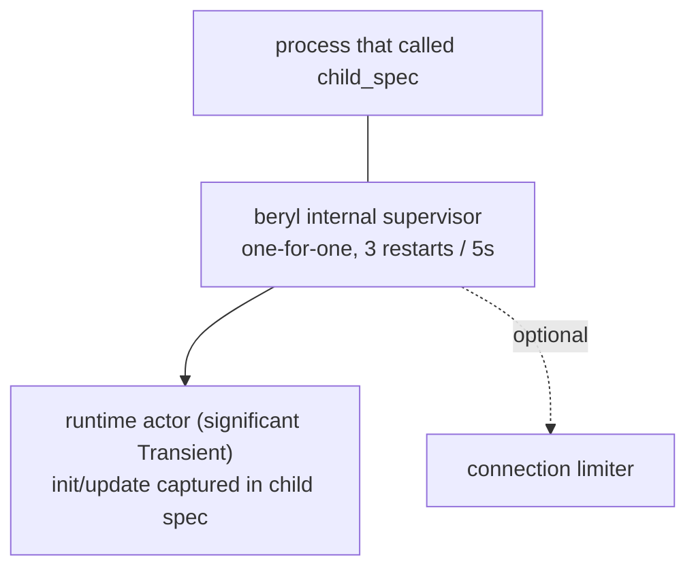

The runtime is the central OTP actor for app-side socket dispatch. Transports send admitted, decoded frames to it, and your application's `init`/`update` functions run inside it during event dispatch. Presence and groups are independent application-owned actors; PubSub is an Erlang `pg` wrapper rather than a child of the runtime.

## Role

The runtime is the single source of truth for connected socket IDs, app models, topic subscriptions, and heartbeat timestamps. It processes its mailbox sequentially, which gives it a consistent view of app dispatch without locks. Transport connection processes still own edge concerns such as WebSocket state, frame limits, decoding, and the local message-rate bucket; the model returned by `update` is the app state the next event sees.

## What it tracks

The runtime maintains four categories of state:

- **Per-socket models** — the app-defined `model` value produced by `init` and threaded through every `update` call for that socket.
- **Socket tracking** — each connected socket's ID, its wire-send functions (text and binary), its closer, and the set of topics it has joined (including joins awaiting an `AcceptJoin`/`RejectJoin` answer).
- **Topic → subscriber sets** — maps each active topic string to the set of socket IDs currently joined on it, used for broadcast fan-out.
- **Heartbeat last-seen** — a monotonic timestamp per socket, updated on every received heartbeat frame; used by the periodic eviction check.

## Typed dispatch without erasure

The runtime actor is generic over the app's `model` and `msg` types. `beryl.child_spec` captures those types in a record of monomorphic closures at construction time, so the public `Sockets` handle — and the frame-level transport SPI behind it — stays unparameterized while the runtime holds fully typed state. This is plain closure capture by a generic function: there are no unchecked casts, `Dynamic` round-trips, or identity FFI in the socket-dispatch path. PubSub separately validates the frozen raw mailbox record before its package-internal payload coercion.

Server-side messages work the same way: `init` receives a typed `Sender(msg)` whose closure captures the message type, and `socket.notify` delivers messages that arrive in `update` as `Info(msg)` — an ordinary typed send.

`channel.child_spec` uses this same mechanism. Its generic router
captures each handler's private state and server-message type in closures,
while the socket-level message is a sealed, generation-stamped envelope.
The envelope's topic and generation are checked before the typed value is
opened, so stale mail cannot reach a later join.

## Input dispatch

Inbound WebSocket frames follow a two-step path:

1. **Decode at the edge** — the transport decodes raw frames in the connection process using the configured codec (see [Wire & Transport](/architecture/wire-and-transport)), so parse cost and malformed input never reach the shared runtime actor.
2. **Route to update** — the decoded message is sent to the runtime, which turns it into an `Input` for the socket's `update` function:
   - `phx_join` → validates the topic (length, control characters, reserved `beryl:` prefix, join rate, topic cap), then delivers `Join(topic, payload, ref)`. The join is held pending until the update's effects answer it; an unanswered join is rejected (fail closed).
   - Any other event on a joined topic → `Message(topic, event, payload, ref)`.
   - `heartbeat` → answered directly by the runtime; the app never sees it.
   - `phx_leave` → acks the leave, then delivers `Closed(topic, Normal)`.
   - Binary frames → decoded through the codec's binary decoder when present and routed with binary message classification; otherwise delivered raw as `Binary(topic, data)` to each joined topic.

## Effect ordering

Effects are applied strictly in list order. Because the same runtime actor interprets the list and writes frames for that socket, list order is wire order; an `AcceptJoin` is guaranteed to reach the wire before a `Push` later in the same list.

Most lists are applied in a single actor turn. `PresenceTrack` and `PresenceUntrack` are applied by the presence actor instead, so the runtime holds the rest of that socket's list — and queues that socket's later inbound messages — until the mutation is acknowledged, then resumes exactly where it left off. Ordering for the socket is unchanged; what changes is that only that socket waits. Every other socket, broadcast, heartbeat check, and shutdown keeps being processed, which also means an unrelated broadcast can land between two of the waiting socket's effects.

## Crash containment

Crashes in app callbacks are rescued rather than allowed to take down the shared runtime. The blast radius is scoped to what crashed: a crashing `Join` is rejected; a crashing topic-scoped `Message` or `Binary` closes only that topic; a crashing `Info` tears down the whole socket because it has no topic to attribute; a crashing `Closed` is logged while teardown continues; and a crashing `init` leaves the socket unregistered. Crash descriptions are depth-limited and truncated before logging. Other sockets remain isolated.

This is a deliberate trade-off with OTP's usual "let it crash" model. Every
socket's model lives in the same runtime actor, so allowing one app callback
crash to reach supervision would restart that actor, discard every socket's
state, and close every connection on the handle. Beryl uses a crash boundary
only where it can discard the callback result and reject or tear down the
narrowest affected scope; it never continues with a partial result. Faults
outside those explicit boundaries still crash the runtime and invoke
supervision.

For the channel layer, those scopes map to `join`, `on_message` /
`on_binary`, `on_info`, and `on_terminate`. A terminate panic discards that
router update, so its actions are lost and the old instance remains reachable
only through its own typed sender until rejoin or socket teardown. Core still
finishes closing the topic and continues closing sibling channels.

## Heartbeat enforcement

The runtime schedules a recurring self-check at `heartbeat_timeout_ms / 2`. On each check it compares the current monotonic time to each socket's `last_heartbeat` and evicts any socket past the timeout. Eviction delivers `Closed(topic, HeartbeatTimeout)` for each joined topic, invokes the transport's registered closer so the underlying connection is actually shut, and removes the socket from all state. `child_spec` rejects timeouts below 2 loudly, because integer division would otherwise round the check interval to zero and silently disable eviction.

## Supervision

`child_spec` has no unsupervised mode. The runtime always starts under an internal one-for-one supervisor with a **3 restarts / 5 seconds** tolerance:

- The `init`/`update` closures live in the child specification, so a restart resumes dispatch immediately — there is no registration step to replay.
- The runtime is registered under a stable name; the `Sockets` handle keeps working across restarts, and sends during a restart window degrade to quiet no-ops.
- A restart drops per-socket state (models, joined topics); clients rejoin exactly as they would after any server restart.
- The child is `Transient`, so a graceful `beryl.stop` is final.

PubSub is **not** part of this tree; it is backed by Erlang's `pg` module, which manages its own lifecycle. Presence and groups are independent actors started by the application (see the [Supervision guide](/guides/supervision/)).

## Where this lives

- `src/beryl/runtime.gleam` — the runtime actor: socket/model tracking, event dispatch, the effect interpreter, heartbeat timer, crash rescue.
- `src/beryl.gleam` — `child_spec`, the supervised child specification, and the monomorphic closure record over the generic runtime.
