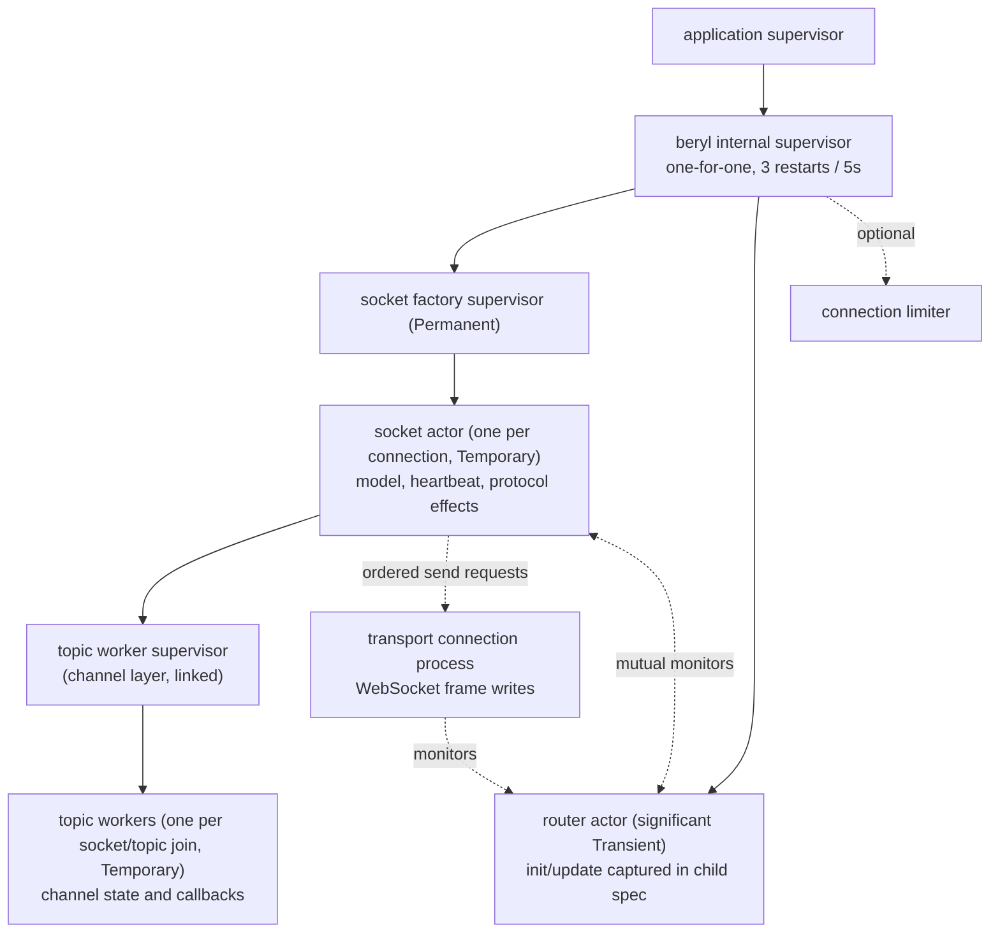

The runtime uses one shared router actor and one supervised, temporary actor
for each connected socket.
Transports send admitted, decoded frames to the router. The router sends each
frame to the actor that owns the socket. Your application's `init` and `update`
functions run in that socket actor. With the channel layer, the socket actor
also starts one worker process for each accepted topic, and the channel's
callbacks run there. The application owns separate supervised children for
presence and groups. PubSub wraps Erlang `pg` and is not a runtime child.

## How the processes divide the work

Each socket actor stores the app model, wire-send functions, joined topics, and
heartbeat time for one socket. It processes mailbox messages in sequence. This
serializes that socket's `update` calls and protocol effects without locks.
A slow raw callback delays that socket, not callbacks on other sockets.

With the channel layer, each joined topic has a worker under a supervisor
that the socket actor starts and links. The worker runs `join` during startup,
and the socket actor waits for the result. The worker also runs `on_message`
and `on_info`. It sends effects to the socket actor. The socket actor applies
them in arrival order and enqueues each frame for the transport. Thus, effects
for one topic keep their order. Effects for different topics can interleave.
The socket actor sends a close to the worker before it drops the topic's reply refs. Thus, it
can deliver a push or reply that the worker computed before a leave.

Channel `on_message` and `on_info` callbacks on different topics can run
concurrently. This is not complete latency isolation: worker startup during a
join and ordered worker shutdown can make the socket actor wait. Worker join
and termination each have a 5-second timeout. A slow raw callback blocks all
topics on its socket. Presence suspension also delays
ordered work for that socket, and a slow shared presence actor can delay
mutations from multiple sockets.

The router manages admission, the topic subscriber index, the PubSub
subscription, and stats. It only matches and forwards messages. It does not run
app callbacks. Transport connection processes manage WebSocket state, frame
limits, and decoding. Each socket actor owns its decoded-message, join, and
per-channel rate-limit buckets. The next event uses the model returned by
`update`.

## Data stored for each socket

A socket actor maintains, for its one socket:

- **The app model** — the app-defined `model` value produced by `init` and threaded through every `update` call.
- **Socket tracking** — the socket's wire-send functions (text and binary), its closer, and the set of topics it has joined (including joins awaiting an `AcceptJoin`/`RejectJoin` answer).
- **Heartbeat last-seen** — a monotonic timestamp, updated on every received heartbeat frame; checked by the actor's own recurring timer.

The router maintains:

- **Topic → subscriber sets** — maps each active topic string to the socket IDs currently joined on it. Socket actors update this map when they join and leave.
- **The actor table** — socket ID → socket actor, with a monitor per actor so a crashed actor's entries are swept rather than leaked.

## How beryl preserves app types

The router and socket actors use the app's `model` and `msg` types.
`beryl.child_spec` stores typed functions in closures. The public `Sockets`
handle and transport interface do not need type parameters, but the runtime
still keeps typed state. It does not use unchecked casts or convert app state
to `Dynamic`. PubSub validates each raw mailbox message before converting its
internal payload.

Server-side messages work the same way: `init` receives a typed `Sender(msg)` whose closure captures the message type, and `socket.notify` delivers messages that arrive in `update` as `Info(msg)` — an ordinary typed send.

`channel.child_spec` uses this same mechanism. Its generic router
captures each handler's private state and server-message type in closures,
while the socket-level message records its topic and join generation. The
runtime checks both values before delivery, so a message for an older join
cannot reach a later join.

## How incoming frames reach your app

Inbound WebSocket frames follow a two-step path:

1. **Decode in the connection process** — the transport decodes raw frames with the configured codec (see [WebSocket Frames & Transports](/architecture/wire-and-transport)), so malformed input never reaches the runtime.
2. **Route to update** — the decoded message is sent to the router, which forwards it to the socket's actor; the actor turns it into an `Input` for the socket's `update` function:
   - `phx_join` → validates the topic (length, control characters, reserved `beryl:` prefix, join rate, topic cap), then delivers `Join(topic, payload, ref)`. The join is held pending until the update's effects answer it; an unanswered join is rejected (fail closed).
   - Any other event on a joined topic → `Message(topic, event, payload, ref)`.
   - `heartbeat` → answered directly by the socket actor; the app never sees it.
   - `phx_leave` → acks the leave, then delivers `Closed(topic, Normal)`.
   - Binary frames → decoded through the codec's binary decoder when present and routed with binary message classification; otherwise delivered raw as `Binary(topic, data)` to each joined topic.

## Order of replies, pushes, and broadcasts

The socket actor applies effects in list order and calls its send functions in
that order. For Mist and Ewe, these functions enqueue `SendText` or
`SendBinary` requests to the transport connection process. That process calls
the transport's frame-write functions. The socket actor owns protocol/effect
ordering; the connection process owns the WebSocket and performs the writes.

Thus, an `AcceptJoin` is queued before a later `Push`, preserving wire order.
A successful send-function result means the request was enqueued, not that a
network write completed or that the client received it. A `Broadcast` goes
through the router, which sends a copy to each recipient actor. The source
socket enqueues its own copy at the broadcast's effect-list position.

The socket actor applies most lists in one turn. The presence actor applies
`PresenceTrack` and `PresenceUntrack`. The runtime pauses the rest of that
socket's list until the presence actor responds. It also queues later input for
that socket. Then it resumes at the next effect. The socket keeps its effect
order. Other sockets, broadcasts, heartbeat checks, and shutdown work continue.
An unrelated broadcast can occur between two effects from the paused socket.

## What closes after a callback crash

The runtime catches crashes in app callbacks. A `Join` crash rejects that join.
A topic `Message` or `Binary` crash closes only that topic. An `Info` crash
closes the socket because the message has no topic. A `Closed` crash is logged,
and teardown continues. An `init` crash prevents socket registration. The
runtime limits and truncates crash descriptions before logging. Other sockets
continue.

This differs from OTP's usual "let it crash" model. If a callback crash stopped
the socket actor, one topic error would close every topic on that socket.
beryl instead discards the callback result and closes only the affected join,
topic, or socket. It never continues with a partial result. Other faults can
still stop the socket actor, which closes that socket. A router fault invokes
supervision.

For the channel layer, a `join` panic rejects that join. An `on_message` or
`on_info` panic closes only that topic. The worker keeps its previous state,
so `on_terminate` still runs. An `on_terminate` panic discards its actions and
stops the worker. If a worker stops unexpectedly, the runtime closes its topic
with `phx_error`. It cannot run `on_terminate` because the worker held the
channel state. The runtime still closes the topic and continues to close
sibling channels.

## Detect inactive sockets

Each socket actor checks its heartbeat every `heartbeat_timeout_ms / 2`. There
is no global sweep. The actor compares the current monotonic time with its
socket's `last_heartbeat`. It removes the socket when it exceeds the timeout.
Removal sends
`Closed(topic, HeartbeatTimeout)` for each joined topic. It also calls the
transport closer and removes all socket state. `child_spec` rejects timeouts
below 2 because integer division would set the check interval to zero.

## Restart behavior

`child_spec` has no unsupervised mode. The router and shared socket factory
start under an internal one-for-one supervisor with a **3 restarts / 5
seconds** tolerance. Socket actors are `Temporary` children of the factory.
The transport requests a child, then the router registers it before its
application `init` runs. The router and socket actor monitor each other.

- The child specification contains the `init` and `update` closures. A restart
  resumes dispatch without a registration step.
- The router uses a stable registered name. The `Sockets` handle works after a
  restart. Sends during the restart window do nothing.
- Router death stops all socket actors. The transports also monitor the router
  and close their connections. A restart starts with no sockets, so clients
  must reconnect and rejoin.
- Factory death stops all socket actors it owns. The router sweeps their
  routing and presence state and closes their transports. The router keeps
  its generation; the `Permanent` factory restarts under its stable name and
  accepts new connections.
- A socket actor fault closes only its connection and topics. Socket actors
  and topic workers are `Temporary`: supervision does not restart them or
  reconstruct models, refs, or memberships. Recovery requires a new connection
  and joins, or a topic rejoin if only its worker stopped.
- The router is significant and `Transient`, so a graceful `beryl.stop` is
  final. A stop first
  completes in-flight presence work, then stops the socket actors. It kills an
  actor that remains blocked in an app callback. The router drains before the
  factory shuts down; the factory terminates any surviving children.

PubSub is **not** part of this tree. Erlang `pg` starts and stops it.
Presence and groups provide child specifications for the application
supervision tree. See the [Supervision guide](/guides/supervision/).

## Queue limits and overload

beryl currently has no finite end-to-end queue or memory budget. Process
isolation and rate limits do not establish one. The current controls limit
admission or input rate, not all work that can accumulate after admission.
See [Production hardening](/guides/production-hardening/) for configuration.

| Boundary | Current control and overload behavior |
|---|---|
| Connection admission | Optional per-IP attempt-rate and concurrent connection limits, plus a node-wide concurrent connection limit. All default to disabled. The limiter owns accounting; a rejected upgrade receives HTTP `429`. |
| Complete inbound frames | The connection process closes the connection for frames over 1 MiB by default, after assembly. Optional frame-rate limiting drops over-rate frames before decoding. Neither bounds pre-assembly buffers or router queues. |
| Decoded socket input | Socket actors own optional message, join, and channel/topic rate buckets. Rates default to disabled. Over-rate messages are dropped; over-rate joins receive an error reply. These are not worker queue limits. |
| Topic-worker input | No configured message or byte budget. A slow worker can accumulate input. |
| Worker reports and action batches | No configured budget for pending `WorkerRan` reports or the effects they contain. |
| Socket mailbox and deferred presence work | No configured queue budget. The presence operation timeout defaults to 5 seconds; it limits the acknowledgement wait, not queued messages or effect-list size. On timeout, the runtime logs and resumes without claiming success. |
| Shared router ingress and fan-out | No aggregate queue budget. Per-socket input rates do not bound combined ingress, broadcasts, or fan-out work. |
| Presence and PubSub admission | No global queue budget. Shared presence work, generic PubSub consumers, and external consumer mailboxes are not bounded by socket rate limits. |
| Outbound connection queue | Send requests have no configured count/byte budget or slow-reader eviction policy. A slow writer can accumulate requests independently of the socket actor. |

[#397](https://github.com/tylerbutler/beryl/issues/397) tracks finite supported
budgets, accounting and release paths, overflow semantics, occupancy/queue-age
telemetry, and bounded-memory evidence. These are not current guarantees.
[#249](https://github.com/tylerbutler/beryl/issues/249) separately tracks the
outbound queue and slow-client eviction. beryl cannot promise a global bound
for arbitrary PubSub subscribers or external consumers.

Until those contracts are implemented, do not treat rate settings, heartbeat
eviction, or temporary supervision as backpressure. In particular, heartbeat
checks need the socket actor to process its mailbox; they cannot interrupt a
blocked callback. Use deployment-level limits and measure queue growth under
your workload.

## Performance evidence

[#371](https://github.com/tylerbutler/beryl/pull/371) provides protocol-smoke
evidence, not a comparative capacity result. The
[ADR 0005 measurements](https://github.com/tylerbutler/beryl/blob/main/docs/adr/0005-socket-actor-supervision.md#results)
compare direct and factory startup at a requested 2,000 connections per second
with Mist on Erlang 27.2.1 and 12 schedulers, with three runs per design.
They support that narrow start-rate comparison, not a general throughput,
latency, memory, or recovery guarantee.

[#400](https://github.com/tylerbutler/beryl/issues/400) tracks broader workload
baselines, including slow readers, hot workers, presence delays, combined
router load, and crash/reconnect recovery.

## Source files

- `src/beryl/runtime.gleam` — socket and model tracking, event delivery, returned effects, heartbeat timers, crash handling, admission, and shutdown.
- `src/beryl.gleam` — `child_spec`, the supervised child specification, and the typed functions used to start the runtime and socket actors.
- `src/beryl/transport/server.gleam` — connection admission and ordered outbound send requests consumed by Mist and Ewe.
