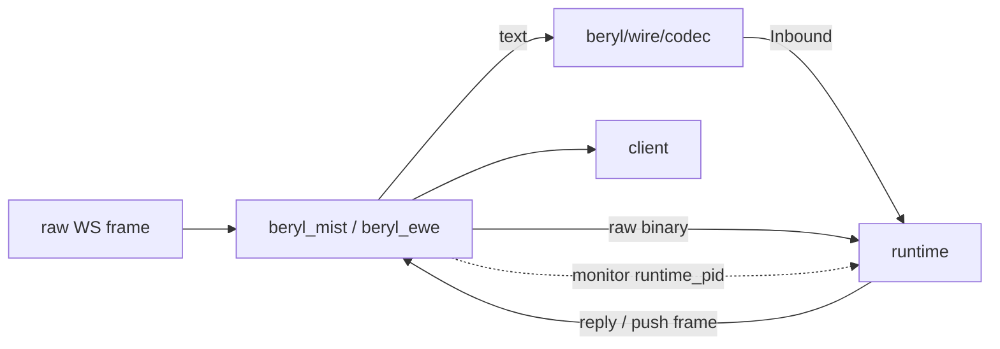

The wire and transport layer sits between raw WebSocket frames and the runtime. It is split into two concerns: a pluggable **codec** that translates bytes into structured messages, and transport adapters that own the socket lifecycle.

## Codec abstraction

A `Codec` is a plain data value that pairs a decoder with a set of encoders. The runtime is framing-agnostic: it receives `Inbound` values and writes `Frame` values; the codec performs every translation.

```
packages/beryl/src/beryl/wire/codec.gleam
```

The `Codec` type carries five core fields:

| Field | Purpose |
|---|---|
| `decode_text` | Parse a raw text frame into an `Inbound` |
| `decode_binary` | Parse a raw binary frame into an `Inbound` (optional) |
| `encode_reply` | Encode a reply frame back to the client |
| `encode_push` | Encode a server-initiated push |
| `encode_heartbeat_reply` | Encode the heartbeat acknowledgement |

The built-in `phoenix_codec()` (from `packages/beryl/src/beryl/wire.gleam`) wires the Phoenix JSON framing into those slots. Applications that want Phoenix-compatible framing pass it explicitly to `beryl.config`:

```gleam
beryl.config(wire.phoenix_codec())
```

Custom codecs can be swapped in by constructing a `Codec` value directly, allowing alternative protocols without changing the runtime or the transport SPI.

## Frame shapes

Phoenix uses a JSON array for every text message on the wire:

```
[join_ref, ref, topic, event, payload]
```

The `join_ref` and `ref` fields are nullable strings used for reply correlation. `topic` is the subscription key (for example `"room:lobby"`). `event` names the protocol action or user event.

### Key functions in `beryl/wire`

**`decode_message(json_string)`** — parses a raw JSON string into an `Inbound`. Returns `InvalidJson` or `InvalidFormat` errors for malformed input.

**`encode(msg)`** — round-trips an `Inbound` back to a Phoenix wire JSON string.

**`reply_json(join_ref, ref, topic, status, response)`** — produces a `phx_reply` frame. The payload is `{"status": "ok"|"error", "response": <payload>}`.

**`push(topic, event, payload)`** — produces a server-initiated push. Server pushes carry `null` for both `join_ref` and `ref` because there is no client message to correlate against.

**`heartbeat_reply(ref)`** — produces the heartbeat acknowledgement. The topic is always `"phoenix"`, the event is `"phx_reply"`, and the status is `"ok"` with an empty response object.

## Transport SPI

`packages/beryl/src/beryl/transport.gleam` is the contract between core Beryl and transport packages.

A transport:

1. admits or rejects the connection at the HTTP/WebSocket edge
2. announces the socket with `socket_connected`
3. registers a closer with `register_closer`
4. decodes inbound text frames with `active_codec` and routes them with `route_decoded`
5. routes raw binary frames with `route_binary` when needed
6. reports closes with `socket_disconnected`
7. checks `runtime_pid`; on `Ok(pid)` it monitors `pid`, and on `Error(Nil)` it refuses the connection

That ownership check is what makes runtime restarts safe: when the owning runtime dies, the connection process closes the WebSocket instead of leaving an orphaned socket behind.

## Mist and Ewe transports

The Mist and Ewe packages expose the same surface, both implemented on top of `beryl/transport`.

- `default_config(path)` creates a config for one WebSocket path, seeds empty `ConnectSeed.metadata` (`[]`), and applies `SameOrigin` by default.
- `with_on_connect(config, callback)` attaches a socket-level auth/connect hook. The callback returns `Result(List(#(String, String)), ConnectError)`: `Ok(metadata)` allows the upgrade and appends those ordered string-pair values to `ConnectSeed.metadata`, while `Error(ConnectRejected)` returns HTTP 403.
- `with_allowed_origins` and `with_allow_all_origins` change the origin policy.
- `upgrade` performs path matching, origin checks, optional `on_connect`, connection-limit admission, and the actual WebSocket upgrade.
- `handler` wraps `upgrade` into a complete request handler with an HTTP fallback.
- `is_websocket_request` checks the `Upgrade: websocket` header.

The request path, query params, headers, and `with_on_connect` metadata are merged into `ConnectSeed` and delivered to your app's `init` through `ConnectInfo.seed`.

## Diagram



## Where this lives

| Module | Path |
|---|---|
| Transport SPI | `packages/beryl/src/beryl/transport.gleam` |
| Codec abstraction | `packages/beryl/src/beryl/wire/codec.gleam` |
| Phoenix wire helpers | `packages/beryl/src/beryl/wire.gleam` |
| Connect metadata types | `packages/beryl/src/beryl/socket.gleam` |
| Mist transport | `packages/beryl_mist/src/beryl_mist.gleam` |
| Ewe transport | `packages/beryl_ewe/src/beryl_ewe.gleam` |
