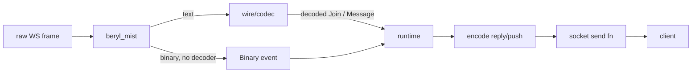

The wire and transport layer sits between raw WebSocket frames and the runtime. It is split into two concerns: a pluggable **codec** that translates bytes into structured messages, and the **Mist transport** that owns the socket lifecycle.

## Codec abstraction

A `Codec` is opaque. Use the public factory and builder functions in `beryl/wire/codec`, or use the ready-made `wire.phoenix_codec()`. The runtime is framing-agnostic: it only ever sees `Inbound` values and emits `Frame` values; the codec performs every translation.

```
src/beryl/wire/codec.gleam
```

The public codec builders configure these behaviors:

| Behavior | Purpose |
|---|---|
| `decode_text` | Parse a raw text frame into an `Inbound` |
| `decode_binary` | Parse a binary frame into an `Inbound` (optional) |
| `encode_reply` | Encode a channel reply back to the client |
| `encode_push` | Encode a server-initiated push |
| `encode_heartbeat_reply` | Encode the heartbeat acknowledgement |
| `encode_close` | Optionally encode graceful topic closure via `with_close_encoder` |
| `encode_error` | Optionally encode abnormal topic termination via `with_error_encoder` |

Build a custom text codec with `codec.new(...)`, then add optional behavior with builders such as `codec.with_binary_decoder`, `codec.with_close_encoder`, `codec.with_error_encoder`, and `codec.with_topicless_events`. The built-in `wire.phoenix_codec()` configures Phoenix text and V2 binary framing.

Every Beryl `Config` requires a codec explicitly; there is no implicit default:

```gleam
beryl.config(wire.phoenix_codec())
```

Pass a custom opaque `Codec` to `beryl.config(codec)` to use an alternative protocol without changing the runtime or app logic.

## Frame shapes

Phoenix uses a JSON array for every message on the wire:

```
[join_ref, ref, topic, event, payload]
```

The `join_ref` and `ref` fields are nullable strings used for reply correlation. `topic` is the subscription key (e.g. `"room:lobby"`). `event` names the protocol action or user event.

### Key functions in `beryl/wire`

**`decode_message(json_string)`**: parses a raw JSON string into an `Inbound`. Returns `InvalidJson` or `InvalidFormat` errors for malformed input.

**`encode(msg)`**: round-trips an `Inbound` back to a Phoenix wire JSON string.

**`reply_json(join_ref, ref, topic, status, response)`**: produces a `phx_reply` frame. The `payload` field is `{"status": "ok"|"error", "response": <payload>}`.

**`push(topic, event, payload)`**: produces a server-initiated push. Server pushes carry `null` for both `join_ref` and `ref` because there is no client message to correlate against.

**`heartbeat_reply(ref)`**: produces the heartbeat acknowledgement. The topic is always `"phoenix"`, the event is `"phx_reply"`, and the status is `"ok"` with an empty response object. The client sends heartbeats with topic `"phoenix"` / event `"heartbeat"`.

## Mist transport

The Mist transport (`packages/beryl_mist/src/beryl_mist.gleam`) bridges Mist's native WebSocket handling to the beryl runtime through the frame-level SPI in `beryl/transport`. It is responsible for:

1. **Generating a unique socket id**: `crypto.strong_random_bytes` produces a 16-byte random id encoded as base16.
2. **Admitting the socket atomically**: the transport captures `transport.connection_owner`, installs a monitor for that exact pid, then calls `transport.admit_socket` with the send functions, closer, codec, and `ConnectSeed`. A restart or registration failure closes the connection instead of registering it with a successor runtime.
3. **Routing text frames**: `mist.Text` frames are decoded in the connection process with the codec from `transport.active_codec` and routed with `transport.route_decoded`.
4. **Routing binary frames**: when the active codec supplies `decode_binary`, `mist.Binary` frames are decoded in the connection process and routed with `transport.route_decoded_binary`, producing normal `Join`/`Message` semantics while preserving binary telemetry classification; without a binary decoder, the transport uses `transport.route_binary` to deliver the raw `BitArray` to the app as a `Binary` event. Ewe follows the same routing contract.
5. **Notifying on close**: `mist.Closed` and `mist.Shutdown` call `transport.socket_disconnected` so the runtime can clean up subscriptions.
6. **Rejecting disallowed origins**: when configured, `with_allowed_origins` checks the full `Origin` header before the WebSocket handshake and returns HTTP 403 for missing or non-matching origins.

### Key functions

**`default_config(path)`**: creates a `TransportConfig` with no connect hook. Accepts all (same-origin) connections.

**`with_on_connect(config, callback)`**: attaches a socket-level authentication callback. The callback receives the HTTP request before the WebSocket upgrade. Return `Ok(metadata)` to allow the connection and append ordered string pairs to `ConnectSeed.metadata`, or `Error(ConnectRejected)` to reject with 403.

**`with_allowed_origins(config, origins)`**: attaches an exact-match allow-list for browser `Origin` headers, such as `["https://app.example.com"]`. Use this when cookie-authenticated WebSockets need CSWSH protection.

**`upgrade(request, channels, config, next)`**: checks whether the request path matches the configured socket path, runs the `on_connect` hook, and performs the WebSocket upgrade. Calls `next()` when the path does not match, enabling use as middleware.

**`is_websocket_request(request)`**: checks the `Upgrade: websocket` header.

**`handler(channels, config, http_fallback)`**: returns a combined request handler that routes WebSocket upgrade requests to `upgrade` and everything else to `http_fallback`. Removes boilerplate from application code.

## Diagram



## Where this lives

| Module | Path |
|---|---|
| Codec abstraction | `src/beryl/wire/codec.gleam` |
| Phoenix wire helpers | `src/beryl/wire.gleam` |
| Mist transport | `packages/beryl_mist/src/beryl_mist.gleam` |
