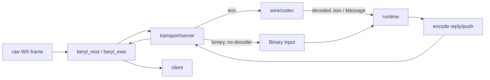

This part of beryl converts raw WebSocket frames into app messages. A
**codec** defines how to decode and encode messages. A **transport** connects
beryl to a WebSocket server such as Mist or Ewe.

## Choose or build a codec

A `Codec` is opaque. Use the public factory and builder functions in
`beryl/wire/codec`, or use `wire.phoenix_codec()`. The runtime receives
`Inbound` values and emits `Frame` values. The codec converts all frames.

```
src/beryl/wire/codec.gleam
```

The public codec builders configure these behaviors:

| Behavior | Purpose |
|---|---|
| `decode_text` | Parse a raw text frame into an `Inbound` |
| `decode_binary` | Parse a binary frame into an `Inbound` (optional) |
| `encode_reply` | Encode a channel reply back to the client |
| `encode_push` | Encode a server-initiated push |
| `encode_heartbeat_reply` | Encode the heartbeat acknowledgement |
| `encode_close` | Optionally encode graceful topic closure via `with_close_encoder` |
| `encode_error` | Optionally encode abnormal topic termination via `with_error_encoder` |

Build a custom text codec with `codec.new(...)`, then add optional behavior with builders such as `codec.with_binary_decoder`, `codec.with_close_encoder`, `codec.with_error_encoder`, and `codec.with_topicless_events`. The built-in `wire.phoenix_codec()` configures Phoenix text and V2 binary framing.

Each beryl `Config` requires a codec. There is no default:

```gleam
beryl.config(wire.phoenix_codec())
```

Pass a custom `Codec` to `beryl.config(codec)` to use another protocol. You do
not need to change the runtime or app logic.

## Phoenix frame format

Phoenix uses a JSON array for every message on the wire:

```
[join_ref, ref, topic, event, payload]
```

The `join_ref` and `ref` fields are nullable strings that link requests and
replies. `topic` is the subscription key, such as `"room:lobby"`. `event` names
the protocol action or user event.

### Decode and encode frames

**`decode_message(json_string)`** parses a raw JSON string into an `Inbound`.
It returns `InvalidJson` or `InvalidFormat` for malformed input.

**`encode(msg)`** converts an `Inbound` to a Phoenix wire JSON string.

**`reply_json(join_ref, ref, topic, status, response)`** creates a `phx_reply`
frame. The `payload` field is
`{"status": "ok"|"error", "response": <payload>}`.

**`push(topic, event, payload)`** creates a server push. Server pushes use
`null` for `join_ref` and `ref` because they do not answer a client message.

**`heartbeat_reply(ref)`** creates the heartbeat acknowledgment. It uses topic
`"phoenix"`, event `"phx_reply"`, status `"ok"`, and an empty response object.
The client sends heartbeats with topic `"phoenix"` and event `"heartbeat"`.

## How transports handle a connection

`beryl/transport/server` manages admission, connections, and frames.
`beryl_mist` and `beryl_ewe` provide the server-specific upgrade, frame-send,
and peer-IP functions:

1. **Generate a unique socket ID:** The shared server uses
   `crypto.strong_random_bytes` to create a 16-byte random ID in base16.
2. **Admit the socket as one operation:** The server captures
   `transport.runtime_pid` and monitors that PID. It then calls
   `transport.admit_socket` with the send functions, closer, codec, and
   `ConnectSeed`. A restart or registration failure closes the connection.
3. **Route text frames:** The connection process decodes `mist.Text` frames
   with `transport.active_codec`. It routes them with
   `transport.route_decoded`.
4. **Route binary frames:** If the codec provides `decode_binary`, the
   connection process decodes `mist.Binary` frames. It routes them with
   `transport.route_decoded_binary`. This keeps normal `Join` and `Message`
   behavior and binary telemetry classification. Without a binary decoder,
   `transport.route_binary` sends the raw `BitArray` to the app as `Binary`.
   Ewe uses the same contract.
5. **Notify on close:** Each server adapter calls the shared close path. This
   path releases the connection permit and calls
   `transport.socket_disconnected`.
6. **Reject disallowed origins:** When configured, `with_allowed_origins`
   checks the full `Origin` header before the handshake. It returns HTTP 403
   for a missing or non-matching origin.

### Configure the server transport

**`server.default_config(path)`**: creates a `TransportConfig` with no connect hook and the default same-origin policy.

**`server.with_on_connect(config, callback)`**: attaches a socket-level authentication callback. The callback receives the HTTP request before the WebSocket upgrade. Return `Ok(metadata)` to allow the connection and append ordered string pairs to `ConnectSeed.metadata`, or `Error(ConnectRejected)` to reject with 403.

**`server.with_allowed_origins(config, origins)`**: attaches an exact-match allow-list for browser `Origin` headers, such as `["https://app.example.com"]`. Use this when cookie-authenticated WebSockets need CSWSH protection.

**`upgrade(request, channels, config, next)`**: checks whether the request path matches the configured socket path, runs the `on_connect` hook, and performs the WebSocket upgrade. Calls `next()` when the path does not match, enabling use as middleware.

**`is_websocket_request(request)`**: checks the `Upgrade: websocket` header.

**`handler(channels, config, http_fallback)`**: returns a combined request handler that routes WebSocket upgrade requests to `upgrade` and everything else to `http_fallback`. Removes boilerplate from application code.

## Frame path



## Source files

| Module | Path |
|---|---|
| Codec configuration | `src/beryl/wire/codec.gleam` |
| Phoenix wire helpers | `src/beryl/wire.gleam` |
| Shared server connection handling | `src/beryl/transport/server.gleam` |
| Origin policy | `src/beryl/transport/origin.gleam` |
| Mist transport | `packages/beryl_mist/src/beryl_mist.gleam` |
| Ewe transport | `packages/beryl_ewe/src/beryl_ewe.gleam` |
