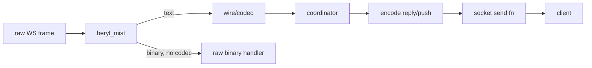

The wire and transport layer sits between raw WebSocket frames and the coordinator. It is split into two concerns: a pluggable **codec** that translates bytes into structured messages, and the **Mist transport** that owns the socket lifecycle.

## Codec abstraction

A `Codec` is a plain data value that pairs a decoder with a set of encoders. The coordinator is framing-agnostic: it only ever sees `Inbound` values and emits `Frame` values; the codec performs every translation.

```
packages/beryl/src/beryl/wire/codec.gleam
```

The `Codec` type carries five fields:

| Field | Purpose |
|---|---|
| `decode_text` | Parse a raw text frame into an `Inbound` |
| `decode_binary` | Parse a binary frame into an `Inbound` (optional) |
| `encode_reply` | Encode a channel reply back to the client |
| `encode_push` | Encode a server-initiated push |
| `encode_heartbeat_reply` | Encode the heartbeat acknowledgement |

The built-in `phoenix_codec()` (from `packages/beryl/src/beryl/wire.gleam`) wires the Phoenix JSON framing into all five slots. `beryl.config/1` takes the codec as a required argument — there is no implicit default — so pass it explicitly:

```gleam
beryl.config(wire.phoenix_codec())
```

Custom codecs can be swapped in by constructing a `Codec` value directly, allowing alternative protocols without changing the coordinator or channel logic.

## Frame shapes

Phoenix uses a JSON array for every message on the wire:

```
[join_ref, ref, topic, event, payload]
```

The `join_ref` and `ref` fields are nullable strings used for reply correlation. `topic` is the subscription key (e.g. `"room:lobby"`). `event` names the protocol action or user event.

### Key functions in `beryl/wire`

**`decode_message(json_string)`** — parses a raw JSON string into an `Inbound`. Returns `InvalidJson` or `InvalidFormat` errors for malformed input.

**`encode(msg)`** — round-trips an `Inbound` back to a Phoenix wire JSON string.

**`reply_json(join_ref, ref, topic, status, response)`** — produces a `phx_reply` frame. The `payload` field is `{"status": "ok"|"error", "response": <payload>}`.

**`push(topic, event, payload)`** — produces a server-initiated push. Server pushes carry `null` for both `join_ref` and `ref` because there is no client message to correlate against.

**`heartbeat_reply(ref)`** — produces the heartbeat acknowledgement. The topic is always `"phoenix"`, the event is `"phx_reply"`, and the status is `"ok"` with an empty response object. The client sends heartbeats with topic `"phoenix"` / event `"heartbeat"`.

## Mist transport

The Mist transport (`packages/beryl_mist/src/beryl_mist.gleam`) bridges Mist's native WebSocket handling to the beryl coordinator. It is responsible for:

1. **Generating a unique socket id** — `crypto.strong_random_bytes` produces a 16-byte random id encoded as base16.
2. **Registering the send fn** — on connection init, the transport sends a `SocketConnected` message to the coordinator containing both a text send fn and a binary send fn.
3. **Routing text frames** — `mist.Text` frames are forwarded to `coordinator.route_message`, which decodes them through the codec.
4. **Routing binary frames** — `mist.Binary` frames are forwarded to `coordinator.route_binary`; the coordinator passes them through the codec's `decode_binary` when present, otherwise delivers the raw `BitArray` to `channel.handle_binary`.
5. **Notifying on close** — `mist.Closed` and `mist.Shutdown` send `SocketDisconnected` to the coordinator so it can clean up subscriptions.
6. **Rejecting disallowed origins** — when configured, `with_allowed_origins` checks the full `Origin` header before the WebSocket handshake and returns HTTP 403 for missing or non-matching origins.

### Key functions

**`default_config(path)`** — creates a `TransportConfig(Nil)` with no connect hook. Accepts all connections and seeds `Nil` assigns.

**`with_on_connect(config, callback)`** — attaches a socket-level authentication callback. The callback receives the HTTP request before the WebSocket upgrade. Return `Ok(assigns)` to allow the connection, `Error(ConnectRejected)` to reject with 403.

**`with_allowed_origins(config, origins)`** — attaches an exact-match allow-list for browser `Origin` headers, such as `["https://app.example.com"]`. Use this when cookie-authenticated WebSockets need CSWSH protection.

**`upgrade(request, channels, config, next)`** — checks whether the request path matches the configured socket path, runs the `on_connect` hook, and performs the WebSocket upgrade. Calls `next()` when the path does not match, enabling use as middleware.

**`is_websocket_request(request)`** — checks the `Upgrade: websocket` header.

**`handler(channels, config, http_fallback)`** — returns a combined request handler that routes WebSocket upgrade requests to `upgrade` and everything else to `http_fallback`. Removes boilerplate from application code.

## Diagram



## Where this lives

| Module | Path |
|---|---|
| Codec abstraction | `packages/beryl/src/beryl/wire/codec.gleam` |
| Phoenix wire helpers | `packages/beryl/src/beryl/wire.gleam` |
| Mist transport | `packages/beryl_mist/src/beryl_mist.gleam` |
