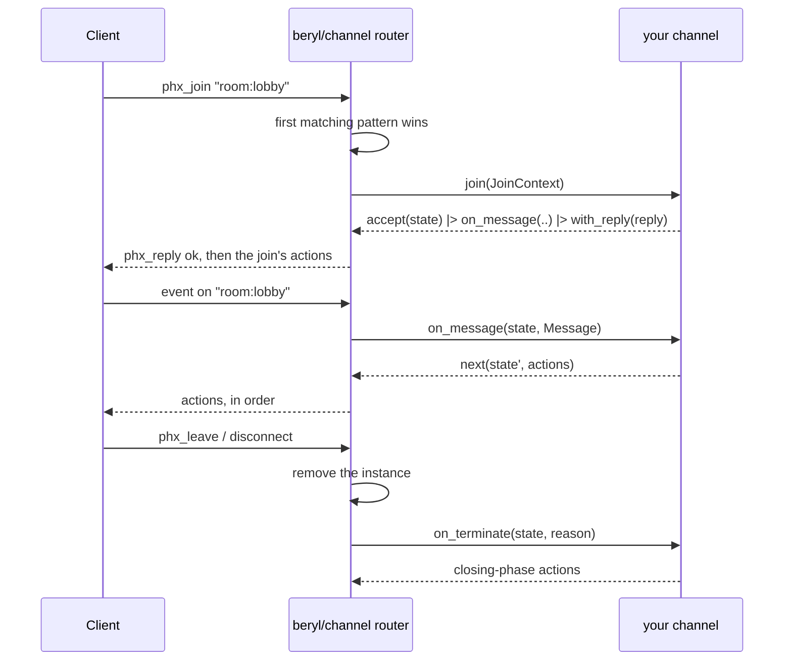

`beryl/channel` is the **recommended default** for applications that serve
more than one topic namespace on a socket. It is also the default for a Phoenix
style design. Register a list of channel handlers. The layer routes each join,
message, server message, and close to the correct channel.

If you are not sure which layer you want, read
[Choose an API](/choosing-an-api/) first. If you want one topic family and
complete control over routing, use [Raw Dispatch](/guides/dispatch/)
instead. It is the core API under the channel layer.

:::note[No extra package]
The `beryl` package includes the `beryl/channel` module. Applications need
`beryl` and one transport. See
[Installation](/installation/) for the dependency block.
:::

## Define a channel handler

A channel is a **topic pattern** plus a typed `join` callback. The `join`
callback receives one context value. It rejects the join or accepts it with
private state and callbacks.

```gleam
// src/my_app/room_channel.gleam
import beryl/channel
import gleam/json

/// This channel's private state. Each joined topic has one value.
type State {
  State(room_id: String, username: String, sent: Int)
}

/// This channel's server-side message type.
type Note {
  Tick(Int)
}

pub fn room() -> channel.Handler {
  channel.handler("room:*", fn(context: channel.JoinContext(Note)) {
    let state =
      State(
        room_id: context.topic,
        username: context.socket_id,
        sent: 0,
      )

    channel.accept(state)
    |> channel.on_message(fn(state: State, message: channel.Message) {
      channel.next(
        State(..state, sent: state.sent + 1),
        [
          channel.broadcast_from(message.event, json.int(state.sent + 1)),
        ],
      )
    })
    |> channel.on_info(fn(state: State, note: Note) {
      let Tick(at) = note
      channel.next(state, [channel.push("tick", json.int(at))])
    })
    |> channel.on_terminate(fn(state: State, _reason) {
      [channel.broadcast("left", json.string(state.username))]
    })
    |> channel.with_reply(
      json.object([#("room", json.string(context.topic))]),
    )
    |> channel.with_actions([
      channel.broadcast("joined", json.string(state.username)),
    ])
  })
}
```

`State` and `Note` stay private. `channel.handler` returns a
`channel.Handler`, not a generic value. Unrelated channels can therefore use
one handler list.

## Starting a channel system

`channel.child_spec` takes the same `beryl.Config` as `beryl.child_spec`. The
config contains the codec, rate limits, presence handle, PubSub, and logging.
`channel.child_spec` also takes the handler table. It returns a
`beryl.Sockets` handle and a child specification for the application
supervision tree.

```gleam
// src/my_app.gleam
import beryl
import beryl/transport/server
import beryl/wire
import beryl/channel
import beryl_mist as mist_transport
import gleam/bytes_tree
import gleam/erlang/process
import gleam/http/request
import gleam/http/response
import gleam/otp/static_supervisor
import mist
import my_app/room_channel

pub fn handlers() -> List(channel.Handler) {
  [room_channel.room()]
}

pub fn main() -> Nil {
  let config =
    beryl.config(wire.phoenix_codec())
    |> beryl.with_frame_rate(per_second: 35, burst: 70)
    |> beryl.with_message_rate(per_second: 30, burst: 60)

  let assert Ok(#(sockets, channel_specification)) =
    channel.child_spec(config, handlers: handlers())
  let assert Ok(_root) =
    static_supervisor.new(static_supervisor.OneForOne)
    |> static_supervisor.add(channel_specification)
    |> static_supervisor.start()

  // `sockets` is an ordinary core handle: hand it to a transport, to
  // `beryl.broadcast`, and to `beryl.stop`.
  let assert Ok(_) =
    mist_transport.handler(
      sockets,
      server.default_config("/socket/websocket"),
      handle_http,
    )
    |> mist.new
    |> mist.port(8000)
    |> mist.start

  process.sleep_forever()
}

fn handle_http(
  _req: request.Request(mist.Connection),
) -> response.Response(mist.ResponseData) {
  response.new(404)
  |> response.set_body(mist.Bytes(bytes_tree.new()))
}
```

`handle_http` is the HTTP fallback. `mist_transport.handler` routes WebSocket
upgrades on the configured path to beryl. It sends all other requests to
`handle_http`. The
[Quick Start](/quick-start/#2-start-beryl-and-mist)
shows how to serve pages from this function.

Both APIs use the same runtime, wire codec, presence, abuse controls, and
transports. The channel layer supplies only the `init` and `update` pair.

`child_spec` reports eager validation failures as
`channel.ChildSpecError`:

| Variant | Meaning |
|---|---|
| `InvalidPattern(pattern, reason)` | A handler pattern is invalid |
| `DuplicatePattern(pattern)` | The same pattern was registered twice |
| `InvalidConfig(beryl.ConfigError)` | The core's eager config validation failed |

## Match topics in registration order

Patterns use beryl topic syntax, such as `"room:lobby"`, `"room:*"`,
`"document:*:ops"`, and `"*"`. The layer checks patterns in
**registration order**. The first match owns the topic.

A bigger `handlers()` returns one entry per channel module:

```gleam
// A fragment of `handlers()`. See "Starting a channel system" above.
[
  // Special-case one topic by putting it ahead of the wildcard.
  lobby_channel.lobby(),        // "room:lobby"
  room_channel.room(),          // "room:*"
  document_channel.document(),  // "document:*"
]
```

Patterns can overlap. Put `"room:lobby"` before `"room:*"` to give the lobby a
separate channel. Put specific patterns first. If `"room:*"` comes first, the
lobby handler cannot receive a join. The layer cannot detect this routing
error. It rejects duplicate pattern strings because the second handler cannot
receive a join. It also rejects unmatched topics with
`{"reason": "unmatched topic"}`.

`InvalidPattern` contains the core
[`topic.TopicError`](/reference/api/beryl-topic/) instead of a string, so you
can match on the reason. New variants may be added
in a minor release, so use a catch-all when the exact reason does not
change your handling:

```gleam
Error(channel.InvalidPattern(pattern, _reason)) ->
  panic as { "invalid channel pattern " <> pattern }
```

The same rule applies to
`beryl.InvalidTopicPattern(pattern, reason)`, which nests the identical
`topic.TopicError`.

`child_spec` first checks pattern syntax in registration order. It then checks
for duplicate strings in the same order. Both checks happen before it builds
the supervised child processes.

## Typed state instead of assigns

Phoenix keeps per-channel state in `socket.assigns`, a map of atoms to
untyped terms. A beryl channel keeps a **value of its own type**, chosen
by the channel and known to the compiler:

```gleam
type State {
  State(room_id: String, username: String, sent: Int)
}

// Inside the `join` callback:
channel.accept(State(room_id: context.topic, username: name, sent: 0))
```

`channel.handler` keeps the state in its callbacks. Each `channel.next` result
creates the next callbacks with the new state. The layer does not convert the
state to `Dynamic` or use unchecked conversion. One `List(Handler)` can
therefore contain channels with unrelated state types.

The layer keeps **one instance per joined topic**. A socket joined to
`room:general` and `room:random` has two independent `State` values, and
the layer prunes an instance when its topic closes. You do not write
cleanup code for the state itself.

## Read `JoinContext` and use its typed sender

The `join` callback receives a `channel.JoinContext(info)`:

| Field | Type | Description |
|---|---|---|
| `socket_id` | `String` | Unique id of the socket that is joining |
| `seed` | `socket.ConnectSeed` | Request data the transport assembled before the upgrade: path, query, headers, and any `on_connect` metadata |
| `self` | `channel.Sender(info)` | This channel instance's own typed sender |
| `topic` | `String` | Concrete topic being joined |
| `params` | `List(String)` | Wildcard captures in pattern order; exact patterns receive `[]` |
| `payload` | `Dynamic` | Raw client join payload |

The layer builds one `JoinContext` for each join. It is not the core
`socket.ConnectInfo`. The layer owns the socket model and message type. This
lets channels keep private state and private message types. Each join receives
the required connection data and a sender for that join.

`channel.notify(sender, message)` delivers `message` to that channel's
`on_info` callback with its type intact:

```gleam
pub type Note {
  Tick(Int)
}

// Call from a timer, application actor, or HTTP handler:
channel.notify(sender, Tick(1))
```

This mechanism does not use casts. `notify` keeps the value in a typed
function and sends it to the worker process of that join. Only that join can
read the value during delivery. No mailbox stores the typed value between
turns.

Delivery uses a selective receive on the worker's mailbox. One delivery can
scan queued work for that topic. Work for other topics does not add to this
cost.

### Senders from closed or rejoined channels

A sender applies only to the join that produced it. Sending is asynchronous
and does not report failure. The receiver determines whether the channel is
live:

- If the channel has **closed** after a client leave, `close([])`, or socket
  shutdown, the layer drops the message.
- If the same topic has since been **joined again**, the new join has a
  different worker, so the message is dropped rather than handed to it.
- A live match delivers exactly one `on_info` call. Sends are never
  coalesced, and they arrive in the order the worker receives them.

A long-lived process can keep a sender. It cannot send a message to a different
join. If the target join is gone, the message is dropped.

Use `notify` to schedule a **later** turn, including from another process. Put
work that must occur during the join in
[actions after a join](#run-actions-after-a-join).

## Return actions from callbacks

An action is one operation **on this channel's own topic**. Constructor
functions return one action. Put actions in a list in the order clients should
observe them:

| Action | Effect |
|---|---|
| `push(event, payload)` | Server-initiated message to this socket on this topic |
| `broadcast(event, payload)` | To every subscriber of this topic, including this socket |
| `broadcast_from(event, payload)` | To every subscriber except this socket |
| `reply_ok(reply, payload)` | Success reply when `Message.reply` is `Some`; no effect for `None` |
| `reply_error(reply, payload)` | Error reply with the same optional-ref behavior |
| `presence_track(key, meta)` | Track this socket under `key` and emit the `presence_diff` join |
| `presence_untrack(key)` | Untrack and emit the `presence_diff` leave |
| `push_presence(event, encode)` | Presence snapshot for this topic, to this socket |
| `broadcast_presence(event, encode)` | Presence snapshot for this topic, to every subscriber |

No action names a topic. Each action applies to the channel that returned it.
To send across topics, use the external APIs described in
[When to use raw dispatch or another process](#when-to-use-raw-dispatch-or-another-process).

Presence actions need a presence handle on the config
(`beryl.with_presence_handle`); without one they are dropped with a
warning, exactly as the equivalent core effects are.

### Clients observe action list order

The runtime applies channel actions in list order. Each action maps to one core
`socket.Effect`. An asynchronous presence effect can pause this socket while
other sockets continue. The remaining actions resume after the effect
completes.

The `encode` callbacks of `push_presence` and `broadcast_presence` run
**when the action is applied**, so a snapshot already reflects any
`presence_track` or `presence_untrack` earlier in the same list:

```gleam
[
  channel.presence_track(state.username, meta(state)),
  channel.broadcast_presence("presence_list", presence_helpers.encode_users),
]
```

## Run actions after a join

`channel.with_actions` attaches ordered actions to an accepted join. They
are emitted with the acknowledgment and applied strictly after it:

```gleam
channel.accept(state)
|> channel.with_reply(reply)
|> channel.with_actions([
  channel.presence_track(state.username, meta(state)),
  channel.broadcast("new_msg", joined_message(state)),
  channel.broadcast_presence("presence_list", encode_users),
])
```

This ordering has two consequences:

- **The acknowledgment always reaches the wire first.** The socket is
  already subscribed to the topic when the join's own actions run, so a
  `push` cannot overtake its own join reply.
- **Effect order is per socket, not a cross-socket transaction.** If an
  action starts asynchronous presence work, the runtime may process other
  sockets while this one waits. Use application-owned synchronous state for
  an atomic capacity reservation.

`with_actions` appends, so it composes with itself, and it returns
`channel.reject` results unchanged: a refused join has no topic to act on.

Use join actions instead of sending `notify` to the same channel from `join`.
`notify` schedules a later input. Join actions stay directly after the join
acknowledgment.

## Handle client and server messages

| Callback | Input | Signature |
|---|---|---|
| `on_message` | A client message on this topic | `fn(state, channel.Message) -> Next(state)` |
| `on_info` | A `notify` addressed to this join | `fn(state, info) -> Next(state)` |
| `on_terminate` | This channel ending, for any reason | `fn(state, socket.StopReason) -> List(Action(Closing))` |

`channel.accept(state)` stays joined until you add callbacks with the `on_*`
builders. Unhandled messages and server-side notifications have no effect.
For raw binary frames, use [Raw Dispatch](/guides/dispatch/).

A `channel.Message` has `event`, the raw `payload` as `Dynamic`, and
`reply: Option(socket.ReplyRef)`, which is present only when the client asked for a
reply. Store `context.topic` in channel state when a callback needs it:

```gleam
|> channel.on_message(fn(state: State, message: channel.Message) {
  case message.event {
    "new_msg" ->
      channel.next(state, [
        channel.broadcast("new_msg", body(message.payload)),
        channel.reply_ok(message.reply, json.object([])),
      ])

    "typing" ->
      channel.next(state, [
        channel.broadcast_from("typing", json.object([])),
      ])

    _ -> channel.stay(state)
  }
})
```

Every callback answers with a `channel.Next(state)`:

| Result | Behavior |
|---|---|
| `next(state, actions)` | Stay joined, applying the active-phase actions in order |
| `stay(state)` | Stay joined with no actions |
| `close(actions)` | Apply active-phase actions, then leave this channel |

`close` applies its actions first and then closes the topic, so a
farewell broadcast still reaches the topic's subscribers.

## Handle channel termination

`on_terminate` runs once for each accepted join. It runs after `phx_leave`,
`close([])`, socket disconnect, heartbeat timeout, and `beryl.stop`. A rejected
join does not create an instance, so it does not run `on_terminate`.

The runtime converts the returned actions to effects during the turn that
closes the topic,
right after the instance has been removed. Closing-phase lists can contain
`broadcast`, `broadcast_from`, `presence_untrack`, and
`broadcast_presence`. Active-only pushes, replies, presence tracking, and
presence pushes do not type-check in `on_terminate`.

Put a leave announcement and updated roster here instead of sending them from
code outside the channel:

```gleam
|> channel.on_terminate(fn(state: State, _reason) {
  [
    channel.broadcast("new_msg", departure(state)),
    channel.presence_untrack(state.username),
    channel.broadcast_presence("presence_list", encode_users),
  ]
})
```

Put `presence_untrack` before `broadcast_presence`. The runtime encodes the
snapshot after it applies the untrack, so the roster is current. The runtime
also removes presence entries when the topic closes. That removal occurs after
`Closed`, not before your actions.

## When channel callbacks run



<a id="crash-behavior"></a>

## When callbacks panic

An app panic does not stop the runtime. The core limits the effect based on
where the panic occurred:

| Panic in | Effect |
|---|---|
| `join` | That join is rejected; the socket survives |
| `on_message` | The runtime closes that topic with `phx_error` and runs `on_terminate`. Other topics on the socket continue |
| `on_info` | The runtime closes that topic with `phx_error` and runs `on_terminate`. Other topics on the socket continue |
| `on_terminate` | The runtime logs the panic and completes the close without its actions. It still runs termination actions for sibling channels |

Each topic runs in its own worker process. A panic in a callback keeps the
state from before that callback, so `on_terminate` still sees it. After
`on_terminate` the worker stops, so a sender for that join delivers nothing.

If the worker process stops unexpectedly, the runtime closes the topic with
`phx_error`. It cannot run `on_terminate` because the worker held the channel
state. The client must rejoin. The runtime kills a worker that does not finish
its queued work and `on_terminate` within five seconds. It then completes the
close without the termination actions. During a graceful `beryl.stop` this
bound is one second for each worker, so the full teardown stays inside the
stop budget.

Crash isolation stops at the socket for other faults: a fault in the socket
actor loses only that socket and its workers. A router crash loses every
socket on that `beryl.Sockets` handle. See
[Socket Processes & Restarts](/architecture/runtime/).

## Supervise the channel system

`channel.child_spec` mirrors `beryl.child_spec` for applications
that own their supervision tree:

```gleam
// src/my_app/supervised.gleam
import beryl
import beryl/wire
import beryl/channel
import gleam/otp/static_supervisor
import my_app

pub fn start_supervised() -> beryl.Sockets {
  let assert Ok(#(sockets, channel_specification)) =
    channel.child_spec(
      beryl.config(wire.phoenix_codec()),
      handlers: my_app.handlers(),
    )

  let assert Ok(_root) =
    static_supervisor.new(static_supervisor.OneForOne)
    |> static_supervisor.add(channel_specification)
    |> static_supervisor.start()

  sockets
}
```

It reports the same validation errors as `channel.ChildSpecError`. See the
table in
[Starting a channel system](#starting-a-channel-system).

The channel layer uses the core child processes, restart policy, and `beryl.stop`
behavior. See the [Supervision guide](/guides/supervision/). The application
must start and supervise PubSub, presence, and group actors. Pass their handles
to `beryl.Config`.

After a runtime crash the handle keeps working for new connections, but
every live channel instance is gone: clients reconnect and rejoin, and
each join runs afresh.

## Migrating from `beryl_channels`

The compiler guides the package migration:

1. Remove the `beryl_channels` dependency from `gleam.toml`.
2. Replace imports of `beryl_channels/channel` with `beryl/channel`.
3. Remove the root `beryl_channels` import and call
   `channel.child_spec(config, handlers:)`.
4. Match startup errors as `channel.InvalidPattern`,
   `channel.DuplicatePattern`, and `channel.InvalidConfig`.

Handler construction, private typed state and server messages, action
ordering, and callback behavior are unchanged. Run `gleam check` to find every
remaining old import or qualified error name.

## When to use raw dispatch or another process

The layer handles one topic at a time. Note these limits:

- **Each action applies to one topic.** A `room:general` channel cannot broadcast
  on `lobby`. Cross-topic publishing goes through the external `Sockets`
  APIs, such as `beryl.broadcast`, `beryl.broadcast_from`, or a `beryl/group`
  actor, with the handle `channel.child_spec` returned.
- **Handlers are built before the handle is returned.** A channel cannot
  capture the `Sockets` handle directly while constructing its handler.
  One option is a small actor that holds the handle and exposes a
  `publish(topic, event, payload)` function, like Phoenix's
  `Endpoint.broadcast/3`. Bind it after `child_spec` returns and before the
  transport starts accepting connections.
  [`examples/showcase`](https://github.com/tylerbutler/beryl/tree/main/examples/showcase)
  does exactly this for its `lobby` room list.
- **Channels do not share state with each other.** Anything two channels
  both need, such as a document store, presence handle, or groups actor, is a
  dependency you capture in the handler closures when you build the
  table.
- **The layer owns the socket-level model and message type.** Pick raw
  dispatch or the channel layer per socket endpoint; mixing hand-written
  `update` logic into a channel system is not supported.
- **Raw binary frames require raw dispatch.** Binary frames decoded by the
  configured codec into normal events still reach `on_message`.
- **`beryl/bridge` targets the core sender, not a channel's.**
  `bridge.start(to:, with:)` wants a `beryl/socket.Sender`, which a
  channel never sees. To adapt an existing actor's messages into
  `on_info`, forward them yourself from your own process by calling
  `channel.notify(context.self, ..)`. The typed sender is safe to hold and
  is dropped after the join ends.
- **A slow callback delays only its own topic.** Each channel runs in its
  own worker, so other topics on the socket continue. The socket actor waits
  for `join` for a maximum of five seconds. Keep `join` short. Run long work
  in your own process and return results through `channel.notify`.
- **beryl does not define an order between topics.** Actions for one topic
  keep their order. Replies and pushes for different topics on one socket can
  interleave.

## Next steps

- [Choose an API](/choosing-an-api/): when to use channels or raw dispatch
- [Coming from Phoenix](/guides/coming-from-phoenix/): a callback-by-callback comparison
- [Raw Dispatch](/guides/dispatch/): the core API under the channel handlers
- [Presence](/guides/presence/): start the presence actor required by presence actions
- [Supervision](/guides/supervision/): child processes, restarts, and shutdown behavior
- [`beryl/channel`](/reference/api/beryl-channel/): generated API reference
