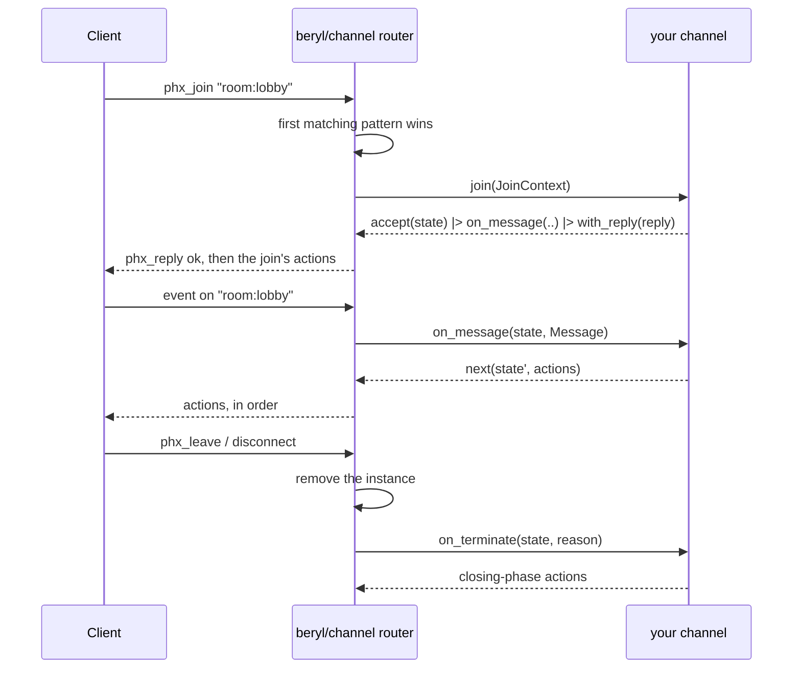

`beryl/channel` is the **recommended default** for applications that serve
more than one topic namespace on a socket. It is also the default for a Phoenix
style design. Register a list of channel handlers. The layer routes each join,
message, server message, and close to the correct channel.

If you are not sure which layer you want, read
[Choose an API](/choosing-an-api/) first. If you want one topic family and
complete control over routing, use [App-Side Dispatch](/guides/dispatch/)
instead. It is the core API under the channel layer.

:::note[One package]
The `beryl` package includes the `beryl/channel` module. Applications need
`beryl` and one transport. See
[Installation](/installation/) for the dependency block.
:::

## The shape

A channel is a **topic pattern** plus a typed `join` callback. The `join`
callback receives one context value. It rejects the join or accepts it with
private state and callbacks.

```gleam
// src/my_app/room_channel.gleam
import beryl/channel
import gleam/json

/// This channel's private state — one value per joined topic.
type State {
  State(room_id: String, username: String, sent: Int)
}

/// This channel's server-side message type.
type Note {
  Tick(Int)
}

pub fn room() -> channel.Handler {
  channel.handler("room:*", fn(context: channel.JoinContext(Note)) {
    let state =
      State(
        room_id: context.topic,
        username: context.socket_id,
        sent: 0,
      )

    channel.accept(state)
    |> channel.on_message(fn(state: State, message: channel.Message) {
      channel.next(
        State(..state, sent: state.sent + 1),
        [
          channel.broadcast_from(message.event, json.int(state.sent + 1)),
        ],
      )
    })
    |> channel.on_info(fn(state: State, note: Note) {
      let Tick(at) = note
      channel.next(state, [channel.push("tick", json.int(at))])
    })
    |> channel.on_terminate(fn(state: State, _reason) {
      [channel.broadcast("left", json.string(state.username))]
    })
    |> channel.with_reply(
      json.object([#("room", json.string(context.topic))]),
    )
    |> channel.with_actions([
      channel.broadcast("joined", json.string(state.username)),
    ])
  })
}
```

`State` and `Note` stay private. `channel.handler` returns a plain
`channel.Handler`, not a generic value. Thus, unrelated channels can use one
handler list.

## Starting a channel system

`channel.child_spec` takes the same `beryl.Config` as `beryl.child_spec`. The
config contains the codec, rate limits, presence handle, PubSub, and logging.
`channel.child_spec` also takes the handler table. It returns a
`beryl.Sockets` handle and a child specification for the application
supervision tree.

```gleam
// src/my_app.gleam
import beryl
import beryl/transport/server
import beryl/wire
import beryl/channel
import beryl_mist as mist_transport
import gleam/bytes_tree
import gleam/erlang/process
import gleam/http/request
import gleam/http/response
import gleam/otp/static_supervisor
import mist
import my_app/room_channel

pub fn handlers() -> List(channel.Handler) {
  [room_channel.room()]
}

pub fn main() {
  let config =
    beryl.config(wire.phoenix_codec())
    |> beryl.with_frame_rate(per_second: 35, burst: 70)
    |> beryl.with_message_rate(per_second: 30, burst: 60)

  let assert Ok(#(sockets, spec)) =
    channel.child_spec(config, handlers: handlers())
  let assert Ok(_root) =
    static_supervisor.new(static_supervisor.OneForOne)
    |> static_supervisor.add(spec)
    |> static_supervisor.start()

  // `sockets` is an ordinary core handle: hand it to a transport, to
  // `beryl.broadcast`, and to `beryl.stop`.
  let assert Ok(_) =
    mist_transport.handler(
      sockets,
      server.default_config("/socket/websocket"),
      handle_http,
    )
    |> mist.new
    |> mist.port(8000)
    |> mist.start

  process.sleep_forever()
}

fn handle_http(
  _req: request.Request(mist.Connection),
) -> response.Response(mist.ResponseData) {
  response.new(404)
  |> response.set_body(mist.Bytes(bytes_tree.new()))
}
```

`handle_http` is the HTTP fallback. `mist_transport.handler` routes WebSocket
upgrades on the configured path to beryl. It sends all other requests to
`handle_http`. The
[Quick Start](/quick-start/#2-start-the-channel-system-and-wire-the-transport)
shows how to serve pages from this function.

Both APIs use the same runtime, wire codec, presence, abuse controls, and
transports. The channel layer supplies only the `init` and `update` pair.

`child_spec` reports eager validation failures as
`channel.ChildSpecError`:

| Variant | Meaning |
|---|---|
| `InvalidPattern(pattern, reason)` | A handler pattern is invalid |
| `DuplicatePattern(pattern)` | The same pattern was registered twice |
| `InvalidConfig(beryl.ConfigError)` | The core's eager config validation failed |

## Handler patterns and precedence

Patterns use beryl topic syntax, such as `"room:lobby"`, `"room:*"`,
`"document:*:ops"`, and `"*"`. The layer checks patterns in
**registration order**. The first match owns the topic.

A bigger `handlers()` returns one entry per channel module:

```gleam
// A fragment of `handlers()` — see "Starting a channel system" above.
[
  // Special-case one topic by putting it ahead of the wildcard.
  lobby_channel.lobby(),        // "room:lobby"
  room_channel.room(),          // "room:*"
  document_channel.document(),  // "document:*"
]
```

Patterns can overlap. Put `"room:lobby"` before `"room:*"` to give the lobby a
separate channel. Put specific patterns first. If `"room:*"` comes first, the
lobby handler cannot receive a join. The layer cannot detect this routing
error. It rejects duplicate pattern strings because the second handler cannot
receive a join. It also rejects unmatched topics with
`{"reason": "unmatched topic"}`.

`InvalidPattern` contains the core
[`topic.TopicError`](/reference/api/beryl-topic/) itself rather than a
flattened string, so the reason stays matchable. New variants may be added
in a minor release, so use a catch-all when the exact reason does not
change your handling:

```gleam
Error(channel.InvalidPattern(pattern, _reason)) ->
  panic as { "invalid channel pattern " <> pattern }
```

The same rule applies to
`beryl.InvalidTopicPattern(pattern, reason)`, which nests the identical
`topic.TopicError`.

Validation has two phases. First, `child_spec` checks pattern syntax in
registration order. Then it checks for duplicate strings in the same order. It
does this before it builds the supervised subtree.

## Typed state instead of assigns

Phoenix keeps per-channel state in `socket.assigns`, a map of atoms to
untyped terms. A beryl channel keeps a **value of its own type**, chosen
by the channel and known to the compiler:

```gleam
type State {
  State(room_id: String, username: String, sent: Int)
}

// Inside the `join` callback:
channel.accept(State(room_id: context.topic, username: name, sent: 0))
```

`channel.handler` captures the state in the callback closures. Each
`channel.next` result rebuilds the closures with the next state. The layer does
not erase the state to `Dynamic` or use unchecked coercion. Therefore, one
`List(Handler)` can contain channels with unrelated state types.

The layer keeps **one instance per joined topic**. A socket joined to
`room:general` and `room:random` has two independent `State` values, and
the layer prunes an instance when its topic closes. You do not write
cleanup code for the state itself.

## `JoinContext` and the typed sender

The `join` callback receives a `channel.JoinContext(info)`:

| Field | Type | What it is |
|---|---|---|
| `socket_id` | `String` | Unique id of the socket that is joining |
| `seed` | `socket.ConnectSeed` | Request data the transport assembled before the upgrade: path, query, headers, and any `on_connect` metadata |
| `self` | `channel.Sender(info)` | This channel instance's own typed sender |
| `topic` | `String` | Concrete topic being joined |
| `params` | `List(String)` | Wildcard captures in pattern order; exact patterns receive `[]` |
| `payload` | `Dynamic` | Raw client join payload |

The layer builds one `JoinContext` for each join. It is not the core
`socket.ConnectInfo`. The layer owns the socket model and message type. This
lets channels keep private state and private message types. Each join receives
the required connection data and a sender for that join.

`channel.notify(sender, message)` delivers `message` to that channel's
`on_info` callback with its type intact:

```gleam
pub type Note {
  Tick(Int)
}

// Anywhere — a timer, a domain actor, an HTTP handler:
channel.notify(sender, Tick(1))
```

This mechanism does not use casts. `notify` seals the typed value in a closure.
It creates an **envelope** with the join topic and generation. The layer
increments the generation for each join attempt and does not reuse it. The
envelope has no readable payload. The router compares the envelope with the
live instance. Only the owning join can open it, during the delivery turn. The
socket actor's mailbox does not store the typed value between turns.

Opening the envelope uses a selective receive on the socket actor's mailbox.
This occurs in the same turn, so one delivery costs O(mailbox depth). The cost
is small for a short mailbox. A deep backlog makes `notify` unsuitable for a
high-rate data path. See
[Limitations](#limitations).

### Stale senders

A sender applies only to the join that produced it. Sending is asynchronous
and does not report failure. The receiver determines whether the channel is
live:

- If the channel has **closed** after a client leave, `close([])`, or socket
  teardown, the layer drops the sealed envelope.
- If the same topic has since been **joined again**, the envelope's
  generation no longer matches the live instance, so it is dropped rather
  than handed to the new join.
- A live match delivers exactly one `on_info` call. Sends are never
  coalesced, and they arrive in the order the owning socket receives them.

A long-lived process can keep a sender. It cannot send a message to a different
join. If the target join is gone, the message is dropped.

A **panic inside `on_terminate`** is an exception. For a crash during topic
close, the core logs the crash and keeps the model from before the close. That
model still contains the channel instance. Its sender can deliver `on_info`
until the topic joins again or the socket ends. See
[Crash behavior](#crash-behavior).

Use `notify` to schedule a **later** turn, including from another process. Put
work that must occur during the join in
[join actions](#join-actions).

## Action builders

An action is one thing to do **on this channel's own topic**. Constructors
return one opaque action; put them in a list in wire order:

| Action | Effect |
|---|---|
| `push(event, payload)` | Server-initiated message to this socket on this topic |
| `broadcast(event, payload)` | To every subscriber of this topic, including this socket |
| `broadcast_from(event, payload)` | To every subscriber except this socket |
| `reply_ok(reply, payload)` | Success reply when `Message.reply` is `Some`; no effect for `None` |
| `reply_error(reply, payload)` | Error reply with the same optional-ref behavior |
| `presence_track(key, meta)` | Track this socket under `key` and emit the `presence_diff` join |
| `presence_untrack(key)` | Untrack and emit the `presence_diff` leave |
| `push_presence(event, encode)` | Presence snapshot for this topic, to this socket |
| `broadcast_presence(event, encode)` | Presence snapshot for this topic, to every subscriber |

No action names a topic: actions are always scoped to the channel that
returned them. Cross-topic work is [a deliberate limitation](#limitations).

Presence actions need a presence handle on the config
(`beryl.with_presence_handle`); without one they are dropped with a
warning, exactly as the equivalent core effects are.

### Order is wire order

The runtime applies channel actions in list order. Each action maps to one core
`socket.Effect`. An asynchronous presence effect can pause this socket while
other sockets continue. The remaining actions resume after the effect
completes.

The `encode` callbacks of `push_presence` and `broadcast_presence` run
**when the action is applied**, so a snapshot already reflects any
`presence_track` or `presence_untrack` earlier in the same list:

```gleam
[
  channel.presence_track(state.username, meta(state)),
  channel.broadcast_presence("presence_list", presence_helpers.encode_users),
]
```

## Join actions

`channel.with_actions` attaches ordered actions to an accepted join. They
are emitted with the acknowledgment and applied strictly after it:

```gleam
channel.accept(state)
|> channel.with_reply(reply)
|> channel.with_actions([
  channel.presence_track(state.username, meta(state)),
  channel.broadcast("new_msg", joined_message(state)),
  channel.broadcast_presence("presence_list", encode_users),
])
```

Two consequences worth designing around:

- **The acknowledgment always reaches the wire first.** The socket is
  already subscribed to the topic when the join's own actions run, so a
  `push` cannot overtake its own join reply.
- **Effect order is per socket, not a cross-socket transaction.** If an
  action lowers to asynchronous presence work, the runtime may process other
  sockets while this one waits. Use application-owned synchronous state for
  an atomic capacity reservation.

`with_actions` appends, so it composes with itself, and it returns
`channel.reject` results unchanged: a refused join has no topic to act on.

Use join actions instead of sending `notify` to the same channel from `join`.
`notify` schedules a later input. Join actions stay directly after the join
acknowledgment.

## Handling input

| Callback | Runs on | Signature |
|---|---|---|
| `on_message` | A client message on this topic | `fn(state, channel.Message) -> Next(state)` |
| `on_info` | A `notify` addressed to this join | `fn(state, info) -> Next(state)` |
| `on_terminate` | This channel ending, for any reason | `fn(state, socket.StopReason) -> List(Action(Closing))` |

`channel.accept(state)` stays joined until you add callbacks with the `on_*`
builders. Unhandled messages and server-side notifications have no effect.
For raw binary frames, use [App-Side Dispatch](/guides/dispatch/).

A `channel.Message` has `event`, the raw `payload` as `Dynamic`, and
`reply: Option(socket.ReplyRef)` — present only when the client asked for a
reply. Store `context.topic` in channel state when a callback needs it:

```gleam
|> channel.on_message(fn(state: State, message: channel.Message) {
  case message.event {
    "new_msg" ->
      channel.next(state, [
        channel.broadcast("new_msg", body(message.payload)),
        channel.reply_ok(message.reply, json.object([])),
      ])

    "typing" ->
      channel.next(state, [
        channel.broadcast_from("typing", json.object([])),
      ])

    _ -> channel.stay(state)
  }
})
```

Every callback answers with a `channel.Next(state)`:

| Result | Meaning |
|---|---|
| `next(state, actions)` | Stay joined, applying the active-phase actions in order |
| `stay(state)` | Stay joined with no actions |
| `close(actions)` | Apply active-phase actions, then leave this channel |

`close` applies its actions first and then closes the topic, so a
farewell broadcast still reaches the topic's subscribers.

## Termination

`on_terminate` runs once for each accepted join. It runs after `phx_leave`,
`close([])`, socket disconnect, heartbeat timeout, and `beryl.stop`. A rejected
join does not create an instance, so it does not run `on_terminate`.

The actions it returns are lowered inside the turn that closes the topic,
right after the instance has been removed. Closing-phase lists can contain
`broadcast`, `broadcast_from`, `presence_untrack`, and
`broadcast_presence`. Active-only pushes, replies, presence tracking, and
presence pushes do not type-check in `on_terminate`.

This is why a leave announcement and a post-leave roster belong here
rather than in an out-of-band broadcast:

```gleam
|> channel.on_terminate(fn(state: State, _reason) {
  [
    channel.broadcast("new_msg", departure(state)),
    channel.presence_untrack(state.username),
    channel.broadcast_presence("presence_list", encode_users),
  ]
})
```

Put `presence_untrack` before `broadcast_presence`. The runtime encodes the
snapshot after it applies the untrack, so the roster is current. The runtime
also removes presence entries when the topic closes. That removal occurs after
`Closed`, not before your actions.

## Lifecycle at a glance



## Crash behavior

An app panic does not stop the runtime. The core limits the effect based on
where the panic occurred:

| Panic in | Effect |
|---|---|
| `join` | That join is rejected; the socket survives |
| `on_message` | That topic closes; the socket's other topics survive |
| `on_info` | The whole socket is torn down |
| `on_terminate` | Teardown still completes, and sibling channels still run their own termination actions |

A panic inside `on_terminate` discards the channel's `Closed` turn. The
termination actions and model update are lost. The instance stays at its
original generation. The core cannot reach it through the closed topic. Client messages and another
`Closed` cannot name it. However, `on_info` applies to the socket, not the
topic. A `Sender` from that join can still deliver to the retained instance. A
rejoin replaces the entry, and socket shutdown removes it.

The panic discards the model update that would remove the instance. Catching
the callback in the layer would hide a crash that the core must log. Moving
termination to another turn would make a termination panic close the socket.
`crash_test` fixes this behavior. Keep code that can panic out of
`on_terminate`. Then a closed channel is removed and its senders reach nothing.

Crash isolation stops at the socket, as it does with raw dispatch: a
panic in `on_info` ends one socket, not the router. Another fault in that
socket actor also loses only that socket. A router crash loses every socket on
that `beryl.Sockets` handle. See
[Runtime & Effect Interpreter](/architecture/runtime/).

## Supervision

`channel.child_spec` mirrors `beryl.child_spec` for applications
that own their supervision tree:

```gleam
// src/my_app/supervised.gleam
import beryl
import beryl/wire
import beryl/channel
import gleam/otp/static_supervisor
import my_app

pub fn start_supervised() -> beryl.Sockets {
  let assert Ok(#(sockets, spec)) =
    channel.child_spec(
      beryl.config(wire.phoenix_codec()),
      handlers: my_app.handlers(),
    )

  let assert Ok(_root) =
    static_supervisor.new(static_supervisor.OneForOne)
    |> static_supervisor.add(spec)
    |> static_supervisor.start()

  sockets
}
```

It reports the same eager validation failures as
`channel.ChildSpecError` — see the table in
[Starting a channel system](#starting-a-channel-system).

The channel layer uses the core subtree, restart policy, and `beryl.stop`
behavior. See the [Supervision guide](/guides/supervision/). The application
must start and supervise PubSub, presence, and group actors. Pass their handles
to `beryl.Config`.

After a runtime crash the handle keeps working for new connections, but
every live channel instance is gone: clients reconnect and rejoin, and
each join runs afresh.

## Migrating from `beryl_channels`

The compiler guides the package-boundary migration:

1. Remove the `beryl_channels` dependency from `gleam.toml`.
2. Replace imports of `beryl_channels/channel` with `beryl/channel`.
3. Remove the root `beryl_channels` import and call
   `channel.child_spec(config, handlers:)`.
4. Match startup errors as `channel.InvalidPattern`,
   `channel.DuplicatePattern`, and `channel.InvalidConfig`.

Handler construction, closure-sealed state and server messages, action
ordering, and callback behavior are unchanged. Run `gleam check` to find every
remaining old import or qualified error name.

## Limitations

The layer handles one topic at a time. Note these limits:

- **Each action is topic-scoped.** A `room:general` channel cannot broadcast
  on `lobby`. Cross-topic publishing goes through the external `Sockets`
  APIs — `beryl.broadcast`, `beryl.broadcast_from`, or a `beryl/group`
  actor — with the handle `channel.child_spec` returned.
- **Handlers are built before the handle is returned.** A channel cannot
  capture the `Sockets` handle directly while constructing its handler.
  The usual pattern is a small actor that holds the handle and exposes a
  `publish(topic, event, payload)` function — the equivalent of Phoenix's
  `Endpoint.broadcast/3` — bound after `child_spec` returns and before the
  transport starts accepting connections.
  [`examples/showcase`](https://github.com/tylerbutler/beryl/tree/main/examples/showcase)
  does exactly this for its `lobby` room list.
- **Channels do not share state with each other.** Anything two channels
  both need — a document store, a presence handle, a groups actor — is a
  dependency you capture in the handler closures when you build the
  table.
- **The layer owns the socket-level model and message type.** Pick raw
  dispatch or the channel layer per socket endpoint; mixing hand-written
  `update` logic into a channel system is not a supported surface.
- **Raw binary frames require raw dispatch.** Binary frames decoded by the
  configured codec into normal events still reach `on_message`.
- **`beryl/bridge` targets the core sender, not a channel's.**
  `bridge.start(to:, with:)` wants a `beryl/socket.Sender`, which a
  channel never sees. To adapt an existing actor's messages into
  `on_info`, forward them yourself from your own process by calling
  `channel.notify(context.self, ..)` — the sealed sender is safe to hold and
  is dropped after the join ends.
- **Nothing is per-topic-process.** Like raw dispatch, all of a socket's
  channels run in its socket actor, sequentially. Long or blocking work
  belongs in your own process, which can hand results back through
  `channel.notify`.
- **`notify` delivery costs O(mailbox depth).** Keeping the typed value
  out of the mailbox costs a same-turn selective receive on the socket
  actor's mailbox, which scans it. Fine at ordinary depths; not a
  free high-rate data path on a socket with a deep backlog. Batch in your
  own process rather than sending per item.

## Next steps

- [Choose an API](/choosing-an-api/) — when to use this layer and when to use raw dispatch
- [Coming from Phoenix](/guides/coming-from-phoenix/) — the callback-by-callback map
- [App-Side Dispatch](/guides/dispatch/) — the core this layer is built on
- [Presence](/guides/presence/) — the presence actor the presence actions need
- [Supervision](/guides/supervision/) — subtree shape, crash, and shutdown semantics
- [`beryl/channel`](/reference/api/beryl-channel/) — generated API reference
