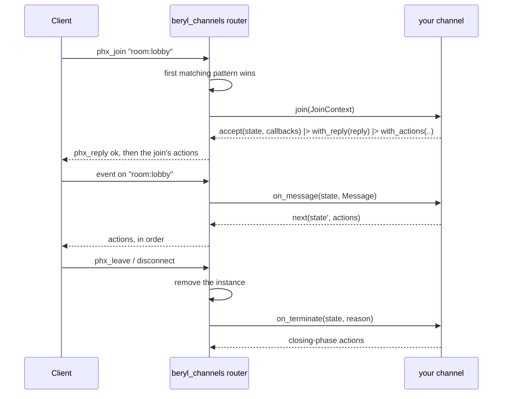

`beryl_channels` is the **recommended default** for applications that serve
more than one topic namespace on a socket, and for anyone porting a
Phoenix-shaped design. You register a list of channel handlers, and the
layer routes every join, message, binary frame, typed server-side message,
and close to the channel that owns the topic.

If you are not sure which layer you want, read
[Choose an API](/choosing-an-api/) first. If you want one topic family and
complete control over routing, use [App-Side Dispatch](/guides/dispatch/)
instead — it is the core the channel layer is built on.

:::note[Separate package]
The channel layer ships as its own package. Beryl packages are currently
distributed from GitHub, not Hex, so add it alongside beryl and a transport
in `gleam.toml`:

```toml
[dependencies]
beryl = { git = "https://github.com/tylerbutler/beryl.git", ref = "main", path = "packages/beryl" }
beryl_channels = { git = "https://github.com/tylerbutler/beryl.git", ref = "main", path = "packages/beryl_channels" }
beryl_mist = { git = "https://github.com/tylerbutler/beryl.git", ref = "main", path = "packages/beryl_mist" }
```

See [Installation](/installation/) for version and transport choices.
:::

## The shape

A channel is a **topic pattern** plus a typed `join` callback. The `join`
callback receives one context value and answers with a rejection or an
accepted private state and callback set.

```gleam
// src/my_app/room_channel.gleam
import beryl_channels/channel
import gleam/json

/// This channel's private state — one value per joined topic.
type State {
  State(room_id: String, username: String, sent: Int)
}

/// This channel's server-side message type.
type Note {
  Tick(Int)
}

pub fn room() -> channel.Handler {
  channel.handler("room:*", fn(context: channel.JoinContext(Note)) {
    let state =
      State(
        room_id: context.topic,
        username: context.socket_id,
        sent: 0,
      )

    channel.accept(state, callbacks())
    |> channel.with_reply(
      json.object([#("room", json.string(context.topic))]),
    )
    |> channel.with_actions([
      channel.broadcast("joined", json.string(state.username)),
    ])
  })
}

fn callbacks() -> channel.Callbacks(State, Note) {
  channel.callbacks()
  |> channel.on_message(fn(state: State, message: channel.Message) {
    channel.next(
      State(..state, sent: state.sent + 1),
      [
        channel.broadcast_from(message.event, json.int(state.sent + 1)),
      ],
    )
  })
  |> channel.on_info(fn(state: State, note: Note) {
    let Tick(at) = note
    channel.next(state, [channel.push("tick", json.int(at))])
  })
  |> channel.on_terminate(fn(state: State, _reason) {
    [channel.broadcast("left", json.string(state.username))]
  })
}
```

Nothing about `State` or `Note` escapes: `channel.handler` returns a
plain `channel.Handler`, not a generic one, so channels that agree on
nothing compose in a single list.

## Starting a channel system

`beryl_channels.child_spec` takes the same `beryl.Config` as
`beryl.child_spec` — codec, rate limits, presence handle, PubSub, logging —
plus the handler table. It returns the ordinary `beryl.Sockets` handle and a
child specification for your application's supervision tree.

```gleam
// src/my_app.gleam
import beryl
import beryl/transport/server
import beryl/wire
import beryl_channels
import beryl_channels/channel
import beryl_mist as mist_transport
import gleam/bytes_tree
import gleam/erlang/process
import gleam/http/request
import gleam/http/response
import gleam/otp/static_supervisor
import mist
import my_app/room_channel

pub fn handlers() -> List(channel.Handler) {
  [room_channel.room()]
}

pub fn main() {
  let config =
    beryl.config(wire.phoenix_codec())
    |> beryl.with_frame_rate(per_second: 35, burst: 70)
    |> beryl.with_message_rate(per_second: 30, burst: 60)

  let assert Ok(#(sockets, spec)) =
    beryl_channels.child_spec(config, handlers: handlers())
  let assert Ok(_root) =
    static_supervisor.new(static_supervisor.OneForOne)
    |> static_supervisor.add(spec)
    |> static_supervisor.start()

  // `sockets` is an ordinary core handle: hand it to a transport, to
  // `beryl.broadcast`, and to `beryl.stop`.
  let assert Ok(_) =
    mist_transport.handler(
      sockets,
      server.default_config("/socket/websocket"),
      handle_http,
    )
    |> mist.new
    |> mist.port(8000)
    |> mist.start

  process.sleep_forever()
}

fn handle_http(
  _req: request.Request(mist.Connection),
) -> response.Response(mist.ResponseData) {
  response.new(404)
  |> response.set_body(mist.Bytes(bytes_tree.new()))
}
```

`handle_http` is the plain HTTP fallback: `mist_transport.handler` routes
WebSocket upgrades on the configured path into beryl and hands every other
request to it. The [Quick Start](/quick-start/#2-start-the-channel-system-and-wire-the-transport)
serves real pages from the same function.

Everything downstream of `child_spec` is unchanged from raw dispatch: the same
runtime, the same wire codec, the same presence and abuse controls, the
same transports. The layer only supplies the `init`/`update` pair.

`child_spec` reports eager validation failures as
`beryl_channels.ChildSpecError`:

| Variant | Meaning |
|---|---|
| `InvalidPattern(pattern, reason)` | A handler pattern is invalid |
| `DuplicatePattern(pattern)` | The same pattern was registered twice |
| `InvalidConfig(beryl.ConfigError)` | The core's eager config validation failed |

## Handler patterns and precedence

Patterns use beryl's topic pattern syntax — `"room:lobby"`, `"room:*"`,
`"document:*:ops"`, `"*"` — and are matched in **registration order**.
The first pattern that matches a topic owns it.

A bigger `handlers()` returns one entry per channel module:

```gleam
// A fragment of `handlers()` — see "Starting a channel system" above.
[
  // Special-case one topic by putting it ahead of the wildcard.
  lobby_channel.lobby(),        // "room:lobby"
  room_channel.room(),          // "room:*"
  document_channel.document(),  // "document:*"
]
```

- **Overlapping patterns are allowed and useful.** `"room:lobby"` ahead of
  `"room:*"` is the normal way to give one topic its own channel.
- **More specific patterns belong earlier.** A `"room:*"` registered ahead
  of `"room:lobby"` would make the lobby channel unreachable — that is a
  routing mistake the layer cannot detect for you.
- **Two handlers with the same pattern string are rejected**, because the
  second could never receive a join.
- **A join for a topic no handler matches is refused explicitly** with
  `{"reason": "unmatched topic"}` rather than left unanswered.

`InvalidPattern` carries the core
[`topic.TopicError`](/reference/api/beryl-topic/) itself rather than a
flattened string, so the reason stays matchable. New variants may be added
in a minor release, so use a catch-all when the exact reason does not
change your handling:

```gleam
Error(beryl_channels.InvalidPattern(pattern, _reason)) ->
  panic as { "invalid channel pattern " <> pattern }
```

The same rule applies to
`beryl.InvalidTopicPattern(pattern, reason)`, which nests the identical
`topic.TopicError`.

Validation is deterministic and two-phase: every pattern's syntax is
checked in registration order first, then duplicate pattern strings are
looked for in registration order. `child_spec` performs this check before
building the supervised subtree.

## Typed state instead of assigns

Phoenix keeps per-channel state in `socket.assigns`, a map of atoms to
untyped terms. A beryl channel keeps a **value of its own type**, chosen
by the channel and known to the compiler:

```gleam
type State {
  State(room_id: String, username: String, sent: Int)
}

// Inside the `join` callback:
channel.accept(
  State(room_id: context.topic, username: name, sent: 0),
  callbacks(),
)
```

`channel.accept` binds the state to the callbacks by capturing it in
closures. Each `channel.next` result rebuilds the same closures over the
next state. No value is ever erased to `Dynamic`, and no
unchecked coercion is involved — which is why a `List(Handler)` can hold
channels whose states have nothing in common.

The layer keeps **one instance per joined topic**. A socket joined to
`room:general` and `room:random` has two independent `State` values, and
the layer prunes an instance when its topic closes. You do not write
cleanup code for the state itself.

## `JoinContext` and the typed sender

The `join` callback receives a `channel.JoinContext(info)`:

| Field | Type | What it is |
|---|---|---|
| `socket_id` | `String` | Unique id of the socket that is joining |
| `seed` | `socket.ConnectSeed` | Request data the transport assembled before the upgrade: path, query, headers, and any `on_connect` metadata |
| `self` | `channel.Sender(info)` | This channel instance's own typed sender |
| `topic` | `String` | Concrete topic being joined |
| `params` | `List(String)` | Wildcard captures in pattern order; exact patterns receive `[]` |
| `payload` | `Dynamic` | Raw client join payload |

`JoinContext` is a per-join view built by the layer, not beryl's core
`socket.ConnectInfo`. The layer owns the socket-level model and the
socket-level message type — that is what lets channels keep private state
and private message types — so it hands each join the connection facts it
needs plus a sender scoped to *this* join, rather
than the core connect record.

`channel.notify(sender, message)` delivers `message` to that channel's
`on_info` callback with its type intact:

```gleam
pub type Note {
  Tick(Int)
}

// Anywhere — a timer, a domain actor, an HTTP handler:
channel.notify(sender, Tick(1))
```

The mechanism is cast-free. `notify` seals the typed value inside a
closure and hands the layer an **envelope** stamped with this join's topic
and generation — a counter the layer advances on every join attempt and
never reuses. The envelope carries no readable payload; the router
compares its stamp against the live instance and only then lets the
owning join open it, in the same turn it is delivered. Nothing typed is
ever parked in a shared mailbox between turns, and nothing is coerced on
the way through.

Cast-free is not cost-free. Opening the envelope is a selective receive
on the socket's runtime actor mailbox, performed in the same turn, so one
delivery costs O(mailbox depth). At ordinary depths that is noise; on a
socket running a deep backlog it is the thing to know before making
`notify` a high-rate data path. See
[Limitations](#limitations).

### Stale senders

A sender is scoped to the join that produced it. Sending is asynchronous
and never fails, so it cannot report that the channel is gone — liveness
is decided where the message is delivered:

- If the channel has **closed** normally — a client leave, a `close([])`
  result, a socket teardown — the envelope is dropped, still sealed.
- If the same topic has since been **joined again**, the envelope's
  generation no longer matches the live instance, so it is dropped rather
  than handed to the new join.
- A live match delivers exactly one `on_info` call. Sends are never
  coalesced, and they arrive in the order the owning socket receives them.

So a sender kept by a long-lived process is always safe to use: it never
reaches a *different* join, and the ordinary worst case is that the
message goes nowhere.

There is one exception, and it is the only one: a **panic inside
`on_terminate`**. Core's policy for a crash while closing a topic is to
log it and keep the model from before the close — which is the model that
still lists that instance. The instance therefore outlives its own
termination, and its own sender keeps delivering `on_info` to it until
the topic is joined again or the socket ends. See
[Crash behavior](#crash-behavior).

Use `notify` to schedule a **later** turn — including from another
process. Work that has to be part of the join itself belongs in
[join actions](#join-actions).

## Actions

An action is one thing to do **on this channel's own topic**. Constructors
return one opaque action; put them in a list in wire order:

| Action | Effect |
|---|---|
| `push(event, payload)` | Server-initiated message to this socket on this topic |
| `broadcast(event, payload)` | To every subscriber of this topic, including this socket |
| `broadcast_from(event, payload)` | To every subscriber except this socket |
| `reply_ok(reply, payload)` | Success reply when `Message.reply` is `Some`; no effect for `None` |
| `reply_error(reply, payload)` | Error reply with the same optional-ref behavior |
| `presence_track(key, meta)` | Track this socket under `key` and emit the `presence_diff` join |
| `presence_untrack(key)` | Untrack and emit the `presence_diff` leave |
| `push_presence(event, encode)` | Presence snapshot for this topic, to this socket |
| `broadcast_presence(event, encode)` | Presence snapshot for this topic, to every subscriber |

No action names a topic: actions are always scoped to the channel that
returned them. Cross-topic work is [a deliberate limitation](#limitations).

Presence actions need a presence handle on the config
(`beryl.with_presence_handle`); without one they are dropped with a
warning, exactly as the equivalent core effects are.

### Order is wire order

Actions are applied strictly in the order they were added. They lower
one-to-one onto core `socket.Effect` values, which the runtime applies in
list order. An asynchronous presence effect can park this socket while other
sockets continue; the remaining actions resume only after it completes.

The `encode` callbacks of `push_presence` and `broadcast_presence` run
**when the action is applied**, so a snapshot already reflects any
`presence_track` or `presence_untrack` earlier in the same list:

```gleam
[
  channel.presence_track(state.username, meta(state)),
  channel.broadcast_presence("presence_list", presence_helpers.encode_users),
]
```

## Join actions

`channel.with_actions` attaches ordered actions to an accepted join. They
are emitted with the acknowledgment and applied strictly after it:

```gleam
channel.accept(state, callbacks())
|> channel.with_reply(reply)
|> channel.with_actions([
  channel.presence_track(state.username, meta(state)),
  channel.broadcast("new_msg", joined_message(state)),
  channel.broadcast_presence("presence_list", encode_users),
])
```

Two consequences worth designing around:

- **The acknowledgment always reaches the wire first.** The socket is
  already subscribed to the topic when the join's own actions run, so a
  `push` cannot overtake its own join reply.
- **Effect order is per socket, not a cross-socket transaction.** If an
  action lowers to asynchronous presence work, the runtime may process other
  sockets while this one waits. Use application-owned synchronous state for
  an atomic capacity reservation.

`with_actions` appends, so it composes with itself, and it returns
`channel.reject` results unchanged: a refused join has no topic to act on.

This is what to reach for instead of notifying yourself from `join`.
`notify` schedules a later input; actions preserve their declared position
immediately after the join acknowledgment.

## Handling input

| Callback | Runs on | Signature |
|---|---|---|
| `on_message` | A client message on this topic | `fn(state, channel.Message) -> Next(state)` |
| `on_binary` | A binary frame on this topic | `fn(state, BitArray) -> Next(state)` |
| `on_info` | A `notify` addressed to this join | `fn(state, info) -> Next(state)` |
| `on_terminate` | This channel ending, for any reason | `fn(state, socket.StopReason) -> List(Action(Closing))` |

`channel.callbacks()` starts from callbacks that ignore every input and
stay joined; override only what the channel cares about.

A `channel.Message` carries `topic`, `event`, the raw `payload` as
`Dynamic`, and `reply: Option(socket.ReplyRef)` — present only when the client
asked for a reply:

```gleam
channel.on_message(fn(state: State, message: channel.Message) {
  case message.event {
    "new_msg" ->
      channel.next(state, [
        channel.broadcast("new_msg", body(message.payload)),
        channel.reply_ok(message.reply, json.object([])),
      ])

    "typing" ->
      channel.next(state, [
        channel.broadcast_from("typing", json.object([])),
      ])

    _ -> channel.next(state, [])
  }
})
```

Every callback answers with a `channel.Next(state)`:

| Result | Meaning |
|---|---|
| `next(state, actions)` | Stay joined, applying the active-phase actions in order |
| `close(actions)` | Apply active-phase actions, then leave this channel |
| `stop_socket(reason)` | Tear down the whole socket |

`close` applies its actions first and then closes the topic, so a
farewell broadcast still reaches the topic's subscribers.
`stop_socket` deliberately carries no actions: the socket and every
channel on it are going away, so there is nothing left to apply them to —
but each channel still runs its `on_terminate`.

## Termination

`on_terminate` runs **exactly once per accepted join**, on every exit
path: a client `phx_leave`, a `close([])` result, `stop_socket`, a socket
disconnect, a heartbeat timeout, and `beryl.stop`. A join that was
*rejected* never started an instance, so it never terminates.

The actions it returns are lowered inside the turn that closes the topic,
right after the instance has been removed. Closing-phase lists can contain
`broadcast`, `broadcast_from`, `presence_untrack`, and
`broadcast_presence`. Active-only pushes, replies, presence tracking, and
presence pushes do not type-check in `on_terminate`.

This is why a leave announcement and a post-leave roster belong here
rather than in an out-of-band broadcast:

```gleam
channel.on_terminate(fn(state: State, _reason) {
  [
    channel.broadcast("new_msg", departure(state)),
    channel.presence_untrack(state.username),
    channel.broadcast_presence("presence_list", encode_users),
  ]
})
```

Ordering the explicit `presence_untrack` *before* the
`broadcast_presence` is what makes the roster correct: the snapshot is
encoded when the action is applied, after the untrack, so it cannot be
stale. Presence entries are auto-untracked when the topic closes anyway, but the
automatic untrack runs after `Closed`, not before your actions.

## Lifecycle at a glance



## Crash behavior

App code that panics never takes the runtime down. The core's crash
policy is attributed by *where* the panic happened, and the layer does not
blunt it:

| Panic in | Effect |
|---|---|
| `join` | That join is rejected; the socket survives |
| `on_message` / `on_binary` | That topic closes; the socket's other topics survive |
| `on_info` | The whole socket is torn down |
| `on_terminate` | Teardown still completes, and sibling channels still run their own termination actions |

A panic inside `on_terminate` discards that channel's own `Closed` turn,
so its termination actions are lost — and so is the model update that
removed its instance from the layer's map. The instance is retained at
its original generation. Core cannot reach it: the topic is closed, so no
client message, binary frame, or second `Closed` can name it. But
`on_info` is socket-scoped rather than topic-scoped, so a `Sender` created
by that join still resolves to the retained instance and still delivers to
it — until the topic is joined again (a rejoin overwrites the entry) or
the socket ends.

That is a deliberate trade, not an oversight. Undoing it is exactly the
model update the panic threw away, and the alternatives — rescuing the
callback inside the layer, or moving termination onto a second turn — hide
a crash core is responsible for logging, or make a terminate panic
socket-fatal. `crash_test` pins the behavior so it cannot drift quietly.
Keep `on_terminate` free of code that can panic and the ordinary rule
holds: a closed channel is gone, and its senders reach nothing.

Crash isolation stops at the socket, as it does with raw dispatch: a
panic in `on_info` ends one socket, not the runtime. A crash of the
runtime actor itself still loses every socket on that `beryl.Sockets`
handle. See [Runtime & Effect Interpreter](/architecture/runtime/).

## Supervision

`beryl_channels.child_spec` mirrors `beryl.child_spec` for applications
that own their supervision tree:

```gleam
// src/my_app/supervised.gleam
import beryl
import beryl/wire
import beryl_channels
import gleam/otp/static_supervisor
import my_app

pub fn start_supervised() -> beryl.Sockets {
  let assert Ok(#(sockets, spec)) =
    beryl_channels.child_spec(
      beryl.config(wire.phoenix_codec()),
      handlers: my_app.handlers(),
    )

  let assert Ok(_root) =
    static_supervisor.new(static_supervisor.OneForOne)
    |> static_supervisor.add(spec)
    |> static_supervisor.start()

  sockets
}
```

It reports only what can be detected before the tree starts, as
`beryl_channels.ChildSpecError`:

| Variant | Meaning |
|---|---|
| `InvalidPattern(pattern, reason)` | A handler pattern is invalid |
| `DuplicatePattern(pattern)` | The same pattern was registered twice |
| `InvalidConfig(beryl.ConfigError)` | The core's eager config validation failed |

The subtree, restart policy, and `beryl.stop` semantics are the core's,
unchanged — see the [Supervision guide](/guides/supervision/). PubSub,
presence, and group actors are still yours to start and supervise; pass
their handles into `beryl.Config` as usual.

After a runtime crash the handle keeps working for new connections, but
every live channel instance is gone: clients reconnect and rejoin, and
each join runs afresh.

## Limitations

The layer is deliberately scoped to *one topic at a time*. These are the
edges to know before you design around it:

- **Actions are topic-scoped.** A `room:general` channel cannot broadcast
  on `lobby`. Cross-topic publishing goes through the external `Sockets`
  APIs — `beryl.broadcast`, `beryl.broadcast_from`, or a `beryl/group`
  actor — with the handle `beryl_channels.child_spec` returned.
- **Handlers are built before the handle is returned.** A channel cannot
  capture the `Sockets` handle directly while constructing its handler.
  The usual pattern is a small actor that holds the handle and exposes a
  `publish(topic, event, payload)` function — the equivalent of Phoenix's
  `Endpoint.broadcast/3` — bound after `child_spec` returns and before the
  transport starts accepting connections.
  [`examples/showcase`](https://github.com/tylerbutler/beryl/tree/main/examples/showcase)
  does exactly this for its `lobby` room list.
- **Channels do not share state with each other.** Anything two channels
  both need — a document store, a presence handle, a groups actor — is a
  dependency you capture in the handler closures when you build the
  table.
- **The layer owns the socket-level model and message type.** Pick raw
  dispatch or the channel layer per socket endpoint; mixing hand-written
  `update` logic into a channel system is not a supported surface.
- **`stop_socket` carries no actions.** The socket and all its channels are
  going away.
- **`beryl/bridge` targets the core sender, not a channel's.**
  `bridge.start(to:, with:)` wants a `beryl/socket.Sender`, which a
  channel never sees. To adapt an existing actor's messages into
  `on_info`, forward them yourself from your own process by calling
  `channel.notify(context.self, ..)` — the sealed sender is safe to hold and
  is dropped after the join ends.
- **Nothing is per-topic-process.** Like raw dispatch, all of a socket's
  channels run in the runtime actor, sequentially. Long or blocking work
  belongs in your own process, which can hand results back through
  `channel.notify`.
- **`notify` delivery costs O(mailbox depth).** Keeping the typed value
  out of the shared mailbox costs a same-turn selective receive on the
  runtime actor's mailbox, which scans it. Fine at ordinary depths; not a
  free high-rate data path on a socket with a deep backlog. Batch in your
  own process rather than sending per item.

## Next steps

- [Choose an API](/choosing-an-api/) — when to use this layer and when to use raw dispatch
- [Coming from Phoenix](/guides/coming-from-phoenix/) — the callback-by-callback map
- [App-Side Dispatch](/guides/dispatch/) — the core this layer is built on
- [Presence](/guides/presence/) — the presence actor the presence actions need
- [Supervision](/guides/supervision/) — subtree shape, crash, and shutdown semantics
- [`beryl_channels`](/reference/api/beryl_channels/) and [`beryl_channels/channel`](/reference/api/beryl_channels-channel/) — generated API reference
